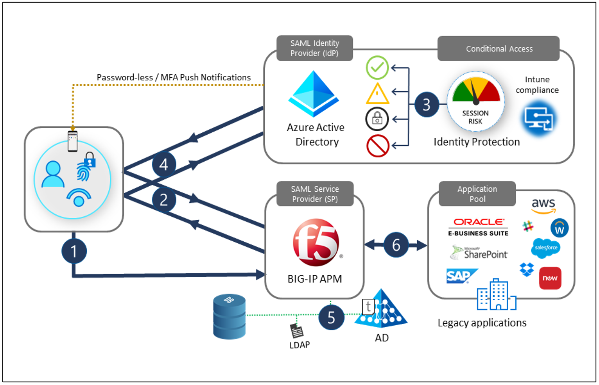
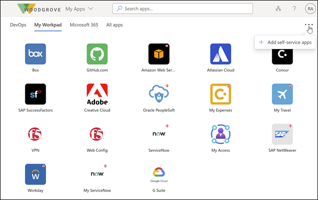

# Integrate F5 BIG-IP with Azure Active Directory

The proliferation of mobility and evolving threat landscape is placing extra scrutiny on resource access and governance, putting [Zero Trust](https://www.microsoft.com/security/blog/2020/04/02/announcing-microsoft-zero-trust-assessment-tool/) front and center of all modernization programs.
At Microsoft and F5, we realize that digital transformation is typically a multi-year journey for any business, potentially leaving critical resources exposed until modernized. The genesis behind F5 BIG-IP and Azure Active Directory Secure Hybrid Access (SHA) aims not only at improving remote access to on-premises applications, but also at strengthening the overall security posture of vulnerable legacy services.

For context, research estimates that 60-80% of on-premises applications are legacy in nature, or in other words incapable of being integrated directly with Azure Active Directory (AD). The same study also indicated a large proportion of these systems runs on downlevel versions of SAP, Oracle, SAGE, and other well-known workloads that provide critical services.

SHA addresses this blind spot by enabling organizations to continue using their F5 investments for superior network and application delivery. Combined with Azure AD, SHA bridges the heterogeneous application landscape with the modern Identity control plane.

Having Azure AD pre-authenticate access to BIG-IP published services provides many benefits:

- Password-less authentication through [Windows Hello](/windows/security/identity-protection/hello-for-business/hello-overview), [MS Authenticator](https://support.microsoft.com/account-billing/download-and-install-the-microsoft-authenticator-app-351498fc-850a-45da-b7b6-27e523b8702a), [Fast Identity Online (FIDO) keys](../authentication/howto-authentication-passwordless-security-key.md), and [Certificate-based authentication](../authentication/concept-certificate-based-authentication.md)

- Preemptive [Conditional Access](../conditional-access/overview.md) and [Azure AD Multi-Factor Authentication (MFA)](../authentication/concept-mfa-howitworks.md)

- [Identity Protection](../identity-protection/overview-identity-protection.md) - Adaptive protection through user and session risk profiling, plus [Leaked credential detection](../identity-protection/concept-identity-protection-risks.md)

- [Self-service password reset (SSPR)](../authentication/tutorial-enable-sspr.md)

- [Partner collaboration](../governance/entitlement-management-external-users.md) - Entitlement management for governed guest access

- [Defender for Cloud Apps (CASB)](/cloud-app-security/what-is-cloud-app-security) - For complete app discovery and  control

- Threat monitoring - [Microsoft Sentinel](https://azure.microsoft.com/services/azure-sentinel/) for advanced threat analytics

- The [Azure AD portal](https://azure.microsoft.com/features/azure-portal/) - A single control plane for governing identity and access

## Scenario description

As an Application Delivery Controller (ADC) and SSL-VPN, a BIG-IP system provides local and remote access to all types of services including:

- Modern and legacy web applications

- Non-web-based applications

- REST and SOAP Web API services

Its Local Traffic Manager (LTM) allows secure publishing of services, whilst a sophisticated Access Policy Manager (APM) further extends BIG-IP functionality with a rich set of capabilities, enabling identity federation and Single sign-on (SSO).

Through this integration, you achieve the protocol transitioning required to secure legacy or non-Azure AD-integrated services with modern controls such as [Password-less authentication](https://www.microsoft.com/security/business/identity/passwordless) and [Conditional Access](../conditional-access/overview.md). In this scenario, a BIG-IP continues to fulfill its core role as a reverse proxy, while handing off pre-authentication and authorization to Azure AD, on a per service basis.

The integration is based on a standard federation trust between the APM and Azure AD, common to most SHA use cases including the [SSL-VPN scenario](f5-aad-password-less-vpn.md). Security Assertion Markup Language (SAML), OAuth and Open ID Connect (OIDC) resources are no exception either, as they too can be secured through SHA. 

When used for both, local and remote access, a BIG-IP can also become a choke point for Zero Trust access to all services, including SaaS apps.

Steps 1-4 in the diagram illustrate the front-end pre-authentication exchange between a user, a BIG-IP, and Azure AD, in a service provider (SP) initiated flow. Steps 5-6 show subsequent APM session enrichment and SSO to individual backend services.

| Step | Description |
|:------|:-----------|
| 1. | User selects an application icon in the portal, resolving URL to the SAML SP (BIG-IP) |
| 2. | The BIG-IP redirects user to SAML IDP (Azure AD) for pre-authentication|
| 3. | Azure AD processes Conditional Access policies and [session controls](../conditional-access/concept-conditional-access-session.md) for authorization|
| 4. | User redirects back to BIG-IP presenting the SAML claims issued by Azure AD |
| 5. | BIG-IP requests any additional session information to include for [SSO](../hybrid/how-to-connect-sso.md) and [Role based access control (RBAC)](../../role-based-access-control/overview.md) to the published service |
| 6. | BIG-IP forwards the client request to the backend service

## User experience

Whether a direct employee, affiliate, or consumer, most users are already acquainted with the Office 365 login experience, so accessing BIG-IP services via SHA remains largely familiar.

Users now find their BIG-IP published services consolidated in the Microsoft [MyApps portal](https://support.microsoft.com/account-billing/sign-in-and-start-apps-from-the-my-apps-portal-2f3b1bae-0e5a-4a86-a33e-876fbd2a4510) or [O365 launchpads](https://support.microsoft.com/office/meet-the-microsoft-365-app-launcher-79f12104-6fed-442f-96a0-eb089a3f476a) along with self-service capabilities to a broader set of services, no matter the type of device or location. Users can even continue accessing published services directly via the BIG-IP's proprietary Webtop portal, if preferred. When logging off, SHA ensures a users’ session is terminated at both ends, the BIG-IP and Azure AD, ensuring services remain fully protected from unauthorized access.  

Users access the Microsoft MyApps portal to easily find their BIG-IP published services and for managing their account properties.  

## Insights and analytics

A BIG-IP’s role is critical to any business, so deployed BIG-IP instances can be monitored to ensure published services are highly available, both at an SHA level and operationally too.

Several options exist for logging events either locally, or remotely through a Security Information and Event Management (SIEM) solution, enabling off-box storage and processing of telemetry. A highly effective solution for monitoring Azure AD and SHA-specific activity, is to use [Azure Monitor](../../azure-monitor/overview.md) and [Microsoft Sentinel](../../sentinel/overview.md), together offering:

- Detailed overview of your organization, potentially across multiple clouds, and on-premises locations, including BIG-IP infrastructure

- Single control plane providing combined view of all signals, avoiding reliance on complex, and disparate tools

## Prerequisites

Integrating an F5 BIG-IP with Azure AD for SHA has the following pre-requisites:

- An F5 BIG-IP instance running on either of the following platforms:

  - Physical appliance

  - Hypervisor Virtual Edition such as Microsoft Hyper-V, VMware ESXi, Linux KVM, and Citrix Hypervisor

  - Cloud Virtual Edition such as Azure, VMware, KVM, Community Xen, MS Hyper-V, AWS, OpenStack, and Google Cloud

    The actual location of a BIG-IP instance can be either on-premises or any supported cloud platform including Azure, provided it has connectivity to the Internet, resources being published, and any other required services such as Active Directory.  

- An active F5 BIG-IP APM license, through one of the following options:

  - F5 BIG-IP® Best bundle

  - F5 BIG-IP Access Policy Manager™ standalone license

  - F5 BIG-IP Access Policy Manager™ (APM) add-on license on an existing BIG-IP F5 BIG-IP® Local Traffic Manager™ (LTM)

  - A 90-day BIG-IP Access Policy Manager™ (APM) [trial license](https://www.f5.com/trial/big-ip-trial.php)

- Azure AD licensing through either of the following options:

  - An Azure AD [free subscription](/windows/client-management/mdm/register-your-free-azure-active-directory-subscription#:~:text=%20Register%20your%20free%20Azure%20Active%20Directory%20subscription,will%20take%20you%20to%20the%20Azure...%20More%20) provides the minimum core requirements for implementing SHA with password-less authentication

  - A [Premium subscription](https://www.microsoft.com/security/business/identity-access-management/azure-ad-pricing) provides all additional value adds outlined in the preface, including [Conditional Access](../conditional-access/overview.md), [MFA](../authentication/concept-mfa-howitworks.md), and [Identity Protection](../identity-protection/overview-identity-protection.md)

No previous experience or F5 BIG-IP knowledge is necessary to implement SHA, but we do recommend familiarizing yourself with F5 BIG-IP terminology. F5’s rich [knowledge base](https://www.f5.com/services/resources/glossary) is also a good place to start building BIG-IP knowledge.

## Configuration scenarios

Configuring a BIG-IP for SHA is achieved using any of the many available methods, including several template based options, or a manual configuration.
The following tutorials provide detailed guidance on implementing some of the more common patterns for BIG-IP and Azure AD secure hybrid access.  

**Advanced configuration**

The advanced approach provides a more elaborate, yet flexible way of implementing SHA by manually creating all BIG-IP configuration objects. You would use this approach for scenarios not covered by the guided configuration templates. 

Refer to the following advanced configuration tutorials for your integration requirements:

- [F5 BIG-IP in Azure deployment walk-through](f5-bigip-deployment-guide.md)

- [Securing F5 BIG-IP SSL-VPN with Azure AD SHA](f5-aad-password-less-vpn.md)

- [Extend Azure AD B2C to protect applications using F5 BIG-IP](../../active-directory-b2c/partner-f5.md)

- [F5 BIG-IP APM and Azure AD SSO to Kerberos applications](f5-big-ip-kerberos-advanced.md)

- [F5 BIG-IP APM and Azure AD SSO to header-based applications](f5-big-ip-header-advanced.md)

- [F5 BIG-IP APM and Azure AD SSO to forms-based applications](f5-big-ip-forms-advanced.md)

**Guided Configuration and Easy Button templates**

The Guided Configuration wizard, available from BIG-IP version 13.1 aims to minimize time and effort implementing common BIG-IP publishing scenarios. Its workflow-based framework provides an intuitive deployment experience tailored to specific access topologies.

Version 16.x of the Guided Configuration now offers an Easy Button feature. With **Easy Button**, admins no longer go back and forth between Azure AD and a BIG-IP to enable services for SHA. The end-to-end deployment and policy management is handled directly between the APM’s Guided Configuration wizard and Microsoft Graph. This rich integration between BIG-IP APM and Azure AD ensures applications can quickly, easily support identity federation, SSO, and Azure AD Conditional Access, without management overhead of having to do so on a per app basis. 

Refer to the following guided configuration tutorials using Easy Button templates for your integration requirements:

- [F5 BIG-IP Easy Button for SSO to Kerberos applications](f5-big-ip-kerberos-easy-button.md)

- [F5 BIG-IP Easy Button for SSO to header-based applications](f5-big-ip-headers-easy-button.md)

- [F5 BIG-IP Easy Button for SSO to header-based and LDAP applications](f5-big-ip-ldap-header-easybutton.md)

- [F5-BIG-IP Easy Button for SSO to Oracle EBS (Enterprise Business Suite)](f5-big-ip-oracle-enterprise-business-suite-easy-button.md)

- [F5-BIG-IP Easy Button for SSO to Oracle JD Edwards](f5-big-ip-oracle-jde-easy-button.md)

- [F5-BIG-IP Easy Button for SSO to Oracle PeopleSoft](f5-big-ip-oracle-peoplesoft-easy-button.md)

- [F5-BIG-IP Easy Button for SSO to SAP ERP](f5-big-ip-sap-erp-easy-button.md)

## Azure AD B2B guest access
Azure AD B2B guest access to SHA protected applications is also possible, but some scenarios may require some additional steps not covered in the tutorials. One example is Kerberos SSO, where a BIG-IP will perform kerberos constrained delegation (KCD) to obtain a service ticket from domain contollers. Without a local representation of a guest user exisiting locally, a domain controller will fail to honour the request on the basis that the user does not exist. To support this scenario, you would need to ensure external identities are flowed down from your Azure AD tenant to the directory used by the application. See [Grant B2B users in Azure AD access to your on-premises applications](../external-identities/hybrid-cloud-to-on-premises.md) for guidance.

## Next steps

Consider running a SHA Proof of concept (POC) using your existing BIG-IP infrastructure, or by [Deploying a BIG-IP Virtual Edition (VE) VM into Azure](f5-bigip-deployment-guide.md). Deploying a VM in Azure takes approximately 30 minutes, at which point you'll have:

- A fully secured platform to model a SHA pilot

- A pre-production instance for testing new BIG-IP system updates and hotfixes

You should should also identify one or two applications that can be published via the BIG-IP and protected with SHA.

Our recommendation is to start with an application that isn’t yet published via a BIG-IP, so as to avoid potential disruption to production services. The guidelines mentioned in this article will help you get acquainted with the general procedure for creating the various BIG-IP configuration objects and setting up SHA. Once complete you should be able to do the same with any other new services, plus also have enough knowledge to convert existing BIG-IP published services over to SHA with minimal effort.

The below interactive guide walks through the high-level procedure for implementing SHA using a non Easy Button template, and seeing the end-user experience.

## Additional resources

- [The end of passwords, go passwordless](https://www.microsoft.com/security/business/identity/passwordless)

- [Azure Active Directory secure hybrid access](https://azure.microsoft.com//services/active-directory/sso/secure-hybrid-access/)

- [Microsoft Zero Trust framework to enable remote work](https://www.microsoft.com/security/blog/2020/04/02/announcing-microsoft-zero-trust-assessment-tool/)

- [Getting started with Microsoft Sentinel](https://azure.microsoft.com/services/azure-sentinel/?&OCID=AID2100131_SEM_XfknpgAAAHoVMTvh:20200922160358:s&msclkid=5e0e022409fc1c94dab85d4e6f4710e3&ef_id=XfknpgAAAHoVMTvh:20200922160358:s&dclid=CJnX6vHU_esCFUq-ZAod1iQF6A)
