# Configure F5 BIG-IP Access Policy Manager for form-based SSO

Learn to configure F5 BIG-IP Access Policy Manager (APM) and Microsoft Entra ID for secure hybrid access (SHA) to form-based applications. BIG-IP published services for Microsoft Entra single sign-on (SSO) has benefits:

* Improved Zero Trust governance through Microsoft Entra preauthentication and Conditional Access 
  * See [What is Conditional Access?](../conditional-access/overview.md)
  * See [Zero Trust security](../../security/fundamentals/zero-trust.md)
* Full SSO between Microsoft Entra ID and BIG-IP published services
* Managed identities and access from one control plane
  * See the [Microsoft Entra admin center](https://entra.microsoft.com)

Learn more:

* [Integrate F5 BIG-IP with Microsoft Entra ID](./f5-integration.md)
* [Enable SSO for an enterprise application](add-application-portal-setup-sso.md)

## Scenario description

For the scenario, there's an internal legacy application configured for form-based authentication (FBA). Ideally, Microsoft Entra ID manages application access, because legacy lacks modern authentication protocols. Modernization takes time and effort, introducing the risk of downtime. Instead, deploy a BIG-IP between the public internet and the internal application. This configuration gates inbound access to the application.

With a BIG-IP in front of the application, you can overlay the service with Microsoft Entra preauthentication and header-based SSO. The overlay improves application security posture.

## Scenario architecture

The SHA solution has the following components:

* **Application** - BIG-IP published service protected by SHA. 
  * The application validates user credentials against Active Directory
  * Use any directory, including Active Directory Lightweight Directory Services, open source, and so on
* **Microsoft Entra ID** - Security Assertion Markup Language (SAML) identity provider (IdP) that verifies user credentials, Conditional Access, and SSO to the BIG-IP. 
  * With SSO, Microsoft Entra ID provides attributes to the BIG-IP, including user identifiers
* **BIG-IP** - reverse-proxy and SAML service provider (SP) to the application. 
  * BIG-IP delegating authentication to the SAML IdP then performs header-based SSO to the back-end application. 
  * SSO uses the cached user credentials against other forms-based authentication applications

SHA supports SP- and IdP-initiated flows. The following diagram illustrates the SP-initiated flow.

   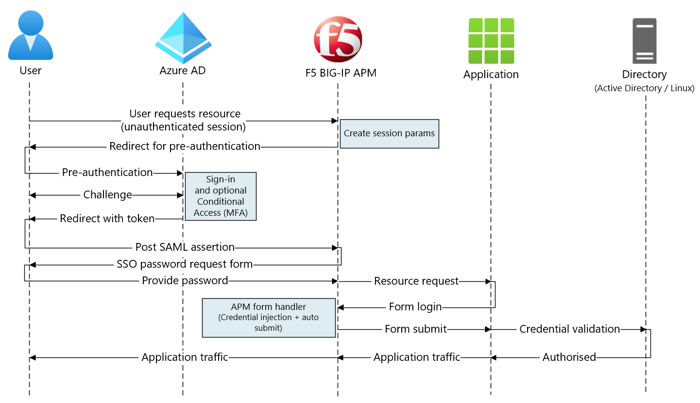

1. User connects to application endpoint (BIG-IP).
2. BIG-IP APM access policy redirects user to Microsoft Entra ID (SAML IdP).
3. Microsoft Entra preauthenticates user and applies enforced Conditional Access policies.
4. User is redirected to BIG-IP (SAML SP) and SSO occurs using issued SAML token. 
5. BIG-IP prompts the user for an application password and stores it in the cache.
6. BIG-IP sends a request to the application and receives a sign on form.
7. The APM scripting fills in the username and password, then submits the form.
8. The web server serves application payload and sends it to the client. 

## Prerequisites

You need the following components:

* An Azure subscription
  * If you don't have one, get an [Azure free account](https://azure.microsoft.com/free/)
* One of the following roles: Global Administrator, Cloud Application Administrator, or Application Administrator
* A BIG-IP or deploy a BIG-IP Virtual Edition (VE) in Azure
  * See [Deploy F5 BIG-IP Virtual Edition VM in Azure](./f5-bigip-deployment-guide.md)
* Any of the following F5 BIG-IP license SKUs:
  * F5 BIG-IP® Best bundle
  * F5 BIG-IP Access Policy Manager™ (APM) standalone license
  * F5 BIG-IP Access Policy Manager™ (APM) add-on license on a BIG-IP F5 BIG-IP® Local Traffic Manager™ (LTM)
  * 90-day BIG-IP full feature trial. See [Free Trials](https://www.f5.com/trial/big-ip-trial.php)
* User identities synchronized from an on-premises directory to Microsoft Entra ID
  * See [Microsoft Entra Connect Sync: Understand and customize synchronization](../hybrid/connect/how-to-connect-sync-whatis.md)
* An SSL certificate to publish services over HTTPS, or use default certificates while testing
  * See [SSL profile](./f5-bigip-deployment-guide.md#ssl-profile)
* A form-based authentication application, or set up an IIS FBA app for testing
  * See [Forms-based authentication](/troubleshoot/aspnet/forms-based-authentication)

## BIG-IP configuration

The configuration in this article is a flexible SHA implementation: manual creation of BIG-IP configuration objects. Use this approach for scenarios the Guided Configuration templates don't cover.

   >[!NOTE]
   >Replace example strings or values with those from your environment.

## Register F5 BIG-IP in Microsoft Entra ID

[!INCLUDE [portal updates](~/articles/active-directory/includes/portal-update.md)]

BIG-IP registration is the first step for SSO between entities. The app you create from the F5 BIG-IP gallery template is the relying party, representing the SAML SP for the BIG-IP published application.

1. Sign in to the [Microsoft Entra admin center](https://entra.microsoft.com) as at least a [Cloud Application Administrator](../roles/permissions-reference.md#cloud-application-administrator). 
2. Browse to **Identity** > **Applications** > **Enterprise applications** > **All applications**.
3. In the **All applications** pane, select **New application**.
4. The **Browse Microsoft Entra Gallery** pane opens.
5. Tiles appear for cloud platforms, on-premises applications, and featured applications. **Featured applications** icons indicate support of federated SSO and provisioning. 
6. In the Azure gallery, search for **F5**.
7. Select **F5 BIG-IP APM Azure AD integration**.
8. Enter a **Name** the new application uses to recognize the application instance. 
9. Select **Add**.
10. Select **Create**.

### Enable SSO to F5 BIG-IP

Configure the BIG-IP registration to fulfill SAML tokens that BIG-IP APM requests.

1. In left menu, in the **Manage** section, select **Single sign-on**.
2. The **Single sign-on** pane appears.
3. On the **Select a single sign-on method** page, select **SAML**.
4. Select **No, I'll save later**.
5. On the **Set up single sign-on with SAML** pane, select the **pen** icon. 
6. For **Identifier**, replace the value with the BIG-IP published application URL.
7. For **Reply URL**, replace the value, but retain the path for the application SAML SP endpoint. With this configuration, SAML flow operates in IdP-initiated mode. Microsoft Entra ID issues a SAML assertion, then the user is redirected to the BIG-IP endpoint. 
9. For SP-initiated mode, for **Sign on URL**, enter the application URL.
10. For **Logout Url**, enter the BIG-IP APM single logout (SLO) endpoint prepended by the service host header. Then, BIG-IP APM user sessions end when they sign out of Microsoft Entra ID. 

   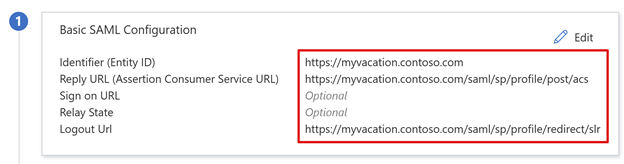

   > [!NOTE]
   > From Traffic Management Operating System (TMOS) v16 onward, the SAML SLO endpoint is `/saml/sp/profile/redirect/slo`.

11. Select **Save**.
12. Close the SAML configuration pane.
13. Skip the SSO test prompt.
14. Make a note of the **User Attributes & Claims** section properties. Microsoft Entra ID issues the properties for BIG-IP APM authentication, and SSO to the back-end application.
15. On the **SAML Signing Certificate** pane, select **Download**.
16. The **Federation Metadata XML** file is saved to your computer.

   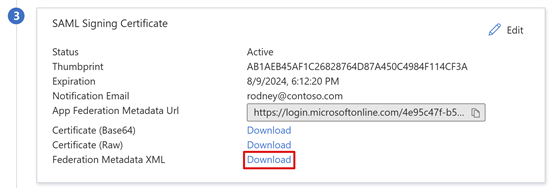

   > [!NOTE]
   > Microsoft Entra SAML signing certificates have a lifespan of three years. 

Learn more: [Tutorial: Manage certificates for federated single sign-on](tutorial-manage-certificates-for-federated-single-sign-on.md)

### Assign users and groups

Microsoft Entra ID issues tokens for users granted access to an application. To grant specific users and groups application access:

1. On the **F5 BIG-IP application's overview** pane, select **Assign Users and groups**.
2. Select **+ Add user/group**.
3. Select the users and groups you want.
4. Select **Assign**.   

## BIG-IP advanced configuration

Use the following instructions to configure BIG-IP.

### Configure SAML service provider settings

SAML SP settings define the SAML SP properties that the APM uses to overlay the legacy application with SAML preauthentication. To configure them:

1. Select **Access** > **Federation** > **SAML Service Provider**.
2. Select **Local SP Services**.
3. Select **Create**.

   

4. On the **Create New SAML SP Service** pane, for **Name** and **Entity ID**, enter the defined name and entity ID.

   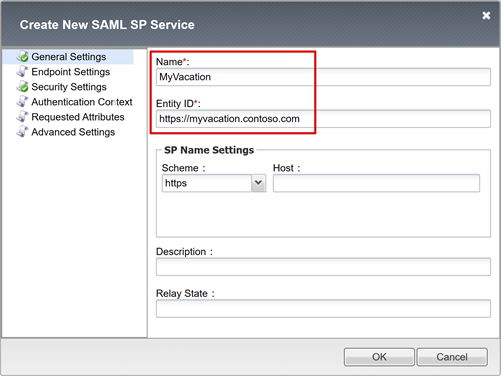

   > [!NOTE]
   > **SP Name Settings** values are required if the entity ID doesn't match the hostname portion of the published URL. Or, values are required if the entity ID isn't in regular hostname-based URL format. 

5. If the entity ID is `urn:myvacation:contosoonline`, enter the application external scheme and hostname.

### Configure an external IdP connector

A SAML IdP connector defines settings for the BIG-IP APM to trust Microsoft Entra ID as its SAML IdP. The settings connect the SAML service provider to a SAML IdP, which establishes the federation trust between the APM and Microsoft Entra ID. 

To configure the connector:

1. Select the new SAML service provider object.
2. Select **Bind/UnbBind IdP Connectors**.

   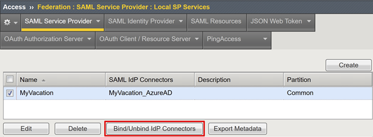

3. In the **Create New IdP Connector** list, select **From Metadata**.

   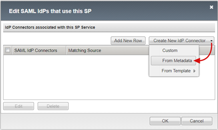
  
4. On the **Create New SAML IdP Connector** pane, browse for the Federation Metadata XML file you downloaded.
5. Enter an **Identity Provider Name** for the APM object that represents the external SAML IdP. For example, MyVacation\_AzureAD.

   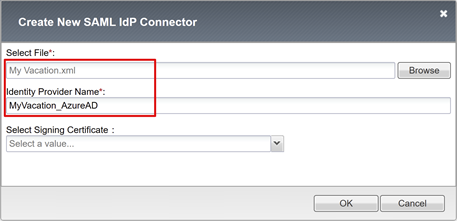

6. Select **Add New Row**.
7. Select the new **SAML IdP Connector**.
8. Select **Update**.
  
   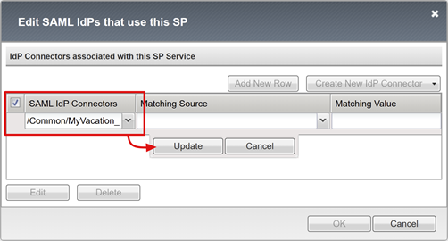

9. Select **OK**.

   

### Configure forms-based SSO

Create an APM SSO object for FBA SSO to back-end applications. 

Perform FBA SSO in client-initiated mode or BIG-IP-initiated mode. Both methods emulate a user sign-on by injecting credentials into the username and password tags. The form is then autosubmitted. Users provide password to access an FBA application. The password is cached and reused for other FBA applications.

1. Select **Access** > **Single Sign-on**.
2. Select **Forms Based**.
3. Select **Create**.
4. For **Name**, enter a descriptive name. For example, Contoso\FBA\sso.
5. For **Use SSO Template**, select **None**.
6. For **Username Source**, enter the username source to prefill the password collection form. The default `session.sso.token.last.username` works well, because it has the signed-in user Microsoft Entra UPN.
7. For **Password Source**, keep the default `session.sso.token.last.password`, the APM variable BIG-IP uses to cache user passwords. 

   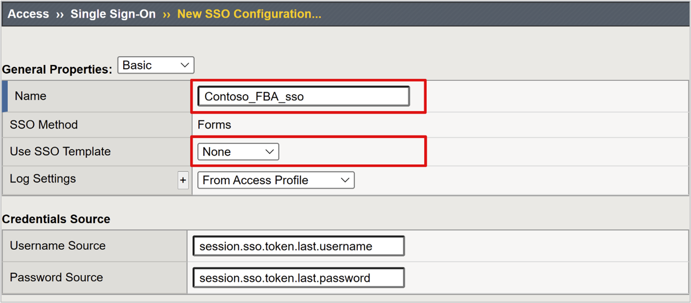

8. For **Start URI**, enter the FBA application logon URI. If the request URI matches this URI value, the APM form-based authentication executes SSO.
9. For **Form Action**, leave it blank. Then, the original request URL is used for SSO.
10. For **Form Parameter for Username**, enter the sign in form username field element. Use the browser dev tools to determine the element.
11. For **Form Parameter for Password**, enter the sign in form password field element. Use the browser dev tools to determine the element.

   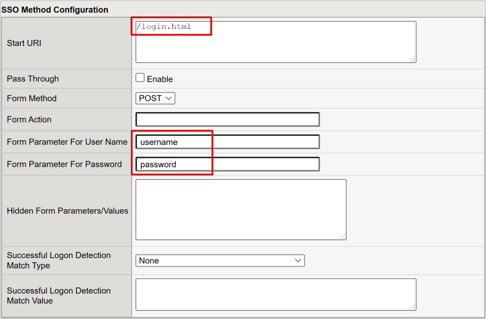

   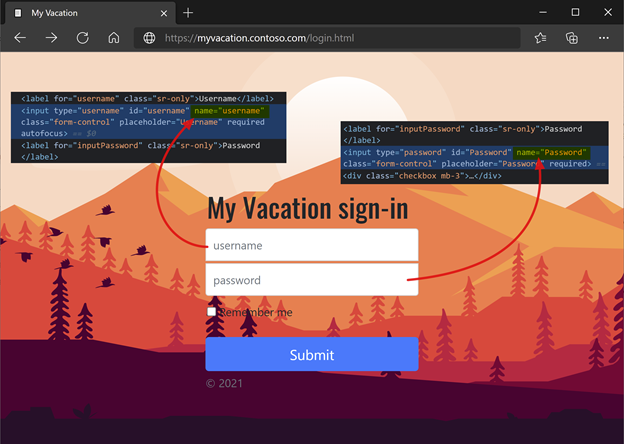

To learn more, go to techdocs.f5.com for [Manual Chapter: Single sign-on methods](https://techdocs.f5.com/en-us/bigip-14-1-0/big-ip-access-policy-manager-single-sign-on-concepts-configuration-14-1-0/single-sign-on-methods.html#GUID-F8588DF4-F395-4E44-881B-8D16EED91449).

### Configure an access profile

An access profile binds the APM elements that manage access to BIG-IP virtual servers, including access policies, SSO configuration, and UI settings.

1. Select **Access** > **Profiles / Policies**.
2. Select **Access Profiles (Per-Session Policies)**.
3. Select **Create**.
4. Enter a **Name**.
5. For **Profile Type**, select **All**.
6. For **SSO Configuration**, select the FBA SSO configuration object you created.
7. For **Accepted Language**, select at least one language. 

   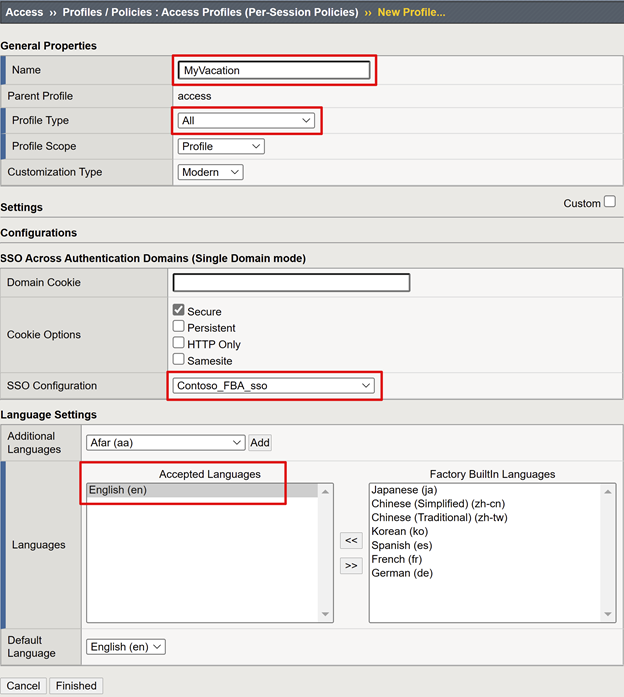

8. In the **Per-Session Policy** column, for the profile, select **Edit**.
9. The APM Visual Policy Editor starts.

   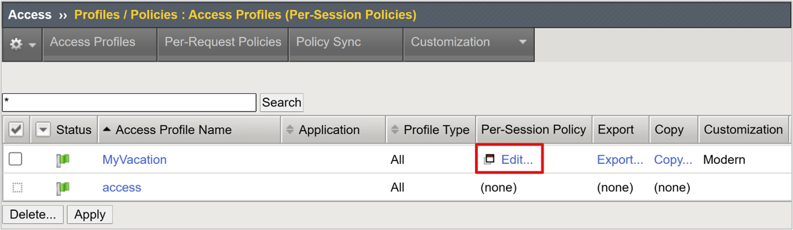

10. Under **fallback**, select the **+** sign.

   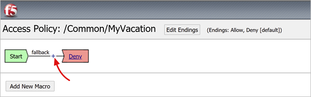

11. In the pop-up, select **Authentication**.
12. Select **SAML Auth**.
13. Select **Add Item**.

   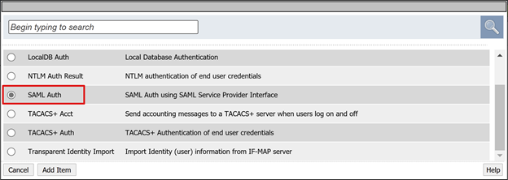

14. On **SAML authentication SP**, change the **Name** to **Microsoft Entra auth**.
15. In the **AAA Server** dropdown, enter the SAML service provider object you created.

   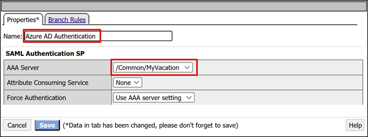

16. On the **Successful** branch, select the **+** sign.
17. In the pop-up, select **Authentication**.
18. Select **Logon Page**.
19. Select **Add Item**.

   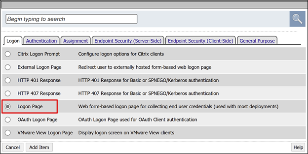

20. For **usesrname**, in the **Read Only** column, select **Yes**.

   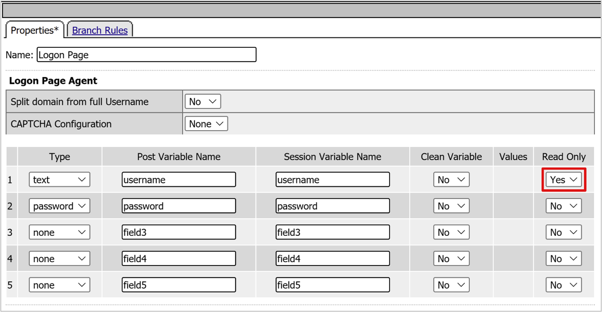

21. For the sign in page fallback, select the **+** sign. This action adds an SSO credential mapping object.

22. In the pop-up, select the **Assignment** tab.
23. Select **SSO Credential Mapping**.
24. Select **Add Item**.

    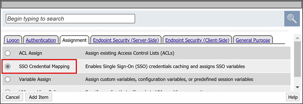

25. On **Variable Assign: SSO Credential Mapping**, keep the default settings.
26. Select **Save**.

    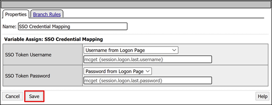

27. In the upper **Deny** box, select the link.
28. The **Successful** branch changes to **Allow**.
29. Select **Save**.

#### (Optional) Configure attribute mappings

You can add a LogonID_Mapping configuration. Then, the BIG-IP active sessions list has the signed-in user UPN, not a session number. Use this information for analyzing logs or troubleshooting.

1. For the **SAML Auth Successful** branch, select the **+** sign.
2. In the pop-up, select **Assignment**.
3. Select **Variable Assign**.
4. Select **Add Item**.

   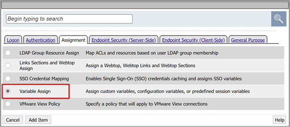

5. On the **Properties** tab, enter a **Name**. For example, LogonID_Mapping.
6. Under **Variable Assign**, select **Add new entry**.
7. Select **change**.

   

8. For **Custom Variable**, use `session.logon.last.username`.
9.  For Session Variable, user `session.saml.last.identity`.
10. Select **Finished**.
11. Select **Save**.
12. Select **Apply Access Policy**.
13. Close the Visual Policy Editor.

   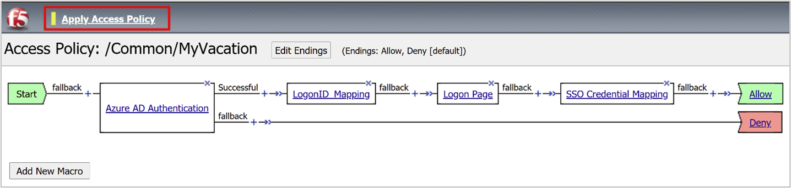

### Configure a back-end pool

To enable BIG-IP to forward client traffic correctly, create a BIG-IP node object that represents the back-end server that hosts your application. Then, place that node in a BIG-IP server pool.

1. Select **Local Traffic** > **Pools**.
2. Select **Pool List**.
3. Select **Create**. 
4. Enter a **Name** for a server pool object. For example, MyApps_VMs.

   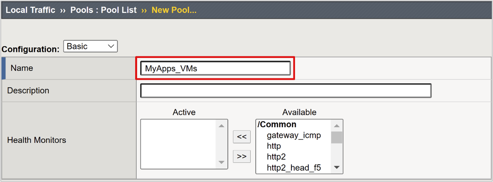

5. For **Node Name**, enter a server display name. This server hosts the back-end web application.
6. For **Address**, enter the application server host IP address.
7. For **Service Port** enter the HTTP/S port the application is listening on.

   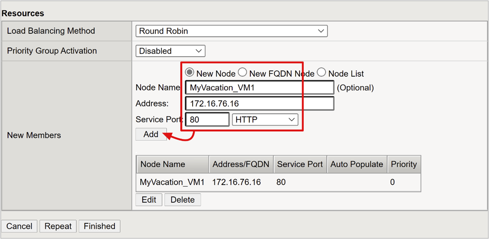

   >[!NOTE]
   >Health monitors require configuration this article doesn't cover. Go to support.f5.com for [K13397: Overview of HTTP health monitor request formatting for the BIG-IP DNS system](https://support.f5.com/csp/article/K13397).  

### Configure a virtual server

A virtual server is a BIG-IP data-plane object represented by a virtual IP address. The server listens for client requests to the application. Any received traffic is processed and evaluated against the APM access profile associated with the virtual server. The traffic is directed according to policy.

To configure a virtual server:

1. Select **Local Traffic** > **Virtual Servers**.
2. Select **Virtual Server List**.
3. Select **Create**.
4. Enter a **Name**.
5. For **Destination Address/Mask**, select **Host** and enter an IPv4 or IPv6 address. The address receives client traffic for the published back-end application. 
6. For **Service Port**, select **Port**, enter **443**, and select **HTTPS**.

   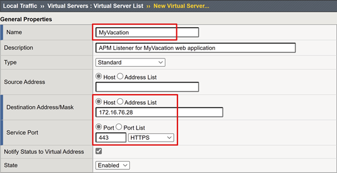  
 
7. For **HTTP Profile (Client)**, select **http**.
8. For **SSL Profile (Client)**, select the profile you created, or leave the default for testing. This option enables a virtual server for Transport Layer Security (TLS) to publish services over HTTPS. 

   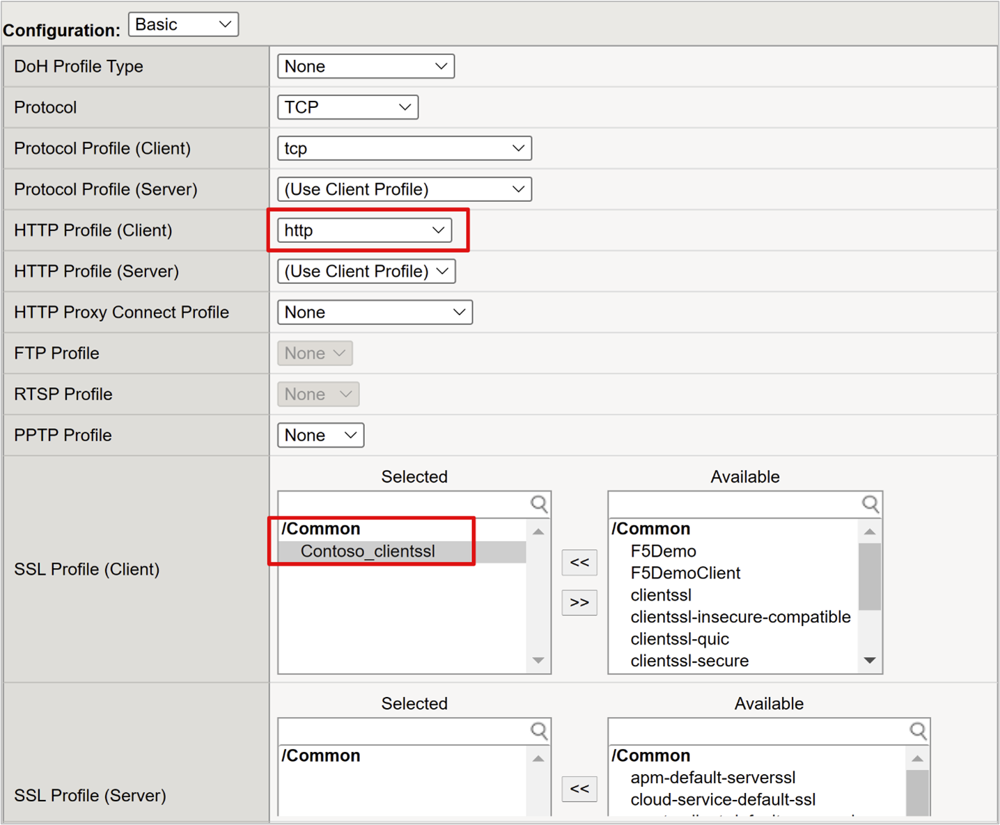

9. For **Source Address Translation**, select **Auto Map**.

   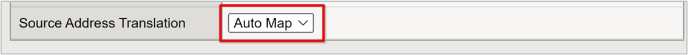

10. Under **Access Policy**, in the **Access Profile** box, enter the name you created. This action binds the Microsoft Entra SAML preauthentication profile and FBA SSO policy to the virtual server.

   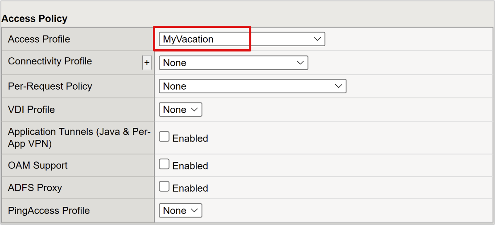

11. Under **Resources**, for **Default Pool**, select the back-end pool objects you created. 
12. Select **Finished**.

   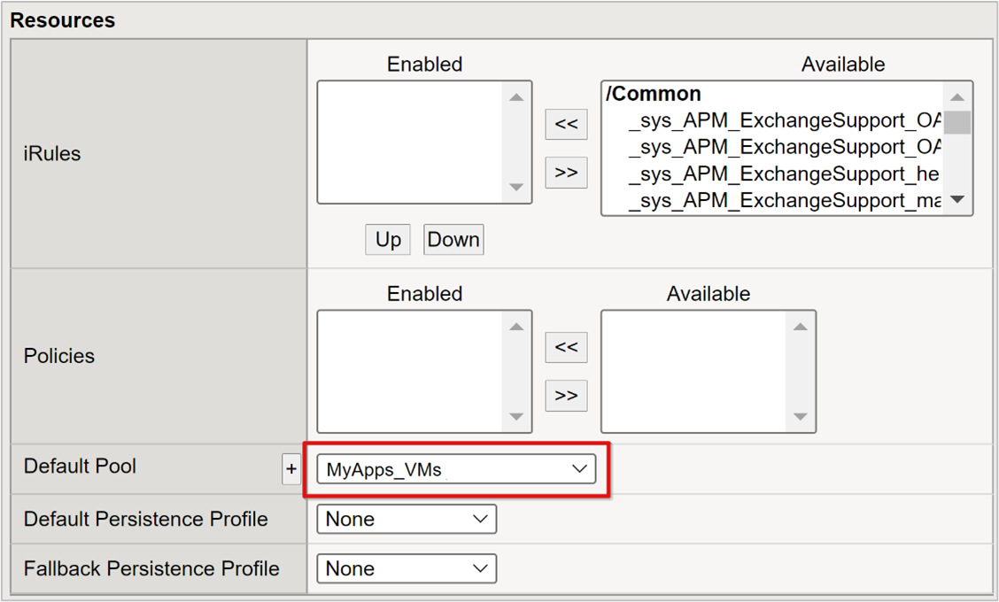

### Configure session management settings

BIG-IP session management settings define conditions for sessions termination and continuation. Create policy in this area. 

1. Go to **Access Policy**.
2. Select **Access Profiles**.
3. Select **Access Profile**.
4. From the list, select your application.

If you defined a single logout URI value in Microsoft Entra ID, IdP-initiated sign out from MyApps ends the client and the BIG-IP APM session. The imported application federation metadata XML file provides the APM with the Microsoft Entra SAML endpoint for SP-initiated sign out. Ensure the APM responds correctly to a user sign out.

If there's no BIG-IP web portal, users can't instruct the APM to sign out. If the user signs out of the application, BIG-IP is oblivious. The application session can be reinstated through SSO. For SP-initiated sign out, ensure sessions terminate securely.

You can add an SLO function to your application **sign out** button. This function redirects the client to the Microsoft Entra SAML sign out endpoint. To locate SAML sign out endpoint, go to **App Registrations > Endpoints**.

If you can't change the app, have the BIG-IP listen for the app sign out call and trigger SLO.

Learn more:

* [K42052145: Configuring automatic session termination (logout) based on a URI-referenced file name](https://support.f5.com/csp/article/K42052145)
* [K12056: Overview of the Logout URI Include option](https://support.f5.com/csp/article/K12056)

## Published application

Your application is published and accessible with SHA with the app URL or Microsoft portals.

The application appears as a target resource in Conditional Access. Learn more: [Building a Conditional Access policy](../conditional-access/concept-conditional-access-policies.md).

For increased security, block direct access to the application, enforcing a path through the BIG-IP.

## Test

1. With a browser, connect to the application external URL, or in My Apps, select the application icon. 
2. Authenticate to Microsoft Entra ID.
3. You’re redirected to the BIG-IP endpoint for the application.
4. The password prompt appears. 
5. The APM fills the username with the UPN from Microsoft Entra ID. The username is read-only for session consistency. Hide this field, if needed.

   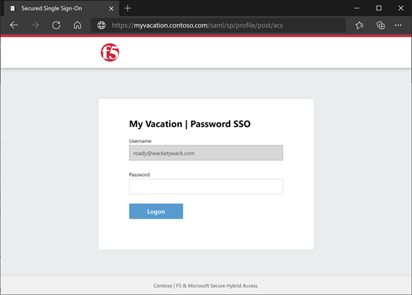

6. The information is submitted.
7. You're signed in to the application.

   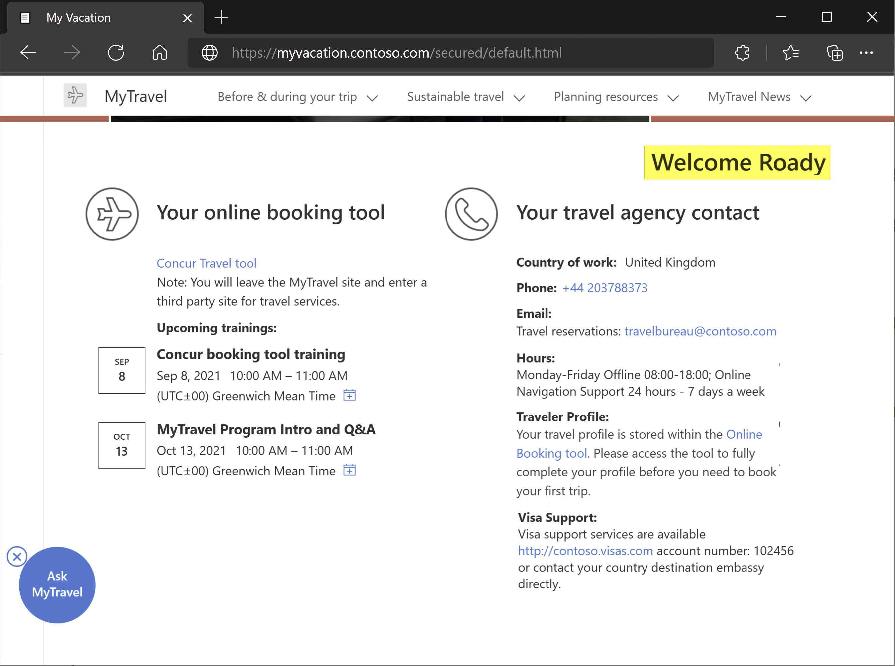

## Troubleshoot

When troubleshooting, consider the following information

* BIG-IP performs FBA SSO as it parses the sign in form at the URI
  * BIG-IP seeks the username and password element tags from your configuration
* Ensure element tags are consistent, or SSO fails
* Complex forms generated dynamically might require dev tool analysis to understand the sign in form
* Client-initiated is better for sign in pages with multiple forms
  * You can specify form name and customize the JavaScript form handler logic
* Both FBA SSO methods optimize user experience and security by hiding form interactions:
  * You can validate if the credentials are injected 
  * In client-initiated mode, disable form autosubmission in your SSO profile
  * Use dev tools to disable the two style properties that prevent the sign in page from appearing

  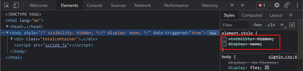

### Increase log verbosity

BIG-IP logs contain information to isolating authentication and SSO issues. Increase the log verbosity level:

1. Go to **Access Policy** > **Overview**.
2. Select **Event Logs**.
3. Select **Settings**.
4. Select the row of your published application.
5. Select **Edit**.
6. Select **Access System Logs**.
7. In the SSO list, select **Debug**.
8. Select **OK**. 
9. Reproduce the issue.
10. Review the logs.

Revert the settings otherwise there's excessive data.

### BIG-IP error message

If a BIG-IP error appears after Microsoft Entra preauthentication, the issue might relate to Microsoft Entra ID and BIG-IP SSO.

1. Go to **Access** > **Overview**.
2. Select **Access reports**.
3. Run the report for the last hour.
4. Review the logs for clues. 

Use the **View session variables** link for your session to determine if the APM receives expected Microsoft Entra claims.

### No BIG-IP error message

If no BIG-IP error message appears, the issue might relate to the back-end request, or BIG-IP-to-application SSO. 

1. Select **Access Policy** > **Overview**.
2. Select **Active Sessions**.
3. Select the active session link.

Use the **View Variables** link in this location to help determine root cause, particularly if the APM fails to obtain correct user identifier and password.

To learn more, go to techdocs.f5.com for [Manual Chapter: Session Variables](https://techdocs.f5.com/en-us/bigip-15-0-0/big-ip-access-policy-manager-visual-policy-editor/session-variables.html).

## Resources

* Go to techdocs.f5.com for [Manual Chapter: Active Directory Authentication](https://techdocs.f5.com/kb/en-us/products/big-ip_apm/manuals/product/apm-authentication-single-sign-on-11-5-0/2.html)
* [Passwordless authentication](https://www.microsoft.com/security/business/identity/passwordless)
* [What is Conditional Access?](../conditional-access/overview.md)
* [Zero Trust framework to enable remote work](https://www.microsoft.com/security/blog/2020/04/02/announcing-microsoft-zero-trust-assessment-tool/)
