# Tutorial: Configure F5 BIG-IP Access Policy Manager for Kerberos authentication

In this tutorial, you'll learn to implement secure hybrid access (SHA) with single sign-on (SSO) to Kerberos applications by using the F5 BIG-IP advanced configuration. Enabling BIG-IP published services for Microsoft Entra SSO provides many benefits, including:

* Improved [Zero Trust](https://www.microsoft.com/security/blog/2020/04/02/announcing-microsoft-zero-trust-assessment-tool/) governance through Microsoft Entra pre-authentication, and use of the Conditional Access security policy enforcement solution. 
  * See, [What is Conditional Access?](../conditional-access/overview.md)
* Full SSO between Microsoft Entra ID and BIG-IP published services
* Identity management and access from a single control plane, the [Microsoft Entra admin center](https://entra.microsoft.com)

To learn more about benefits, see [Integrate F5 BIG-IP with Microsoft Entra ID](./f5-integration.md).

## Scenario description

For this scenario, you'll configure a line-of-business application for Kerberos authentication, also known as Integrated Windows Authentication.

To integrate the application with Microsoft Entra ID requires support from a federation-based protocol, such as Security Assertion Markup Language (SAML). Because modernizing the application introduces the risk of potential downtime, there are other options. 

While you're using Kerberos Constrained Delegation (KCD) for SSO, you can use [Microsoft Entra application proxy](../app-proxy/application-proxy.md) to access the application remotely. You can achieve the protocol transition to bridge the legacy application to the modern, identity control plane. 

Another approach is to use an F5 BIG-IP Application Delivery Controller. This approach enables overlay of the application with Microsoft Entra pre-authentication and KCD SSO. It improves the overall Zero Trust posture of the application.

## Scenario architecture

The SHA solution for this scenario has the following elements:

- **Application**: Back-end Kerberos-based service externally published by BIG-IP and protected by SHA

- **BIG-IP**: Reverse proxy functionality for publishing back-end applications. The Access Policy Manager (APM) overlays published applications with SAML service provider (SP) and SSO functionality.

- **Microsoft Entra ID**: Identity provider (IdP) that verifies user credentials, Microsoft Entra Conditional Access, and SSO to the BIG-IP APM through SAML

- **KDC**: Key Distribution Center role on a domain controller (DC) that issues Kerberos tickets

The following image illustrates the SAML SP-initiated flow for this scenario, but IdP-initiated flow is also supported.

   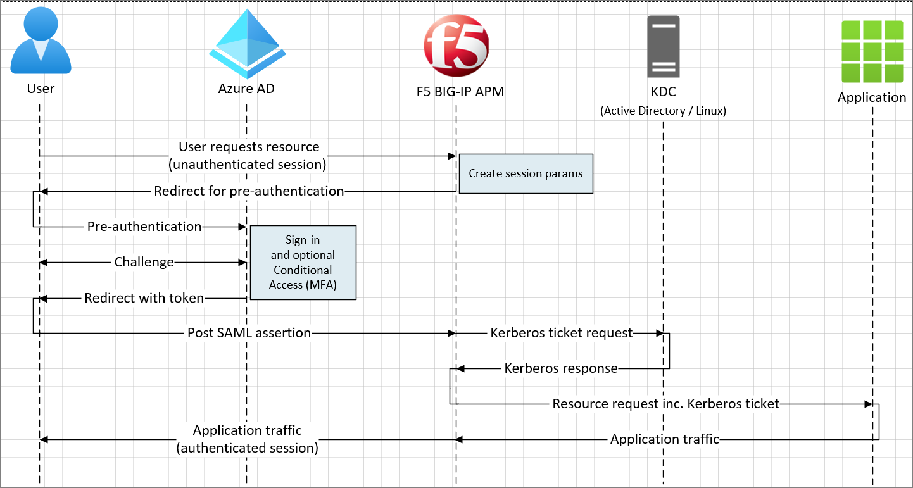

## User flow

1. User connects to the application endpoint (BIG-IP)
2. BIG-IP access policy redirects the user to Microsoft Entra ID (SAML IdP)
3. Microsoft Entra ID pre-authenticates the user and applies enforced Conditional Access policies
4. User is redirected to BIG-IP (SAML SP), and SSO is performed via the issued SAML token
5. BIG-IP authenticates the user and requests a Kerberos ticket from KDC
6. BIG-IP sends the request to the back-end application with the Kerberos ticket for SSO
7. Application authorizes the request and returns the payload

 ## Prerequisites

Prior BIG-IP experience isn't necessary. You need:

* An [Azure free account](https://azure.microsoft.com/free/active-directory/), or a higher-tier subscription.
* A BIG-IP, or [deploy BIG-IP Virtual Edition in Azure](../manage-apps/f5-bigip-deployment-guide.md).
* Any of the following F5 BIG-IP licenses:
  * F5 BIG-IP Best bundle
  * F5 BIG-IP APM standalone license
  * F5 BIG-IP APM add-on license on a BIG-IP Local Traffic Manager (LTM)
  * 90-day BIG-IP [Free Trial](https://www.f5.com/trial/big-ip-trial.php) license
* User identities [synchronized](../hybrid/connect/how-to-connect-sync-whatis.md) from an on-premises directory to Microsoft Entra ID, or created in Microsoft Entra ID and flowed back to your on-premises directory.
* One of the following roles in Microsoft Entra tenant: Global Administrator, Cloud Application Administrator, or Application Administrator.
* A web server [certificate](../manage-apps/f5-bigip-deployment-guide.md) for publishing services over HTTPS, or use default BIG-IP certificates while testing.
* A Kerberos application, or go to active-directory-wp.com to learn to configure [SSO with IIS on Windows](https://active-directory-wp.com/docs/Networking/Single_Sign_On/SSO_with_IIS_on_Windows.html).

## BIG-IP configuration methods

This article covers the advanced configuration, a flexible SHA implementing that creates BIG-IP configuration objects. You can use this approach for scenarios the Guided Configuration templates don't cover.

>[!NOTE]
> Replace all example strings or values in this article with those for your actual environment.

<a name='register-f5-big-ip-in-azure-ad'></a>

## Register F5 BIG-IP in Microsoft Entra ID

[!INCLUDE [portal updates](~/articles/active-directory/includes/portal-update.md)]

Before BIG-IP can hand off pre-authentication to Microsoft Entra ID, register it in your tenant. This process initiates SSO between both entities. The app you create from the F5 BIG-IP gallery template is the relying party that represents the SAML SP for the BIG-IP published application.

1. Sign in to the [Microsoft Entra admin center](https://entra.microsoft.com) as at least a [Cloud Application Administrator](../roles/permissions-reference.md#cloud-application-administrator). 
2. Browse to **Identity** > **Applications** > **Enterprise applications** > **All applications**, then select **New application**.
3. The **Browse Microsoft Entra Gallery** pane appears with tiles for cloud platforms, on-premises applications, and featured applications. Applications in the **Featured applications** section have icons that indicate whether they support federated SSO and provisioning. 
4. In the Azure gallery, search for **F5**, and select **F5 BIG-IP APM Azure AD integration**.

5. Enter a name for the new application to recognize the application instance. 
6. Select **Add/Create** to add it to your tenant.

## Enable SSO to F5 BIG-IP

Configure the BIG-IP registration to fulfill SAML tokens that the BIG-IP APM requests.

1. In the **Manage** section of the left menu, select **Single sign-on**. The **Single sign-on** pane appears.
2. On the **Select a single sign-on method** page, select **SAML**. Select **No, I'll save later** to skip the prompt.
3. On the **Set up single sign-on with SAML** pane, select the **pen** icon to edit **Basic SAML Configuration**. 
4. Replace the predefined **Identifier** value with the full URL for the BIG-IP published application.
5. Replace the **Reply URL** value, but retain the path for the application's SAML SP endpoint. 
   
> [!NOTE]
> In this configuration, the SAML flow operates in IdP-initiated mode. Microsoft Entra ID issues a SAML assertion before the user is redirected to the BIG-IP endpoint for the application. 

6. To use SP-initiated mode, enter the application URL in **Sign on URL**.
7. For **Logout Url**, enter the BIG-IP APM single logout (SLO) endpoint prepended by the host header of the service being published. This action ensures the user BIG-IP APM session ends after the user signs out of Microsoft Entra ID. 

    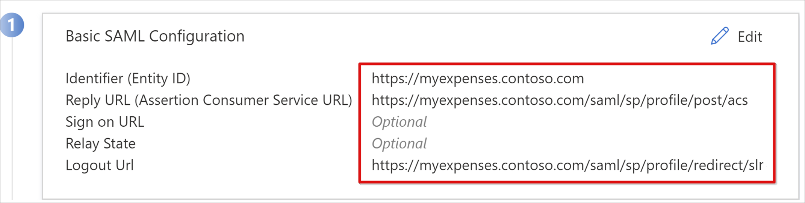

> [!NOTE]
> From BIG-IP traffic management operating system (TMOS) v16, the SAML SLO endpoint has changed to **/saml/sp/profile/redirect/slo**.

8. Before you close the SAML configuration, select **Save**.
9. Skip the SSO test prompt.
10. Note the properties of the **User Attributes & Claims** section. Microsoft Entra ID issues properties to users for BIG-IP APM authentication and for SSO to the back-end application.
11. To save the Federation Metadata XML file to your computer, on the **SAML Signing Certificate** pane, select **Download**.

    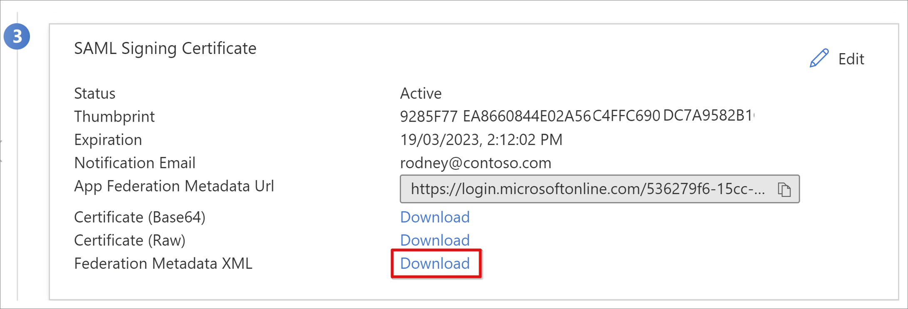

> [!NOTE]
> SAML signing certificates that Microsoft Entra ID creates have a lifespan of three years. For more information, see [Managed certificates for federated single sign-on](./tutorial-manage-certificates-for-federated-single-sign-on.md).

## Grant access to users and groups

By default, Microsoft Entra ID issues tokens for users granted access to an application. To grant users and groups access to the application:

1. On the **F5 BIG-IP application's overview** pane, select **Assign Users and groups**.
2. Select **+ Add user/group**.

    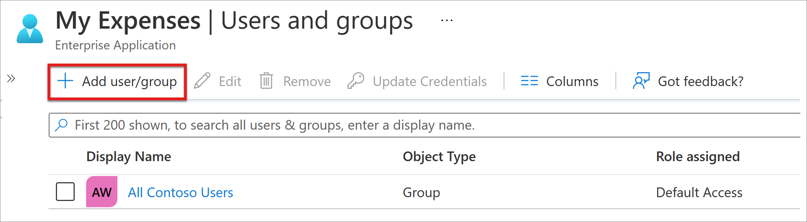

3. Select users and groups, and then select **Assign**.   

## Configure Active Directory Kerberos constrained delegation

For the BIG-IP APM to perform SSO to the back-end application on behalf of users, configure KCD in the target Active Directory (AD) domain. Delegating authentication requires you to provision the BIG-IP APM with a domain service account.

For this scenario, the application is hosted on server APP-VM-01 and runs in the context of a service account named web_svc_account, not the computer identity. The delegating service account assigned to the APM is F5-BIG-IP.

### Create a BIG-IP APM delegation account 

The BIG-IP does not support group Managed Service Accounts (gMSA), therefore create a standard user account for the APM service account.

1. Enter the following PowerShell command. Replace the **UserPrincipalName** and **SamAccountName** values with your environment values. For better security, use a dedicated SPN that matches the host header of the application.

    ```New-ADUser -Name "F5 BIG-IP Delegation Account" UserPrincipalName $HOST_SPN SamAccountName "f5-big-ip" -PasswordNeverExpires $true Enabled $true -AccountPassword (Read-Host -AsSecureString "Account Password") ```

    HOST_SPN = host/f5-big-ip.contoso.com@contoso.com

    >[!NOTE]
    >When the Host is used, any application running on the host will delegate the account whereas when HTTPS is used, it will allow only HTTP protocol-related operations.

2. Create a **Service Principal Name (SPN)** for the APM service account to use during delegation to the web application service account:

    ```Set-AdUser -Identity f5-big-ip -ServicePrincipalNames @Add="host/f5-big-ip.contoso.com"} ```

    >[!NOTE]
     >It is mandatory to include the host/ part in the format of UserPrincipleName (host/name.domain@domain) or ServicePrincipleName (host/name.domain).

3. Before you specify the target SPN, view its SPN configuration. Ensure the SPN shows against the APM service account. The APM service account delegates for the web application:

    * Confirm your web application is running in the computer context or a dedicated service account.
    * For the Computer context, use the following command to query the account object in the Active Directory to see its defined SPNs. Replace <name_of_account> with the account for your environment.

        ```Get-ADComputer -identity <name_of_account> -properties ServicePrincipalNames | Select-Object -ExpandProperty ServicePrincipalNames ```

        For example:
        Get-ADUser -identity f5-big-ip -properties ServicePrincipalNames | Select-Object -ExpandProperty ServicePrincipalNames
    
    * For the dedicated service account, use the following command to query the account object in Active Directory to see its defined SPNs. Replace <name_of_account> with the account for your environment.
      
        ```Get-ADUser -identity <name_of_account> -properties ServicePrincipalNames | Select-Object -ExpandProperty ServicePrincipalNames ```

        For example:
        Get-ADComputer -identity f5-big-ip -properties ServicePrincipalNames | Select-Object -ExpandProperty ServicePrincipalNames

 4. If the application ran in the machine context, add the SPN to the object of the computer account in Active Directory:

    ```Set-ADComputer -Identity APP-VM-01 -ServicePrincipalNames @{Add="http/myexpenses.contoso.com"} ```

With SPNs defined, establish trust for the APM service account delegate to that service. The configuration varies depending on the topology of your BIG-IP instance and application server.

### Configure BIG-IP and the target application in the same domain

1. Set trust for the APM service account to delegate authentication:

    ```Get-ADUser -Identity f5-big-ip | Set-ADAccountControl -TrustedToAuthForDelegation $true ```

2. The APM service account needs to know the target SPN it's trusted to delegate to. Set the target SPN to the service account running your web application:

    ```Set-ADUser -Identity f5-big-ip -Add @{'msDS-AllowedToDelegateTo'=@('HTTP/myexpenses.contoso.com')} ```

    >[!NOTE]
    >You can complete these tasks with the Active Directory Users and Computers, Microsoft Management Console (MMC) snap-in, on a domain controller.

### Configure BIG-IP and the target application in different domains

In the Windows Server 2012 version, and higher, cross-domain KCD uses Resource-Based Constrained Delegation (RBCD). The constraints for a service are transferred from the domain administrator to the service administrator. This delegation allows the back-end service administrator to allow or deny SSO. This situation creates a different approach at configuration delegation, which is possible when you use PowerShell or Active Directory Service Interfaces Editor (ADSI Edit).

You can use the PrincipalsAllowedToDelegateToAccount property of the application service account (computer or dedicated service account) to grant delegation from BIG-IP. For this scenario, use the following PowerShell command on a domain controller (Windows Server 2012 R2, or later) in the same domain as the application.

Use an SPN defined against a web application service account. For better security, use a dedicated SPN that matches the host header of the application. For example, because the web application host header in this example is myexpenses.contoso.com, add HTTP/myexpenses.contoso.com to the application service account object in Active Directory (AD):

```Set-AdUser -Identity web_svc_account -ServicePrincipalNames @{Add="http/myexpenses.contoso.com"} ```

For the following commands, note the context. 

If the web_svc_account service runs in the context of a user account, use these commands:

```$big-ip= Get-ADComputer -Identity f5-big-ip -server dc.contoso.com ```
```Set-ADUser -Identity web_svc_account -PrincipalsAllowedToDelegateToAccount ```
```$big-ip Get-ADUser web_svc_account -Properties PrincipalsAllowedToDelegateToAccount ```

If the web_svc_account service runs in the context of a computer account, use these commands:

```$big-ip= Get-ADComputer -Identity f5-big-ip -server dc.contoso.com ```
```Set-ADComputer -Identity web_svc_account -PrincipalsAllowedToDelegateToAccount ```
```$big-ip Get-ADComputer web_svc_account -Properties PrincipalsAllowedToDelegateToAccount ```

For more information, see [Kerberos Constrained Delegation across domains](/previous-versions/windows/it-pro/windows-server-2012-R2-and-2012/hh831477(v=ws.11)).

## BIG-IP advanced configuration

Use the following section to continue setting up the BIG-IP configurations.

### Configure SAML service provider settings

SAML service provider settings define the SAML SP properties that APM uses for overlaying the legacy application with SAML pre-authentication. To configure them:

1. From a browser, sign in to the F5 BIG-IP management console.
2. Select **Access** > **Federation** > **SAML Service Provider** > **Local SP Services** > **Create**.

    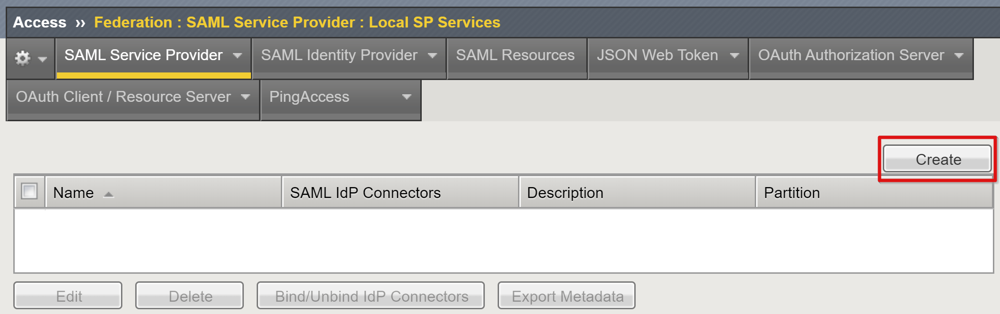

3. Provide the **Name** and **Entity ID** values you saved when you configured SSO for Microsoft Entra ID.

    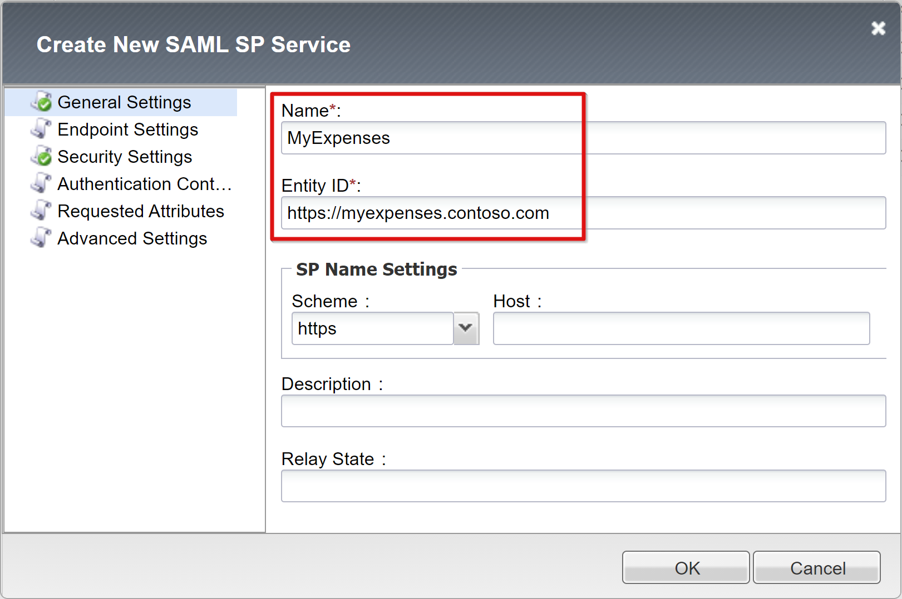

4. If the SAML entity ID is an exact match of the URL for the published application, you can skip **SP Name Settings**. For example, if the entity ID is urn:myexpenses:contosoonline, the **Scheme** value is **https**; the **Host** value is **myexpenses.contoso.com**. If the entity ID is "https://myexpenses.contoso.com", you don't need to provide this information.

### Configure an external IdP connector 

A SAML IdP connector defines the settings for the BIG-IP APM to trust Microsoft Entra ID as its SAML IdP. These settings map the SAML SP to a SAML IdP, establishing the federation trust between the APM and Microsoft Entra ID. To configure the connector:

1. Scroll down to select the new SAML SP object, and then select **Bind/Unbind IdP Connectors**.

   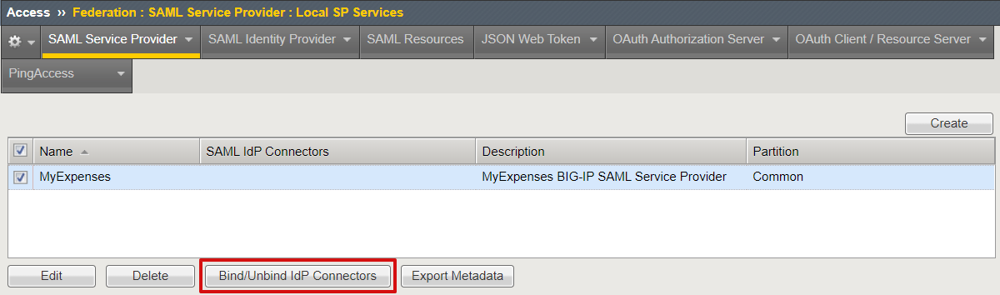

2. Select **Create New IdP Connector** > **From Metadata**.

    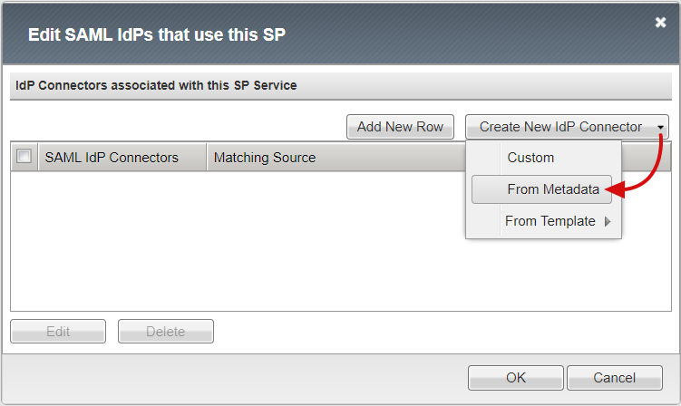

3. Browse to the federation metadata XML file you downloaded, and provide an **Identity Provider Name** for the APM object that represents the external SAML IdP. The following example shows **MyExpenses_AzureAD**.

    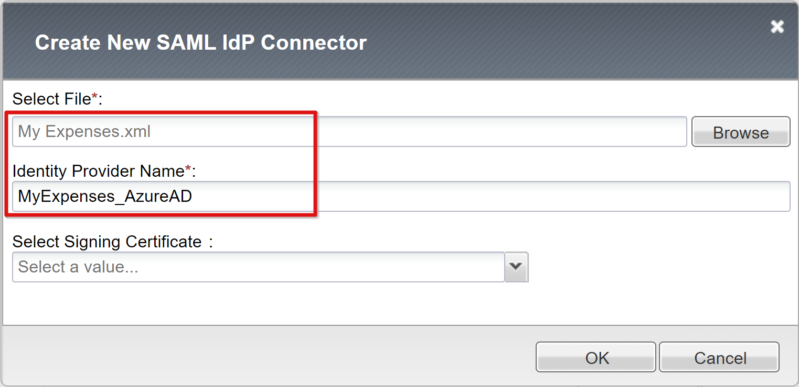

4. Select **Add New Row** to choose the new **SAML IdP Connectors** value, and then select **Update**.

    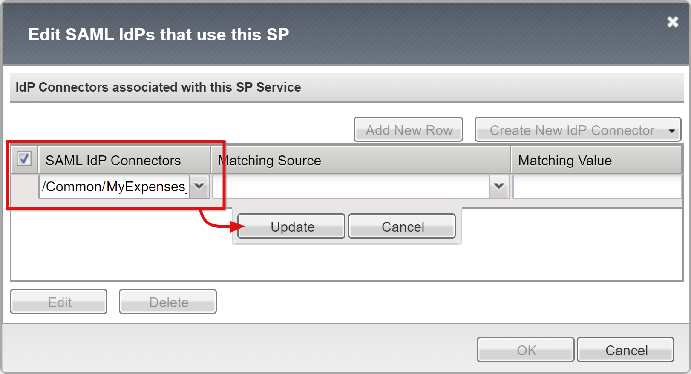

5. Select **OK**.

### Configure Kerberos SSO

Create an APM SSO object for KCD SSO to back-end applications. Use the APM delegation account that you created.

1. Select **Access** > **Single Sign-on** > **Kerberos** > **Create** and provide the following information:

* **Name**: After you create it, other published applications can use the Kerberos SSO APM object. For example, use Contoso_KCD_sso for multiple published applications for the Contoso domain. Use MyExpenses_KCD_sso for a single application.
* **Username Source**: Specify the user ID source. Use an APM session variable as the source. Use of **session.saml.last.identity** is advised because it contains the logged-in user ID from the Microsoft Entra claim.
* **User Realm Source**: Required when the user domain differs from the Kerberos realm for KCD. If users are in a separate trusted domain, you make the APM aware by specifying the APM session variable with the logged-in user domain. An example is session.saml.last.attr.name.domain. You do this action in scenarios when the user UPN is based on an alternative suffix.
* **Kerberos Realm**: User domain suffix in uppercase
* **KDC**: Domain controller IP address. Or enter a fully qualified domain name if DNS is configured and efficient.
* **UPN Support**: Select this checkbox if the source for username is in UPN format, for instance the session.saml.last.identity variable.
* **Account Name** and **Account Password**: APM service account credentials to perform KCD
* **SPN Pattern**: If you use HTTP/%h, APM uses the host header of the client request to build the SPN for which it's requesting a Kerberos token.
* **Send Authorization**: Disable this option for applications that prefer negotiating authentication, instead of receiving the Kerberos token in the first request (for example, Tomcat).

    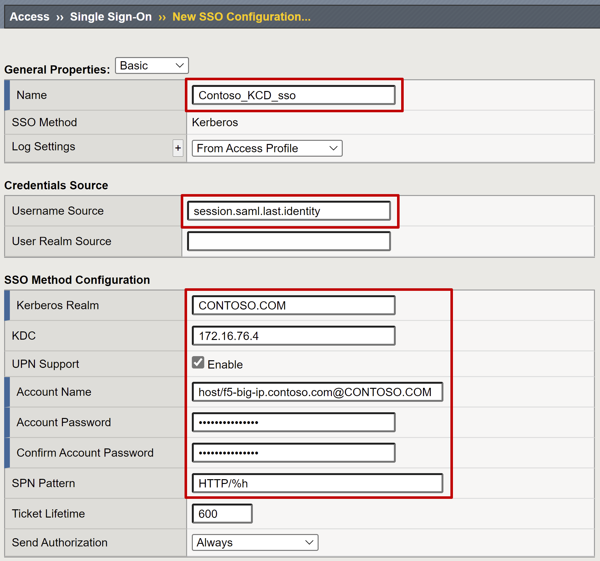

You can leave KDC undefined if the user realm is different from the back-end server realm. This rule applies to multiple-domain realm scenarios. If you leave KDC undefined, BIG-IP will try to discover a Kerberos realm through a DNS lookup of SRV records for the back-end server domain. It expects the domain name to be the same as the realm name. If the domain name differs, specify it in the [/etc/krb5.conf](https://support.f5.com/csp/article/K17976428) file.

Kerberos SSO processing is faster when a KDC is specified by IP address. Kerberos SSO processing is slower if a KDC is specified by host name. Because of more DNS queries, processing is slower when a KDC is undefined. Ensure your DNS is performing optimally before moving a proof-of-concept into production. 


> [!NOTE]
> If back-end servers are in multiple realms, create a separate SSO configuration object for each realm.

You can inject headers as part of the SSO request to the back-end application. Change the **General Properties** setting from **Basic** to **Advanced**. 

For more information on configuring an APM for KCD SSO, see the F5 article [K17976428: Overview of Kerberos constrained delegation](https://support.f5.com/csp/article/K17976428).

### Configure an access profile

An access profile binds APM elements that manage access to BIG-IP virtual servers. These elements include access policies, SSO configuration, and UI settings. 

1. Select **Access** > **Profiles / Policies** > **Access Profiles (Per-Session Policies)** > **Create** and enter the following properties:

   * **Name**: For example, enter MyExpenses

   * **Profile Type**: Select **All**

   * **SSO Configuration**: Select the KCD SSO configuration object you created

   * **Accepted Languages**: Add at least one language

    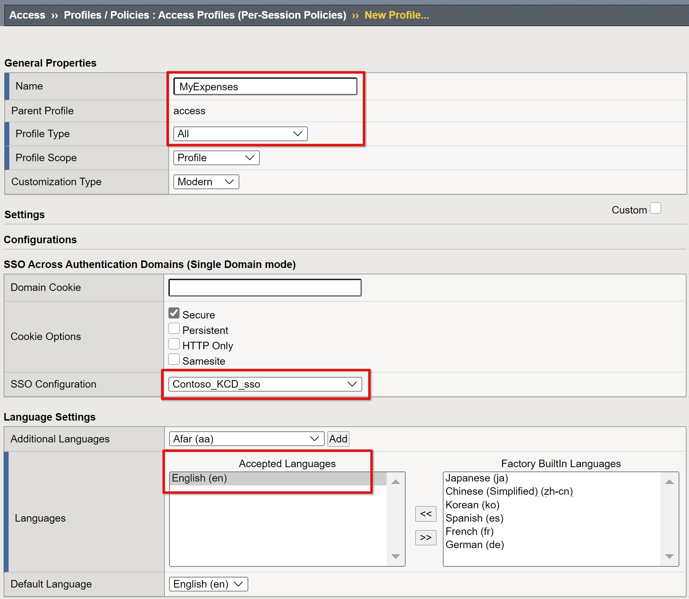

2. For the per-session profile you created, select **Edit**. 

    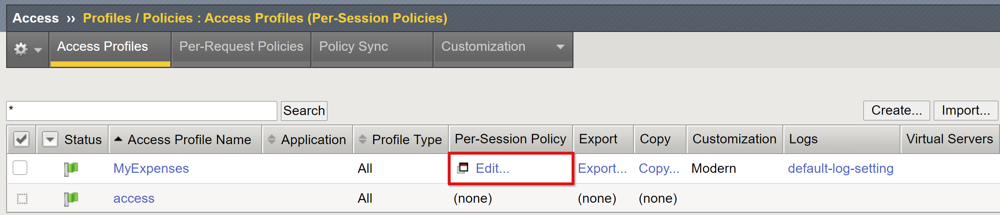

3. The visual policy editor opens. Select the **plus sign** next to the fallback.

    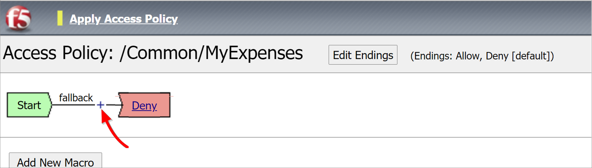

4. In the dialog, select **Authentication** > **SAML Auth** > **Add Item**.

    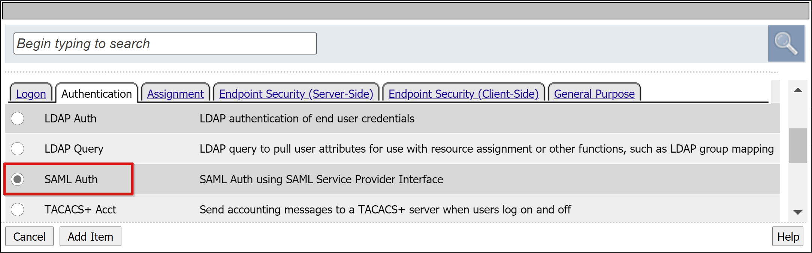

5. In the **SAML authentication SP** configuration, set the **AAA Server** option to use the SAML SP object you created.

    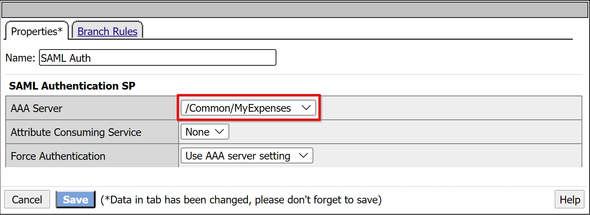

6. To change the **Successful** branch to **Allow**, select the link in the upper **Deny** box.
7. Select **Save**.

    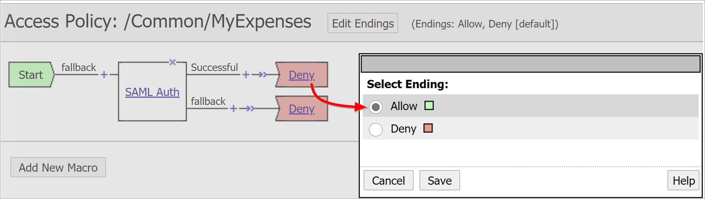

### Configure attribute mappings

Although it's optional, you can add a **LogonID_Mapping** configuration to enable the BIG-IP active sessions list to display the UPN of the logged-in user, instead of a session number. This information is useful for analyzing logs or troubleshooting.

1. For the **SAML Auth Successful** branch, select the **plus sign**. 
2. In the dialog, select **Assignment** > **Variable Assign** > **Add Item**.

    

3. Enter a **Name**. 
4. On the **Variable Assign** pane, select **Add new entry** > **change**. The following example shows LogonID_Mapping in the Name box.

     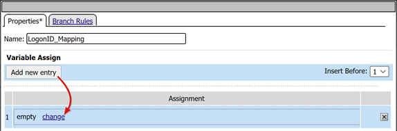

5. Set both variables: 

   * **Custom Variable**: Enter session.logon.last.username
   * **Session Variable**: Enter session.saml.last.identity

6. Select **Finished** > **Save**.
7. Select the **Deny** terminal of the access policy **Successful** branch. Change it to **Allow**. 
8. Select **Save**.
9. Select **Apply Access Policy**, and close the editor.

    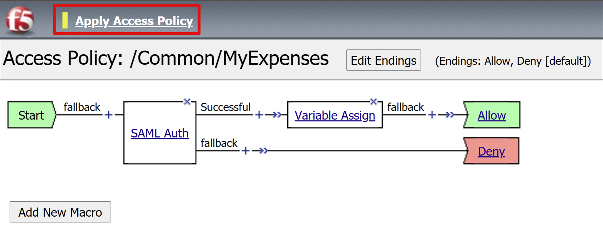

### Configure the back-end pool

For BIG-IP to forward client traffic accurately, create a BIG-IP node object that represents the back-end server hosting your application. Then, place that node in a BIG-IP server pool.

1. Select **Local Traffic** > **Pools** > **Pool List** > **Create** and provide a name for a server pool object. For example, enter MyApps_VMs.

    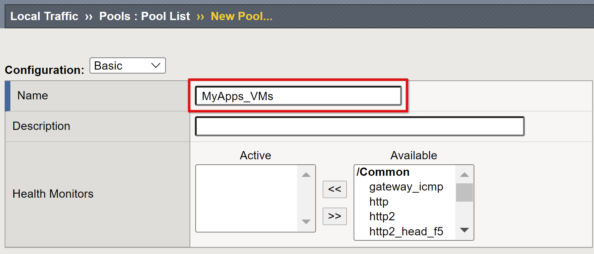

2. Add a pool member object with the following resource details:

   * **Node Name**: Display name for the server hosting the back-end web application
   * **Address**: IP address of the server hosting the application
   * **Service Port**: HTTP/S port the application is listening on

    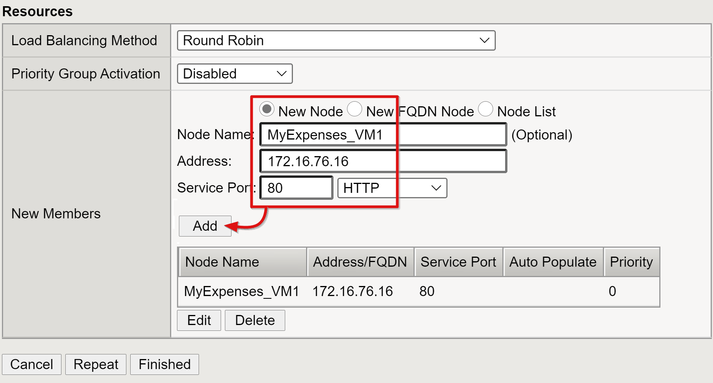

> [!NOTE]
> This article doesn't cover the additional configuration health monitors require. See, [K13397: Overview of HTTP health monitor request formatting for the BIG-IP DNS system](https://support.f5.com/csp/article/K13397).

### Configure the virtual server

A virtual server is a BIG-IP data plane object represented by a virtual IP address listening for client requests to the application. Received traffic is processed and evaluated against the APM access profile associated with the virtual server, before being directed according to policy. 

To configure a virtual server:

1. Select **Local Traffic** > **Virtual Servers** > **Virtual Server List** > **Create**.

2. Enter a **Name** and an IPv4/IPv6 address not allocated to a BIG-IP object, or device, on the connected network. The IP address is dedicated to receive client traffic for the published back-end application. 
3. Set **Service Port** to **443**.

    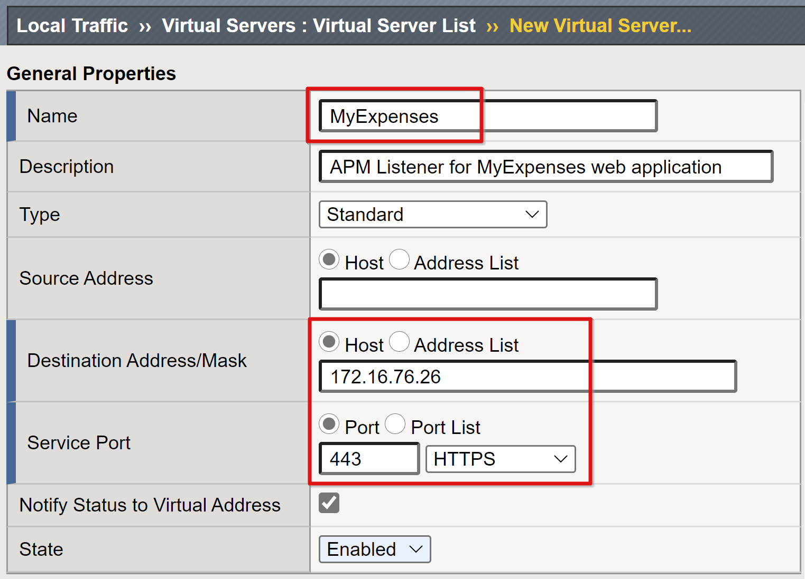

4. Set **HTTP Profile (Client)** to **http**. 
5. Enable a virtual server for Transport Layer Security (TLS) to allow services to be published over HTTPS. 
6. For **SSL Profile (Client)**, select the profile you created for the prerequisites. Or use the default if you're testing.

    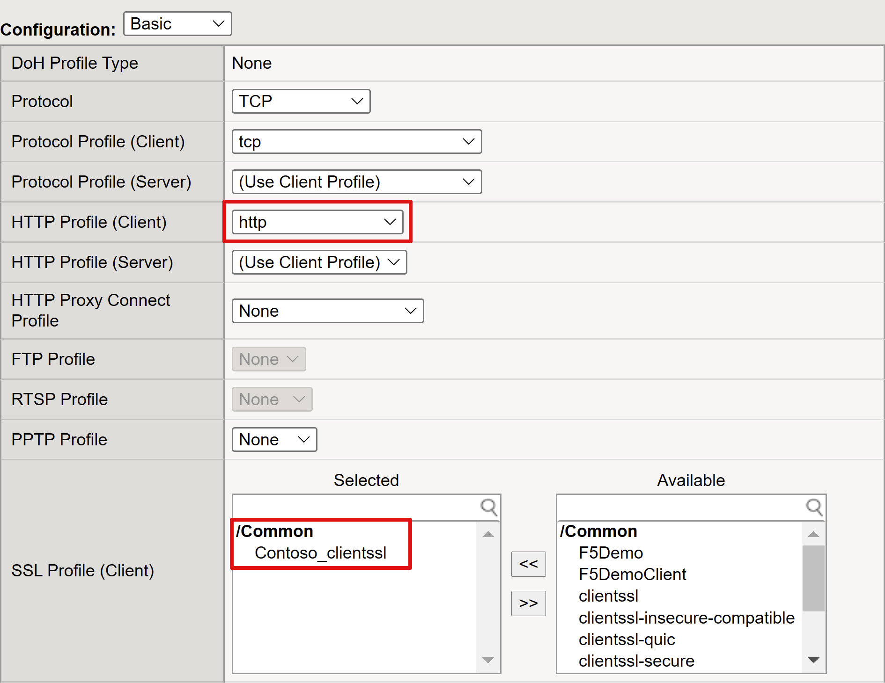

7. Change **Source Address Translation** to **Auto Map**.

    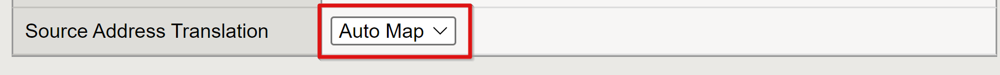

8. Under **Access Policy**, set **Access Profile** based on the profile you created. This selection binds the Microsoft Entra SAML pre-authentication profile and KCD SSO policy to the virtual server.

    

9. Set **Default Pool** to use the back-end pool objects you created in the previous section. 
10. Select **Finished**.

    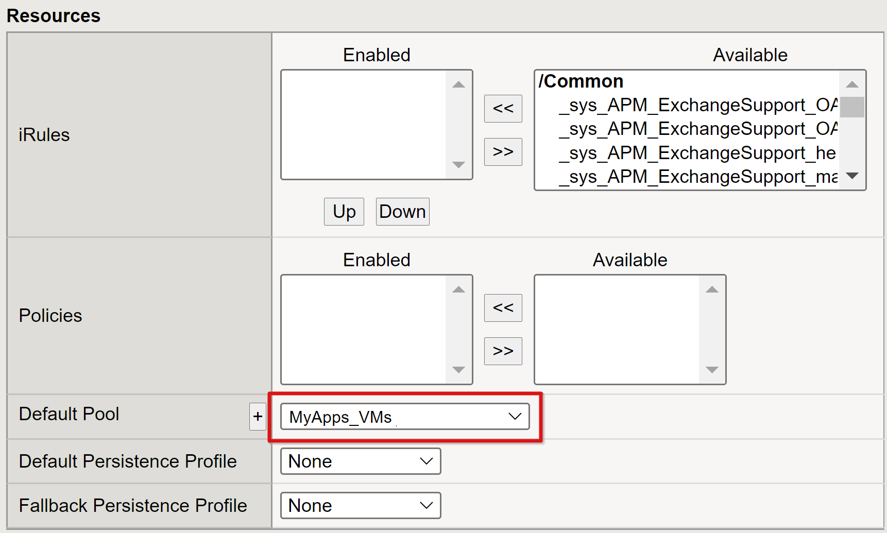

### Configure session management settings

BIG-IP session-management settings define the conditions for which user sessions are terminated or allowed to continue, limits for users and IP addresses, and error pages. You can create policy here. 

Go to **Access Policy** > **Access Profiles** > **Access Profile** and select an application from the list.

If you defined a Single Logout URI value in Microsoft Entra ID, it ensures an IdP-initiated sign out from the MyApps portal ends the session between the client and the BIG-IP APM. The imported application federation metadata XML file provides the APM with the Microsoft Entra SAML sign-out endpoint for SP-initiated sign out. For effective results, the APM needs to know when a user signs out. 

Consider a scenario when a BIG-IP web portal isn't used. The user can't instruct the APM to sign out. Even if the user signs out of the application, BIG-IP is  oblivious, so the application session could be reinstated through SSO. SP-initiated sign-out needs consideration to ensure sessions terminate securely.

> [!NOTE]
> You can add an SLO function to your application Sign-out button. This function redirects your client to the Microsoft Entra SAML sign-out endpoint. Find the SAML sign-out endpoint at **App Registrations** > **Endpoints**.

If you can't change the app, consider having BIG-IP listen for the app sign-out call. When it detects the request, it triggers SLO. 

For more information, see the F5 articles:

* [K42052145: Configuring automatic session termination (logout) based on a URI-referenced file name](https://support.f5.com/csp/article/K42052145)
* [K12056: Overview of the Logout URI Include option](https://support.f5.com/csp/article/K12056).

## Summary

Your application is published and accessible via SHA, by its URL or through Microsoft application portals. The application is visible as a target resource in [Microsoft Entra Conditional Access](../conditional-access/concept-conditional-access-policies.md). 

For increased security, organizations that use this pattern can block direct access to the application, which forces a strict path through BIG-IP.

## Next steps

As a user, open a browser and connect to the application external URL. You can select the application icon in the [Microsoft MyApps portal](https://myapps.microsoft.com/). After you authenticate against your Microsoft Entra tenant, you're redirected to the BIG-IP endpoint for the application and signed in via SSO.

   

<a name='azure-ad-b2b-guest-access'></a>

### Microsoft Entra B2B guest access

SHA supports [Microsoft Entra B2B guest access](../external-identities/hybrid-cloud-to-on-premises.md). Guest identities are synchronized from your Microsoft Entra tenant to your target Kerberos domain. Have a local representation of guest objects for BIG-IP to perform KCD SSO to the back-end application. 

## Troubleshooting

While troubleshooting, consider the following points:

* Kerberos is time sensitive. It requires servers and clients set to the correct time and, when possible, synchronized to a reliable time source.
* Ensure the host names for the domain controller and web application are resolvable in DNS
* Ensure there are no duplicate SPNs in your environment. Run the following query at the command line: `setspn -q HTTP/my_target_SPN`.

> [!NOTE]
> To validate an IIS application is configured for KCD, see [Troubleshoot Kerberos constrained delegation configurations for Application Proxy](../app-proxy/application-proxy-back-end-kerberos-constrained-delegation-how-to.md). See also the AskF5 article, [Kerberos Single Sign-On Method](https://techdocs.f5.com/en-us/bigip-15-1-0/big-ip-access-policy-manager-single-sign-on-concepts-configuration/kerberos-single-sign-on-method.html).

**Increase log verbosity**

BIG-IP logs are a reliable source of information. To increase the log verbosity level:

1. Go to **Access Policy** > **Overview** > **Event Logs** > **Settings**.
2. Select the row for your published application. 
3. Select **Edit** > **Access System Logs**.
4. Select **Debug** from the SSO list.
5. Select **OK**. 

Reproduce your problem before you look at the logs. Then revert this feature, when finished. Otherwise the verbosity is significant. 

**BIG-IP error**

If a BIG-IP error appears after Microsoft Entra pre-authentication, the problem might relate to SSO, from Microsoft Entra ID to BIG-IP.

1. Go to **Access** > **Overview** > **Access reports**.
2. To see if logs have any clues, run the report for the last hour. 
3. Use the **View session variables** link for your session to understand if the APM receives the expected claims from Microsoft Entra ID.

**Back-end request**

If no BIG-IP error appears, the issue is probably related to the back-end request, or related to SSO from BIG-IP to the application.

1. Go to **Access Policy** > **Overview** > **Active Sessions**.
2. Select the link for your active session. 
3. Use the **View Variables** link to determine root-cause KCD problems, particularly if the BIG-IP APM fails to get the right user and domain identifiers.

For help diagnosing KCD-related problems, see the F5 BIG-IP deployment guide [Configuring Kerberos Constrained Delegation](https://www.f5.com/pdf/deployment-guides/kerberos-constrained-delegation-dg.pdf), which has been archived.

## Resources

* MyF5 article, [Active Directory Authentication](https://techdocs.f5.com/kb/en-us/products/big-ip_apm/manuals/product/apm-authentication-single-sign-on-11-5-0/2.html)
* [Forget passwords, go passwordless](https://www.microsoft.com/security/business/identity/passwordless)
* [What is Conditional Access?](../conditional-access/overview.md)
* [Zero Trust framework to enable remote work](https://www.microsoft.com/security/blog/2020/04/02/announcing-microsoft-zero-trust-assessment-tool/)
