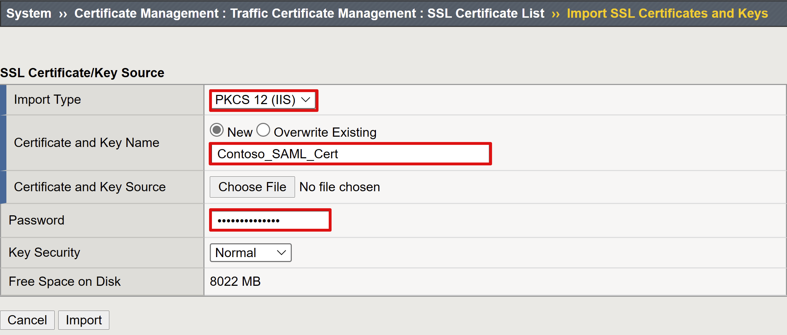
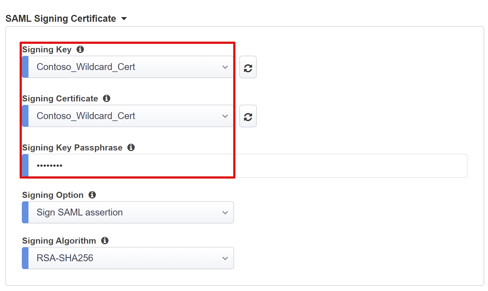
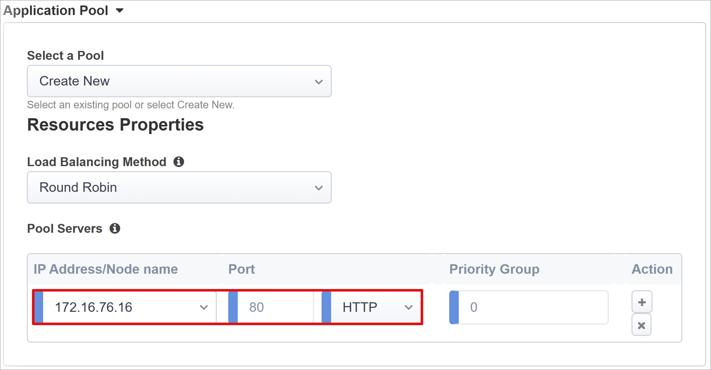

# Tutorial: Configure F5 BIG-IP Easy Button for Kerberos SSO

In this article, you'll learn to implement Secure Hybrid Access (SHA) with single sign-on (SSO) to Kerberos applications using F5’s BIG-IP Easy Button guided configuration.

Integrating a BIG-IP with Azure Active Directory (Azure AD) provides many benefits, including:

* Improved Zero Trust governance through Azure AD pre-authentication and [Conditional Access](/conditional-access/overview)

* Full SSO between Azure AD and BIG-IP published services

* Manage identities and access from a single control plane, the [Azure portal](https://portal.azure.com/)

To learn about all of the benefits, see the article on [F5 BIG-IP and Azure AD integration](./f5-aad-integration.md) and [what is application access and single sign-on with Azure AD](/azure/active-directory/active-directory-appssoaccess-whatis).

## Scenario description

For this scenario, we have an application using **Kerberos authentication**, also known as **Integrated Windows Authentication (IWA)**, to gate access to protected content.

Being legacy, the application lacks modern protocols to support a direct integration with Azure AD. Modernizing the app would be ideal, but is costly, requires careful planning, and introduces risk of potential impact.

One option would be to consider using [Azure AD Application Proxy](/azure/active-directory/app-proxy/application-proxy), as it provides the protocol transitioning required to bridge the legacy application to the modern identity control plane. Or for our scenario, we'll achieve this using F5's BIG-IP Application Delivery Controller (ADC).

Having a BIG-IP in front of the application enables us to overlay the service with Azure AD pre-authentication and header-based SSO, significantly improving the overall security posture of the application for remote and local access.

## Scenario architecture

The SHA solution for this scenario is made up of the following:

**Application:** BIG-IP published service to be protected by and Azure AD SHA. The application host is domain-joined and so is integrated with Active Directory (AD).

**Azure AD:** Security Assertion Markup Language (SAML) Identity Provider (IdP) responsible for verification of user credentials, Conditional Access (CA), and SSO to the BIG-IP APM.

**KDC:** Key Distribution Center (KDC) role on a Domain Controller (DC), issuing Kerberos tickets.

**BIG-IP:** Reverse proxy and SAML service provider (SP) to the application, delegating authentication to the SAML IdP before performing header-based SSO to the PeopleSoft service.

SHA for this scenario supports both SP and IdP initiated flows. The following image illustrates the SP initiated flow.

| Steps| Description|
| -------- |-------|
| 1| User connects to SAML SP endpoint for application (BIG-IP APM) |
| 2| APM access policy redirects user to Azure AD (SAML IdP) |
| 3| Azure AD pre-authenticates user and applies any enforced CA policies |
| 4| User is redirected to BIG-IP (SAML SP) and SSO is performed using issued SAML token |
| 5| BIG-IP requests Kerberos ticket from KDC |
| 6| BIG-IP sends request to backend application, along with Kerberos ticket for SSO |
| 7| Application authorizes request and returns payload |

## Prerequisites
Prior BIG-IP experience isn’t necessary, but you will need:

* An Azure AD free subscription or above

* An existing BIG-IP or [deploy a BIG-IP Virtual Edition (VE) in Azure](./f5-bigip-deployment-guide.md)

* Any of the following F5 BIG-IP license offers

    * F5 BIG-IP® Best bundle

    * F5 BIG-IP APM standalone license

    * F5 BIG-IP APM add-on license on an existing BIG-IP F5 BIG-IP® Local Traffic Manager™ (LTM)

    * 90-day BIG-IP full feature [trial license](https://www.f5.com/trial/big-ip-trial.php).

* User identities [synchronized](../hybrid/how-to-connect-sync-whatis.md) from an on-premises directory to Azure AD, or created directly within Azure AD and flowed back to your on-premises directory

* An account with Azure AD Application admin [permissions](/azure/active-directory/users-groups-roles/directory-assign-admin-roles#application-administrator)

* Web server [certificate](./f5-bigip-deployment-guide.md) for publishing services over HTTPS or use default BIG-IP certs while testing

* An existing Kerberos application or [setup an IIS (Internet Information Services) app](https://active-directory-wp.com/docs/Networking/Single_Sign_On/SSO_with_IIS_on_Windows.html) for KCD SSO

## BIG-IP configuration methods

There are many methods to configure BIG-IP for this scenario, including two template-based options and an advanced configuration. This tutorial covers latest Guided Configuration 16.1 offering an Easy button template.

With the **Easy Button**, admins no longer go back and forth between Azure AD and a BIG-IP to enable services for SHA. The end-to-end deployment and policy management is handled directly between the APM’s Guided Configuration wizard and Microsoft Graph. This rich integration between BIG-IP APM and Azure AD ensures applications can quickly, easily support identity federation, SSO, and Azure AD Conditional Access, reducing administrative overhead.

The advanced approach provides a more flexible way of implementing SHA by manually creating all BIG-IP configuration objects. You would also use this approach for scenarios not covered by the guided configuration templates.

>[!NOTE] 
> All example strings or values referenced throughout this guide should be replaced with those for your actual environment.

## Register Easy Button

Before a client or service can access Microsoft Graph, it must be trusted by the Microsoft identity platform by being registered with Azure AD. A BIG-IP must also be registered as a client in Azure AD, before the Easy Button wizard is trusted to access Microsoft Graph.

1. Sign-in to the [Azure AD portal](https://portal.azure.com/) using an account with Application Administrative rights

2. From the left navigation pane, select the **Azure Active Directory** service

3. Under Manage, select **App registrations > New registration**

4. Enter a display name for your application. For example, *F5 BIG-IP Easy Button*

5. Specify who can use the application > **Accounts in this organizational directory only**

6. Select **Register** to complete the initial app registration

7. Navigate to **API permissions** and authorize the following Microsoft Graph permissions:

   * Application.Read.All
   * Application.ReadWrite.All
   * Application.ReadWrite.OwnedBy
   * Directory.Read.All
   * Group.Read.All
   * IdentityRiskyUser.Read.All
   * Policy.Read.All
   * Policy.ReadWrite.ApplicationConfiguration
   * Policy.ReadWrite.ConditionalAccess
   * User.Read.All

8. Grant admin consent for your organization

9. In the **Certificates & Secrets** blade, generate a new **client secret** and note it down

10. From the **Overview** blade, note the **Client ID** and **Tenant ID**

## Configure Easy Button

Next, step through the Easy Button configurations, and complete the trust to start publishing the internal application. Start by provisioning your BIG-IP with an X509 certificate that Azure AD can use to sign SAML tokens and claims issued for SHA enabled services.

1. From a browser, sign-in to the **F5 BIG-IP management console**

2. Navigate to **System > Certificate Management > Traffic Certificate Management SSL Certificate List > Import**

3. Select **PKCS 12 (IIS)** and import your certificate along with its private key

Once provisioned, the certificate can be used for every application published through Easy Button. You can also choose to upload a separate certificate for individual applications.

   

4. Navigate to **Access > Guided Configuration > Microsoft Integration and select Azure AD Application**

You can now access the Easy Button functionality that provides quick configuration steps to set up the APM as a SAML Service Provider (SP) and Azure AD as an Identity Provider (IdP) for your application.

   

5. Review the list of configuration steps and select **Next**

   

## Configuration steps

The **Easy Button** template will display the sequence of steps required to publish your application.


### Configuration Properties

These are general and service account properties. Consider this section to be the client application you registered in your Azure AD tenant earlier. These settings allow a BIG-IP to programmatically register a SAML application directly in your tenant, along with the properties you would normally configure manually. Easy Button will do this for every BIG-IP APM service being enabled for SHA. 

Some of these are global settings so can be re-used for publishing more applications, further reducing deployment time and effort.

1. Provide a unique **Configuration Name** so admins can easily distinguish between Easy Button configurations

2. Enable **Single Sign-On (SSO) & HTTP Headers**

3. Enter the **Tenant Id, Client ID,** and **Client Secret** you noted down during tenant registration

   

Before you select **Next**, confirm that BIG-IP can successfully connect to your tenant.

### Service Provider

The Service Provider settings define the SAML SP properties for the APM instance representing the application protected through SHA.

1. Enter **Host.** This is the public FQDN of the application being secured. You’ll need a corresponding DNS record for clients to resolve this address, but using a localhost record is fine during testing

2. Enter **Entity ID.** This is the identifier Azure AD will use to identify the SAML SP requesting a token

   

    Next, under security settings, enter information for Azure AD to encrypt issued SAML assertions. Encrypting assertions between Azure AD and the BIG-IP APM provides    additional assurance that the content tokens can't be intercepted, and personal or corporate data be compromised.

3. Check **Enable Encrypted Assertion (Optional).** Enable to request Azure AD to encrypt SAML assertions

4. Select **Assertion Decryption Private Key.** The private key for the certificate that BIG-IP APM will use to decrypt Azure AD assertions

5. Select **Assertion Decryption Certificate.** This is the certificate that BIG-IP will upload to Azure AD for encrypting the issued SAML assertions. This can be the certificate you provisioned earlier

   

### Azure Active Directory

This section defines all properties that you would normally use to manually configure a new BIG-IP SAML application within your Azure AD tenant. 

The Easy Button wizard provides a set of pre-defined application templates for Oracle PeopleSoft, Oracle E-business Suite, Oracle JD Edwards, SAP ERP, but you can use the generic SHA template by selecting **F5 BIG-IP APM Azure AD Integration > Add.**


#### Azure Configuration

1. Enter **Display Name** of app that the BIG-IP creates in your Azure AD tenant, and the icon that the users will see in [MyApps portal](https://myapplications.microsoft.com/).

2. Leave the **Sign On URL (optional)** blank to enable IdP initiated sign-on.

   

3. Select **Signing key.** The IdP SAML signing certificate you provisioned earlier 

4. Select the same certificate for **Singing Certificate**

5. Enter the certificate’s password in **Passphrase**

6. Select **Signing Options**. It can be enabled optionally to ensure the BIG-IP only accepts tokens and claims that have been signed by your Azure AD tenant

   

7. **User and User Groups** are dynamically queried from your Azure AD tenant and used to authorize access to the application. **Add** a user or group that you can use later for testing, otherwise all access will be denied

#### User Attributes & Claims

When a user successfully authenticates to Azure AD, it issues a SAML token with a default set of claims and attributes uniquely identifying the user. The **User Attributes & Claims tab** shows the default claims to issue for the new application. It also lets you configure more claims.

As our AD infrastructure is based on a .com domain suffix used both, internally and externally, we don’t require any additional attributes to achieve a functional KCD SSO implementation. See the [advanced tutorial](f5-big-ip-kerberos-advanced.md) for cases where you have multiple domains or user’s login using an alternate suffix. 


#### Additional User Attributes

The **Additional User Attributes** tab can support a variety of distributed systems requiring attributes stored in other directories, for session augmentation. Attributes fetched from an LDAP source can then be injected as additional SSO headers to further control access based on roles, Partner IDs, etc.


>[!NOTE] 
>This feature has no correlation to Azure AD but is another source of attributes.

#### Conditional Access Policy

You can further protect the published application with policies returned from your Azure AD tenant. These policies are enforced after the first-factor authentication has been completed and uses signals from conditions like device platform, location, user or group membership, or application to determine access.

The **Available Policies** by default, lists all CA policies defined without user based actions.

The **Selected Policies**, by default, displays all policies targeting All cloud apps. These policies cannot be deselected or moved to the Available Policies list.

To select a policy to be applied to the application being published:

1. Select the desired policy in the **Available Policies** list

2. Select the right arrow and move it to the **Selected Policies** list

Selected policies should either have an **Include** or **Exclude** option checked. If both options are checked, the selected policy is not enforced. Excluding all policies may ease testing, you can go back and enable them later.

  

>[!NOTE]
>The policy list is enumerated only once when first switching to this tab. A refresh button is available to manually force the wizard to query your tenant, but this button is displayed only when the application has been deployed.

### Virtual Server Properties

A virtual server is a BIG-IP data plane object represented by a virtual IP address listening for client requests to the application. Any received traffic is processed and evaluated against the APM profile associated with the virtual server, before being directed according to the policy results and settings.

1. Enter **Destination Address.** This is any available IPv4/IPv6 address that the BIG-IP can use to receive client traffic

2. Enter **Service Port** as *443* for HTTPS

3. Check **Enable Redirect Port** and then enter **Redirect Port**. It redirects incoming HTTP client traffic to HTTPS

4. Select **Client SSL Profile** to enable the virtual server for HTTPS so that client connections are encrypted over TLS. Select the client SSL profile you created as part of the prerequisites or leave the default if testing

    

### Pool Properties

The **Application Pool tab** details the services behind a BIG-IP, represented as a pool containing one or more application servers.

1. Choose from **Select a Pool.** Create a new pool or select an existing one

2. Choose the **Load Balancing Method** as *Round Robin*

3. Update **Pool Servers.** Select an existing server node or specify an IP and port for the backend node hosting the header-based application

   

Our backend application runs on HTTP port 80. You can switch this to 443 if your application runs on HTTPS.

#### Single Sign-On & HTTP Headers

Enabling SSO allows users to access BIG-IP published services without having to enter credentials. The **Easy Button wizard** supports Kerberos, OAuth Bearer, and HTTP authorization headers for SSO. You will need the Kerberos delegation account created earlier to complete this step. 

Enable **Kerberos** and **Show Advanced Setting** to enter the following:

* **Username Source:** Specifies the preferred username to cache for SSO. You can provide any session variable as the source of the user ID, but *session.saml.last.identity* tends to work best as it holds the Azure AD claim containing the logged in user ID

* **User Realm Source:** Required if the user domain is different to the BIG-IP’s kerberos realm. In that case, the APM session variable would contain the logged in user domain. For example,*session.saml.last.attr.name.domain*

   

* **KDC:** IP of a Domain Controller (Or FQDN if DNS is configured & efficient)

* **UPN Support:** Enable for the APM to use the UPN for kerberos ticketing 

* **SPN Pattern:** Use HTTP/%h to inform the APM to use the host header of the client request and build the SPN that it is requesting a kerberos token for.

* **Send Authorization:** Disable for applications that prefer negotiating authentication instead of receiving the kerberos token in the first request. For example, *Tomcat.*

   


### Session Management

The BIG-IPs session management settings are used to define the conditions under which user sessions are terminated or allowed to continue, limits for users and IP addresses, and error pages. For more details, consult [F5 documentation](https://support.f5.com/csp/article/K18390492).

However, this documentation does not cover the Single Log-Out (SLO) functionality, which ensures all sessions between the IdP, the BIG-IP, and the client are terminated after a user has logged out. 

When the Easy Button wizard deploys a SAML application to Azure AD, it also populates the Logout Url with the APM’s SLO endpoint. That way IdP initiated sign-outs from the MyApps portal also terminates the session between the BIG-IP and a client.

During deployment, the SAML applications federation metadata is also imported, providing the APM the SAML logout endpoint for Azure AD. This helps SP initiated sign-outs also terminate the session between a client and Azure AD. But for this to be truly effective, the APM needs to know exactly when a user signs-out.

Consider a scenario where the BIG-IP web portal isn’t used, and the user has no way of instructing the APM to sign out. Even if the user signs-out of the application itself, the BIG-IP is technically oblivious to this, so the application session could easily be reinstated through SSO. 

For this reason, SP initiated sign-out needs careful consideration to ensure sessions are securely terminated when no longer required. One way of achieving this would be to add an SLO function to your applications sign out button, so that it can redirect your client to the Azure AD SAML sign-out endpoint. The SAML sign-out endpoint for your tenant can be found in **App Registrations > Endpoints.**

If making a change to the app is a no go, then consider having the BIG-IP listen for the apps sign-out call, and upon detecting the request have it trigger SLO. For more information on using BIG-IP iRules to achieve this scenario, refer to F5 knowledge articles [Configuring automatic session termination (logout) based on a URI-referenced file name](https://support.f5.com/csp/article/K42052145) and [Overview of the Logout URI Include option](https://support.f5.com/csp/article/K12056).

## Summary

This last step provides a breakdown of your configurations. Select **Deploy** to commit all settings and verify that the application now exists in your tenants list of Enterprise applications.

## Active Directory KCD configurations

For the BIG-IP APM to perform SSO to the backend application on behalf of users, KCD must be configured in the target AD domain. Delegating authentication also requires that the BIG-IP APM be provisioned with a domain service account.

Skip this section if your APM service account and delegation are already setup, otherwise log into a domain controller with an admin account.

For our scenario, the application is hosted on server **APP-VM-01** and is running in the context of a service account named **web_svc_account**, not the computer’s identity. The delegating service account assigned to the APM will be called **F5-BIG-IP**.

### Create a BIG-IP APM delegation account 

As the BIG-IP doesn’t support group Managed Service Accounts (gMSA), create a standard user account to use as the APM service account:

1. Replace the **UserPrincipalName** and **SamAccountName** values with those for your environment.

    ```New-ADUser -Name "F5 BIG-IP Delegation Account" -UserPrincipalName host/f5-big-ip.contoso.com@contoso.com -SamAccountName "f5-big-ip" -PasswordNeverExpires $true -Enabled $true -AccountPassword (Read-Host -AsSecureString "Account Password") ```

2. Create a **Service Principal Name (SPN)** for the APM service account to use when performing delegation to the web application’s service account.

     ```Set-AdUser -Identity f5-big-ip -ServicePrincipalNames @{Add="host/f5-big-ip.contoso.com"} ```

3. Ensure the SPN now shows against the APM service account.
     
     ```Get-ADUser -identity f5-big-ip -properties ServicePrincipalNames | Select-Object -ExpandProperty ServicePrincipalNames ```

4. Before specifying the target SPN that the APM service account should delegate to for the web application, you need to view its existing SPN config. Check whether your web application is running in the computer context or a dedicated service account. Next, query that account object in AD to see its defined SPNs. Replace <name_of_account> with the account for your environment. 

    ```Get-ADUser -identity <name_of _account> -properties ServicePrincipalNames | Select-Object -ExpandProperty ServicePrincipalNames ```

5. You can use any SPN you see defined against a web application’s service account, but in the interest of security it’s best to use a dedicated SPN matching the host header of the application. For example, as our web application host header is myexpenses.contoso.com we would add HTTP/myexpenses.contoso.com to the applications service account object in AD.

    ```Set-AdUser -Identity web_svc_account -ServicePrincipalNames @{Add="http/myexpenses.contoso.com"} ```

    Or if the app ran in the machine context, we would add the SPN to the object of the computer account in AD.

    ```Set-ADComputer -Identity APP-VM-01 -ServicePrincipalNames @{Add="http/myexpenses.contoso.com"} ```

With the SPNs defined, the APM service account now needs trusting to delegate to that service. The configuration will vary depending on the topology of your BIG-IP and application server.

### Configure BIG-IP and target application in same domain

1. Set trust for the APM service account to delegate authentication

    ```Get-ADUser -Identity f5-big-ip | Set-ADAccountControl -TrustedToAuthForDelegation $true ```

2. The APM service account then needs to know which target SPN it’s trusted to delegate to, Or in other words which service is it allowed to request a Kerberos ticket for. Set target SPN to the service account running your web application.

    ```Set-ADUser -Identity f5-big-ip -Add @{'msDS-AllowedToDelegateTo'=@('HTTP/myexpenses.contoso.com')} ```

If preferred, you can also complete these tasks through the Active Directory Users and Computers MMC (Microsoft Management Console) on a domain controller.

### BIG-IP and application in different domains

Starting with Windows Server 2012, cross domain KCD uses Resource-based constrained delegation (RCD). The constraints for a service have been transferred from the domain administrator to the service administrator. This allows the back-end service administrator to allow or deny SSO. This also introduces a different approach at configuration delegation, which is only possible using either PowerShell or ADSIEdit.

The **PrincipalsAllowedToDelegateToAccount** property of the applications service account (computer or dedicated service account) can be used to grant delegation from the BIG-IP. For this scenario, use the following PowerShell command on a Domain Controller DC (2012 R2+) within the same domain as the application.

If the **web_svc_account** service runs in context of a user account:

 ```$big-ip= Get-ADComputer -Identity f5-big-ip -server dc.contoso.com ```
 ```Set-ADUser -Identity web_svc_account -PrincipalsAllowedToDelegateToAccount $big-ip ```
 ```Get-ADUser web_svc_account -Properties PrincipalsAllowedToDelegateToAccount ```

If the **web_svc_account** service runs in context of a computer account:

 ```$big-ip= Get-ADComputer -Identity f5-big-ip -server dc.contoso.com ```
 ```Set-ADComputer -Identity web_svc_account -PrincipalsAllowedToDelegateToAccount $big-ip ```
 ```Get-ADComputer web_svc_account -Properties PrincipalsAllowedToDelegateToAccount ```

For more information, see [Kerberos Constrained Delegation across domains](/previous-versions/windows/it-pro/windows-server-2012-R2-and-2012/hh831477(v=ws.11)).

## Next steps

From a browser, **connect** to the application’s external URL or select the **application’s icon** in the [Microsoft MyApps portal](https://myapps.microsoft.com/). After authenticating to Azure AD, you’ll be redirected to the BIG-IP virtual server for the application and automatically signed in through SSO.


For increased security, organizations using this pattern could also consider blocking all direct access to the application, thereby forcing a strict path through the BIG-IP.

### Azure AD B2B guest access

SHA also supports [Azure AD B2B guest access](../external-identities/hybrid-cloud-to-on-premises.md). Azure AD B2B guest access is also possible by having guest identities flowed down from your Azure AD tenant to the directory that your application. It is necessary to have a local representation of guest objects for BIG-IP to perform KCD SSO to the backend application. 

## Advanced deployment

There may be cases where the Guided Configuration templates lack the flexibility to achieve a particular set of requirements. Or even a need to fast track a proof of concept. For those scenarios, the BIG-IP offers the ability to disable the Guided Configuration’s strict management mode. That way the bulk of your configurations can be deployed through the wizard-based templates, and any tweaks or additional settings applied manually.

For those scenarios, go ahead and deploy using the Guided Configuration. Then navigate to **Access > Guided Configuration** and select the small padlock icon on the far right of the row for your applications’ configs. At that point, changes via the wizard UI are no longer possible, but all BIG-IP objects associated with the published instance of the application will be unlocked for direct management.

For more information, see [Advanced Configuration for kerberos-based SSO](./f5-big-ip-kerberos-advanced.md).

>[!NOTE]
>Re-enabling strict mode and deploying a configuration will overwrite any settings performed outside of the Guided Configuration UI, therefore we recommend the manual approach for production services. 

## Troubleshooting

You can fail to access the SHA protected application due to any number of factors, including a misconfiguration. 

Consider the following points while troubleshooting any issue.

* Kerberos is time sensitive, so requires that servers and clients be set to the correct time and where possible synchronized to a reliable time source

* Ensure the hostname for the domain controller and web application are resolvable in DNS

* Ensure there are no duplicate SPNs in your environment by executing the following query at the command line: setspn -q HTTP/my_target_SPN

>[!NOTE]
>You can refer to our [App Proxy guidance to validate an IIS application ](../app-proxy/application-proxy-back-end-kerberos-constrained-delegation-how-to.md)is configured appropriately for KCD. F5’s article on [how the APM handles Kerberos SSO](https://techdocs.f5.com/en-us/bigip-15-1-0/big-ip-access-policy-manager-single-sign-on-concepts-configuration/kerberos-single-sign-on-method.html) is also a valuable resource.

### Authentication and SSO issues

BIG-IP logs are a great source of information for isolating all sorts of authentication & SSO issues. When troubleshooting you should increase the log verbosity level. 

1. Navigate to **Access Policy > Overview > Event Logs > Settings**

2. Select the row for your published application, then **Edit > Access System Logs**

3. Select **Debug** from the SSO list, and then select **OK**. 

Then reproduce your issue before looking at the logs but remember to switch this back when finished. If you see a BIG-IP branded error immediately after successful Azure AD pre-authentication, it’s possible the issue relates to SSO from Azure AD to the BIG-IP.

1. Navigate to **Access > Overview > Access reports**

2. Run the report for the last hour to see logs provide any clues. The **View session variables** link for your session will also help understand if the APM is receiving the expected claims from Azure AD.

If you don’t see a BIG-IP error page, then the issue is probably more related to the backend request or SSO from the BIG-IP to the application. 

1. Navigate to **Access Policy > Overview > Active Sessions**

2. Select the link for your active session. The **View Variables** link in this location may also help determine root cause KCD issues, particularly if the BIG-IP APM fails to obtain the right user and domain identifiers.

F5 provides a great BIG-IP specific paper to help diagnose KCD related issues, see the deployment guide on [Configuring Kerberos Constrained Delegation](https://www.f5.com/pdf/deployment-guides/kerberos-constrained-delegation-dg.pdf).

## Additional resources

* [BIG-IP Advanced configuration](https://techdocs.f5.com/kb/en-us/products/big-ip_apm/manuals/product/apm-authentication-single-sign-on-11-5-0/2.html)

* [The end of passwords, go password-less](https://www.microsoft.com/security/business/identity/passwordless)

* [What is Conditional Access?](../conditional-access/overview.md)

* [Microsoft Zero Trust framework to enable remote work](https://www.microsoft.com/security/blog/2020/04/02/announcing-microsoft-zero-trust-assessment-tool/)
