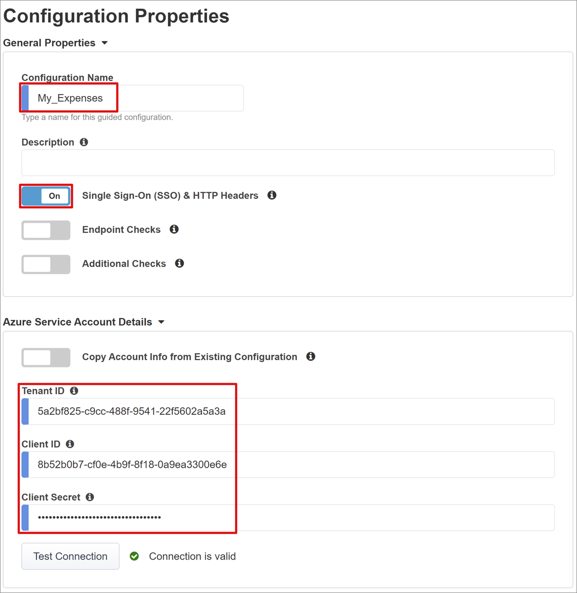
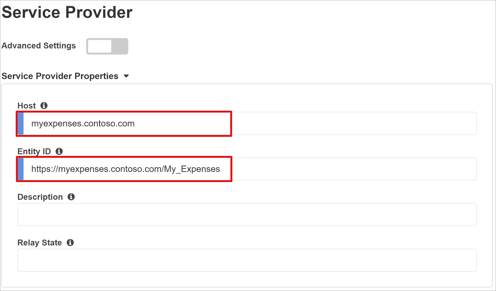
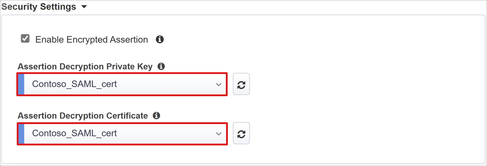
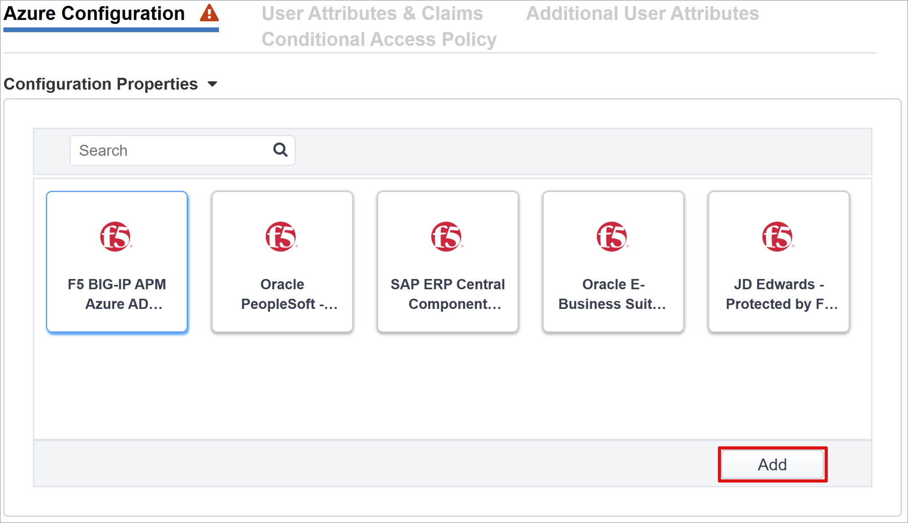
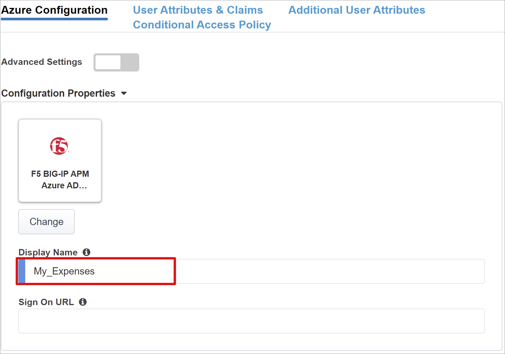
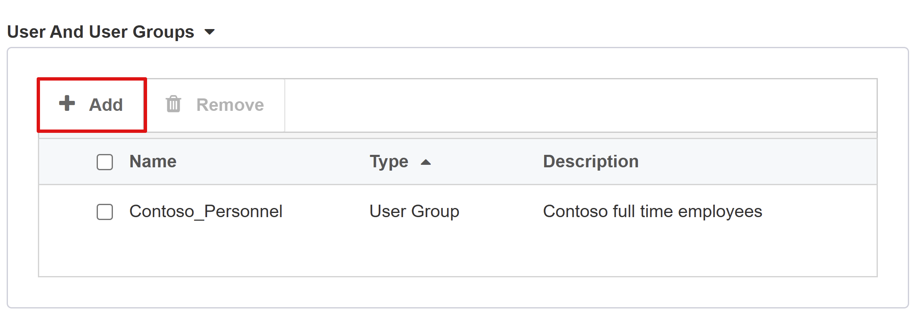
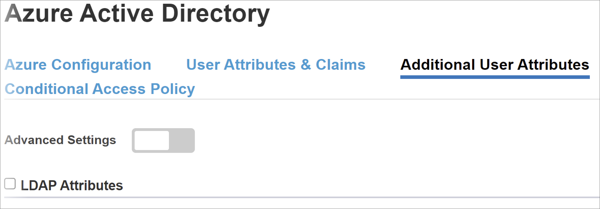

# Tutorial: Configure F5 BIG-IP Easy Button for Kerberos single sign-on

Learn to secure Kerberos-based applications with Microsoft Entra ID, through F5 BIG-IP Easy Button Guided Configuration 16.1.

Integrating a BIG-IP with Microsoft Entra ID provides many benefits, including:

* Improved governance: See, [Zero Trust framework to enable remote work](https://www.microsoft.com/security/blog/2020/04/02/announcing-microsoft-zero-trust-assessment-tool/) and learn more about Microsoft Entra pre-authentication. 
* Enforce organizational policies. See [What is Conditional Access?](../conditional-access/overview.md).
* Full SSO between Microsoft Entra ID and BIG-IP published services
* Manage identities and access from a single control plane, the [Microsoft Entra admin center](https://entra.microsoft.com).

To learn more about benefits, see the article on [F5 BIG-IP and Microsoft Entra integration](./f5-integration.md).

## Scenario description

This scenario is the classic, legacy application using Kerberos authentication, also known as Integrated Windows Authentication (IWA), to gate access to protected content.

Because it's legacy, the application lacks modern protocols to support direct integration with Microsoft Entra ID. You can modernize the application, but it's costly, requires planning, and introduces risk of potential downtime. Instead, an F5 BIG-IP Application Delivery Controller (ADC) bridges the gap between the legacy application and the modern ID control plane, through protocol transitioning. 

A BIG-IP in front of the application enables overlay of the service with Microsoft Entra pre-authentication and headers-based SSO, improving the security posture of the application.

> [!NOTE] 
> Organizations can gain remote access to this type of application with [Microsoft Entra application proxy](../app-proxy/application-proxy.md)

## Scenario architecture

The secure hybrid access (SHA) solution for this scenario has the following components:

* **Application:** BIG-IP published service to be protected by Microsoft Entra SHA. The application host is domain-joined, therefore is integrated with Active Directory (AD).
* **Microsoft Entra ID:** Security Assertion Markup Language (SAML) identity provider (IdP) that verifies user credentials, Conditional Access, and SAML-based SSO to the BIG-IP. Through SSO, Microsoft Entra ID provides BIG-IP with required session attributes.
* **KDC:** Key Distribution Center (KDC) role on a Domain Controller (DC), issuing Kerberos tickets
* **BIG-IP:** Reverse proxy and SAML service provider (SP) to the application, delegating authentication to the SAML IdP before performing Kerberos-based SSO to the back-end application.

SHA for this scenario supports SP- and IdP-initiated flows. The following image illustrates the SP flow.

   

1. User connects to application endpoint (BIG-IP)
2. BIG-IP APM access policy redirects user to Microsoft Entra ID (SAML IdP)
3. Microsoft Entra ID pre-authenticates user and applies any enforced Conditional Access policies
4. User is redirected to BIG-IP (SAML SP) and SSO is performed using issued SAML token
5. BIG-IP requests Kerberos ticket from KDC
6. BIG-IP sends request to backend application, along with Kerberos ticket for SSO
7. Application authorizes request and returns payload

## Prerequisites

Prior BIG-IP experience isn't necessary, but you need:

* An [Azure free account](https://azure.microsoft.com/free/active-directory/), or higher
* A BIG-IP or [deploy a BIG-IP Virtual Edition (VE) in Azure](./f5-bigip-deployment-guide.md)
* Any of the following F5 BIG-IP licenses:
    * F5 BIG-IP&reg; Best bundle
    * F5 BIG-IP APM standalone
    * F5 BIG-IP APM add-on license on a BIG-IP F5 BIG-IP&reg; Local Traffic Manager&trade; (LTM)
    * 90-day BIG-IP [Free Trial](https://www.f5.com/trial/big-ip-trial.php) license
* User identities [synchronized](../hybrid/connect/how-to-connect-sync-whatis.md) from an on-premises directory to Microsoft Entra ID, or created in Microsoft Entra ID and flowed back to your on-premises directory
* One of the following roles: Global Administrator, Cloud Application Administrator, or Application Administrator.
* An [SSL Web certificate](./f5-bigip-deployment-guide.md) for publishing services over HTTPS, or use the default BIG-IP certificates while testing
* A Kerberos application, or go to active-directory-wp.com to learn to configure [SSO with IIS on Windows](https://active-directory-wp.com/docs/Networking/Single_Sign_On/SSO_with_IIS_on_Windows.html).

## BIG-IP configuration methods

This tutorial covers the latest Guided Configuration 16.1 with an Easy Button template. With the Easy Button, Admins don't go back and forth between Microsoft Entra ID and a BIG-IP to enable services for SHA. The deployment and policy management is handled by the APM Guided Configuration wizard and Microsoft Graph. This integration between BIG-IP APM and Microsoft Entra ID ensures applications support identity federation, SSO, and Microsoft Entra Conditional Access, reducing administrative overhead.

>[!NOTE] 
> Replace example strings or values in this article with those for your environment.

## Register Easy Button

[!INCLUDE [portal updates](~/articles/active-directory/includes/portal-update.md)]

Before a client or service can access Microsoft Graph, it must be trusted by the [Microsoft identity platform.](../develop/quickstart-register-app.md). This action creates a tenant app registration to authorize Easy Button access to Graph. Through these permissions, the BIG-IP pushes the configurations to establish a trust between a SAML SP instance for published application, and Microsoft Entra ID as the SAML IdP.

1. Sign in to the [Microsoft Entra admin center](https://entra.microsoft.com) as at least a [Cloud Application Administrator](../roles/permissions-reference.md#cloud-application-administrator). 
2. Browse to **Identity** > **Applications** > **App registrations > New registration**.
3. Enter a display name for your application. For example, F5 BIG-IP Easy Button.
4. Specify who can use the application > **Accounts in this organizational directory only**.
5. Select **Register**.
6. Navigate to **API permissions** and authorize the following Microsoft Graph **Application permissions**:

   * Application.Read.All
   * Application.ReadWrite.All
   * Application.ReadWrite.OwnedBy
   * Directory.Read.All
   * Group.Read.All
   * IdentityRiskyUser.Read.All
   * Policy.Read.All
   * Policy.ReadWrite.ApplicationConfiguration
   * Policy.ReadWrite.ConditionalAccess
   * User.Read.All

8. Grant admin consent for your organization.
9. On **Certificates & Secrets**, generate a new client secret. Make a note of this secret.
10. From **Overview**, note the Client ID and Tenant ID.

## Configure Easy Button

Initiate the APM Guided Configuration to launch the Easy Button template.

1. Navigate to **Access > Guided Configuration > Microsoft Integration** and select **Microsoft Entra Application**.

    

2. Review the configuration steps and select **Next**

    

3. Follow the steps to publish your application.

    

### Configuration Properties

The **Configuration Properties** tab creates a BIG-IP application config and SSO object. The **Azure Service Account Details** section can represent the client you registered in your Microsoft Entra tenant earlier, as an application. These settings allow a BIG-IP OAuth client to register a SAML SP in your tenant, with the SSO properties you configure manually. Easy Button does this action for every BIG-IP service published and enabled for SHA.

Some settings are global, which can be reused for publishing more applications, reducing deployment time and effort.

1. Provide a unique **Configuration Name**.
2. Enable **Single Sign-On (SSO) & HTTP Headers**.
3. Enter the **Tenant ID**, **Client ID**, and **Client Secret** you noted when registering the Easy Button client in your tenant.

    

4. Confirm the BIG-IP connects to your tenant.
5. Select **Next**.

### Service Provider

The Service Provider settings are the properties for the SAML SP instance of the application protected through SHA.

1. For **Host**, enter the public FQDN of the application being secured.
2. For **Entity ID**, enter the identifier Microsoft Entra ID uses to identify the SAML SP requesting a token.

    

The optional **Security Settings** specify whether Microsoft Entra ID encrypts issued SAML assertions. Encrypting assertions between Microsoft Entra ID and the BIG-IP APM provides more assurance the content tokens can't be intercepted, and personal or corporate data can't be compromised.

3.    From the **Assertion Decryption Private Key** list, select **Create New**.
 

4.    Select **OK**. The **Import SSL Certificate and Keys** dialog appears.
5.    Select **PKCS 12 (IIS)** to import your certificate and private key. 
6.    After provisioning, close the browser tab to return to the main tab.

7.    Check **Enable Encrypted Assertion**.
8.    If you enabled encryption, select your certificate from the **Assertion Decryption Private Key** list. This private key is for the certificate that BIG-IP APM uses to decrypt Microsoft Entra assertions.
9.    If you enabled encryption, select your certificate from the **Assertion Decryption Certificate** list. BIG-IP uploads this certificate to Microsoft Entra ID to encrypt the issued SAML assertions.

### Microsoft Entra ID

This section defines properties to manually configure a new BIG-IP SAML application in your Microsoft Entra tenant. Easy Button has application templates for Oracle PeopleSoft, Oracle E-business Suite, Oracle JD Edwards, SAP ERP, and an SHA template for other apps. 

For this scenario, select **F5 BIG-IP APM Azure AD Integration > Add.**

   

#### Azure Configuration

1. Enter a **Display Name** for the app that BIG-IP creates in your Microsoft Entra tenant, and the icon in [MyApps portal](https://myapplications.microsoft.com/).
2. Leave the **Sign On URL** (optional) blank to enable IdP initiated sign-on.

    

3. Select the **refresh** icon next to the **Signing Key** and **Signing Certificate** to locate the certificate you imported.
4. In **Signing Key Passphrase**, enter the certificate password.
5. Enable **Signing Option** (optional) to ensure BIG-IP accepts tokens and claims signed by Microsoft Entra ID.

    

6. **User and User Groups** are dynamically queried from your Microsoft Entra tenant and authorize access to the application. Add a user or group for testing, otherwise all access is denied.

    

#### User Attributes & Claims

When a user authenticates to Microsoft Entra ID, it issues a SAML token with a default set of claims and attributes identifying the user. The **User Attributes & Claims** tab shows the default claims to issue for the new application. Use it to configure more claims.

The AD infrastructure is based on a .com domain suffix used internally and externally. More attributes aren't required to achieve a functional KCD SSO implementation. See the [advanced tutorial](./f5-big-ip-kerberos-advanced.md) for multiple domains or user sign-in using an alternate suffix. 

   

#### Additional User Attributes

The **Additional User Attributes** tab supports various distributed systems requiring attributes stored in other directories, for session augmentation. Attributes fetched from an LDAP source can be injected as SSO headers to help control access based on roles, Partner IDs, etc.

   

>[!NOTE] 
>This feature has no correlation to Microsoft Entra ID but is another source of attributes.

#### Conditional Access Policy

Conditional Access policies are enforced after Microsoft Entra pre-authentication to control access based on device, application, location, and risk signals.

The **Available Policies** view shows Conditional Access policies without user-based actions.

The **Selected Policies** view shows policies targeting cloud apps. You can't deselect policies or move them to the Available Policies list because they're enforced at a tenant level.

To select a policy to apply to the application being published:

1.    From the **Available Policies** list, select a policy.
2.    Select the **right arrow** and move it to the **Selected Policies** list.

Selected policies need an **Include** or **Exclude** option checked. If both options are checked, the selected policy isn't enforced.

   

>[!NOTE]
>The policy list appears once, after switching to this tab. You can use the **refresh** button to manually force the wizard to query your tenant, but this button appears after the application is deployed.

### Virtual Server Properties

A virtual server is a BIG-IP data plane object represented by a virtual IP address listening for client requests to the application. Any received traffic is processed and evaluated against the APM profile associated with the virtual server, before being directed according to policy.

1. Enter a **Destination Address**, an available IPv4/IPv6 address the BIG-IP can use to receive client traffic. There's a corresponding record in DNS, enabling clients to resolve the external URL of your BIG-IP published application to this IP, instead of the application. Using a test PC localhost DNS is acceptable for testing.
2. For **Service Port** enter 443 for HTTPS.
3. Check **Enable Redirect Port** and then enter **Redirect Port**, which redirects incoming HTTP client traffic to HTTPS.
4. The Client SSL Profile enables the virtual server for HTTPS, so client connections are encrypted over TLS. Select the **Client SSL Profile** you created for prerequisites, or leave the default if you're testing.

    

### Pool Properties

The **Application Pool** tab shows the services behind a BIG-IP, represented as a pool with application servers.

1. For **Select a Pool**, create a new pool or select one.
2. Choose a **Load Balancing Method**, such as Round Robin.
3. For **Pool Servers** select a server node, or specify an IP and port for the back-end node hosting the header-based application.

    

The back-end application runs on HTTP port 80. You can switch the port to 443, if your application runs on HTTPS.

#### Single sign-on and HTTP Headers

Enabling SSO allows users to access BIG-IP published services without having to enter credentials. The Easy Button wizard supports Kerberos, OAuth Bearer, and HTTP authorization headers for SSO. For these instructions, use the Kerberos delegation account you created. 

Enable **Kerberos** and **Show Advanced Setting** to enter the following:

* **Username Source:** The preferred username to cache for SSO. You can provide a session variable as the source of the user ID, but *session.saml.last.identity* works better because it holds the Microsoft Entra claim containing the logged in user ID.

* **User Realm Source:** Required if the user domain differs from the BIG-IP Kerberos realm. In that case, the APM session variable contains the logged-in user domain. For example,*session.saml.last.attr.name.domain*

    

* **KDC:** Domain Controller IP, or FQDN if DNS is configured and efficient
* **UPN Support:** Enable this option for the APM to use the UPN for Kerberos ticketing 
* **SPN Pattern:** Use HTTP/%h to inform the APM to use the host header of the client request, and build the SPN for which it's requesting a Kerberos token
* **Send Authorization:** Disable for applications that negotiate authentication instead of receiving the kerberos token in the first request. For example, Tomcat.

     

### Session Management

The BIG-IPs session management settings define the conditions under which user sessions terminate or continue, limits for users and IP addresses, and corresponding user info. Refer to the AskF5 article [K18390492: Security | BIG-IP APM operations guide](https://support.f5.com/csp/article/K18390492) for settings details.

What isn't covered is Single Log Out (SLO) functionality, which ensures sessions between the IdP, the BIG-IP, and the user agent terminate when a user signs out. When the Easy Button instantiates a SAML application in your Microsoft Entra tenant, it populates the sign-out URL with the APM SLO endpoint. An IdP-initiated sign out from the Microsoft Entra My Apps portal terminates the session between the BIG-IP and a client.

The SAML federation metadata for the published application is imported from your tenant, providing the APM with the SAML sign-out endpoint for Microsoft Entra ID. This action ensures an SP-initiated sign out terminates the session between a client and Microsoft Entra ID. The APM needs to know when a user signs out of the application.

If the BIG-IP webtop portal accesses published applications, then a sign out is processed by the APM to call the Microsoft Entra sign-out endpoint. But consider a scenario when the BIG-IP webtop portal isn't used, then the user can't instruct the APM to sign out. Even if the user signs out of the application, the BIG-IP is oblivious. Therefore, consider SP-initiated sign out to ensure sessions terminate securely. You can add an SLO function to your application Sign-out button, so it redirects your client to the Microsoft Entra SAML, or the BIG-IP sign out endpoint. 

The URL for SAML sign-out endpoint for your tenant is found in **App Registrations > Endpoints**.

If you can't change the app, then consider having the BIG-IP listen for the application sign-out call, and upon detecting the request, it triggers SLO. To learn about BIG-IP iRules, refer to [Oracle PeopleSoft SLO guidance](./f5-big-ip-oracle-peoplesoft-easy-button.md#peoplesoft-single-logout). For more information about using BIG-IP iRules, see: 

* [K42052145: Configuring automatic session termination (log out) based on a URI-referenced file name](https://support.f5.com/csp/article/K42052145)
* [K12056: Overview of the Log-out URI Include option](https://support.f5.com/csp/article/K12056).

## Summary

This section is a breakdown of your configurations. 

Select **Deploy** to commit settings and verify the application is in your tenant's list of Enterprise applications.

## Active Directory KCD configurations

For the BIG-IP APM to perform SSO to the back-end application on behalf of users, configure KCD in the target Active Directory (AD) domain. Delegating authentication requires you to provision the BIG-IP APM with a domain service account.

Skip this section if your APM service account and delegation are set up. Otherwise, log into a domain controller with an Admin account.

For this scenario, the application is hosted on server APP-VM-01 and runs in the context of a service account named web_svc_account, not the computer identity. The delegating service account assigned to the APM is F5-BIG-IP.

### Create a BIG-IP APM delegation account 

The BIG-IP does not support group Managed Service Accounts (gMSA), therefore create a standard user account for the APM service account.

1. Enter the following PowerShell command. Replace the **UserPrincipalName** and **SamAccountName** values with your environment values. For better security, use a dedicated SPN that matches the host header of the application.

    `New-ADUser -Name "F5 BIG-IP Delegation Account" UserPrincipalName $HOST_SPN SamAccountName "f5-big-ip" -PasswordNeverExpires $true Enabled $true -AccountPassword (Read-Host -AsSecureString "Account Password")`

    HOST_SPN = host/f5-big-ip.contoso.com@contoso.com

    >[!NOTE]
    >When the Host is used, any application running on the host will delegate the account whereas when HTTPS is used, it will allow only HTTP protocol-related operations.

2. Create a **Service Principal Name (SPN)** for the APM service account to use during delegation to the web application service account:

    `Set-AdUser -Identity f5-big-ip -ServicePrincipalNames @{ Add="host/f5-big-ip.contoso.com" }`
     
     >[!NOTE]
     >It is mandatory to include the host/ part in the format of UserPrincipleName (host/name.domain@domain) or ServicePrincipleName (host/name.domain).

4. Before you specify the target SPN, view its SPN configuration. Ensure the SPN shows against the APM service account. The APM service account delegates for the web application:

    * Confirm your web application is running in the computer context or a dedicated service account.
    * For the Computer context, use the following command to query the account object in the Active Directory to see its defined SPNs. Replace <name_of_account> with the account for your environment.

        `Get-ADComputer -identity <name_of_account> -properties ServicePrincipalNames | Select-Object -ExpandProperty ServicePrincipalNames`

        For example:
        Get-ADUser -identity f5-big-ip -properties ServicePrincipalNames | Select-Object -ExpandProperty ServicePrincipalNames

    * For the dedicated service account, use the following command to query the account object in Active Directory to see its defined SPNs. Replace <name_of_account> with the account for your environment.

        `Get-ADUser -identity <name_of_account> -properties ServicePrincipalNames | Select-Object -ExpandProperty ServicePrincipalNames`

        For example:

        `Get-ADComputer -identity f5-big-ip -properties ServicePrincipalNames | Select-Object -ExpandProperty ServicePrincipalNames`

4. If the application ran in the machine context, add the SPN to the object of the computer account in Active Directory:

    `Set-ADComputer -Identity APP-VM-01 -ServicePrincipalNames @{ Add="http/myexpenses.contoso.com" }`

With SPNs defined, establish trust for the APM service account delegate to that service. The configuration varies depending on the topology of your BIG-IP instance and application server.

### Configure BIG-IP and target application in the same domain

1. Set trust for the APM service account to delegate authentication:

    `Get-ADUser -Identity f5-big-ip | Set-ADAccountControl -TrustedToAuthForDelegation $true`

2. The APM service account needs to know the target SPN it's trusted to delegate to. Set the target SPN to the service account running your web application:

    `Set-ADUser -Identity f5-big-ip -Add @{ 'msDS-AllowedToDelegateTo'=@('HTTP/myexpenses.contoso.com') }`

    >[!NOTE]
    >You can complete these tasks with the Active Directory Users and Computers, Microsoft Management Console (MMC) snap-in, on a domain controller.

### BIG-IP and application in different domains

In the Windows Server 2012 version, and higher, cross-domain KCD uses Resource-Based Constrained Delegation (RBCD). The constraints for a service are transferred from the domain administrator to the service administrator. This delegation allows the back-end service administrator to allow or deny SSO. This situation creates a different approach at configuration delegation, which is possible when you use PowerShell or Active Directory Service Interfaces Editor (ADSI Edit).

You can use the PrincipalsAllowedToDelegateToAccount property of the application service account (computer or dedicated service account) to grant delegation from BIG-IP. For this scenario, use the following PowerShell command on a domain controller (Windows Server 2012 R2, or later) in the same domain as the application.

Use an SPN defined against a web application service account. For better security, use a dedicated SPN that matches the host header of the application. For example, because the web application host header in this example is `myexpenses.contoso.com`, add `HTTP/myexpenses.contoso.com` to the application service account object in Active Directory (AD):

`Set-AdUser -Identity web_svc_account -ServicePrincipalNames @{ Add="http/myexpenses.contoso.com" }`

For the following commands, note the context. 

If the web_svc_account service runs in the context of a user account, use these commands:

`$big-ip= Get-ADComputer -Identity f5-big-ip -server dc.contoso.com`

``Set-ADUser -Identity web_svc_account -PrincipalsAllowedToDelegateToAccount`

`$big-ip Get-ADUser web_svc_account -Properties PrincipalsAllowedToDelegateToAccount`

If the web_svc_account service runs in the context of a computer account, use these commands:

`$big-ip= Get-ADComputer -Identity f5-big-ip -server dc.contoso.com`

`Set-ADComputer -Identity web_svc_account -PrincipalsAllowedToDelegateToAccount`

`$big-ip Get-ADComputer web_svc_account -Properties PrincipalsAllowedToDelegateToAccount`

For more information, see [Kerberos Constrained Delegation across domains](/previous-versions/windows/it-pro/windows-server-2012-R2-and-2012/hh831477(v=ws.11)).

## App view

From a browser, connect to the application external URL or select the **application** icon in the [Microsoft MyApps portal](https://myapps.microsoft.com/). After authenticating to Microsoft Entra ID, you're redirected to the BIG-IP virtual server for the application and signed in through SSO.

   

For increased security, organizations using this pattern can block direct access to the application, thereby forcing a strict path through the BIG-IP.

### Microsoft Entra B2B guest access

[Microsoft Entra B2B guest access](../external-identities/hybrid-cloud-to-on-premises.md) is supported for this scenario, with guest identities flowing down from your Microsoft Entra tenant to the directory the application uses for authorization. Without a local representation of a guest object in AD, the BIG-IP fails to receive a kerberos ticket for KCD SSO to the back-end application.

## Advanced deployment

The Guided Configuration templates can lack the flexibility to achieve some requirements. For those scenarios, see [Advanced Configuration for kerberos-based SSO](./f5-big-ip-kerberos-advanced.md).

Alternatively, in BIG-IP you can disable the Guided Configuration strict management mode. You can manually change your configurations, although the bulk of your configurations are automated through the wizard-based templates.

You can navigate to **Access > Guided Configuration** and select the small **padlock** icon on the far-right of the row for your applications configs. 
 
   

At this point, changes with the wizard UI aren't possible, but all BIG-IP objects associated with the published instance of the application are unlocked for management.

>[!NOTE]
>Re-enabling strict mode and deploying a configuration overwrites settings performed outside the Guided Configuration UI. Therefore we recommend the advanced configuration method for production services.

## Troubleshooting

If troubleshooting kerberos SSO issues, be aware of the following concepts.

* Kerberos is time sensitive, so it requires servers and clients set to the correct time, and when possible, synchronized to a reliable time source
* Ensure the hostname for the domain controller and web application are resolvable in DNS
* Ensure there are no duplicate SPNs in your AD environment: execute the following query at the command line on a domain PC: setspn -q HTTP/my_target_SPN

You can refer to our [App Proxy guidance](../app-proxy/application-proxy-back-end-kerberos-constrained-delegation-how-to.md) to validate an IIS application is configured for KCD. See also the AskF5 article, [Kerberos single sign on method](https://techdocs.f5.com/en-us/bigip-15-1-0/big-ip-access-policy-manager-single-sign-on-concepts-configuration/kerberos-single-sign-on-method.html).

### Log analysis: increase verbosity

Use BIG-IP logging to isolate issues with connectivity, SSO, policy violations, or misconfigured variable mappings. Start troubleshooting by increasing the log verbosity level.

1. Navigate to **Access Policy > Overview > Event Logs > Settings**.
2. Select the row for your published application, then **Edit > Access System Logs**.
3. Select **Debug** from the SSO list, and then select **OK**. 

Reproduce your issue and inspect the logs. When complete, revert the feature because verbose mode generates much data. 

### BIG-IP error page

If a BIG-IP error appears after Microsoft Entra pre-authentication, the issue might relate to SSO from Microsoft Entra ID to the BIG-IP.

1. Navigate to **Access > Overview > Access reports**.
2. To see logs for clues, run the report for the last hour. 
3. Use the **View session variables** link to help understand if the APM receives the expected claims from Microsoft Entra ID.

### Back-end request

If no error page appears, the issue is probably related to the back-end request, or SSO from the BIG-IP to the application. 

1. Navigate to **Access Policy > Overview > Active Sessions**.
2. Select the link for your active session. The **View Variables** link in this location can help determine root cause KCD issues, particularly if the BIG-IP APM fails to obtain the right user and domain identifiers from session variables.

For more information, see:

* dev/central: [APM variable assign examples](https://community.f5.com/t5/codeshare/apm-variable-assign-examples/ta-p/287962)
* MyF5: [Session Variables](https://techdocs.f5.com/en-us/bigip-15-0-0/big-ip-access-policy-manager-visual-policy-editor/session-variables.html)
