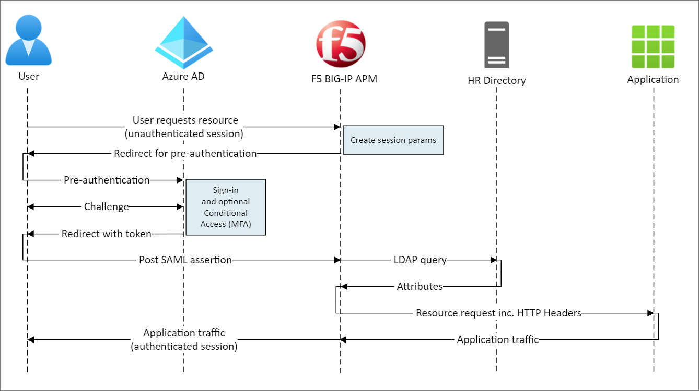
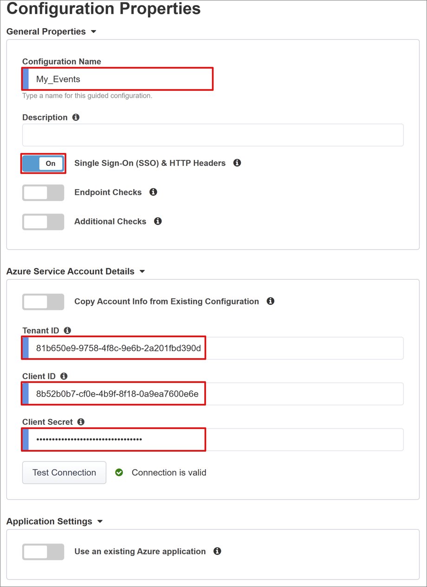
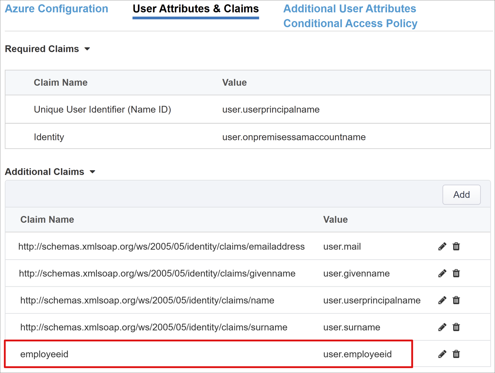
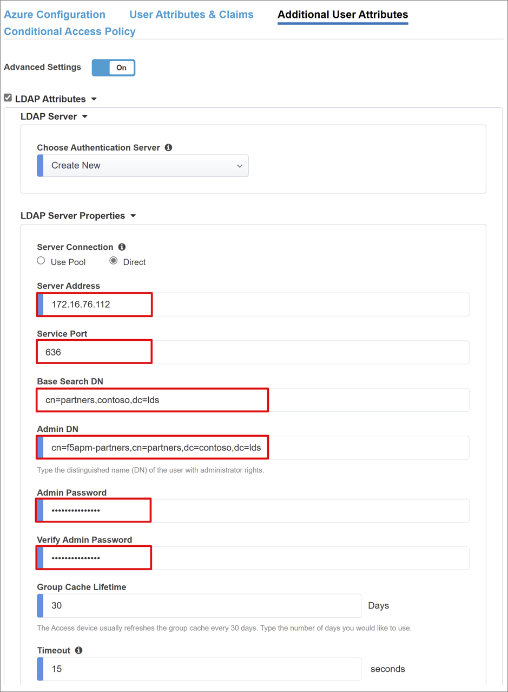
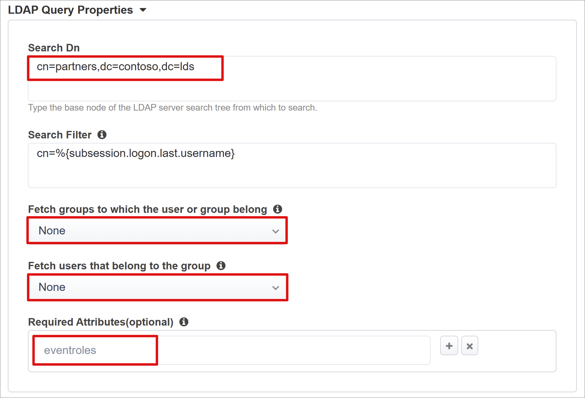
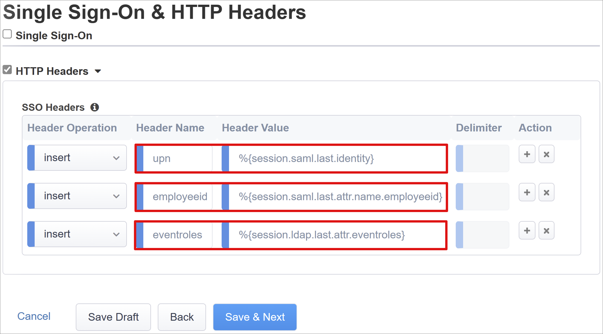

# Tutorial: Configure F5 BIG-IP Easy Button for header-based and LDAP single sign-on

In this article, you can learn to secure header and LDAP-based applications using Azure Active Directory (Azure AD), by using the F5 BIG-IP Easy Button Guided Configuration 16.1. Integrating a BIG-IP with Azure AD provides many benefits: 

* Improved governance: See, [Zero Trust framework to enable remote work](https://www.microsoft.com/security/blog/2020/04/02/announcing-microsoft-zero-trust-assessment-tool/) and learn more about Azure AD pre-authentication
  * See also, [What is Conditional Access?](../conditional-access/overview.md) to learn about how it helps enforce organizational policies
* Full single sign-on (SSO) between Azure AD and BIG-IP published services
* Manage identities and access from one control plane, the [Azure portal](https://portal.azure.com)

To learn about more benefits, see [F5 BIG-IP and Azure AD integration](./f5-integration.md).

## Scenario description

This scenario focuses on the classic, legacy application using **HTTP authorization headers** sourced from LDAP directory attributes, to manage access to protected content.

Because it's legacy, the application lacks modern protocols to support a direct integration with Azure AD. You can modernize the app, but it's costly, requires planning, and introduces risk of potential downtime. Instead, you can use an F5 BIG-IP Application Delivery Controller (ADC) to bridge the gap between the legacy application and the modern ID control plane, with protocol transitioning.

Having a BIG-IP in front of the app enables overlay of the service with Azure AD pre-authentication and header-based SSO, improving the overall security posture of the application.

## Scenario architecture

The secure hybrid access solution for this scenario has:

* **Application** - BIG-IP published service to be protected by Azure AD secure hybrid access (SHA)
* **Azure AD** - Security Assertion Markup Language (SAML) identity provider (IdP) that verifies user credentials, Conditional Access, and SAML-based SSO to the BIG-IP. With SSO, Azure AD provides the BIG-IP with required session attributes.
* **HR system** - LDAP-based employee database as the source of truth for application permissions
* **BIG-IP** - Reverse proxy and SAML service provider (SP) to the application, delegating authentication to the SAML IdP, before performing header-based SSO to the back-end application

SHA for this scenario supports SP and IdP initiated flows. The following image illustrates the SP initiated flow.

   

1. User connects to application endpoint (BIG-IP)
2. BIG-IP APM access policy redirects user to Azure AD (SAML IdP)
3. Azure AD pre-authenticates user and applies enforced Conditional Access policies
4. User is redirected to BIG-IP (SAML SP) and SSO is performed using issued SAML token
5. BIG-IP requests more attributes from LDAP based HR system
6. BIG-IP injects Azure AD and HR system attributes as headers in request to application
7. Application authorizes access with enriched session permissions

## Prerequisites

Prior BIG-IP experience isn't necessary, but you need:

- An [Azure free account](https://azure.microsoft.com/free/active-directory/), or a higher-tier subscription
- A BIG-IP or [deploy a BIG-IP Virtual Edition (VE) in
    Azure](./f5-bigip-deployment-guide.md)
- Any of the following F5 BIG-IP license SKUs:
  - F5 BIG-IP® Best bundle
  - F5 BIG-IP Access Policy Manager™ (APM) standalone license
  - F5 BIG-IP Access Policy Manager™ (APM) add-on license on a BIG-IP F5 BIG-IP® Local Traffic Manager™ (LTM)
  - 90-day BIG-IP product [Free Trial](https://www.f5.com/trial/big-ip-trial.php)
- User identities [synchronized](../hybrid/how-to-connect-sync-whatis.md) from an on-premises directory to Azure AD
- An account with Azure AD Application Admin [permissions](/azure/active-directory/users-groups-roles/directory-assign-admin-roles#application-administrator)
- An [SSL Web certificate](./f5-bigip-deployment-guide.md#ssl-profile) for publishing services over HTTPS, or use default BIG-IP certificates while testing
- A header-based application or [set up a simple IIS header app](/previous-versions/iis/6.0-sdk/ms525396(v=vs.90)) for testing
- A user directory that supports LDAP, such as Windows Active Directory Lightweight Directory Services (AD LDS), OpenLDAP etc.

## BIG-IP configuration

This tutorial uses Guided Configuration 16.1 with an Easy Button template. With the Easy Button, admins don't go back and forth between Azure AD and a BIG-IP to enable services for SHA. The deployment and policy management is handled between the APM Guided Configuration wizard and Microsoft Graph. This integration between BIG-IP APM and Azure AD ensures applications support identity federation, SSO, and Azure AD Conditional Access, reducing administrative overhead.

>[!NOTE]
>Replace example strings or values in this guide with those for your environment.

## Register Easy Button

[!INCLUDE [portal updates](~/articles/active-directory/includes/portal-update.md)]

Before a client or service can access Microsoft Graph, it must be trusted by the [Microsoft identity platform.](../develop/quickstart-register-app.md)

This first step creates a tenant app registration to authorize the **Easy Button** access to Graph. With these permissions, the BIG-IP can push the configurations to establish a trust between a SAML SP instance for published application, and Azure AD as the SAML IdP.

1. Sign in to the [Azure portal](https://portal.azure.com) using an account with Application Administrative rights.
2. From the left navigation pane, select the **Azure Active Directory** service.
3. Under Manage, select **App registrations > New registration**.
4. Enter a display name for your application. For example, F5 BIG-IP Easy Button.
5. Specify who can use the application > **Accounts in this organizational directory only**.
6. Select **Register**.
7. Navigate to **API permissions** and authorize the following Microsoft Graph **Application permissions**:

    * Application.Read.All
    * Application.ReadWrite.All
    * Application.ReadWrite.OwnedBy
    * Directory.Read.All
    * Group.Read.All
    * IdentityRiskyUser.Read.All
    * Policy.Read.All
    * Policy.ReadWrite.ApplicationConfiguration
    * Policy.ReadWrite.ConditionalAccess
    * User.Read.All

8. Grant admin consent for your organization.
9. On **Certificates & Secrets**, generate a new **client secret**. Make a note of this secret.
10. On **Overview**, note the **Client ID** and **Tenant ID**.

## Configure the Easy Button

Initiate the APM **Guided Configuration** to launch the **Easy Button** template.

1. Navigate to **Access > Guided Configuration > Microsoft Integration** and select **Azure AD Application**.

    

2. Review the list of steps and select **Next**

    

3. Follow the steps to publish your application.

   


### Configuration Properties

The **Configuration Properties** tab creates a BIG-IP application config and SSO object. The **Azure Service Account Details** section represents the client you registered in your Azure AD tenant earlier, as an application. These settings allow a BIG-IP OAuth client to register a SAML SP in your tenant, with the SSO properties you would configure manually. Easy Button does this action for every BIG-IP service published and enabled for SHA.

Some of these settings are global, therefore can be reused to publish more applications, reducing deployment time and effort.

1. Enter a unique **Configuration Name** so admins can distinguish between Easy Button configurations.
2. Enable **Single Sign-On (SSO) & HTTP Headers**.
3. Enter the **Tenant ID**, **Client ID**, and **Client Secret** you noted when registering the Easy Button client in your tenant.
4. Confirm the BIG-IP can connect to your tenant.
5. Select **Next**.

    

### Service Provider

The Service Provider settings define the properties for the SAML SP instance of the application protected through SHA.

1. Enter **Host**, the public FQDN of the application being secured.
2. Enter **Entity ID**, the identifier Azure AD uses to identify the SAML SP requesting a token.

    

Use the optional **Security Settings** to specify whether Azure AD encrypts issued SAML assertions. Encrypting assertions between Azure AD and the BIG-IP APM provides assurance the content tokens can’t be intercepted, and personal or corporate data can't be compromised.

3. From the **Assertion Decryption Private Key** list, select **Create New**
 
    

4. Select **OK**. The **Import SSL Certificate and Keys** dialog opens in a new tab.
5. Select **PKCS 12 (IIS)** to import your certificate and private key. After provisioning, close the browser tab to return to the main tab.

    

6. Check **Enable Encrypted Assertion**.
7. If you enabled encryption, select your certificate from the **Assertion Decryption Private Key** list. BIG-IP APM uses this certificate private key to decrypt Azure AD assertions.
8. If you enabled encryption, select your certificate from the **Assertion Decryption Certificate** list. BIG-IP uploads this certificate to Azure AD to encrypt the issued SAML assertions.

    

### Azure Active Directory

This section contains properties to manually configure a new BIG-IP SAML application in your Azure AD tenant. Easy Button has application templates for Oracle PeopleSoft, Oracle E-business Suite, Oracle JD Edwards, SAP ERP, and an SHA template for other apps. 

For this scenario, select **F5 BIG-IP APM Azure AD Integration > Add**.

   

#### Azure Configuration

1. Enter **Display Name** of the app that the BIG-IP creates in your Azure AD tenant, and the icon that users see on [MyApps portal](https://myapplications.microsoft.com/).
2. Make no entry for **Sign On URL (optional)**.

    

3. To locate the certificate you imported, select the **Refresh** icon next to the **Signing Key** and **Signing Certificate**.
4. Enter the certificate password in **Signing Key Passphrase**.
5. Enable **Signing Option** (optional) to ensure BIG-IP accepts tokens and claims signed by Azure AD.

    

6. **User and User Groups** are dynamically queried from your Azure AD tenant and authorize access to the application. Add a user or group for testing, otherwise access is denied.

    

#### User Attributes & Claims

When a user authenticates, Azure AD issues a SAML token with a default set of claims and attributes uniquely identifying the user. The **User Attributes & Claims** tab shows the default claims to issue for the new application. It also lets you configure more claims.

For this example, include one more attribute:

1. For **Claim Name** enter **employeeid**.
2. For **Source Attribute** enter **user.employeeid**.

    

#### Additional User Attributes

On the **Additional User Attributes** tab, you can enable session augmentation for distributed systems such as Oracle, SAP, and other JAVA-based implementations requiring attributes stored in other directories. Attributes fetched from an LDAP source can be injected as more SSO headers to control access based on roles, Partner IDs, etc.

1. Enable the **Advanced Settings** option.
2. Check the **LDAP Attributes** check box.
3. In Choose Authentication Server, select **Create New**.
4. Depending on your setup, select either **Use pool** or **Direct** Server Connection mode to provide the **Server Address** of the target LDAP service. If using a single LDAP server, select **Direct**.
5. For **Service Port** enter 389, 636 (Secure), or another port your LDAP service uses.
6. For **Base Search DN** enter the exact distinguished name of the location containing the account the APM will authenticate with for LDAP service queries.

    

7. For **Search DN** enter the distinguished name of the location containing the user account objects that the APM queries via LDAP.
8. Set both membership options to **None** and add the name of the user object attribute to be returned from the LDAP directory. For this scenario: **eventroles**.

    

#### Conditional Access Policy

Conditional Access policies are enforced after Azure AD pre-authentication to control access based on device, application, location, and risk signals.

The **Available Policies** view lists Conditional Access policies that don't include user actions.

The **Selected Policies** view shows policies targeting all cloud apps. These policies can't be deselected or moved to the Available Policies list because they're enforced at a tenant level.

To select a policy to be applied to the application being published:

1. In the **Available Policies** list, select a policy.
2. Select the right arrow and move it to the **Selected Policies** list.

>[!NOTE]
>Selected policies have an **Include** or **Exclude** option checked. If both options are checked, the selected policy is not enforced.

   

>[!NOTE]
>The policy list is enumerated once, when you initially select this tab. Use the **Refresh** button to manually force the wizard to query your tenant. This button appears when the application is deployed.

### Virtual Server Properties

A virtual server is a BIG-IP data plane object represented by a virtual IP address listening for client requests to the application. Received traffic is processed and evaluated against the APM profile associated with the virtual server, before directed according to policy.

1. Enter the **Destination Address**, an available IPv4/IPv6 address the BIG-IP can use to receive client traffic. There should be a corresponding record in DNS, which enables clients to resolve the external URL of your BIG-IP published application to this IP, instead of the application. Using a test PC localhost DNS is acceptable for testing.
2. For **Service Port** enter 443 and HTTPS.
3. Check **Enable Redirect Port** and then enter **Redirect Port** to redirects incoming HTTP client traffic to HTTPS.
4. The Client SSL Profile enables the virtual server for HTTPS, so client connections are encrypted over TLS. Select the **Client SSL Profile** you created or leave the default while testing.

    

### Pool Properties

The **Application Pool** tab has the services behind a BIG-IP represented as a pool, with one or more application servers.

1. Choose from **Select a Pool**. Create a new pool or select one.
2. Choose the **Load Balancing Method** such as Round Robin.
3. For **Pool Servers** select a node or specify an IP and port for the server hosting the header-based application.
 
    

>[!NOTE]
>Our back-end application sits on HTTP port 80. Switch to 443 if yours is HTTPS.

### Single sign-on and HTTP Headers

Enabling SSO allows users to access BIG-IP published services without entering credentials. The **Easy Button wizard** supports Kerberos, OAuth Bearer, and HTTP authorization headers for SSO, the latter of which we’ll enable to configure the following options.

  * **Header Operation:** Insert
  * **Header Name:** upn
  * **Header Value:** %{session.saml.last.identity}

  * **Header Operation:** Insert
  * **Header Name:** employeeid
  * **Header Value:** %{session.saml.last.attr.name.employeeid}

  * **Header Operation:** Insert
  * **Header Name:** eventroles
  * **Header Value:** %{session.ldap.last.attr.eventroles}

    

>[!NOTE]
>APM session variables in curly brackets are case-sensitive. For example, if you enter OrclGUID and the Azure AD attribute name is orclguid, an attribute mapping failure occurs.

### Session management settings

The BIG-IPs session management settings define the conditions under which user sessions are terminated or allowed to continue, limits for users and IP addresses, and corresponding user info. Refer to the F5 article [K18390492: Security | BIG-IP APM operations guide](https://support.f5.com/csp/article/K18390492) for details on these settings.

What isn’t covered is Single Log Out (SLO) functionality, which ensures sessions between the IdP, the BIG-IP, and the user agent terminate as users sign out. When the Easy Button instantiates a SAML application in your Azure AD tenant, it populates the sign-out URL with the APM SLO endpoint. An IdP-initiated sign-out from the Azure AD MyApps portal terminates the session between the BIG-IP and a client.

The SAML federation metadata for the published application is imported from your tenant, which provides the APM with the SAML sign out endpoint for Azure AD. This action ensures an SP-initiated sign out terminates the session between a client and Azure AD. The APM needs to know when a user signs out of the application.

If the BIG-IP webtop portal is used to access published applications, then a sign out is processed by the APM to call the Azure AD sign-out endpoint. But, consider a scenario wherein the BIG-IP webtop portal isn’t used. The user can't instruct the APM to sign out. Even if the user signs out of the application, the BIG-IP is oblivious. Therefore, consider SP-initiated sign out to ensure sessions terminate securely. You can add an SLO function to an application Sign-out button, so it can redirect your client to the Azure AD SAML or BIG-IP sign-out endpoint. The URL for SAML sign-out endpoint for your tenant is in **App Registrations > Endpoints**.

If you can't make a change to the app, then consider having the BIG-IP listen for the application sign-out call, and upon detecting the request have it trigger SLO. Refer to the [Oracle PeopleSoft SLO guidance](./f5-big-ip-oracle-peoplesoft-easy-button.md#peoplesoft-single-logout) to learn about BIG-IP iRules. For more information about using BIG-IP iRules, see:

* [K42052145: Configuring automatic session termination based on a URI-referenced file name](https://support.f5.com/csp/article/K42052145)
* [K12056: Overview of the Log-out URI Include option](https://support.f5.com/csp/article/K12056)

## Summary

This last step provides a breakdown of your configurations. 

Select **Deploy** to commit settings and verify the application is in your tenant list of Enterprise applications.

Your application should be published and accessible via SHA, either with its URL or through Microsoft application portals. For increased security, organizations using this pattern can block direct access to the application, thereby forcing a strict path through the BIG-IP.

## Next steps

From a browser, in the [Microsoft MyApps portal](https://myapplications.microsoft.com/) connect to the application external URL or select the application icon. After authenticating against Azure AD, you're redirected to the BIG-IP virtual server for the application and signed in through SSO.

See the following screenshot for output of the injected headers in our headers-based application.

   

For increased security, organizations using this pattern can block direct access to the application, thereby forcing a strict path through the BIG-IP.

## Advanced deployment

The Guided Configuration templates can lack flexibility to achieve specific requirements.

In BIG-IP, you can disable the Guided Configuration **strict management mode**. You can then manually change your configurations, although the bulk of your configurations are automated through the wizard-based templates.

For your applications configurations, you can navigate to **Access > Guided Configuration** and select the small **padlock** icon on the far-right of the row. 

   

At this point, changes with the wizard UI are no longer possible, but all BIG-IP objects associated with the published instance of the application are unlocked for direct management.

> [!NOTE]
> Re-enabling strict mode and deploying a configuration overwrites any settings performed outside the Guided Configuration UI. We recommend the advanced configuration method for production services.

## Troubleshooting

**BIG-IP logging**

BIG-IP logging can help isolate issues with connectivity, SSO, policy violations, or misconfigured variable mappings. 

To troubleshoot, you can increase the log verbosity level.

1. Navigate to **Access Policy > Overview > Event Logs > Settings**.
2. Select the row for your published application then **Edit > Access System Logs**.
3. From the SSO list, select **Debug**, then **OK**.

Reproduce your issue, then inspect the logs, but revert this setting when finished. Verbose mode generates significant amounts of data. 

**BIG-IP error page**

If a BIG-IP error appears after Azure AD pre-authentication, it’s possible the issue relates to SSO from Azure AD to the BIG-IP.

1. Navigate to **Access > Overview > Access reports**.
2. Run the report for the last hour to see if the logs provide any clues. 
3. Use the **View Variables** link for your session to understand if the APM is receiving the expected claims from Azure AD.

**Back-end request**

If there's no error page, then the issue is probably related to the back-end request, or SSO from the BIG-IP to the application.

1. Navigate to **Access Policy > Overview > Active Sessions** and select the link for your active session.
2. To help root-cause the issue, use the **View Variables** link, particularly if the BIG-IP APM fails to obtain the right attributes from Azure AD or another source.

**Validate the APM service account**

Use the following command from the BIG-IP bash shell to validate the APM service account for LDAP queries. Confirm authentication and query of a user object.

 ```ldapsearch -xLLL -H 'ldap://192.168.0.58' -b "CN=partners,dc=contoso,dc=lds" -s sub -D "CN=f5-apm,CN=partners,DC=contoso,DC=lds" -w 'P@55w0rd!' "(cn=testuser)"```

For more information, see the F5 article [K11072: Configuring LDAP remote authentication for Active Directory](https://support.f5.com/csp/article/K11072). You can use a BIG-IP reference table to help diagnose LDAP-related issues in AskF5 document, [LDAP Query](https://techdocs.f5.com/kb/en-us/products/big-ip_apm/manuals/product/apm-authentication-single-sign-on-11-5-0/5.html).
