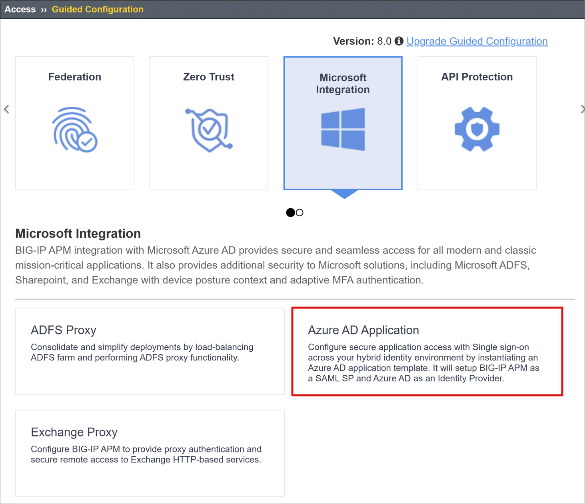
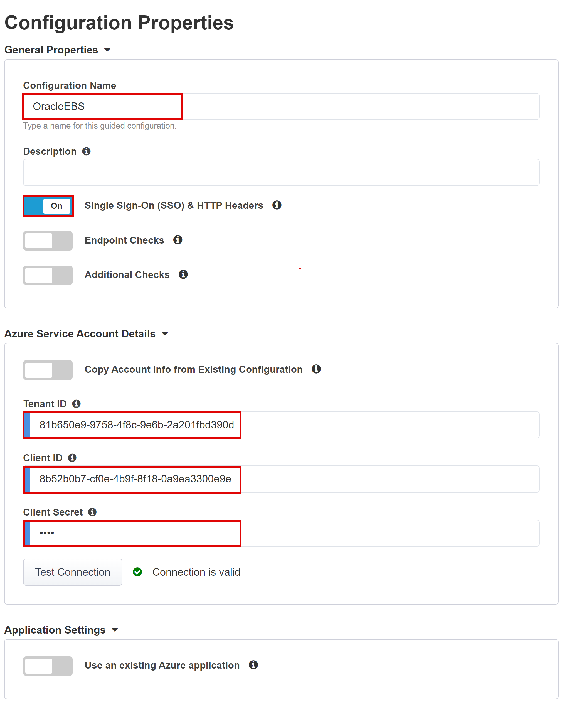
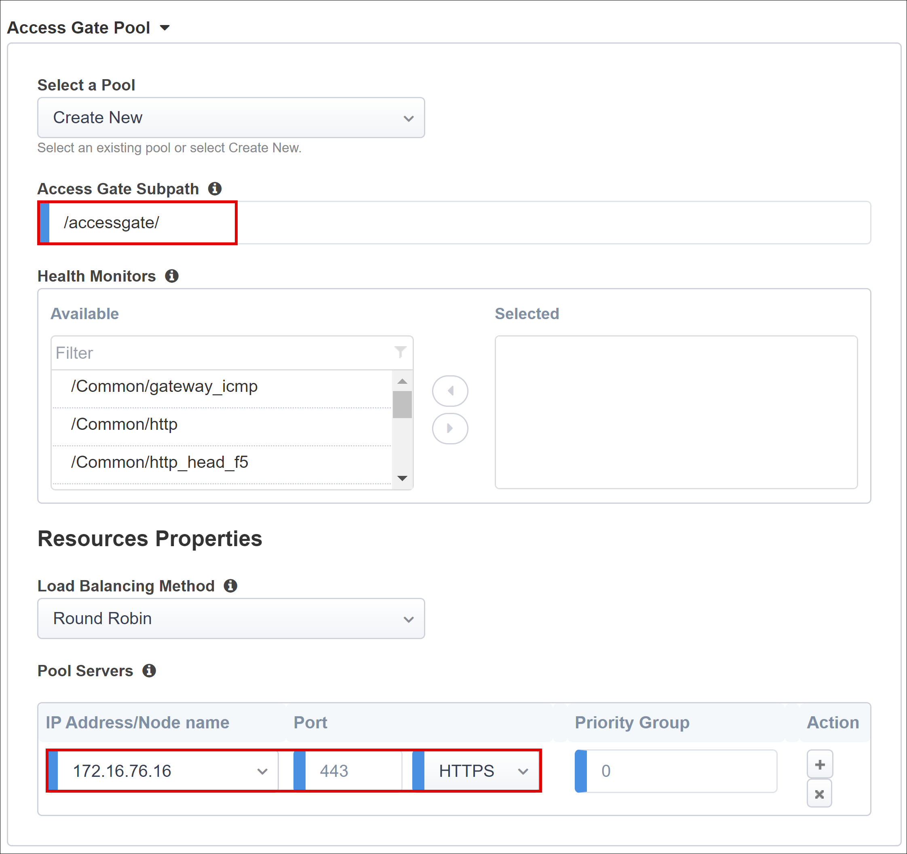

# Tutorial: Configure F5 BIG-IP Easy Button for SSO to Oracle EBS

Learn to secure Oracle E-Business Suite (EBS) using Microsoft Entra ID, with F5 BIG-IP Easy Button Guided Configuration. Integrating a BIG-IP with Microsoft Entra ID has many benefits:

* Improved Zero Trust governance through Microsoft Entra preauthentication and Conditional Access 
  * See, [What is Conditional Access?](../conditional-access/overview.md)
  * See, [Zero Trust security](/azure/security/fundamentals/zero-trust)
* Full SSO between Microsoft Entra ID and BIG-IP published services
* Managed identities and access from one control plane
  * See, the [Microsoft Entra admin center](https://entra.microsoft.com)

Learn more:

* [Integrate F5 BIG-IP with Microsoft Entra ID](./f5-integration.md)
* [Enable SSO for an enterprise application](add-application-portal-setup-sso.md)

## Scenario description

This scenario covers the classic Oracle EBS application that uses HTTP authorization headers to manage access to protected content.

Legacy applications lack modern protocols to support Microsoft Entra integration. Modernization is costly, time consuming, and introduces downtime risk. Instead, use an F5 BIG-IP Application Delivery Controller (ADC) to bridge the gap between legacy applications and the modern ID control plane, with protocol transitioning.

A BIG-IP in front of the app enables overlay of the service with Microsoft Entra preauthentication and header-based SSO. This configuration improves application security posture.

## Scenario architecture

The secure hybrid access (SHA) solution has the following components:

* **Oracle EBS application** - BIG-IP published service to be protected by Microsoft Entra SHA
* **Microsoft Entra ID**  - Security Assertion Markup Language (SAML) identity provider (IdP) that verifies user credentials, Conditional Access, and SAML-based SSO to the BIG-IP
  * With SSO, Microsoft Entra ID provides BIG-IP session attributes
* **Oracle Internet Directory (OID)** - hosts the user database
  * BIG-IP verifies authorization attributes with LDAP
* **Oracle E-Business Suite AccessGate** - validates authorization attributes with the OID service, then issues EBS access cookies 
* **BIG-IP** - reverse-proxy and SAML service provider (SP) to the application 
  * Authentication is delegated to the SAML IdP, then header-based SSO to the Oracle application occurs

SHA supports SP- and IdP-initiated flows. The following diagram illustrates the SP-initiated flow.

   

1. User connects to application endpoint (BIG-IP).
2. BIG-IP APM access policy redirects user to Microsoft Entra ID (SAML IdP).
3. Microsoft Entra preauthenticates user and applies Conditional Access policies.
4. User is redirected to BIG-IP (SAML SP) and SSO occurs using the issued SAML token.
5. BIG-IP performs an LDAP query for the user Unique ID (UID) attribute.
6. BIG-IP injects returned UID attribute as user_orclguid header in Oracle EBS session cookie request to Oracle AccessGate.
7. Oracle AccessGate validates UID against OID service and issues Oracle EBS access cookie.
8. Oracle EBS user headers and cookie sent to application and returns the payload to the user.

## Prerequisites

You need the following components:

* An Azure subscription
  * If you don't have one, get an [Azure free account](https://azure.microsoft.com/free/)
* Global Administrator, Cloud Application Administrator, or Application Administrator.
* A BIG-IP or deploy a BIG-IP Virtual Edition (VE) in Azure
  * See, [Deploy F5 BIG-IP Virtual Edition VM in Azure](./f5-bigip-deployment-guide.md)
* Any of the following F5 BIG-IP license SKUs:
  * F5 BIG-IP&reg; Best bundle
  * F5 BIG-IP Access Policy Manager&trade; (APM) standalone license
  * F5 BIG-IP Access Policy Manager&trade; (APM) add-on license on a BIG-IP F5 BIG-IP&reg; Local Traffic Manager&trade; (LTM)
  * 90-day BIG-IP full feature trial. See, [Free Trials](https://www.f5.com/trial/big-ip-trial.php).
* User identities synchronized from an on-premises directory to Microsoft Entra ID
  * See, [Microsoft Entra Connect Sync: Understand and customize synchronization](../hybrid/connect/how-to-connect-sync-whatis.md)
* An SSL certificate to publish services over HTTPS, or use default certificates while testing
  * See, [SSL profile](./f5-bigip-deployment-guide.md#ssl-profile)
* An Oracle EBS, Oracle AccessGate, and an LDAP-enabled Oracle Internet Database (OID)

## BIG-IP configuration method

This tutorial uses the Guided Configuration v16.1 Easy Button template. With the Easy Button, admins no longer go back and forth to enable services for SHA.  The APM Guided Configuration wizard and Microsoft Graph handle deployment and policy management. This integration ensures applications support identity federation, SSO, and Conditional Access, thus reducing administrative overhead.

   >[!NOTE] 
  > Replace example strings or values with those in your environment.

## Register the Easy Button

[!INCLUDE [portal updates](~/articles/active-directory/includes/portal-update.md)]

Before a client or service accesses Microsoft Graph, the Microsoft identity platform must trust it.

Learn more: [Quickstart: Register an application with the Microsoft identity platform](../develop/quickstart-register-app.md)

Create a tenant app registration to authorize the Easy Button access to Graph. The BIG-IP pushes configurations to establish a trust between a SAML SP instance for published application, and Microsoft Entra ID as the SAML IdP.

1. Sign in to the [Microsoft Entra admin center](https://entra.microsoft.com) as at least a [Cloud Application Administrator](../roles/permissions-reference.md#cloud-application-administrator). 
2. Browse to **Identity** > **Applications** > **App registrations** > **New registration**.
4. Enter an application **Name**. For example, F5 BIG-IP Easy Button.
5. Specify who can use the application > **Accounts in this organizational directory only**.
6. Select **Register**.
7. Navigate to **API permissions**.
8. Authorize the following Microsoft Graph **Application permissions**:

   * Application.Read.All
   * Application.ReadWrite.All
   * Application.ReadWrite.OwnedBy
   * Directory.Read.All
   * Group.Read.All
   * IdentityRiskyUser.Read.All
   * Policy.Read.All
   * Policy.ReadWrite.ApplicationConfiguration
   * Policy.ReadWrite.ConditionalAccess
   * User.Read.All

9. Grant admin consent for your organization.
10. Go to **Certificates & Secrets**.
11. Generate a new **Client Secret**. Make a note of the Client Secret.
12. Go to **Overview**. Make a note of the Client ID and Tenant ID.

## Configure the Easy Button

1. Initiate the APM **Guided Configuration**.
2. Start the **Easy Button** template.
3. Navigate to **Access > Guided Configuration > Microsoft Integration**.
4. Select **Microsoft Entra Application**.

   

5. Review the configuration options.
6. Select **Next**.

   

7. Use the graphic to help publish your application.

   

### Configuration Properties

The **Configuration Properties** tab creates a BIG-IP application config and SSO object. The **Azure Service Account Details** section represents the client you registered in your Microsoft Entra tenant, as an application. With these settings, a BIG-IP OAuth client registers a SAML SP in your tenant, with SSO properties. Easy Button does this action for BIG-IP services published and enabled for SHA.

To reduce time and effort, reuse global settings to publish other applications.

1. Enter a **Configuration Name**.
2. For **Single sign-on (SSO) & HTTP Headers**, select **On**.
3. For **Tenant ID, Client ID**, and **Client Secret** enter what you noted during Easy Button client registration.
4. Confirm the BIG-IP connects to your tenant.
5. Select **Next**.

   

### Service Provider

Use Service Provider settings for the properties of the SAML SP instance of the protected application.

1. For **Host**, enter the public FQDN of the application.
2. For **Entity ID**, enter the identifier Microsoft Entra ID uses for the SAML SP requesting a token.

   

3. (Optional) In **Security Settings**, select or clear the **Enable Encrypted Assertion** option. Encrypting assertions between Microsoft Entra ID and the BIG-IP APM means the content tokens can't be intercepted, nor personal or corporate data compromised.
4. From the **Assertion Decryption Private Key** list, select **Create New**

   

5. Select **OK**. 
6. The **Import SSL Certificate and Keys** dialog appears in a new tab.
7. Select **PKCS 12 (IIS)**.
8. The certificate and private key are imported. 
9. Close the browser tab to return to the main tab.

   

6. Select **Enable Encrypted Assertion**.
7. For enabled encryption, from the **Assertion Decryption Private Key** list, select the certificate private key BIG-IP APM uses to decrypt Microsoft Entra assertions.
8. For enabled encryption,from the **Assertion Decryption Certificate** list, select the certificate BIG-IP uploads to Microsoft Entra ID to encrypt the issued SAML assertions.

   

<a name='azure-ad'></a>

### Microsoft Entra ID

Easy Button has application templates for Oracle PeopleSoft, Oracle E-Business Suite, Oracle JD Edwards, SAP ERP and a generic SHA template. The following screenshot is the Oracle E-Business Suite option under Azure Configuration.

1. Select **Oracle E-Business Suite**.
2. Select **Add**.

   

#### Azure Configuration

1. Enter a **Display Name** for the app BIG-IP creates in your Microsoft Entra tenant, and the icon on MyApps.
2. In **Sign On URL (optional)**, enter the EBS application public FQDN.
3. Enter the default path for the Oracle EBS homepage.

    

3. Next to the **Signing Key** and **Signing Certificate**, select the **refresh** icon.
4. Locate the certificate you imported.
5. In **Signing Key Passphrase**, enter the certificate password.
6. (Optional) Enable **Signing Option**. This option ensures BIG-IP accepts tokens and claims signed by Microsoft Entra ID.

    

7. For **User And User Groups**, add a user or group for testing, otherwise all access is denied. Users and user groups are dynamically queried from the Microsoft Entra tenant and authorize access to the application. 

    

#### User Attributes & Claims

When a user authenticates, Microsoft Entra ID issues a SAML token with default claims and attributes identifying the user. The **User Attributes & Claims** tab has default claims to issue for the new application. Use this area to configure more claims. If needed, add Microsoft Entra attributes, however the Oracle EBS scenario requires the default attributes.

   

#### Additional User Attributes

The **Additional User Attributes** tab supports distributed systems that require attributes stored in directories for session augmentation. Attributes fetched from an LDAP source are injected as more SSO headers to control access based on roles, partner ID, etc.

1. Enable the **Advanced Settings** option.
2. Check the **LDAP Attributes** check box.
3. In **Choose Authentication Server**, select **Create New**.
4. Depending on your setup, select **Use pool** or **Direct** server connection mode for the target LDAP service server address. For a single LDAP server, select **Direct**.
5. For **Service Port**, enter **3060** (Default), **3161** (Secure), or another port for the Oracle LDAP service.
6. Enter a **Base Search DN**. Use the distinguished name (DN) to search for groups in a directory.
7. For **Admin DN**, enter the account distinguished name APM uses to authenticate LDAP queries.
8. For **Admin Password**, enter the password.

   

9. Leave the default **LDAP Schema Attributes**.

   

10. Under **LDAP Query Properties**, for **Search Dn** enter the LDAP server base node for user object search.
11. For **Required Attributes**, enter the user object attribute name to be returned from the LDAP directory. For EBS, the default is **orclguid**.

    

#### Conditional Access Policy

Conditional Access policies control access based on device, application, location, and risk signals. Policies are enforced after Microsoft Entra preauthentication. The Available Policies view has Conditional Access policies with no user actions. The Selected Policies view has policies for cloud apps. You can't deselect these policies or move them to Available Policies because they're enforced at the tenant level.

To select a policy for the application to be published:

1. In **Available Policies**, select a policy.
2. Select the **right arrow**.
3. Move the policy to **Selected Policies**.

   > [!NOTE]
   > The **Include** or **Exclude** option is selected for some policies. If both options are checked, the policy is unenforced.

   

   > [!NOTE]
   > Select the **Conditional Access Policy** tab and the policy list appears. Select **Refresh** and the wizard queries your tenant. Refresh appears for deployed applications.

### Virtual Server Properties

A virtual server is a BIG-IP data plane object represented by a virtual IP address listening for application client requests. Received traffic is processed and evaluated against the APM profile associated with the virtual server. Then, traffic is directed according to policy.

1. Enter a **Destination Address**, an IPv4 or IPv6 address BIG-IP uses to receive client traffic. Ensure a corresponding record in DNS that enables clients to resolve the external URL, of the BIG-IP published application, to the IP. Use a test computer localhost DNS for testing.
3. For **Service Port**, enter **443**, and select **HTTPS**.
4. Select **Enable Redirect Port**.
5. For **Redirect Port**, enter **80**, and select **HTTP**. This action redirects incoming HTTP client traffic to HTTPS.
6. Select the **Client SSL Profile** you created, or leave the default for testing. Client SSL Profile enables the virtual server for HTTPS. Client connections are encrypted over TLS. 

   

### Pool Properties

The **Application Pool** tab has services behind a BIG-IP, a pool with one or more application servers.

1. From **Select a Pool**, select **Create New**, or select another option.
2. For **Load Balancing Method**, select **Round Robin**.
3. Under **Pool Servers**, select and enter an **IP Address/Node Name** and **Port** for the servers hosting Oracle EBS.
4. Select **HTTPS**.

   

5. Under **Access Gate Pool** confirm the **Access Gate Subpath**. 
6. For **Pool Servers** select and enter an **IP Address/Node Name** and **Port** for the servers hosting Oracle EBS.
7. Select **HTTPS**.

   

#### Single Sign-On & HTTP Headers

The Easy Button wizard supports Kerberos, OAuth Bearer, and HTTP authorization headers for SSO to published applications. The Oracle EBS application expects headers, therefore enable HTTP headers.

1. On **Single Sign-On & HTTP Headers**, select **HTTP Headers**.
2. For **Header Operation**, select **replace**.
3. For **Header Name**, enter **USER_NAME**.
4. For **Header Value**, enter **%{session.sso.token.last.username}**.
5. For **Header Operation**, select **replace**.
6. For **Header Name**, enter **USER_ORCLGUID**.
7. For **Header Value**, enter **%{session.ldap.last.attr.orclguid}**.

   

   >[!NOTE] 
   >APM session variables in curly brackets are case-sensitive.

### Session Management

Use BIG-IP Session Management to define conditions for user session termination or continuation. 

To learn more, go to support.f5.com for [K18390492: Security | BIG-IP APM operations guide](https://support.f5.com/csp/article/K18390492)

Single Log-Out (SLO) functionality ensures sessions between the IdP, BIG-IP, and the user agent, terminate when users sign out. When the Easy Button instantiates a SAML application in your Microsoft Entra tenant, it populates the Logout URL with the APM SLO endpoint. Thus, IdP-initiated sign out, from the My Apps portal, terminates the session between the BIG-IP and a client.

See, Microsoft [My Apps](https://myapplications.microsoft.com/)

The SAML federation metadata for the published application is imported from the tenant. This action provides the APM with the SAML sign out endpoint for Microsoft Entra ID. Then, SP-initiated sign out terminates the client and Microsoft Entra session. Ensure the APM knows when a user signs out.

If you use the BIG-IP webtop portal to access published applications, APM processes a sign out to call the Microsoft Entra sign-out endpoint. If you don't use the BIG-IP webtop portal, the user can't instruct the APM to sign out. If the user signs out of the application, the BIG-IP is oblivious to the action. Ensure SP-initiated sign out triggers secure sessions termination. Add an SLO function to the applications **Sign out** button to redirect the client to the Microsoft Entra SAML or BIG-IP sign out endpoint. Find the SAML sign out endpoint URL for your tenant in **App Registrations > Endpoints**.

If you can't change the app, have the BIG-IP listen for the application sign out call and then trigger SLO. 

Learn more:

* [PeopleSoft SLO Logout](./f5-big-ip-oracle-peoplesoft-easy-button.md#peoplesoft-single-logout)
* Go to support.f5.com for: 
  * [K42052145: Configuring automatic session termination (logout) based on a URI-referenced file name](https://support.f5.com/csp/article/K42052145)
  * [K12056: Overview of the Logout URI Include option](https://support.f5.com/csp/article/K12056)

## Deploy

1. Select **Deploy** to commit settings.
2. Verify the application appears in the tenant Enterprise applications list.

## Test

1. From a browser, connect to the Oracle EBS application external URL, or select the application icon in the [My Apps](https://myapps.microsoft.com/). 
2. Authenticate to Microsoft Entra ID.
3. You're redirected to the BIG-IP virtual server for the application and signed in by SSO.

For increased security, block direct application access, thereby enforcing a path through the BIG-IP.

## Advanced deployment

Sometimes, the Guided Configuration templates lack flexibility for requirements. 

Learn more: [Tutorial: Configure F5 BIG-IP's Access Policy Manager for header-based SSO](./f5-big-ip-header-advanced.md). 

### Manually change configurations

Alternatively, in BIG-IP disable the Guided Configuration strict management mode to manually change configurations. Wizard templates automate most configurations.

1. Navigate to **Access > Guided Configuration**.
2. On the right end of the row for your application configuration, select the **padlock** icon. 

   

After you disable strict mode, you can't make changes with the wizard. However, BIG-IP objects associated with the published app instance are unlocked for management.

   > [!NOTE] 
   > If you re-enable strict mode, new configurations overwrite settings performed without the Guided Configuration. We recommend the advanced configuration method for production services.

## Troubleshooting

Use the following instructions to help troubleshoot issues.

### Increase log verbosity

Use BIG-IP logging to isolate issues with connectivity, SSO, policy violations, or misconfigured variable mappings. Increase the log verbosity level.

1. Navigate to **Access Policy > Overview > Event Logs**.
2. Select **Settings**.
3. Select the row for your published application.
4. Select **Edit > Access System Logs**.
5. From the SSO list, select **Debug**.
6. Select **OK**.
7. Reproduce the issue.
8. Inspect the logs. 

Revert the settings changes because verbose mode generates excessive data. 

### BIG-IP error message

If a BIG-IP error appears after Microsoft Entra preauthentication, the issue might relate to Microsoft Entra ID and BIG-IP SSO.

1. Navigate to **Access > Overview.
2. Select **Access reports**.
3. Run the report for the last hour.
4. Review the logs for clues. 

Use the **View session** link for your session to confirm the APM receives expected Microsoft Entra claims.

### No BIG-IP error message

If no BIG-IP error page appears, the issue might relate to the back-end request, or BIG-IP and application SSO.

1. Navigate to **Access Policy > Overview**.
2. Select **Active Sessions**.
3. Select the link for your active session.

Use the **View Variables** link to investigate SSO issues, particularly if the BIG-IP APM doesn't obtain correct attributes from Microsoft Entra ID, or another source.

Learn more:

* Go to devcentral.f5.com for [APM variable assign examples](https://devcentral.f5.com/s/articles/apm-variable-assign-examples-1107)
* Go to techdocs.f5.com for [Manual Chapter: Session Variables](https://techdocs.f5.com/en-us/bigip-15-0-0/big-ip-access-policy-manager-visual-policy-editor/session-variables.html)

### Validate the APM service account

Use the following bash shell command to validate the APM service account for LDAP queries. The command authenticates and queries user objects.

```ldapsearch -xLLL -H 'ldap://192.168.0.58' -b "CN=oraclef5,dc=contoso,dc=lds" -s sub -D "CN=f5-apm,CN=partners,DC=contoso,DC=lds" -w 'P@55w0rd!' "(cn=testuser)"```

Learn more:

* Go to support.f5.com for [K11072: Configuring LDAP remote authentication for AD](https://support.f5.com/csp/article/K11072) 
* Go to techdocs.f5.com for [Manual Chapter: LDAP Query](https://techdocs.f5.com/en-us/bigip-16-1-0/big-ip-access-policy-manager-authentication-methods/ldap-query.html)
