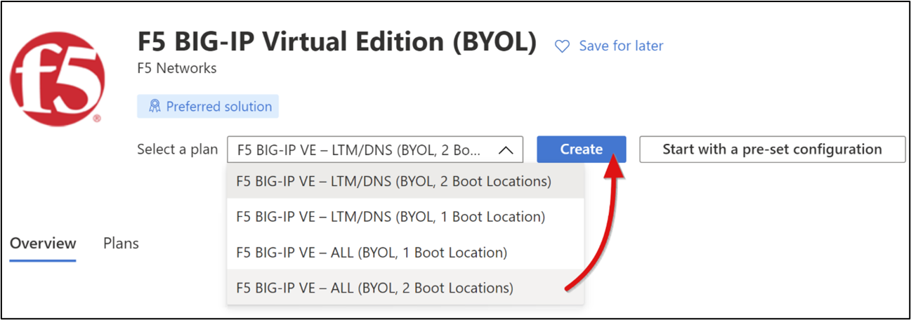
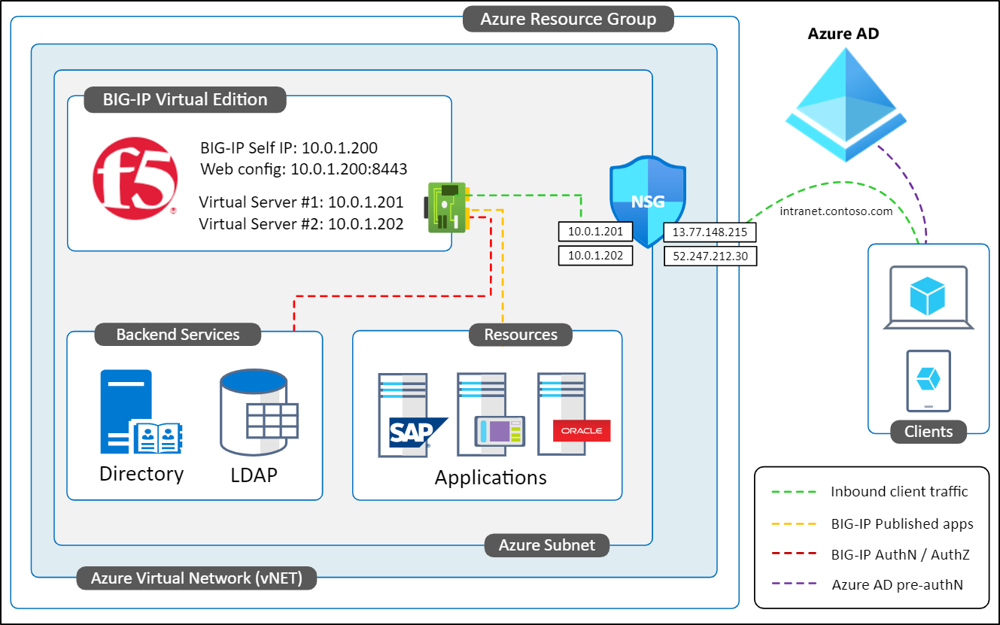
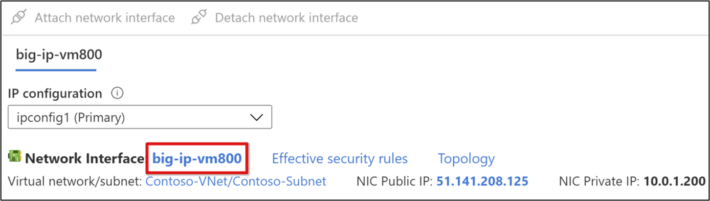
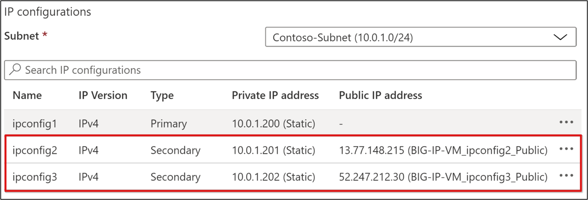
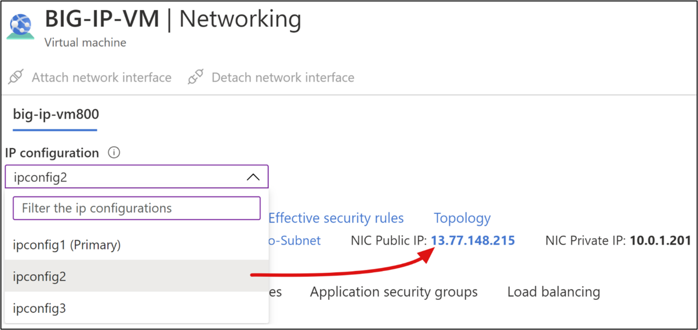
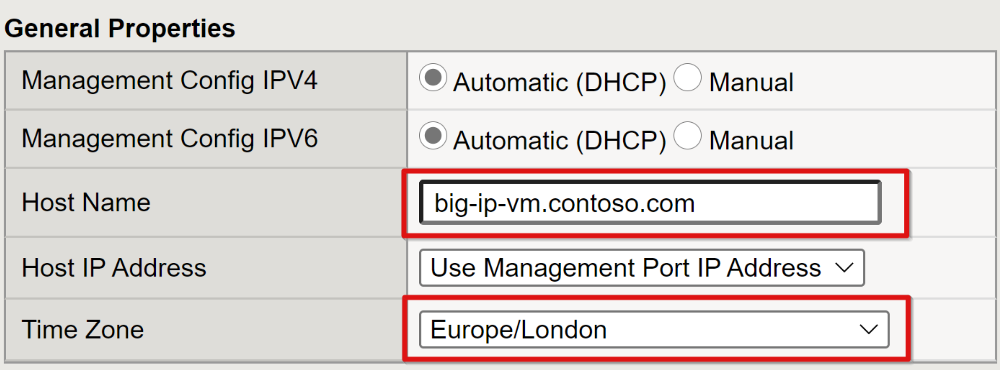
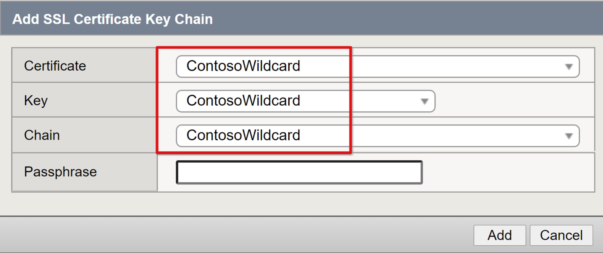
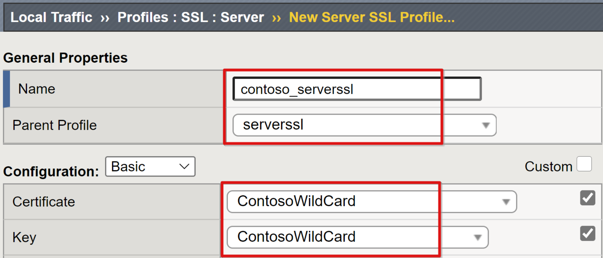
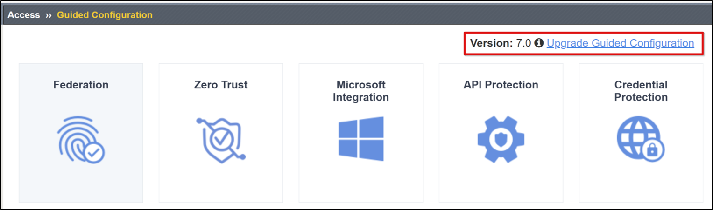

# Tutorial to deploy F5 BIG-IP Virtual Edition VM in Azure IaaS for secure hybrid access

This tutorial walks you through the end to end process of deploying BIG-IP Vitural Edition (VE) in Azure IaaS. By the end of this tutorial you should have:

- A fully prepared BIG-IP Virtual Machine (VM) for modeling a Secure Hybrid Access (SHA) proof of concept

- A staging instance to use for testing new BIG-IP system updates and hotfixes

## Prerequisites

Prior F5 BIG-IP experience or knowledge isn't necessary, however, we do recommend familiarizing yourself with [F5 BIG-IP terminology](https://www.f5.com/services/resources/glossary). Deploying a BIG-IP in Azure for SHA requires:

- A paid Azure subscription or a free 12-month [trial subscription](https://azure.microsoft.com/free/).

- Any of the following F5 BIG-IP license SKUs

  - F5 BIG-IP® Best bundle

  - F5 BIG-IP Access Policy Manager™ (APM) standalone license

  - F5 BIG-IP Access Policy Manager™ (APM) add-on license on an existing BIG-IP F5 BIG-IP® Local Traffic Manager™ (LTM)
  
  - 90-day BIG-IP full feature [trial license](https://www.f5.com/trial/big-ip-trial.php).

- A wildcard or Subject Alternative Name (SAN) certificate, to publish web applications over Secure Socket Layer (SSL). [Let’s encrypt](https://letsencrypt.org/) offers free 90 days certificate for  testing.

- An SSL certificate for securing the BIG-IPs management interface. A certificate used to publish web apps can be used, if its subject corresponds to the BIG-IP's Fully qualified domain name (FQDN). For example, a wildcard certificate defined with a subject *.contoso.com would be suitable for `https://big-ip-vm.contoso.com:8443`

VM deployment and base system configs take approx. 30 minutes, at which point your BIG-IP platform will be ready for implementing any of the SHA scenarios listed [here](f5-aad-integration.md).

For testing the scenarios, this tutorial assumes the BIG-IP will be deployed into an Azure resource group containing an Active Directory (AD) environment. The environment should consist of a Domain Controller (DC) and web host (IIS) VMs. Having these servers in other locations to the BIG-IP VM is also ok, providing the BIG-IP has line of sight to each of the roles required to support a given scenario. Scenarios where the BIG-IP VM is connected to another environment over a VPN connection are also supported.

If you don't have the items mentioned here for testing, you may deploy an entire AD domain environment into Azure, using this [script](https://github.com/Rainier-MSFT/Cloud_Identity_Lab). A collection of sample test applications can also be programmatically deployed to an IIS web host using this [scripted automation](https://github.com/jeevanbisht/DemoSuite).

>[!NOTE]
>The [Azure portal](https://portal.azure.com/#home) is constantly evolving, so some of the steps in this tutorial may differ from the actual layout observed in the Azure portal.

## Azure deployment

A BIG-IP can be deployed in different topologies. This guide focuses on a single network interface (NIC) deployment. However, if your BIG-IP deployment requires multiple network interfaces for high availability, network segregation, or more than 1-GB throughput, consider using F5’s pre-compiled [Azure Resource Manager (ARM) templates](https://clouddocs.f5.com/cloud/public/v1/azure/Azure_multiNIC.html).

Complete the following tasks to deploy BIG-IP VE from the [Azure Marketplace](https://azuremarketplace.microsoft.com/marketplace/apps).

1. Log into the [Azure portal](https://portal.azure.com/#home) with an account, which has permissions to create VMs. For example, Contributor

2. In the top ribbon search box type **marketplace**, followed by **Enter**

3. Type **F5** into the Marketplace filter, followed by **Enter**

4. Select **+ Add** from the top ribbon and type **F5** into  the marketplace filter, followed by **Enter**

5. Select **F5 BIG-IP Virtual Edition (BYOL)** > **Select a software plan** > **F5 BIG-IP VE - ALL (BYOL, 2 Boot Locations)**

6. Select **Create**.



7. Step through the **Basics** menu and use the following settings

 |  Project details     |  Value     |
 |:-------|:--------|
 |Subscription|Target subscription for the BIG-IP VM deployment|
 |Resource group | Existing Azure Resource Group the BIG-IP VM will be deployed into or create one. Should be the same resource group of your DC and IIS VMs|
 | **Instance details**|  |
 |VM Name| Example BIG-IP-VM |
 |Region | Target Azure geo for BIG-IP-VM |
 |Availability options| Only enable if using VM in production|
 |Image| F5 BIG-IP VE - ALL (BYOL, 2 Boot Locations)|
 |Azure Spot instance| No but feel free to enable if appropriate |
 |Size| Minimum specification should be 2 vCPUs and 8-Gb memory|
 |**Administrator account**|  |
 |Authentication type|Select password for now. You can switch to a key pair later |
 |Username|The identity that will be created as a BIG-IP local account for accessing its management interfaces. Username is CASE sensitive.|
 |Password|Secure admin access with a strong password|
 |**Inbound port rules**|  |
 |Public inbound ports|None|

8. Select **Next: Disks** leaving all the defaults and select **Next: Networking**.

9. On the **Networking** menu, complete these settings.

 |Network interface|      Value |
 |:--------------|:----------------|
 |Virtual network|Same Azure VNet used by your DC and IIS VMs, or create one|
 |Subnet| Same Azure internal subnet as your DC and IIS VMs, or create one|
 |Public IP |  None|
 |NIC Network Security Group| Select None if the Azure subnet you selected in the previous steps  is already associated with a Network security group (NSG); otherwise select Basic|
 |Accelerate Networking| Off |
 |**Load balancing**|     |
 |Load balance VM| No|

10. Select **Next: Management** and complete these settings.

 |Monitoring|    Value |
 |:---------|:-----|
 |Detailed monitoring| Off|
 |Boot diagnostics|Enable with custom storage account. Allows connecting to the BIG-IP Secure Shell (SSH) interface via the Serial Console option in the Azure portal. Select any available Azure storage account|
 |**Identity**|  |
 |System assigned managed identity|Off|
 |Azure Active Directory|BIG-IP doesn’t currently support this option|
 |**Autoshutdown**|    |
 |Enable Auto shutdown| If testing, consider setting the BIG-IP-VM to shut-down daily|

11. Select **Next: Advanced** leaving all the defaults and select **Next: Tags**.

12. Select **Next: Review + create** to review your BIG-IP-VM configurations, before selecting **Create** to kick-of the deployment.

13. Time to fully deploy a BIG-IP VM is typically 5 minutes. When complete don't select **Go to resource**, rather expand the Azure portal’s left-hand menu and select **Resource groups** to navigate to your new BIG-IP-VM. If the VM creation fails, select **Back** and **Next**.

## Network configuration

When the BIG-IP VM first boots, its NIC will be provisioned with a **Primary** private IP issued by the Dynamic Host Configuration Protocol (DHCP) service of the Azure subnet it’s connected to. This IP will be used by the BIG-IP’s Traffic Management Operating System (TMOS) to communicate with:

- Communicating with other hosts and services

- Outbound access to the public internet

- Inbound access to the BIG-IPs web config and SSH management interfaces

Exposing either of these management interfaces to the internet increases the BIG-IPs attack surface, hence why the BIG-IPs primary IP was not provisioned with a public IP during deployment. Instead, a secondary internal IP and associated public IP will be provisioned for publishing services.
This 1 to 1 mapping between a VM public IP and private IP enables external traffic to reach a VM. However, an Azure NSG rule is also required to allow the traffic, in much the same way as a firewall.

The diagram shows a single NIC deployment of a BIG-IP VE in Azure, configured with a primary IP for general operations and management, and a separate virtual server IPs for publishing services.
In this arrangement, an NSG rule allows remote traffic destined for `intranet.contoso.com` to route to the public IP for the published service, before being forwarded on to the BIG-IP virtual server.


By default, private and public IPs issued to Azure VMs are always dynamic, so will likely change on every restart of a VM. Avoid unforeseen connectivity issues by changing the BIG-IPs management IP to static and do the same to secondary IPs used for publishing services.

1. From your BIG-IP VM’s menu, go to **Settings** > **Networking**

2. In the networking view, select the link to the right of **Network Interface**



>[!NOTE]
>VM names are randomly generated during deployment.

3. In the left-hand pane, select **IP configurations** and then select **ipconfig1** row

4. Set the **IP Assignment** option to static and if necessary, change the BIG-IP VMs primary IP address. Then select **Save** and close the ipconfig1 menu

>[!NOTE]
>You’ll use this primary IP to connect and manage the BIG-IP-VM.

5. Select **+ Add** on the top ribbon and provide a name for a secondary private IP, for example, ipconfig2

6. Set the **Allocation** option of the private IP address settings to **Static**. Providing the next higher or lower consecutive IP helps keep things orderly.

7. Set the Public IP address to **Associate** and select **Create**

8. Provide a name for the new public IP address, for example,   BIG-IP-VM_ipconfig2_Public

9. If prompted, set the **SKU** to Standard

10. If prompted, set the **Tier** to **Global** and

11. Set the **Assignment** option to **Static**, then select **OK** twice

Your BIG-IP-VM is now ready to set up with:

- **Primary private IP**: Dedicated to managing the BIG-IP-VM via its Web config utility and SSH. It will be used by the BIG-IP system as its **Self-IP** to connect to published backend services. Also, it connects to external services such as NTP, AD, and LDAP.

- **Secondary private IP**: Used when creating a BIG-IP APM virtual server to listen for inbound request to a published service(s).

- **Public IP**: Associated with the secondary private IP, enables client traffic from the public internet to reach the BIG-IP virtual server for the published service(s)

The example illustrates the 1 to 1 relationship between a VM public and private IPs. An Azure VM NIC can have only one primary IP, and any additionally created IPs are always referred to as secondary.

>[!NOTE]
>You'll need the secondary IP mappings for publishing BIG-IP services.



To implement SHA using the BIG-IP **Access Guided Configuration**, repeat steps 5-11 to create additional private and public IP pairs for every additional service you plan to publish via the BIG-IP APM. The same approach can also be used if publishing services using BIG-IPs **Advanced Configuration**. However, in that scenario you have the option of avoiding public IP overheads by using a [Server Name Indicator (SNI)](https://support.f5.com/csp/#/article/K13452) configuration. In this configuration, a BIG-IP virtual server will accept all client traffic it receives, and route it onwards to its destination.

## DNS configuration

It's essential to have DNS configured for clients to resolve your published SHA services to your BIG-IP-VM’s public IP(s).

The following steps assume the DNS zone of the public domain used for your SHA services is managed in Azure. However, the same DNS principles of creating locator record still apply no matter where your DNS zone is managed.

1. If not already open, expand the portal’s left-hand menu and navigate to your BIG-IP-VM via the **Resource Groups** option

2. From your BIG-IP VM’s menu, go to **Settings** > **Networking**

3. In the BIG-IP-VMs networking view, select the first secondary IP from the drop-down IP configuration list and select the link for its **NIC Public IP**



4. Below the **Settings** section in the left-hand pane, select **Configuration** to bring up the public IP and DNS properties menu for the selected secondary IP

5. Select and **Create** alias record and select your **DNS zone** from the drop-down list. If a DNS zone doesn’t already exist, then it may be managed outside of Azure, or you can create one for the domain suffix you would have verified in Azure AD.

6. Use the following details to create the first DNS alias record:

 | Field | Value |
 |:-------|:-----------|
 |Subscription| Same subscription as the BIG-IP-VM|
 |DNS zone| DNS zone that is authoritative for the verified domain suffix your published websites will use, for example, www.contoso.com |
 |Name | The hostname you specify will resolve to the public IP that is associated with the selected secondary IP. Make sure to define the correct DNS to IP mappings. See last image in Networking configs section, for example, intranet.contoso.com > 13.77.148.215|
 | TTL | 1 |
 |TTL units | Hours |

7. Select **Create** for Azure to save those settings to public DNS.

8. Leave the **DNS name label (optional)** and select **Save** before closing the Public IP menu.

9. Repeat steps 1 through 6 to create additional DNS records for every service you plan to publish using BIG-IP’s Guided Configuration.

  With DNS records in place, you can use any of the online tools such as [DNS checker](https://dnschecker.org/) to verify that a created record has successfully propagated across all global public DNS servers.

  If you manage your DNS domain namespace using an external provider like [GoDaddy](https://www.godaddy.com/), then you'll need to create records using their own DNS management facility.

>[!NOTE]
>You can also use a PC’s local hosts file if testing and frequently switching DNS records. The localhosts file on a Windows PC can be accessed by pressing Win + R on the keyboard and submitting the word **drivers** in the run box. Just be mindful that a localhost record will only provide DNS resolution for the local PC, not other clients.

## Client traffic

By default, Azure VNets and associated subnets are private networks that are unable to receive Internet traffic. Your BIG-IP-VM’s NIC should be attached to the NSG you specified during deployment. For external web traffic to reach the BIG-IP-VM you must define an inbound NSG rule to permit ports 443 (HTTPS) and 80 (HTTP) through from the public internet.

1. From the BIG-IP VM's main **Overview** menu, select **Networking**

2. Select **Add** inbound rule to enter the following NSG rule properties:

 |     Field   |   Value        |
 |:------------|:------------|
 |Source| Any|
 |Source port ranges| *|
 |Destination IP addresses|Comma-separated list of all BIG-IP-VM secondary private IPs|
 |Destination ports| 80,443|
 |Protocol| TCP |
 |Action| Allow|
 |Priority|Lowest available value between 100 - 4096|
 |Name | A descriptive name, for example: `BIG-IP-VM_Web_Services_80_443`|

3. Select **Add** to commit the changes, and close the **Networking** menu.

HTTP and HTTPS traffic from any location will now be allowed to reach all of your BIG-IP-VMs secondary interfaces. Permitting port 80 is useful in allowing the BIG-IP APM to auto redirect users from HTTP to HTTPS. This rule can be edited to add or remove destination IPs, whenever necessary.

## Manage BIG-IP

A BIG-IP system is administered via its web config UI, which can be accessed using either of the following recommended methods:

- From a machine within the BIG-IP’s internal network

- From a VPN client connected to the BIG-IP-VM’s internal network

- Published via [Azure AD Application Proxy](./application-proxy-add-on-premises-application.md)

You’ll need to decide on the most suitable method before you can proceed with the remaining configurations. If necessary, you can connect directly to the web config from the internet by configuring the BIG-IP’s primary IP with a public IP. Then adding an NSG rule to allow the 8443 traffic to that primary IP. Make sure to restrict the source to your own trusted IP, otherwise anyone will be able to connect.

Once ready, confirm you can connect to the BIG-IP VM’s web config and login with the credentials specified during VM deployment:

- If you are connecting from a VM on its internal network or via VPN, connect directly to the BIG-IPs primary IP and web config port. For example, `https://<BIG-IP-VM_Primary_IP:8443`. Your browser will prompt about the connection being insecure, but you can ignore the prompt until the BIG-IP is configured. If the browser insists on blocking access, clear its cache, and try again.

- If you published the web config via Application Proxy, then use the URL defined to access the web config externally, without appending the port, for example, `https://big-ip-vm.contoso.com`. The internal URL must be defined using the web config port, for example, `https://big-ip-vm.contoso.com:8443` 

A BIG-IP system can also be managed via its underlying SSH environment, which is typically used for command-line (CLI) tasks and root level access. Several options exist for connecting to the CLI, including:

- [Azure Bastion service](../../bastion/bastion-overview.md): Allows fast and secure connections to any VM within a vNET, from any location

- Connect directly via an SSH client like PuTTY through the JIT approach

- Serial Console: Offered at the bottom of the Support and troubleshooting section of VMs menu in the portal. It doesn't support file transfers.

- As with the web config, you can also connect directly to the CLI from the internet by configuring the BIG-IP’s primary IP with a public IP and adding an NSG rule to allow SSH traffic. Again, be sure to restrict the source to your own trusted IP, if using this method.  

## BIG-IP license

A BIG-IP system must be activated and provisioned with the APM module before it can be configured for publishing services and SHA.

1. Log back into the web config and on the **General properties** page select **Activate**

2. In the **Base Registration key** field, enter the case-sensitive key provided by F5

3. Leave the **Activation Method** set to **Automatic** and select **Next**, the BIG-IP will validate the license and display the End-user license agreement (EULA).

4. Select **Accept** and wait for activation to complete, before selecting **Continue**.

5. Log back in and at the bottom of the License summary page, select **Next**. The BIG-IP will now display a list of modules that provide the various features that are required for SHA. If you don't see this, from the main tab go to **System** > **Resource Provisioning**.

6. Check the provisioning column for Access Policy (APM)


7. Select **Submit** and accept the warning

8. Be patient and wait for the BIG-IP to complete lighting up the new features. It may cycle several times before being fully initialized. 

9. When ready select **Continue** and from the **About** tab select **Run the setup utility**

>[!IMPORTANT]
>F5 licenses are constrained to being consumed by a single BIG-IP VE instance at any one time. There may be reasons for wanting to migrate a license from one instance to another, and if doing so then be sure to [revoke](https://support.f5.com/csp/article/K41458656) your trial license on the active instance before decommissioning it, otherwise the license will be permanently lost.

## Provision BIG-IP

Securing management traffic to and from BIG-IPs web config is paramount. Configure a device management certificate to help protect the web config channel from compromise.

1. From the left-navigation bar, go to **System** > **Certificate Management** > **Traffic Certificate Management** > **SSL Certificate List** > **Import**

2. From the **Import Type** drop down list, select **PKCS 12(IIS)** and **Choose File**. Locate an SSL web certificate that has a Subject name or SAN that will cover the FQDN you'll assign the BIG-IP-VM in the next few steps

3. Provide the password for the certificate then select **Import**

4. From the left-navigation bar, go to **System** > **Platform**

5. Configure the BIG-IP-VM with a fully qualified hostname and the timezone for its environment’s, followed by **Update**



6. From the left-navigation bar, go to **System** > **Configuration** > **Device** > **NTP**

7. Specify a reliable NTP source and select **Add**, followed by **Update**. For example, `time.windows.com`

You now need a DNS record to resolve the BIG-IPs FQDN specified in the previous steps, to its primary private IP. A record should be added to your environment's internal DNS, or to the localhost file of a PC that will be used to connect to the BIG-IP’s web config. Either way, the browser warning should no longer appear when you connect to the web config directly. That is, not via Application Proxy or any other reverse proxy.

## SSL profile

As a reverse proxy, a BIG-IP system can act as a simple forwarding service, otherwise known as a Transparent proxy, or a Full proxy that actively participates in exchanges between clients and servers.
A full proxy creates two distinct connections: a front-end TCP client connection along with a separate backend TCP server connection, coupled by a soft gap in the middle. Clients connect to the proxy listener on one end, otherwise known as a **Virtual Server**, and the proxy establishes a separate, independent connection to the backend server. This is bi-directional on both sides.
In this full proxy mode, the F5 BIG-IP system is capable of inspecting traffic, and therefore interacting with requests and responses is also possible. Certain functions such as load balancing and web performance optimization, as well as more advanced traffic management services such as application layer security, web acceleration, page routing and secure remote access, rely on this functionality.
When publishing SSL-based services, the process of decrypting and encrypting traffic between clients and backend services is handled by BIG-IP SSL profiles.

Two types of profiles exist:

- **Client SSL**: The most common way of setting up a BIG-IP system to publish internal services with SSL is to create a Client SSL profile. With a Client SSL profile, a BIG-IP system can decrypt inbound client requests before sending them on to a downstream service. It then encrypts outbound backend responses before sending them to clients.

- **Server SSL**: For backend services configured for HTTPS, you can configure BIG-IP to use a Server SSL profile. With a Server SSL profile, the BIG-IP re-encrypts the client request before sending it on to the destination backend service. When the server returns an encrypted response, the BIG-IP system decrypts and re-encrypts the response, before sending it on to the client, through the configured Client SSL profile.

Provisioning both, Client and Server SSL profiles will have the BIG-IP pre-configured and ready for all SHA scenarios.

1. From the left-navigation bar, go to **System** > **Certificate Management** > **Traffic Certificate Management** > **SSL Certificate List** > **Import**

2. From the **Import Type** drop down list, select **PKCS 12(IIS)**

3. Provide a name for the imported certificate, for example,  `ContosoWilcardCert`

4. Select **Choose File** to browse to the SSL web certificate who’s subject name corresponds to the domain suffix you plan on using for published services

5. Provide the **password** for the imported certificate then select **Import**

6. From the left-navigation bar, go to **Local Traffic** > **Profiles** > **SSL** > **Client** and then select **Create**

7. In the **New Client SSL Profile** page, provide a unique friendly name for the new client SSL profile and ensure the Parent profile is set to **clientssl**


8. Select the far-right check box in the **Certificate Key Chain** row and select **Add**

9. From the three drop down lists, select the wildcard certificate you imported without a passphrase, then select **Add** > **Finished**.



10.	Repeat steps 6-9 to create an **SSL server certificate profile**. From the top ribbon, select **SSL** > **Server** > **Create**.

11.	In the **New Server SSL Profile** page, provide a unique friendly name for the new server SSL profile and ensure the Parent profile is set to **serverssl**

12.	Select the far-right check box for the Certificate and Key rows and from the drop-down list select your imported certificate, followed by **Finished**.



>[!NOTE]
>Don’t despair if you’re unable to procure an SSL certificate, you can use the integrated self-signed BIG-IP server and client SSL certificates. You’ll just see a certificate error in the browser.

One final step in preparing a BIG-IP for SHA is to ensure it's able to locate the resources its publishing and also the directory service it relies on for SSO. A BIG-IP has two sources of name resolution, starting with its local/.../hosts file, or if a record is not found the BIG-IP system uses whatever DNS service it has been configured with. The hosts file method does not apply to APM nodes and pools that use an FQDN.

1. In the web config, go to **System** > **Configuration** > **Device** > **DNS**

2. In **DNS Lookup Server List**, enter the IP address of your environments DNS server

3. Select **Add** > **Update**

As a separate and optional step, you may consider an [LDAP configuration](https://somoit.net/f5-big-ip/authentication-using-active-directory) to authenticate BIG-IP sysadmins against AD instead of managing local BIG-IP accounts.

## Update BIG-IP

Your BIG-IP-VM should be updated to unlock all of the new functionalities covered in the [scenario-based guidance](f5-aad-integration.md). You can check the systems TMOS version hovering your mouse pointer over the BIG-IPs hostname on the top left of the main page. It's recommended to be running v15.x and above, obtainable from [F5 download](https://downloads.f5.com/esd/productlines.jsp). Use the [guidance](https://support.f5.com/csp/article/K34745165) to update the main system OS (TMOS).

If updating the main TMOS is not possible, then consider at least upgrading the Guided Configuration alone, using these steps.

1. From the main tab in the BIG-IP web config go to **Access** > **Guided Configuration**

2. On the **Guided Configuration** page, select **Upgrade Guided Configuration**



3. On the **Upgrade Guided Configuration** dialog, **Choose File** to upload the downloaded use case pack and select **Upload and Install**

4. When the upgrade has completed, select **Continue**.

## Backup BIG-IP

With the BIG-IP system now fully provisioned, we recommend taking a full backup of its configuration:

1. Go to **System** > **Archives** > **Create**

2. Provide a unique **File Name** and enable **Encryption** with a passphrase

3. Set the **Private Keys** option to **Include** to also back up device and SSL certificates

4. Select **Finished** and wait for the process to complete

5. An operation status will be displayed providing a status of backup result. Select **OK**

6. Save the User configuration set (UCS) archive locally by choosing the link of the backup and select **Download**.

As an optional step, you can also take a backup of the entire system disk using [Azure snapshots](../../virtual-machines/windows/snapshot-copy-managed-disk.md), which unlike the web config backup would provide some contingency for testing between TMOS versions, or rolling back to a fresh system.

```PowerShell
# Install modules
Install-module Az
Install-module AzureVMSnapshots

# Authenticate to Azure
Connect-azAccount

# Set subscription by Id
Set-AzContext -SubscriptionId ‘<Azure_Subscription_ID>’

#Create Snapshot
New-AzVmSnapshot -ResourceGroupName '<E.g.contoso-RG>' -VmName '<E.g.BIG-IP-VM>'

#List Snapshots
#Get-AzVmSnapshot -ResourceGroupName ‘<E.g.contoso-RG>'

#Get-AzVmSnapshot -ResourceGroupName ‘<E.g.contoso-RG>' -VmName '<E.g.BIG-IP-VM>' | Restore-AzVmSnapshot -RemoveOriginalDisk 

```

## Restore BIG-IP

Restoring a BIG-IP follows a similar procedure to the backup and can also be used for migrating configs between BIG-IP VMs. Details on supported upgrade paths should be observed before importing a backup.

1. Go to **System** > **Archives**

2. Either choose the link of a backup you wish to restore or select the **Upload** button to browse to a previously saved UCS archive that isn’t in the list

3. Provide the passphrase for the backup and select **Restore**

```PowerShell
# Authenticate to Azure
Connect-azAccount

# Set subscription by Id
Set-AzContext -SubscriptionId ‘<Azure_Subscription_ID>’

#Restore Snapshot
Get-AzVmSnapshot -ResourceGroupName '<E.g.contoso-RG>' -VmName '<E.g.BIG-IP-VM>' | Restore-AzVmSnapshot

```

>[!NOTE]
>At the time of writing, the AzVmSnapshot cmdlet is limited to restoring the most recent snapshot, based on date. Snapshots are stored in the root of the VM’s resource group. Be aware that restoring snapshots restarts an Azure VM, so time this carefully.

## Additional resources

-	[Reset BIG-IP VE password in Azure](https://clouddocs.f5.com/cloud/public/v1/shared/azure_passwordreset.html)
    -	[Reset the password without using the portal](https://clouddocs.f5.com/cloud/public/v1/shared/azure_passwordreset.html#reset-the-password-without-using-the-portal)

-	[Change the NIC used for BIG-IP VE management](https://clouddocs.f5.com/cloud/public/v1/shared/change_mgmt_nic.html)

-	[About routes in a single NIC configuration](https://clouddocs.f5.com/cloud/public/v1/shared/routes.html)

-	[Microsoft Azure: Waagent](https://clouddocs.f5.com/cloud/public/v1/azure/Azure_waagent.html)

## Next steps

Select a [deployment scenario](f5-aad-integration.md) and start your implementation.
