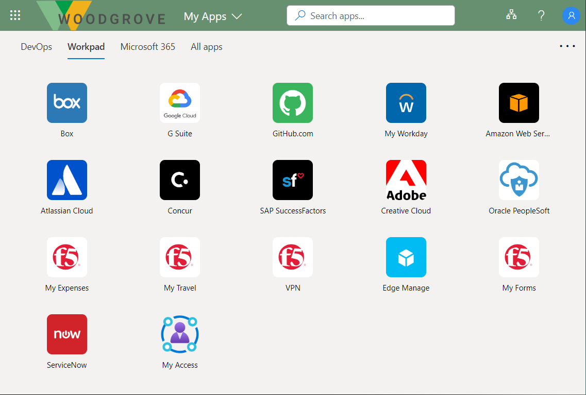
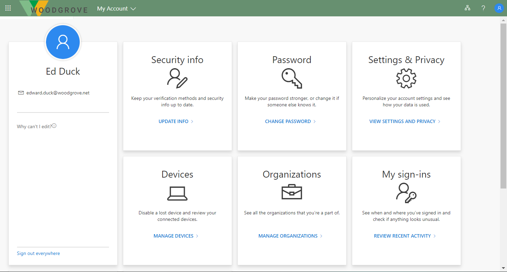
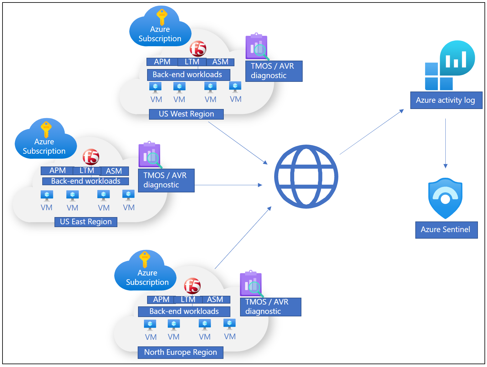

# Integrate F5 BIG-IP with Microsoft Entra ID

With increases in the threat landscape and the use of multiple mobile devices, organizations are rethinking resource access and governance. Part of modernization programs include assessing your readiness across identities, devices, apps, infrastructure, network, and data. You can learn about the [Zero Trust framework to enable remote work](https://www.microsoft.com/security/blog/2020/04/02/announcing-microsoft-zero-trust-assessment-tool/) and the Zero Trust Assessment tool.

At Microsoft and F5, we realize your digital transformation is a long-term journey, potentially critical resources are exposed until modernized. The goal of F5 BIG-IP and Microsoft Entra ID secure hybrid access (SHA) is to improve remote access to on-premises applications, and strengthen the security posture of vulnerable legacy services.

Research estimates that 60%-80% of on-premises applications are legacy, or incapable of being integrated with Microsoft Entra ID. The same study indicates a large proportion of similar systems run on previous versions of SAP, Oracle, SAGE, and other well-known workloads for critical services.

SHA enables organizations to continue using investments in F5 network and application delivery. With Microsoft Entra ID, SHA bridges the gap with the identity control plane.

## Benefits

When Microsoft Entra ID pre-authenticates access to BIG-IP published services, there are many benefits:

- Password-less authentication with:
  -  [Windows Hello](/windows/security/identity-protection/hello-for-business/)
  -  [MS Authenticator](https://support.microsoft.com/account-billing/download-and-install-the-microsoft-authenticator-app-351498fc-850a-45da-b7b6-27e523b8702a)
  -  [Fast Identity Online (FIDO) keys](../authentication/howto-authentication-passwordless-security-key.md)
  -  [Certificate-based authentication](../authentication/concept-certificate-based-authentication.md)

Other benefits include:

- One control plane to govern identity and access
  - The [Microsoft Entra admin center](https://entra.microsoft.com)
- Preemptive [Conditional Access](../conditional-access/overview.md)
- [Microsoft Entra multifactor authentication](../authentication/concept-mfa-howitworks.md)
- Adaptive protection through user and session risk profiling
  - [Identity Protection](../identity-protection/overview-identity-protection.md)
- [Leaked credential detection](../identity-protection/concept-identity-protection-risks.md)
- [Self-service password reset (SSPR)](../authentication/tutorial-enable-sspr.md)
- Entitlement management for governed guest access
  - [Partner collaboration](../governance/entitlement-management-external-users.md)
- App discovery and control
  - [Defender for Cloud Apps (CASB)](/defender-cloud-apps/what-is-defender-for-cloud-apps)
- Threat monitoring and analytics with [Microsoft Sentinel](https://azure.microsoft.com/services/azure-sentinel/)

## Scenario description

As an Application Delivery Controller (ADC) and secure socket layer virtual private network (SSL-VPN), a BIG-IP system provides local and remote access to services, including:

- Modern and legacy web applications
- Non-web-based applications
- Representational State Transfer (REST) and Simple Object Access Protocol (SOAP) Web application programming interface (API) services

BIG-IP Local Traffic Manager (LTM) is for secure service publishing, while an Access Policy Manager (APM) extends BIG-IP functions that enable identity federation and single sign-on (SSO).

With integration, you achieve the protocol transition to secure legacy, or non-Azure AD integrated services, with controls such as: 

* [Password-less authentication](https://www.microsoft.com/security/business/identity/passwordless)
* [Conditional Access](../conditional-access/overview.md)

In the scenario, a BIG-IP is a reverse proxy that hands off service pre-authentication and authorization to Microsoft Entra ID. The integration is based on a standard federation trust between the APM and Microsoft Entra ID. This scenario is common with SHA. Learn more: [Configure F5 BIG-IP SSL-VPN for Microsoft Entra SSO](f5-passwordless-vpn.md). With SHA you can secure Security Assertion Markup Language (SAML), Open Authorization (OAuth), and OpenID Connect (OIDC) resources. 

> [!NOTE]
> When used for local and remote access, a BIG-IP can be a choke point for Zero Trust access to services, including software as a service (SaaS) apps.

The following diagram illustrates the front-end pre-authentication exchange between a user, a BIG-IP, and Microsoft Entra ID, in a service provider (SP) initiated flow. It then shows subsequent APM session enrichment, and SSO to individual back-end services.

   

1. In the portal, a user selects an application icon, resolving URL to the SAML SP (BIG-IP)
2. BIG-IP redirects the user to the SAML identity provider (IdP), Microsoft Entra ID, for pre-authentication
3. Microsoft Entra ID processes Conditional Access policies and [session controls](../conditional-access/concept-conditional-access-session.md) for authorization
4. User goes back to BIG-IP, and presents the SAML claims issued by Microsoft Entra ID
5. BIG-IP requests session information for [SSO](../hybrid/connect/how-to-connect-sso.md) and [role-based access control (RBAC)](/azure/role-based-access-control/overview) to the published service
6. BIG-IP forwards the client request to the back-end service

## User experience

Whether an employee, affiliate, or consumer, most users are acquainted with the Office 365 sign-in experience. Accessing BIG-IP services is similar.

Users can find their BIG-IP published services in the [My Apps portal](https://support.microsoft.com/account-billing/sign-in-and-start-apps-from-the-my-apps-portal-2f3b1bae-0e5a-4a86-a33e-876fbd2a4510) or [Microsoft 365 app launcher](https://support.microsoft.com/office/meet-the-microsoft-365-app-launcher-79f12104-6fed-442f-96a0-eb089a3f476a) with self-service capabilities, regardless of device or location. Users can continue accessing published services with the BIG-IP Webtop portal. When users sign out, SHA ensures session termination for BIG-IP and Microsoft Entra ID, helping services remain protected from unauthorized access.  

Users access the My Apps portal to find BIG-IP published services and to manage their account properties. See the gallery and self-service page in the following graphics. 

   

   

## Insights and analytics

You can monitor deployed BIG-IP instances to ensure published services are highly available, at an SHA level and operationally.

There are several options to log events locally, or remotely through a Security Information and Event Management (SIEM) solution, which enables storage and telemetry processing. To monitor Microsoft Entra ID and SHA activity, you can use [Azure Monitor](/azure/azure-monitor/overview) and [Microsoft Sentinel](/azure/sentinel/overview), together:

- Overview of your organization, potentially across multiple clouds, and on-premises locations, including BIG-IP infrastructure
- One control plane with view of signals, avoiding reliance on complex, and disparate tools

    

## Integration prerequisites

No previous experience, or F5 BIG-IP knowledge, is necessary to implement SHA, but we recommend you learn some F5 BIG-IP terminology. See the F5 service [Glossary](https://www.f5.com/services/resources/glossary).

Integrating an F5 BIG-IP with Microsoft Entra ID for SHA has the following prerequisites:

- An F5 BIG-IP instance running on:
  - Physical appliance
  - Hypervisor Virtual Edition such as Microsoft Hyper-V, VMware ESXi, Linux KVM, and Citrix Hypervisor
  - Cloud Virtual Edition such as Azure, VMware, KVM, Community Xen, MS Hyper-V, AWS, OpenStack, and Google Cloud

> [!NOTE]
> The BIG-IP instance location can be on-premises or a supported cloud platform including Azure. The instance has internet connectivity, resources being published, and any services such as Active Directory.  

- An active F5 BIG-IP APM license:
  - F5 BIG-IP&reg; Best bundle
  - F5 BIG-IP Access Policy Manager&trade; standalone license
  - F5 BIG-IP Access Policy Manager&trade; (APM) add-on license on an existing BIG-IP F5 BIG-IP&reg; Local Traffic Manager&trade; (LTM)
  - A 90-day BIG-IP Access Policy Manager&trade; (APM) [trial license](https://www.f5.com/trial/big-ip-trial.php)
- Microsoft Entra ID licensing:
  - An [Azure free account](https://azure.microsoft.com/free/active-directory/) has minimum core requirements for SHA with password-less authentication
  - A [Premium subscription](https://www.microsoft.com/security/business/identity-access-management/azure-ad-pricing) has [Conditional Access](../conditional-access/overview.md), [multifactor authentication](../authentication/concept-mfa-howitworks.md), and [Identity Protection](../identity-protection/overview-identity-protection.md)

## Configuration scenarios

You can configure a BIG-IP for SHA with template-based options, or a manual configuration. The following tutorials have guidance on implementing BIG-IP and Microsoft Entra ID secure hybrid access.  

### Advanced configuration

The advanced approach is a flexible way to implement SHA. You manually create all BIG-IP configuration objects. Use this approach for scenarios not in guided configuration templates. 

Advanced configuration tutorials:

- [F5 BIG-IP in Azure deployment walk-through](f5-bigip-deployment-guide.md)

- [Securing F5 BIG-IP SSL-VPN with Microsoft Entra SHA](f5-passwordless-vpn.md)

- [Extend Azure AD B2C to protect applications using F5 BIG-IP](/azure/active-directory-b2c/partner-f5)

- [F5 BIG-IP APM and Microsoft Entra SSO to Kerberos applications](f5-big-ip-kerberos-advanced.md)

- [F5 BIG-IP APM and Microsoft Entra SSO to header-based applications](f5-big-ip-header-advanced.md)

- [F5 BIG-IP APM and Microsoft Entra SSO to forms-based applications](f5-big-ip-forms-advanced.md)

### Guided Configuration and Easy Button templates

The BIG-IP version 13.1 Guided Configuration wizard, minimizes time and effort to implement common BIG-IP publishing scenarios. Its workflow framework provides an intuitive deployment experience, for specific access topologies.

Guided Configuration version 16.x has the Easy Button feature: admins no longer go back and forth between Microsoft Entra ID and a BIG-IP to enable services for SHA. The end-to-end deployment and policy management is handled by the APM Guided Configuration wizard and Microsoft Graph. This integration between BIG-IP APM and Microsoft Entra ID ensures applications support identity federation, SSO, and Microsoft Entra Conditional Access, without the management overhead of doing so for each app. 

Tutorials for using Easy Button templates, *F5 BIG-IP Easy Button for SSO to*:

- [Kerberos applications](f5-big-ip-kerberos-easy-button.md)

- [Header-based applications](f5-big-ip-headers-easy-button.md)

- [Header-based and LDAP applications](f5-big-ip-ldap-header-easybutton.md)

- [Oracle EBS (Enterprise Business Suite)](f5-big-ip-oracle-enterprise-business-suite-easy-button.md)

- [Oracle JD Edwards](f5-big-ip-oracle-jde-easy-button.md)

- [Oracle PeopleSoft](f5-big-ip-oracle-peoplesoft-easy-button.md)

- [SAP ERP](f5-big-ip-sap-erp-easy-button.md)

## Microsoft Entra B2B guest access

Microsoft Entra B2B guest access to SHA-protected applications is possible, but might require steps not in the tutorials. One example is Kerberos SSO, when a BIG-IP performs kerberos constrained delegation (KCD) to obtain a service ticket from domain controllers. Without a local representation of a local guest user, a domain controller won't honor the request because there's no user. To support this scenario, ensure external identities are flowed down from your Microsoft Entra tenant to the directory used by the application. 

Learn more: [Grant B2B users in Microsoft Entra ID access to your on-premises applications](../external-identities/hybrid-cloud-to-on-premises.md)

## Next steps

You can conduct a proof-of-concept for SHA using your BIG-IP infrastructure, or by [Deploying a BIG-IP Virtual Edition (VE) VM into Azure](f5-bigip-deployment-guide.md). To deploy a VM in Azure takes approximately 30 minutes, then you'll have:

- A secured platform to model a pilot for SHA
- A pre-production instance for testing new BIG-IP system updates and hotfixes

Identify one or two applications to be published with BIG-IP and protected with SHA.

Our recommendation is to start with an application that isn't published via a BIG-IP. This action avoids potential disruption to production services. The guidelines in this article can help you learn about the procedure to create BIG-IP configuration objects and setting up SHA. You can then convert BIG-IP published services to SHA with minimal effort.

The following interactive guide illustrates implementing SHA with a template, and the end-user experience.

   

## Resources

- [The end of passwords, go passwordless](https://www.microsoft.com/security/business/identity/passwordless)
- [Microsoft Entra ID secure hybrid access](https://azure.microsoft.com//services/active-directory/sso/secure-hybrid-access/)
- [Microsoft Zero Trust framework to enable remote work](https://www.microsoft.com/security/blog/2020/04/02/announcing-microsoft-zero-trust-assessment-tool/)
- [Getting started with Microsoft Sentinel](https://azure.microsoft.com/services/azure-sentinel/?&OCID=AID2100131_SEM_XfknpgAAAHoVMTvh:20200922160358:s&msclkid=5e0e022409fc1c94dab85d4e6f4710e3&ef_id=XfknpgAAAHoVMTvh:20200922160358:s&dclid=CJnX6vHU_esCFUq-ZAod1iQF6A)
