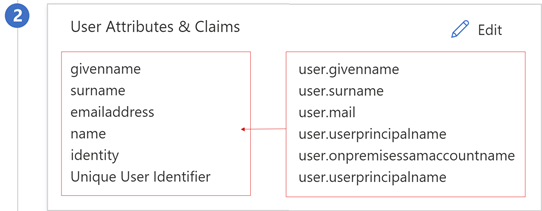
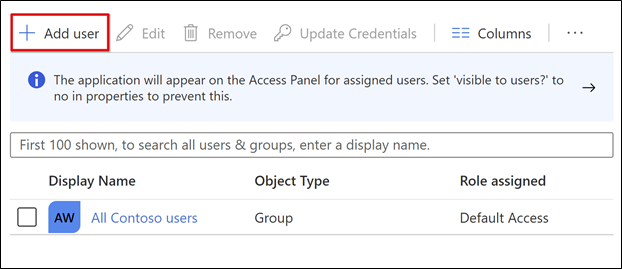
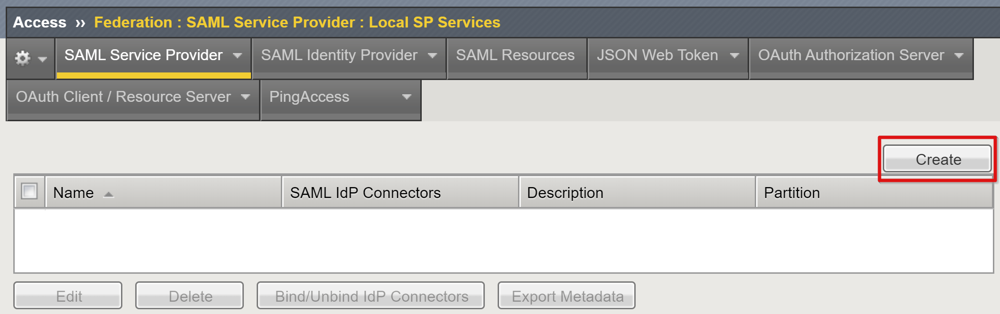
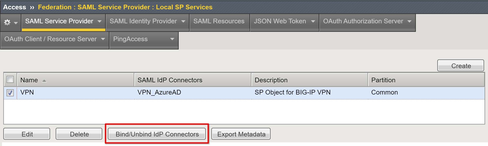
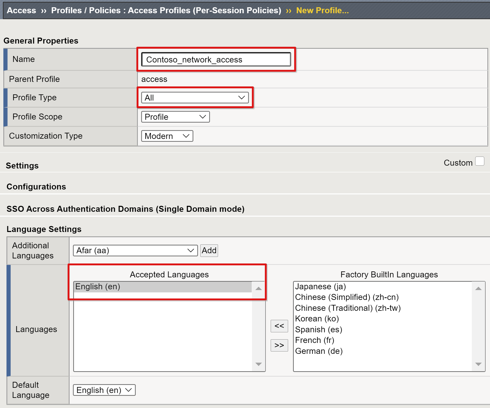
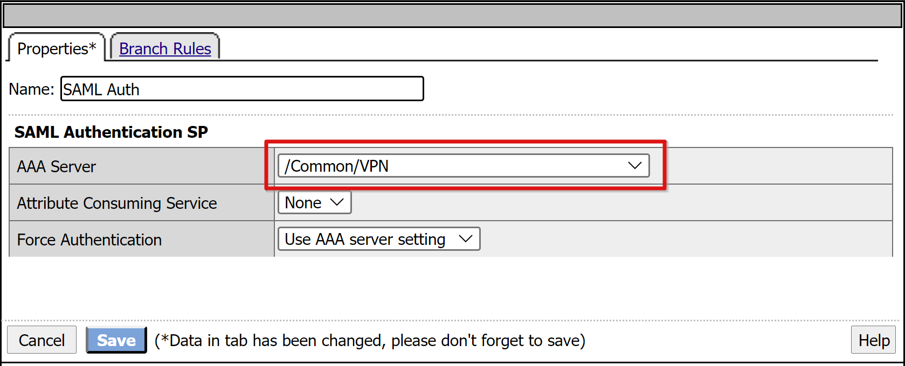
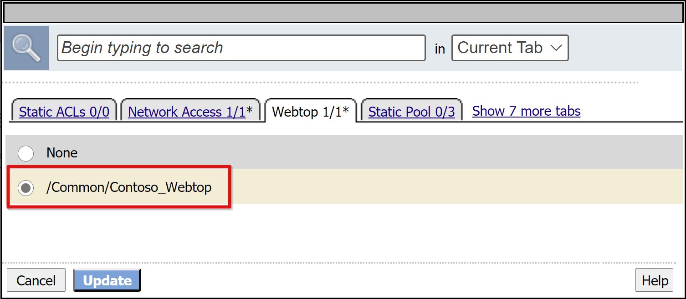
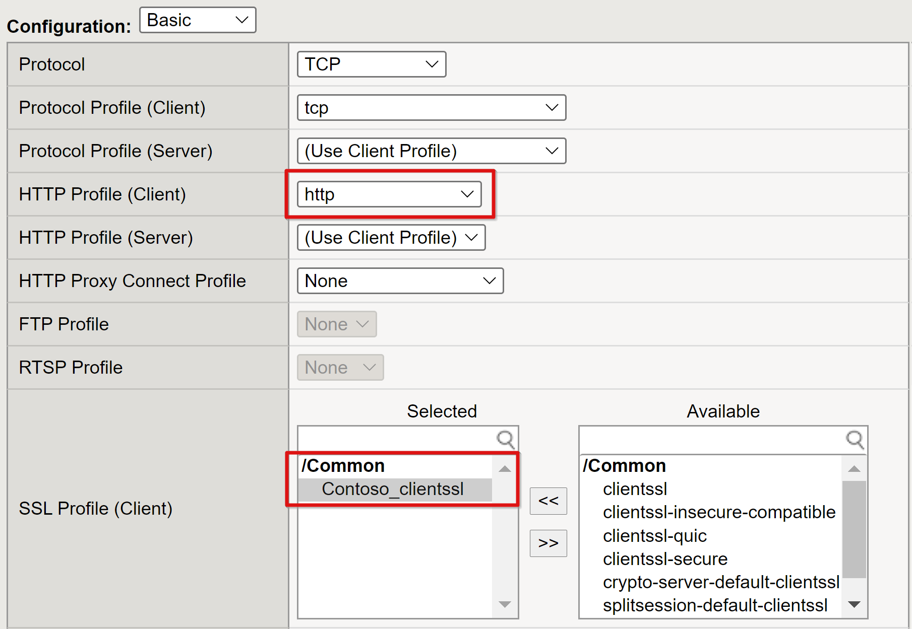

# Tutorial: Configure F5 BIG-IP SSL-VPN for Azure AD SSO

In this tutorial, learn how to integrate F5 BIG-IP based secure socket layer virtual private network (SSL-VPN) with Azure Active Directory (Azure AD) for secure hybrid access (SHA).

Enabling a BIG-IP SSL-VPN for Azure AD single sign-on (SSO) provides many benefits, including:

- Improved Zero trust governance through Azure AD pre-authentication and Conditional Access.
  - [What is Conditional Access?](../conditional-access/overview.md)
- [Passwordless authentication](https://www.microsoft.com/security/business/identity/passwordless) to the VPN service
- Manage identities and access from a single control plane, the [Azure portal](https://azure.microsoft.com/features/azure-portal/)

To learn about more benefits, see 

* [Integrate F5 BIG-IP with Azure Active Directory](./f5-integration.md)
* [What is single sign-on in Azure Active Directory?](/azure/active-directory/active-directory-appssoaccess-whatis)

>[!NOTE]
>Classic VPNs remain network orientated, often providing little to no fine-grained access to corporate applications. We encourage a more identity-centric approach to achieve Zero Trust. Learn more: [Five steps for integrating all your apps with Azure AD](../fundamentals/five-steps-to-full-application-integration.md).

## Scenario description

In this scenario, the BIG-IP APM instance of the SSL-VPN service is configured as a SAML service provider (SP) and Azure AD is the trusted SAML IDP. SSO from Azure AD is provided through claims-based authentication to the BIG-IP APM, a seamless VPN access experience.

   

>[!NOTE]
>Replace example strings or values in this guide with those in your environment.

## Prerequisites

Prior experience or knowledge of F5 BIG-IP isn't necessary, however, you'll need:

- An Azure AD subscription
  -  If you don't have one, you can get an [Azure free account](https://azure.microsoft.com/trial/get-started-active-directory/) or above
- User identities [synchronized from their on-premises directory](../hybrid/how-to-connect-sync-whatis.md) to Azure AD.
- An account with Azure AD application admin [permissions](../roles/permissions-reference.md#application-administrator)
- BIG-IP infrastructure with client traffic routing to and from the BIG-IP 
  - Or [deploy a BIG-IP Virtual Edition into Azure](f5-bigip-deployment-guide.md)
- A record for the BIG-IP published VPN service in public DNS
  - Or a test client localhost file while testing
- The BIG-IP provisioned with the needed SSL certificates for publishing services over HTTPS

To improve the tutorial experience, you can learn industry-standard terminology on the F5 BIG-IP [Glossary](https://www.f5.com/services/resources/glossary).

>[!NOTE]
>Some instructions might vary slightly from the Azure portal. 

## Add F5 BIG-IP from the Azure AD gallery

[!INCLUDE [portal updates](~/articles/active-directory/includes/portal-update.md)]

Set up a SAML federation trust between the BIG-IP to allow the Azure AD BIG-IP to hand off the pre-authentication and [Conditional Access](../conditional-access/overview.md) to Azure AD, before it grants access to the published VPN service.

1. Sign in to the [Azure portal](https://portal.azure.com) with application admin rights.
2. From the left navigation pane, select the **Azure Active Directory service**.
3. Go to **Enterprise Applications** and from the top ribbon select **New application**.
4. In the gallery, search for F5 and select **F5 BIG-IP APM Azure AD integration**.
5. Enter a name for the application.
6. Select **Add** then **Create**. 
7. The name, as an icon, appears in the Azure portal and Office 365 portal. 

## Configure Azure AD SSO

1. With F5 application properties, go to **Manage** > **Single sign-on**.
2. On the **Select a single sign-on method** page, select **SAML**. 
3. Select **No, I'll save later**.
4. On the **Setup single sign-on with SAML** menu, select the pen icon for **Basic SAML Configuration**.
5. Replace the **Identifier URL** with your BIG-IP published service URL. For example, `https://ssl-vpn.contoso.com`.
6. Replace the **Reply URL**, and the SAML endpoint path. For example, `https://ssl-vpn.contoso.com/saml/sp/profile/post/acs`.

>[!NOTE]
>In this configuration, the application operates in an IdP-initiated mode: Azure AD issues a SAML assertion before redirecting to the BIG-IP SAML service. 

7. For apps that don't support IdP-initiated mode, for the BIG-IP SAML service, specify the **Sign-on URL**, for example, `https://ssl-vpn.contoso.com`.
8. For the Logout URL, enter the BIG-IP APM Single logout (SLO) endpoint pre-pended by the host header of the service being published. For example, `https://ssl-vpn.contoso.com/saml/sp/profile/redirect/slr`

>[!NOTE]
>An SLO URL ensures a user session terminates, at BIG-IP and Azure AD, after the user signs out. BIG-IP APM has an option to terminate all sessions when calling an application URL. Learn more on the F5 article, [K12056: Overview of the Logout URI Include option](https://support.f5.com/csp/article/K12056).

  .

>[!NOTE]
>From TMOS v16, the SAML SLO endpoint has changed to /saml/sp/profile/redirect/slo.

9. Select **Save**
10. Skip the SSO test prompt.
11. In **User Attributes & Claims** properties, observe the details. 

    

You can add other claims to your BIG-IP published service. Claims defined in addition to the default set are issued if they're in Azure AD. Define directory [roles or group](../hybrid/how-to-connect-fed-group-claims.md) memberships against a user object in Azure AD, before they can be issued as a claim.

   

SAML signing certificates created by Azure AD have a lifespan of three years.

### Azure AD authorization

By default, Azure AD issues tokens to users with granted access to a service.

1. In the application configuration view, select **Users and groups**.
2. Select **+ Add user**.
3. In the **Add Assignment** menu, select **Users and groups**.
4. In the **Users and groups** dialog, add the user groups authorized to access the VPN
5. Select **Select** > **Assign**.

    

You can set up BIG-IP APM to publish the SSL-VPN service. Configure it with corresponding properties to complete the trust for SAML pre-authentication.

## BIG-IP APM configuration

### SAML federation

To complete federating the VPN service with Azure AD, create the BIG-IP SAML service provider and corresponding SAML IDP objects.

1. Go to **Access** > **Federation** > **SAML Service Provider** > **Local SP Services**.
2. Select **Create**.

    

3. Enter a **Name** and the **Entity ID** defined in Azure AD.
4. Enter the Host FQDN to connect to the application.

    

>[!NOTE]
>If the entity ID isn't an exact match of the hostname of the published URL, configure SP **Name** settings, or perform this action if it isn't in hostname URL format. If entity ID is `urn:ssl-vpn:contosoonline`, provide the external scheme and hostname of the application being published.

5. Scroll down to select the new **SAML SP object**.
6. Select **Bind/UnBind IDP Connectors**.

    

7. Select **Create New IDP Connector**.
8. From the drop-down menu, select **From Metadata**

    

9. Browse to the federation metadata XML file you downloaded. 
10. For the APM object,provide an **Identity Provider Name** that represents the external SAML IdP.
11. To select the new Azure AD external IdP connector, select **Add New Row**.

    

12. Select **Update**.
13. Select **OK**.

    

### Webtop configuration

Enable the SSL-VPN to be offered to users via the BIG-IP web portal.

1. Go to **Access** > **Webtops** > **Webtop Lists**.
2. Select **Create**.
3. Enter a portal name. 
4. Set the type to **Full**, for example, `Contoso_webtop`.
5. Complete the remaining preferences.
6. Select **Finished**.

    

### VPN configuration

VPN elements control aspects of the overall service.

1. Go to **Access** > **Connectivity/VPN** > **Network Access (VPN)** > **IPV4 Lease Pools**
2. Select **Create**.
3. Enter a name for the IP address pool allocated to VPN clients. For example, Contoso_vpn_pool.
4. Set type to **IP Address Range**.
5. Enter a start and end IP.
6. Select **Add**.
7. Select **Finished**.

    

A Network access list provisions the service with IP and DNS settings from the VPN pool, user routing permissions, and can launch applications.

1. Go to **Access** > **Connectivity/VPN: Network Access (VPN)** > **Network Access Lists**.
2. Select **Create**.
3. Provide a name for the VPN access list and caption, for example, Contoso-VPN.
4. Select **Finished**.

    

5. From the top ribbon, select **Network Settings**.
6. For **Supported IP version**: IPV4.
7. For **IPV4 Lease Pool**, select the VPN pool created, for example, Contoso_vpn_pool

    

>[!NOTE]
>Use the Client Settings options to enforce restrictions for how client traffic is routed in an established VPN.

8. Select **Finished**.
9. Go to the **DNS/Hosts** tab.
10. For **IPV4 Primary Name Server**: Your environment DNS IP
11. For **DNS Default Domain Suffix**: The domain suffix for this VPN connection. For example, contoso.com

    

>[!NOTE]
>See the F5 article, [Configuring Network Access Resources](https://techdocs.f5.com/kb/en-us/products/big-ip_apm/manuals/product/apm-network-access-11-5-0/2.html) for other settings.

A BIG-IP connection profile is required to configure VPN client-type settings the VPN service needs to support. For example, Windows, OSX, and Android.

1. Go to **Access** > **Connectivity/VPN** > **Connectivity** > **Profiles**
2. Select **Add**.
3. Enter a profile name.
4. Set the parent profile to **/Common/connectivity**, for example, Contoso_VPN_Profile.

    

For more information on client support, see the F5 article, [F5 Access and BIG-IP Edge Client](https://techdocs.f5.com/kb/en-us/bigip-edge-apps.html).

## Access profile configuration

An access policy enables the service for SAML authentication.

1. Go to **Access** > **Profiles/Policies** > **Access Profiles (Per-Session Policies)**.
2. Select **Create**.
3. Enter a profile name and for the profile type.
4. Select **All**, for example, Contoso_network_access.
5. Scroll down and add at least one language to the **Accepted Languages** list
6. Select **Finished**.

    

7. In the new access profile, on the Per-Session Policy field, select **Edit**. 
8. The visual policy editor opens in a new tab.

    

9. Select the **+** sign.
10. In the menu, select **Authentication** > **SAML Auth**.
11. Select **Add Item**.
12. In the SAML authentication SP configuration, select the VPN SAML SP object you created
13. Select **Save**.

    

14. For the Successful branch of SAML auth, select **+** .
15. From the Assignment tab, select **Advanced Resource Assign**.
16. Select **Add Item**.

    

17. In the pop-up, select **New Entry**
18. Select **Add/Delete**.
19. In the window, select **Network Access**.
20. Select the Network Access profile you created.

    

21. Go to the **Webtop** tab.
22. Add the Webtop object you created.

    

23. Select **Update**.
24. Select**Save**.
25. To change the Successful branch, select the link in the upper **Deny** box.
26. The Allow label appears.
27. **Save**.

    

28. Select **Apply Access Policy**
29. Close the visual policy editor tab.

    

## Publish the VPN service

The APM requires a front-end virtual server to listen for clients connecting to the VPN.

1. Select **Local Traffic** > **Virtual Servers** > **Virtual Server List**.
2. Select **Create**.
3. For the VPN virtual server, enter a **Name**, for example, VPN_Listener.
4. Select an unused **IP Destination Address** with routing to receive client traffic.
5. Set the Service Port to **443 HTTPS**.
6. For **State**, ensure **Enabled** is selected.

    

7. Set the **HTTP Profile** to **http**.
8. Add the SSL Profile (Client) for the public SSL certificate you created.

    

9. To use the created VPN objects, under Access Policy, set the **Access Profile** and **Connectivity Profile**.

    

7. Select **Finished**.

Your SSL-VPN service is published and accessible via SHA, either with its URL or through Microsoft application portals.

## Next steps

1. Open a browser on a remote Windows client. 
2. Browse to the **BIG-IP VPN service** URL. 
3. The BIG-IP webtop portal and VPN launcher appear.

    

>[!NOTE]
>Select the VPN tile to install the BIG-IP Edge client and establish a VPN connection configured for SHA. The F5 VPN application is visible as a target resource in Azure AD Conditional Access. See [Conditional Access policies](../conditional-access/concept-conditional-access-policies.md) to enable users for Azure AD [password-less authentication](https://www.microsoft.com/security/business/identity/passwordless).

## Resources

- [The end of passwords, go passwordless](https://www.microsoft.com/security/business/identity/passwordless)
- [Five steps to full application integration with Azure AD](../fundamentals/five-steps-to-full-application-integration.md)
- [Microsoft Zero Trust framework to enable remote work](https://www.microsoft.com/security/blog/2020/04/02/announcing-microsoft-zero-trust-assessment-tool/)
