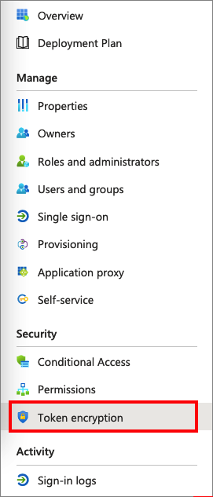

# How to: Configure Azure AD SAML token encryption (Preview)

> [!NOTE]
> Token encryption is an Azure Active Directory (Azure AD) premium feature. To learn more about Azure AD editions, features, and pricing, see [Azure AD pricing](https://azure.microsoft.com/pricing/details/active-directory/).

SAML token encryption enables the use of encrypted SAML assertions with an application that supports it. When configured for an application, Azure AD will encrypt the SAML assertions it emits for that application using the public key obtained from a certificate stored in Azure AD. The application must use the matching private key to decrypt the token before it can be used as evidence of authentication for the signed in user.

Encrypting the SAML assertions between Azure AD and the application provides additional assurance that the content of the token can't be intercepted, and personal or corporate data compromised.

Even without token encryption, Azure AD SAML tokens are never passed on the network in the clear. Azure AD requires token request/response exchanges to take place over encrypted HTTPS/TLS channels so that communications between the IDP, browser, and application take place over encrypted links. Consider the value of token encryption for your situation compared with the overhead of managing additional certificates.   

To configure token encryption, you need to upload an X.509 certificate file that contains the public key to the Azure AD application object that represents the application. To obtain the X.509 certificate, you can download it from the application itself, or get it from the application vendor in cases where the application vendor provides encryption keys or in cases where the application expects you to provide a private key, it can be created using cryptography tools, the private key portion uploaded to the application’s key store and the matching public key certificate uploaded to Azure AD.

Azure AD uses AES-256 to encrypt the SAML assertion data.

## Configure SAML token encryption

To configure SAML token encryption, follow these steps:

1. Obtain a public key certificate that matches a private key that's configured in the application.

    Create an asymmetric key pair to use for encryption. Or, if the application supplies a public key to use for encryption, follow the application's instructions to download the X.509 certificate.

    The public key should be stored in an X.509 certificate file in .cer format.

    If the application uses a key that you create for your instance, follow the instructions provided by your application for installing the private key that the application will use to decrypt tokens from your Azure AD tenant.

1. Add the certificate to the application configuration in Azure AD.

### To configure token encryption in the Azure portal

You can add the public cert to your application configuration within the Azure portal.

1. Go to the [Azure portal](https://portal.azure.com).

1. Go to the **Azure Active Directory > Enterprise applications** blade and then select the application that you wish to configure token encryption for.

1. On the application's page, select **Token encryption**.

    

    > [!NOTE]
    > The **Token encryption** option is only available for SAML applications that have been set up from the **Enterprise applications** blade in the Azure portal, either from the Application Gallery or a Non-Gallery app. For other applications, this menu option is disabled. For applications registered through the **App registrations** experience in the Azure portal, you can configure encryption for SAML tokens using the application manifest, through Microsoft Graph or through PowerShell.

1. On the **Token encryption** page, select **Import Certificate** to import the .cer file that contains your public X.509 certificate.

    

1. Once the certificate is imported, and the private key is configured for use on the application side, activate encryption by selecting the **...** next to the thumbprint status, and then select **Activate token encryption** from the options in the dropdown menu.

1. Select **Yes** to confirm activation of the token encryption certificate.

1. Confirm that the SAML assertions emitted for the application are encrypted.

### To deactivate token encryption in the Azure portal

1. In the Azure portal, go to **Azure Active Directory > Enterprise applications**, and then select the application that has SAML token encryption enabled.

1. On the application's page, select **Token encryption**, find the certificate, and then select the **...** option to show the dropdown menu.

1. Select **Deactivate token encryption**.

## Configure SAML token encryption using Graph API, PowerShell, or app manifest

Encryption certificates are stored on the application object in Azure AD with an `encrypt` usage tag. You can configure multiple encryption certificates and the one that's active for encrypting tokens is identified by the `tokenEncryptionKeyID` attribute.

You'll need the application's object ID to configure token encryption using Microsoft Graph API or PowerShell. You can find this value programmatically, or by going to the application's **Properties** page in the Azure portal and noting the **Object ID** value.

When you configure a keyCredential using Graph, PowerShell, or in the application manifest, you should generate a GUID to use for the keyId.

### To configure token encryption using Microsoft Graph

1. Update the application's `keyCredentials` with an X.509 certificate for encryption. The following example shows how to do this.

    ```
    Patch https://graph.microsoft.com/beta/applications/<application objectid>

    { 
       "keyCredentials":[ 
          { 
             "type":"AsymmetricX509Cert","usage":"Encrypt",
             "keyId":"fdf8c5d8-f727-43fd-beaf-0f1521cf3d35",    (Use a GUID generator to obtain a value for the keyId)
             "key": "MIICADCCAW2gAwIBAgIQ5j9/b+n2Q4pDvQUCcy3…"  (Base64Encoded .cer file)
          }
        ]
    }
    ```

1. Identify the encryption certificate that's active for encrypting tokens. The following example shows how to do this.

    ```
    Patch https://graph.microsoft.com/beta/applications/<application objectid> 

    { 
       "tokenEncryptionKeyId":"fdf8c5d8-f727-43fd-beaf-0f1521cf3d35" (The keyId of the keyCredentials entry to use)
    }
    ```

### To configure token encryption using PowerShell

This functionality is coming soon. 

<!--
1. Use the latest Azure AD PowerShell module to connect to your tenant.

1. Set the token encryption settings using the **[Set-AzureApplication](https://docs.microsoft.com/powershell/module/azuread/set-azureadapplication?view=azureadps-2.0-preview)** command.

    ```
    Set-AzureADApplication -ObjectId <ApplicationObjectId> -KeyCredentials “<KeyCredentialsObject>”  -TokenEncryptionKeyId <keyID>
    ```

1. Read the token encryption settings using the following commands.

    ```powershell
    $app=Get-AzureADApplication -ObjectId <ApplicationObjectId>
    $app.KeyCredentials
    $app.TokenEncryptionKeyId
    ```

-->

### To configure token encryption using the application manifest

1. From the Azure portal, go to **Azure Active Directory > App registrations**.

1. Select **All apps** from the dropdown to show all apps, and then select the enterprise application that you want to configure.

1. In the application's page, select **Manifest** to edit the [application manifest](../develop/reference-app-manifest.md).

1. Set the value for the `tokenEncryptionKeyId` attribute.

    The following example shows an application manifest configured with two encryption certificates, and with the second selected as the active one using the tokenEnryptionKeyId.

    ```json
    { 
      "id": "3cca40e2-367e-45a5-8440-ed94edd6cc35",
      "accessTokenAcceptedVersion": null,
      "allowPublicClient": false,
      "appId": "cb2df8fb-63c4-4c35-bba5-3d659dd81bf1",
      "appRoles": [],
      "oauth2AllowUrlPathMatching": false,
      "createdDateTime": "2017-12-15T02:10:56Z",
      "groupMembershipClaims": "SecurityGroup",
      "informationalUrls": { 
         "termsOfService": null, 
         "support": null, 
         "privacy": null, 
         "marketing": null 
      },
      "identifierUris": [ 
        "https://testapp"
      ],
      "keyCredentials": [ 
        { 
          "customKeyIdentifier": "Tog/O1Hv1LtdsbPU5nPphbMduD=", 
          "endDate": "2039-12-31T23:59:59Z", 
          "keyId": "8be4cb65-59d9-404a-a6f5-3d3fb4030351", 
          "startDate": "2018-10-25T21:42:18Z", 
          "type": "AsymmetricX509Cert", 
          "usage": "Encrypt", 
          "value": <Base64EncodedKeyFile> 
          "displayName": "CN=SAMLEncryptTest" 
        }, 
        {
          "customKeyIdentifier": "U5nPphbMduDmr3c9Q3p0msqp6eEI=",
          "endDate": "2039-12-31T23:59:59Z", 
          "keyId": "6b9c6e80-d251-43f3-9910-9f1f0be2e851",
          "startDate": "2018-10-25T21:42:18Z", 
          "type": "AsymmetricX509Cert", 
          "usage": "Encrypt", 
          "value": <Base64EncodedKeyFile> 
          "displayName": "CN=SAMLEncryptTest2" 
        } 
      ], 
      "knownClientApplications": [], 
      "logoUrl": null, 
      "logoutUrl": null, 
      "name": "Test SAML Application", 
      "oauth2AllowIdTokenImplicitFlow": true, 
      "oauth2AllowImplicitFlow": false, 
      "oauth2Permissions": [], 
      "oauth2RequirePostResponse": false, 
      "orgRestrictions": [], 
      "parentalControlSettings": { 
         "countriesBlockedForMinors": [], 
         "legalAgeGroupRule": "Allow" 
        }, 
      "passwordCredentials": [], 
      "preAuthorizedApplications": [], 
      "publisherDomain": null, 
      "replyUrlsWithType": [], 
      "requiredResourceAccess": [], 
      "samlMetadataUrl": null, 
      "signInUrl": "https://127.0.0.1:444/applications/default.aspx?metadata=customappsso|ISV9.1|primary|z" 
      "signInAudience": "AzureADMyOrg",
      "tags": [], 
      "tokenEncryptionKeyId": "6b9c6e80-d251-43f3-9910-9f1f0be2e851" 
    }  
    ```

## Next steps

* Find out [How Azure AD uses the SAML protocol](../develop/active-directory-saml-protocol-reference.md)
* Learn the format, security characteristics, and contents of [SAML tokens in Azure AD](../develop/reference-saml-tokens.md)