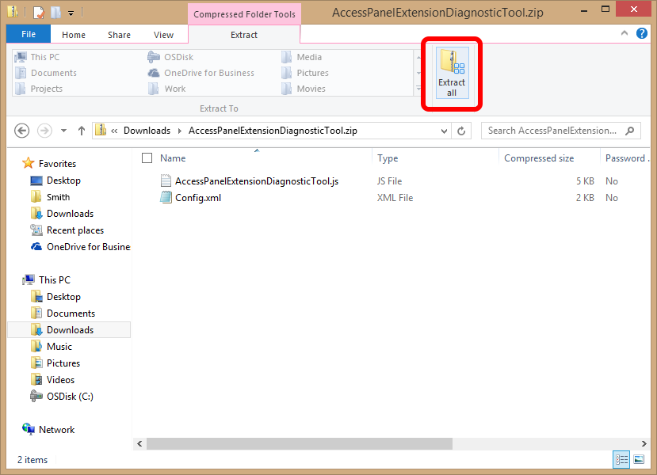
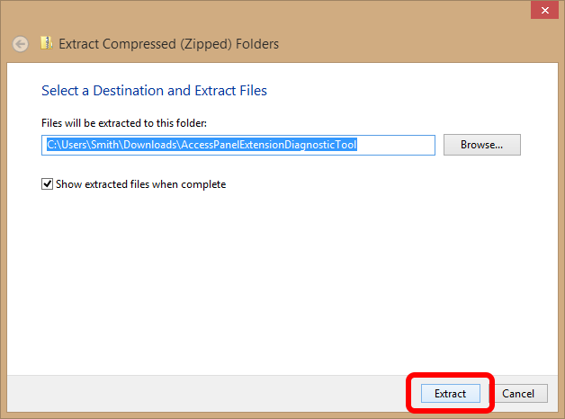
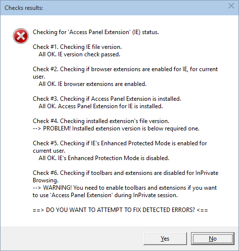
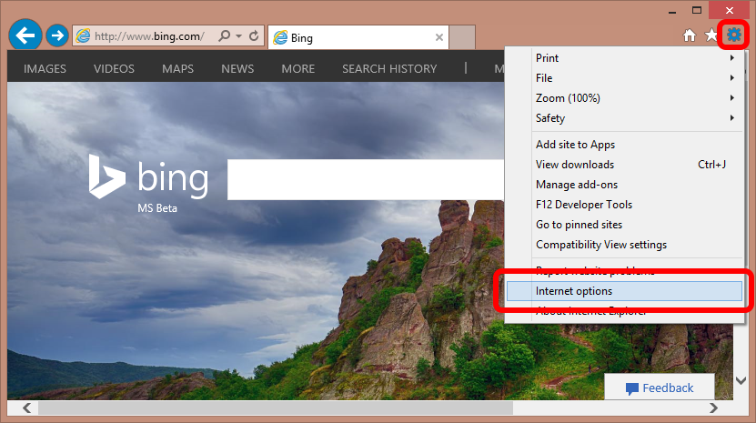
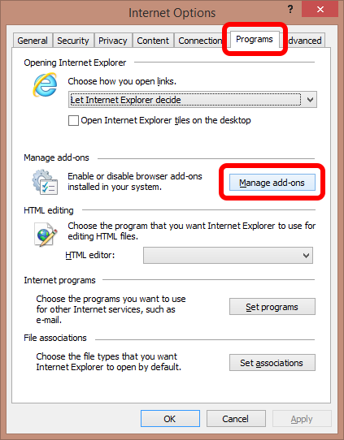
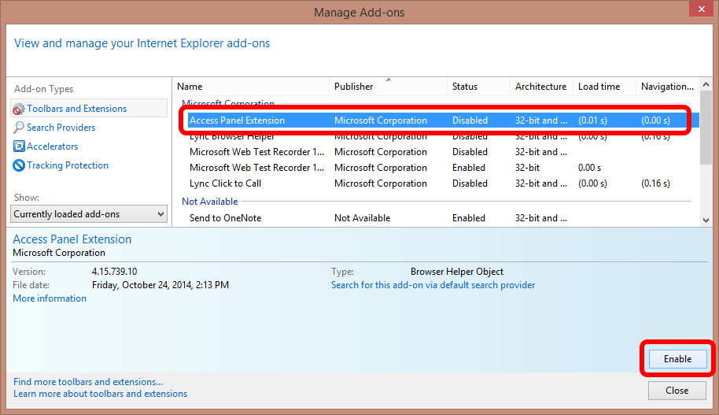
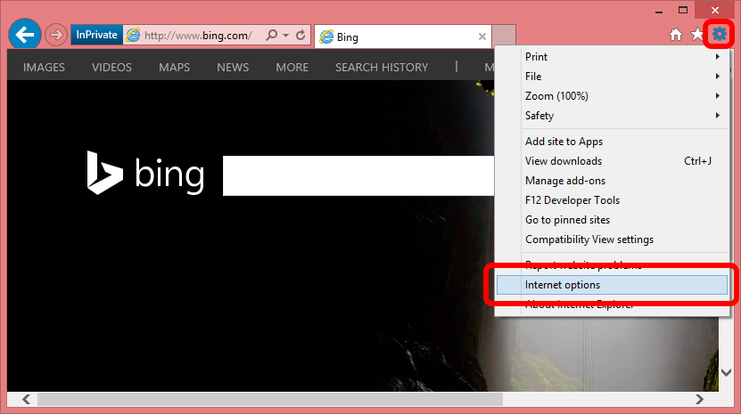
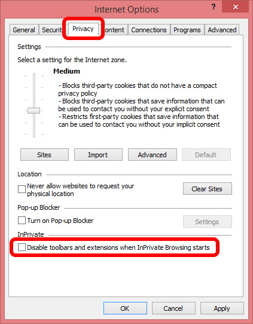
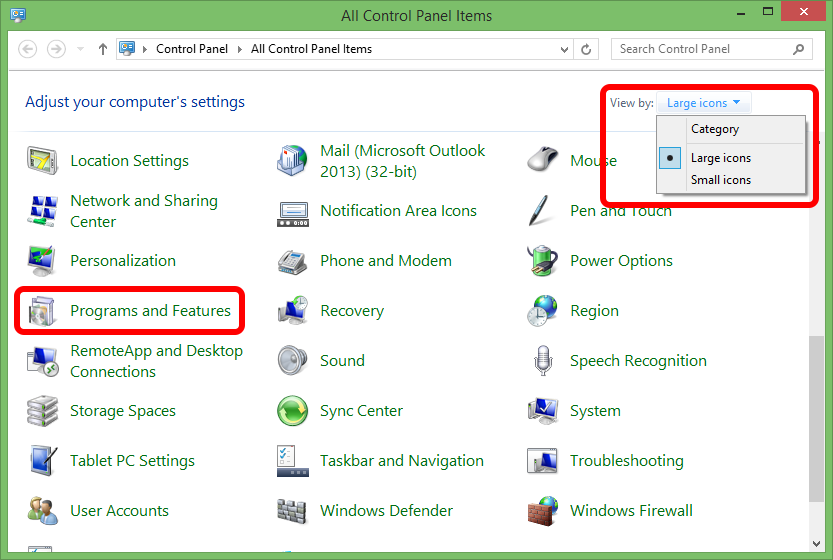
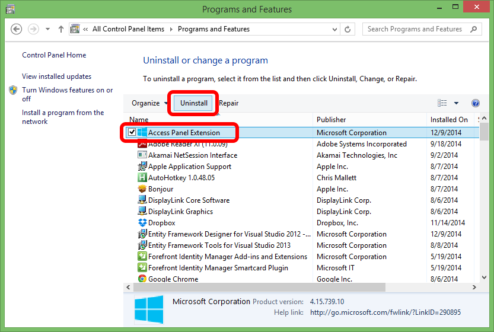

# Troubleshooting the Access Panel Extension for Internet Explorer
This article helps you troubleshoot the following problems:

* You're unable to access your apps through the My Apps portal while using Internet Explorer.
* You see the "Install Software" message even though you've already installed the software.

If you are an admin, see also: [How to Deploy the Access Panel Extension for Internet Explorer using Group Policy](deploy-access-panel-browser-extension.md)

## Run the Diagnostic Tool
You can diagnose installation problems with the Access Panel Extension by downloading and running the Access Panel diagnostic tool:

1. [Click here to download the diagnostic tool.](https://account.activedirectory.windowsazure.com/applications/AccessPanelExtensionDiagnosticTool/AccessPanelExtensionDiagnosticTool.zip)
2. Open the file, and press **Extract all** button.
   
    
3. Then press the **Extract** button to continue.
   
    
4. To run the tool, right-click the file named **AccessPanelExtensionDiagnosticTool**, then select **Open with > Microsoft Windows Based Script Host**.
   
    
5. You will then see the following diagnostic window, which describes what might be wrong with your installation.
   
    
6. Click "**YES**" to let the program fix the issues that have been found.
7. To save these changes, close every Internet Explorer window, and then open Internet Explorer again. If you still can't access your apps, try the steps below.

## Check that the Access Panel Extension is enabled
To verify that the Access Panel Extension is enabled in Internet Explorer:

1. In Internet Explorer, click the **Gear icon** on the top right corner of the window. Then select **Internet options**. (In older versions of Internet Explorer you can find this under **Tools > Internet options**.
   
    
2. Click the **Programs** tab, then click the **Manage add-ons** button.
   
    
3. In this dialog, select **Access Panel Extension** and then click the **Enable** button.
   
    
4. To save these changes, close every Internet Explorer window and then open Internet Explorer again.

## Enable Extensions for InPrivate Browsing
If you are using the InPrivate Browsing mode:

1. In Internet Explorer, click the **Gear icon** on the top right corner of the window. Then select **Internet options**. (In older versions of Internet Explorer you can find this under **Tools > Internet options**.
   
    
2. Go to the **Privacy** tab, then **uncheck** the checkbox labeled **Disable toolbars and extensions when InPrivate Browsing starts**

   
    
3. To save these changes, close every Internet Explorer window and then open Internet Explorer again.

## Uninstall the Access Panel Extension
To uninstall the Access Panel extension from your computer:

1. On your keyboard, press the **Windows key** to open the Start menu. When the menu is open, you can type anything to do a search. Type "Control Panel" and then open the **Control Panel** when it appears in the search results.
   
    
2. In the top right corner of the Control Panel, change the **View by** option to **Large icons**. Then find and click the **Programs and Features** button.
   
    
3. From the list, select **Access Panel Extension**, and the click the **Uninstall** button.
   
    
4. You can then try to install the extension again to see if the problem has been resolved.

If you encounter issues uninstalling the extension, you can also remove it using the [Microsoft Fix It](https://go.microsoft.com/?linkid=9779673) tool.

## Related Articles
* [Application access and single sign-on with Azure Active Directory](what-is-single-sign-on.md)
* [How to Deploy the Access Panel Extension for Internet Explorer using Group Policy](deploy-access-panel-browser-extension.md)

