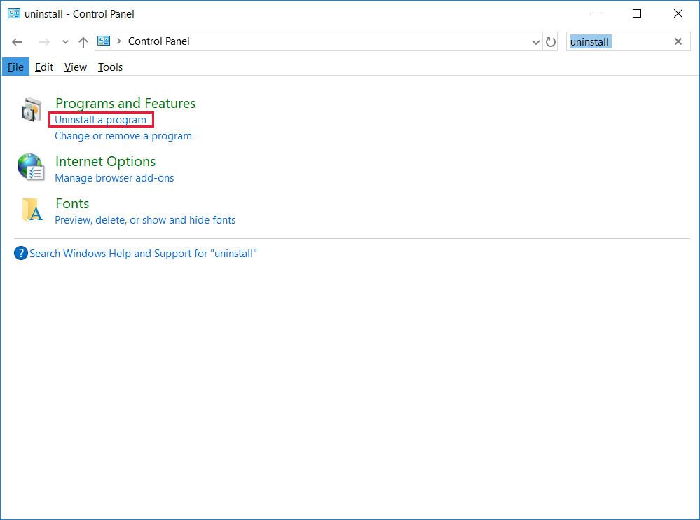
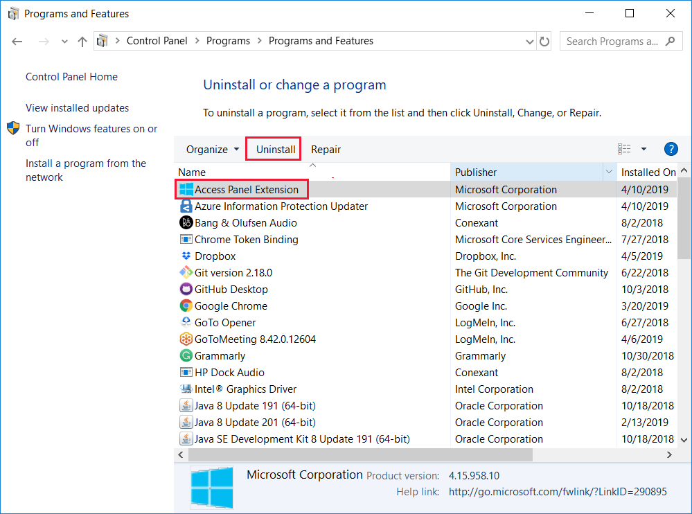

# Troubleshoot the Access Panel Extension for Internet Explorer

This article helps you troubleshoot the following problems:

* You're unable to access your apps through the My Apps portal while using Internet Explorer.
* You see the "Install Software" message even though you've already installed the software.

If you're an admin, see [How to Deploy the Access Panel Extension for Internet Explorer using Group Policy](deploy-access-panel-browser-extension.md).

## Run the diagnostic tool

You can diagnose installation problems with the Access Panel Extension by downloading and running the Access Panel diagnostic tool. 

To download and install the diagnostic tool:

1. [Select this link to download the diagnostic tool.](https://account.activedirectory.windowsazure.com/applications/AccessPanelExtensionDiagnosticTool/AccessPanelExtensionDiagnosticTool.zip)

2. Open the file and extract the contents to your computer.
   
3. To run the tool, right-click the file named *AccessPanelExtensionDiagnosticTool.js* and select **Open with** > **Microsoft Windows Based Script Host**.
   
    

4. Review the diagnostic results that appear and select **Yes** to fix the issues. The **Check Results** dialog box appears with information about what to do if the extension doesn't work.  

5. Read the message and select **OK**.

## Check that the Access Panel Extension is enabled

To verify that you've enabled the Access Panel Extension in Internet Explorer:

1. In Internet Explorer, select the **Gear icon** on the upper-right corner of the window and select **Internet options**.
   
2. Go to the **Programs** tab and select **Manage add-ons**.
   
3. Select **Access Panel Extension** in the **Microsoft Corporation** section and select **Enable**.
   
4. To save the changes, close all of the Internet Explorer browser windows you have open. The change takes effect the next time you open Internet Explorer.

## Enable extensions for InPrivate Browsing

To enable extensions for InPrivate Browsing:

1. In Internet Explorer, select the **Gear icon** on the upper-right corner of the window and select **Internet options**.
   
2. Go to the **Privacy** tab and verify that the **Disable toolbars and extensions when InPrivate Browsing starts** check box is clear.
   
3.  To save the changes, close all of the Internet Explorer browser windows you have open. The change takes effect the next time you open Internet Explorer.

## Uninstall the Access Panel Extension

To uninstall the Access Panel Extension from your computer:

1. In Control Panel, search for *uninstall*. 

2. In the search results, select **Uninstall a program**.
   
    

3. From the list, select **Access Panel Extension** and select **Uninstall**.

    
   
4. You can then try to install the extension again to see if the problem has been resolved.

If you run into issues uninstalling the extension, you can also remove it using the [Microsoft Fix It](https://go.microsoft.com/?linkid=9779673) tool.

## Related articles
* [Application access and single sign-on with Azure Active Directory](what-is-single-sign-on.md)
* [How to deploy the Access Panel Extension for Internet Explorer using Group Policy](deploy-access-panel-browser-extension.md)

