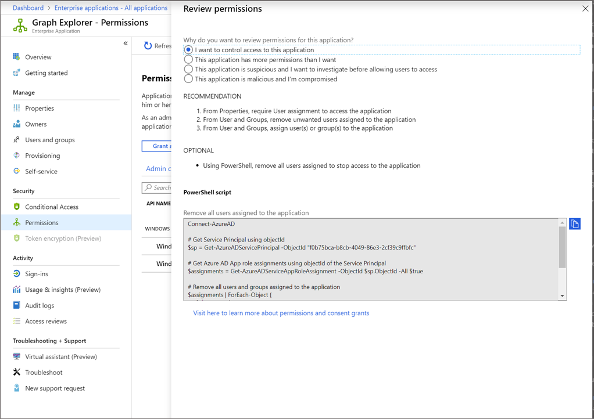

# Review permissions granted to enterprise applications

In this article, you learn how to review permissions granted to applications in your Azure Active Directory (Azure AD) tenant. You may need to review permissions when you've detected a malicious application or the application has been granted more permissions than is necessary. You learn how to revoke permissions granted to the application using Microsoft Graph API and existing versions of PowerShell.

The steps in this article apply to all applications that were added to your Azure AD tenant via user or admin consent. For more information on consenting to applications, see [User and admin consent](user-admin-consent-overview.md).

## Prerequisites

To review permissions granted to applications, you need:

- An Azure account with an active subscription. [Create an account for free](https://azure.microsoft.com/free/?WT.mc_id=A261C142F).
- One of the following roles: Global Administrator, Cloud Application Administrator, Application Administrator.
- A Service principal owner who isn't an administrator is able to invalidate refresh tokens.

:::zone pivot="portal"

## Review permissions

You can access the Azure portal to get contextual PowerShell scripts to perform the actions.

To review application permissions:

1. Sign in to the [Azure portal](https://portal.azure.com) using one of the roles listed in the prerequisites section.
1. Select **Azure Active Directory**, and then select **Enterprise applications**.
1. Select the application that you want to restrict access to.
1. Select **Permissions**. In the command bar, select **Review permissions**.

1. Give a reason for why you want to review permissions for the application by selecting any of the options listed after the question, **Why do you want to review permissions for this application?**

Each option generates PowerShell scripts that enable you to control user access to the application and to review permissions granted to the application. For information about how to control user access to an application, see [How to remove a user's access to an application](methods-for-removing-user-access.md)

:::zone-end

:::zone pivot="aad-powershell"

## Review and revoke permissions

Use the following Azure AD PowerShell script to revoke all permissions granted to an application.

```powershell
Connect-AzureAD 

# Get Service Principal using objectId
$sp = Get-AzureADServicePrincipal -ObjectId "<ServicePrincipal objectID>"

# Get all delegated permissions for the service principal
$spOAuth2PermissionsGrants = Get-AzureADOAuth2PermissionGrant -All $true| Where-Object { $_.clientId -eq $sp.ObjectId }

# Remove all delegated permissions
$spOAuth2PermissionsGrants | ForEach-Object {
    Remove-AzureADOAuth2PermissionGrant -ObjectId $_.ObjectId
}

# Get all application permissions for the service principal
$spApplicationPermissions = Get-AzureADServiceAppRoleAssignedTo-ObjectId $sp.ObjectId -All $true | Where-Object { $_.PrincipalType -eq "ServicePrincipal" }

# Remove all application permissions
$spApplicationPermissions | ForEach-Object {
    Remove-AzureADServiceAppRoleAssignment -ObjectId $_.PrincipalId -AppRoleAssignmentId $_.objectId
}
```

## Invalidate the refresh tokens

Remove appRoleAssignments for users or groups to the application using the following scripts.

```powershell
Connect-AzureAD

# Get Service Principal using objectId
$sp = Get-AzureADServicePrincipal -ObjectId "<ServicePrincipal objectID>"

# Get Azure AD App role assignments using objectID of the Service Principal
$assignments = Get-AzureADServiceAppRoleAssignment -ObjectId $sp.ObjectId -All $true | Where-Object {$_.PrincipalType -eq "User"}

# Revoke refresh token for all users assigned to the application
$assignments | ForEach-Object {
    Revoke-AzureADUserAllRefreshToken -ObjectId $_.PrincipalId
}
```
:::zone-end

:::zone pivot="ms-powershell"

## Review and revoke permissions

Use the following Microsoft Graph PowerShell script to revoke all permissions granted to an application.

```powershell
Connect-MgGraph -Scopes "Application.ReadWrite.All", "Directory.ReadWrite.All", "DelegatedPermissionGrant.ReadWrite.All", "AppRoleAssignment.ReadWrite.All"

# Get Service Principal using objectId
$sp = Get-MgServicePrincipal -ServicePrincipalID "$ServicePrincipalID"

Example: Get-MgServicePrincipal -ServicePrincipalId '22c1770d-30df-49e7-a763-f39d2ef9b369'

# Get all delegated permissions for the service principal
$spOAuth2PermissionsGrants= Get-MgOauth2PermissionGrant -All| Where-Object { $_.clientId -eq $sp.Id }

# Remove all delegated permissions
$spOauth2PermissionsGrants |ForEach-Object {
  Remove-MgOauth2PermissionGrant -OAuth2PermissionGrantId $_.Id
  }

# Get all application permissions for the service principal
$spApplicationPermissions = Get-MgServicePrincipalAppRoleAssignment -ServicePrincipalId $Sp.Id -All | Where-Object { $_.PrincipalType -eq "ServicePrincipal" }

# Remove all application permissions
$spApplicationPermissions | ForEach-Object {
Remove-MgServicePrincipalAppRoleAssignedTo -ServicePrincipalId $Sp.Id  -AppRoleAssignmentId $_.Id
 }
``` 

## Invalidate the refresh tokens

Remove appRoleAssignments for users or groups to the application using the following scripts.

```powershell
Connect-MgGraph -Scopes "Application.ReadWrite.All", "Directory.ReadWrite.All", "AppRoleAssignment.ReadWrite.All"

# Get Service Principal using objectId
$sp = Get-MgServicePrincipal -ServicePrincipalID "$ServicePrincipalID"

Example: Get-MgServicePrincipal -ServicePrincipalId '22c1770d-30df-49e7-a763-f39d2ef9b369'

# Get Azure AD App role assignments using objectID of the Service Principal
$spApplicationPermissions = Get-MgServicePrincipalAppRoleAssignedTo -ServicePrincipalID $sp.Id -All | Where-Object { $_.PrincipalType -eq "ServicePrincipal" }
  
# Revoke refresh token for all users assigned to the application
  $spApplicationPermissions | ForEach-Object {
  Remove-MgServicePrincipalAppRoleAssignment -ServicePrincipalId $_.PrincipalId -AppRoleAssignmentId $_.Id
  }
```

:::zone-end

:::zone pivot = "ms-graph"

## Review and revoke permissions

To review permissions, Sign in to [Graph Explorer](https://developer.microsoft.com/graph/graph-explorer) with one of the roles listed in the prerequisite section.

You need to consent to the following permissions: 

`Application.ReadWrite.All`, `Directory.ReadWrite.All`, `DelegatedPermissionGrant.ReadWrite.All`, `AppRoleAssignment.ReadWrite.All`.

### Delegated permissions

Run the following queries to review delegated permissions granted to an application.

1. Get service principal using the object ID.

    ```http
    GET https://graph.microsoft.com/v1.0/servicePrincipals/{id}
    ```
 
   Example:

    ```http
    GET https://graph.microsoft.com/v1.0/servicePrincipals/00063ffc-54e9-405d-b8f3-56124728e051
    ```

1. Get all delegated permissions for the service principal

    ```http
    GET https://graph.microsoft.com/v1.0/servicePrincipals/{id}/oauth2PermissionGrants
    ```
1. Remove delegated permissions using oAuth2PermissionGrants ID.

    ```http
    DELETE https://graph.microsoft.com/v1.0/oAuth2PermissionGrants/{id}
    ```

### Application permissions

Run the following queries to review application permissions granted to an application.

1. Get all application permissions for the service principal

    ```http
    GET https://graph.microsoft.com/v1.0/servicePrincipals/{servicePrincipal-id}/appRoleAssignments
    ```
1. Remove application permissions using appRoleAssignment ID

    ```http
    DELETE https://graph.microsoft.com/v1.0/servicePrincipals/{resource-servicePrincipal-id}/appRoleAssignedTo/{appRoleAssignment-id}
    ```

## Invalidate the refresh tokens

Run the following queries to remove appRoleAssignments of users or groups to the application.

1. Get Service Principal using objectID.

    ```http
    GET https://graph.microsoft.com/v1.0/servicePrincipals/{id}
    ```
   Example:

    ```http
    GET https://graph.microsoft.com/v1.0/servicePrincipals/57443554-98f5-4435-9002-852986eea510
    ```
1. Get Azure AD App role assignments using objectID of the Service Principal.

    ```http
    GET https://graph.microsoft.com/v1.0/servicePrincipals/{servicePrincipal-id}/appRoleAssignedTo
    ```
1. Revoke refresh token for users and groups assigned to the application using appRoleAssignment ID.

    ```http
    DELETE https://graph.microsoft.com/v1.0/servicePrincipals/{servicePrincipal-id}/appRoleAssignedTo/{appRoleAssignment-id}
    ```
:::zone-end

> [!NOTE]
> Revoking the current granted permission won't stop users from re-consenting to the application. If you want to block users from consenting, read [Configure how users consent to applications](configure-user-consent.md).

## Next steps

- [Configure user consent setting](configure-user-consent.md)
- [Configure admin consent workflow](configure-admin-consent-workflow.md)
