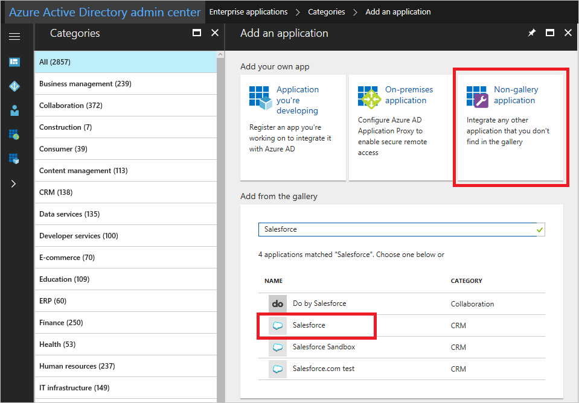
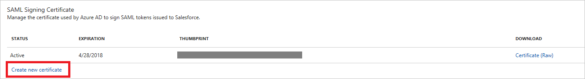
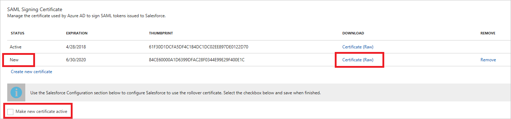

# Manage certificates for federated single sign-on in Azure Active Directory
This article covers common questions and information related to the certificates that Azure Active Directory (Azure AD) creates to establish federated single sign-on (SSO) to your SaaS applications. Add applications from the Azure AD app gallery or by using a non-gallery application template. Configure the application by using the federated SSO option.

This article is relevant only to apps that are configured to use Azure AD SSO through SAML federation, as shown in the following example:

## Auto-generated certificate for gallery and non-gallery applications
When you add a new application from the gallery and configure a SAML-based sign-on, Azure AD generates a certificate for the application that is valid for three years. You can download this certificate from the **SAML Signing Certificate** section. For gallery applications, this section might show an option to download the certificate or metadata, depending on the requirement of the application.

## Customize the expiration date for your federation certificate and roll it over to a new certificate
By default, certificates are set to expire after three years. You can choose a different expiration date for your certificate by completing the following steps.
The screenshots use Salesforce for the sake of example, but these steps can apply to any federated SaaS app.

1. In the [Azure portal](https://aad.portal.azure.com), click **Enterprise application** in the left pane and then click **New application** on the **Overview** page:

   

2. Search for the gallery application and then select the application that you want to add. If you cannot find the required application, add the application by using the **Non-gallery application** option. This feature is available only in the Azure AD Premium (P1 and P2) SKU.

    

3. Click the **Single sign-on** link in the left pane and change **Single Sign-on Mode** to **SAML-based Sign-on**. This step generates a three-year certificate for your application.

4. To create a new certificate, click the **Create new certificate** link in the **SAML Signing Certificate** section.

    

5. The **Create a new certificate** link opens the calendar control. You can set any date and time up to three years from the current date. The selected date and time is the new expiration date and time of your new certificate. Click **Save**.

    

6. Now the new certificate is available to download. Click the **Certificate** link to download it. At this point, your certificate is not active. When you want to roll over to this certificate, select the **Make new certificate active** check box and click **Save**. From that point, Azure AD starts using the new certificate for signing the response.

7.	To learn how to upload the certificate to your particular SaaS application, click the **View application configuration tutorial** link.

## Certificate expiration notification email

Azure AD will send an email notification 60, 30, and 7 days before SAML certificate expires. To specify the email address for where to send the notification:

- On the Azure Active Directory application Single sign-on page, go to the Notification Email field.
- Enter the email address that should receive the certificate expiration notification email. By default, this field uses the email address of the admin who added the application.

You will receive the notification email from aadnotification@microsoft.com. To avoid the email going to your spam location, be sure to add this email to your contacts. 

## Renew a certificate that will soon expire
The following renewal steps should result in no significant downtime for your users. The screenshots in this section feature Salesforce as an example, but these steps can apply to any federated SaaS app.

1. On the **Azure Active Directory** application **Single sign-on** page, generate the new certificate for your application. You can do this by clicking the **Create new certificate** link in the **SAML Signing Certificate** section.

    

2. Select the desired expiration date and time for your new certificate and click **Save**.

3. Download the certificate in the **SAML Signing certificate** option. Upload the new certificate to the SaaS application's single sign-on configuration screen. To learn how to do this for your particular SaaS application, click the **View application configuration tutorial** link.
   
4. To activate the new certificate in Azure AD, select the **Make new certificate active** check box and click the **Save** button at the top of the page. This rolls over the new certificate on the Azure AD side. The status of the certificate changes from **New** to **Active**. From that point, Azure AD starts using the new certificate for signing the response. 
   
    

## Related articles
* [List of tutorials on how to integrate SaaS apps with Azure Active Directory](../saas-apps/tutorial-list.md)
* [Application Management in Azure Active Directory](what-is-application-management.md)
* [Application access and single sign-on with Azure Active Directory](what-is-single-sign-on.md)
* [Troubleshooting SAML-based single sign-on](../develop/howto-v1-debug-saml-sso-issues.md)
