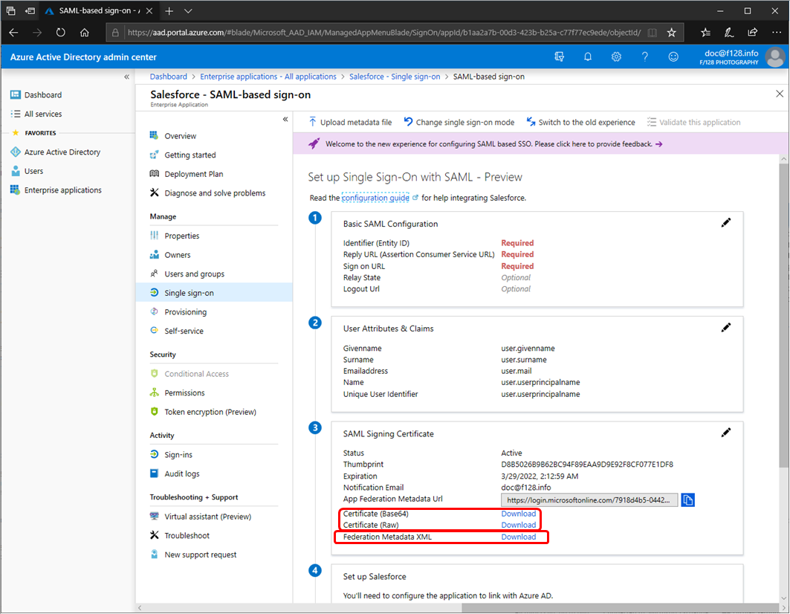
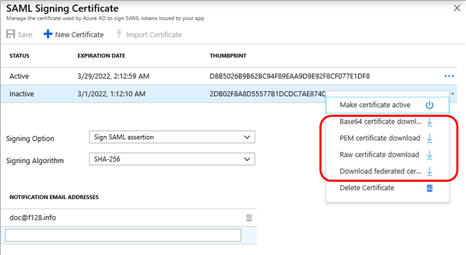

# Manage certificates for federated single sign-on in Azure Active Directory

In this article, we cover common questions and information related to certificates that Azure Active Directory (Azure AD) creates to establish federated single sign-on (SSO) to your software as a service (SaaS) applications. Add applications from the Azure AD app gallery or by using a non-gallery application template. Configure the application by using the federated SSO option.

This article is relevant only to apps that are configured to use Azure AD SSO through [Security Assertion Markup Language](https://wikipedia.org/wiki/Security_Assertion_Markup_Language) (SAML) federation.

## Auto-generated certificate for gallery and non-gallery applications

When you add a new application from the gallery and configure a SAML-based sign-on (by selecting **Single sign-on** > **SAML** from the application overview page), Azure AD generates a certificate for the application that is valid for three years. To download the active certificate as a security certificate (**.cer**) file, return to that page (**SAML-based sign-on**) and select a download link in the **SAML Signing Certificate** heading. You can choose between the raw (binary) certificate or the Base64 (base 64-encoded text) certificate. For gallery applications, this section might also show a link to download the certificate as federation metadata XML (an **.xml** file), depending on the requirement of the application.

You can also download an active or inactive certificate by selecting the **SAML Signing Certificate** heading's **Edit** icon (a pencil), which displays the **SAML Signing Certificate** page. Select the ellipsis (**...**) next to the certificate you want to download, and then choose which certificate format you want. You have the additional option to download the certificate in privacy-enhanced mail (PEM) format. This format is identical to Base64 but with a **.pem** file name extension, which isn't recognized in Windows as a certificate format.

## Customize the expiration date for your federation certificate and roll it over to a new certificate

By default, Azure configures a certificate to expire after three years when it is created automatically during SAML single sign-on configuration. Because you can't change the date of a certificate after you save it, you have to:

1. Create a new certificate with the desired date.
1. Save the new certificate.
1. Download the new certificate in the correct format.
1. Upload the new certificate to the application.
1. Make the new certificate active in the Azure Active Directory portal.

The following two sections help you perform these steps.

### Create a new certificate

First, create and save new certificate with a different expiration date:

1. Sign in to the [Azure Active Directory portal](https://aad.portal.azure.com/). The **Azure Active Directory admin center** page appears.
1. In the left pane, select **Enterprise applications**. A list of the enterprise applications in your account appears.
1. Select the affected application. An overview page for the application appears.
1. In the left pane of the application overview page, select **Single sign-on**.
1. If the **Select a single sign-on method** page appears, select **SAML**.
1. In the **Set up Single Sign-On with SAML - Preview** page, find the **SAML Signing Certificate** heading and select the **Edit** icon (a pencil). The **SAML Signing Certificate** page appears, which displays the status (**Active** or **Inactive**), expiration date, and thumbprint (a hash string) of each certificate.
1. Select **New Certificate**. A new row appears below the certificate list, where the expiration date defaults to exactly three years after the current date. (Your changes haven't been saved yet, so you can still modify the expiration date.)
1. In the new certificate row, hover over the expiration date column and select the **Select Date** icon (a calendar). A calendar control appears, displaying the days of a month of the new row's current expiration date.
1. Use the calendar control to set a new date. You can set any date between the current date and three years after the current date.
1. Select **Save**. The new certificate now appears with a status of **Inactive**, the expiration date that you chose, and a thumbprint.
1. Select the **X** to return to the **Set up Single Sign-On with SAML - Preview** page.

### Upload and activate a certificate

Next, download the new certificate in the correct format, upload it to the application, and make it active in Azure Active Directory:

1. View the application's additional SAML sign-on configuration instructions by either:

   - Selecting the **configuration guide** link to view in a separate browser window or tab, or
   - Going to the **set up** heading and selecting **View step-by-step instructions** to view in a sidebar.

1. In the instructions, note the encoding format required for the certificate upload.
1. Follow the instructions in the [Auto-generated certificate for gallery and non-gallery applications](#auto-generated-certificate-for-gallery-and-non-gallery-applications) section earlier. This step downloads the certificate in the encoding format required for upload by the application.
1. When you want to roll over to the new certificate, go back to the **SAML Signing Certificate** page, and in the newly saved certificate row, select the ellipsis (**...**) and select **Make certificate active**. The status of the new certificate changes to **Active**, and the previously active certificate changes to a status of **Inactive**.
1. Continue following the application's SAML sign-on configuration instructions that you displayed earlier, so that you can upload the SAML signing certificate in the correct encoding format.

## Add email notification addresses for certificate expiration

Azure AD will send an email notification 60, 30, and 7 days before the SAML certificate expires. You may add more than one email address to receive notifications. To specify the email address(es) you want the notifications to be sent to:

1. In the **SAML Signing Certificate** page, go to the **notification email addresses** heading. By default, this heading uses only the email address of the admin who added the application.
1. Below the final email address, type the email address that should receive the certificate's expiration notice, and then press Enter.
1. Repeat the previous step for each email address you want to add.
1. For each email address you want to delete, select the **Delete** icon (a garbage can) next to the email address.
1. Select **Save**.

You will receive the notification email from aadnotification@microsoft.com. To avoid the email going to your spam location, add this email to your contacts.

## Renew a certificate that will soon expire

If a certificate is about to expire, you can renew it using a procedure that results in no significant downtime for your users. To renew an expiring certificate:

1. Follow the instructions in the [Create a new certificate](#create-a-new-certificate) section earlier, using a date that overlaps with the existing certificate. That date limits the amount of downtime caused by the certificate expiration.
1. If the application can automatically roll over a certificate, set the new certificate to active by following these steps:
   1. Go back to the **SAML Signing Certificate** page.
   1. In the newly saved certificate row, select the ellipsis (**...**) and then select **Make certificate active**.
   1. Skip the next two steps.

1. If the app can only handle one certificate at a time, pick a downtime interval to perform the next step. (Otherwise, if the application doesn’t automatically pick up the new certificate but can handle more than one signing certificate, you can perform the next step anytime.)
1. Before the old certificate expires, follow the instructions in the [Upload and activate a certificate](#upload-and-activate-a-certificate) section earlier.
1. Sign in to the application to make sure that the certificate works correctly.

## Related articles

- [Tutorials for integrating SaaS applications with Azure Active Directory](../saas-apps/tutorial-list.md)
- [Application management with Azure Active Directory](what-is-application-management.md)
- [Single sign-on to applications in Azure Active Directory](what-is-single-sign-on.md)
- [Debug SAML-based single sign-on to applications in Azure Active Directory](../azuread-dev/howto-v1-debug-saml-sso-issues.md)
