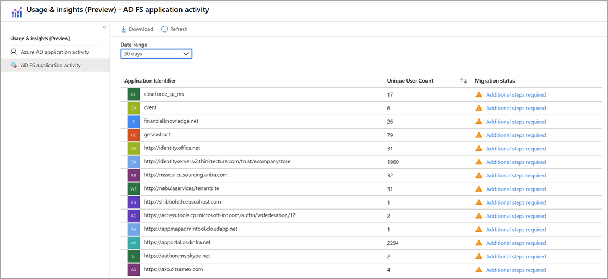
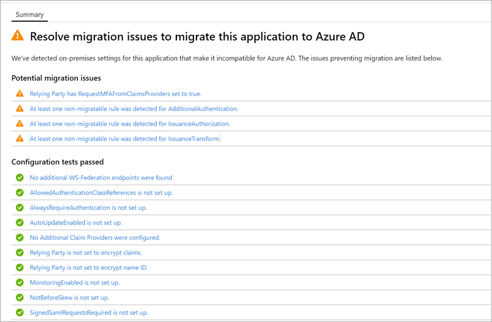
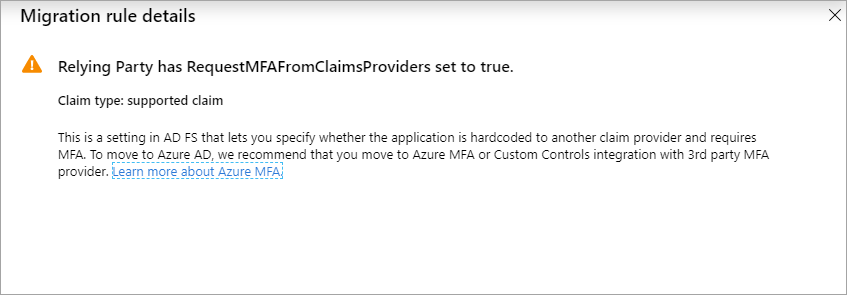
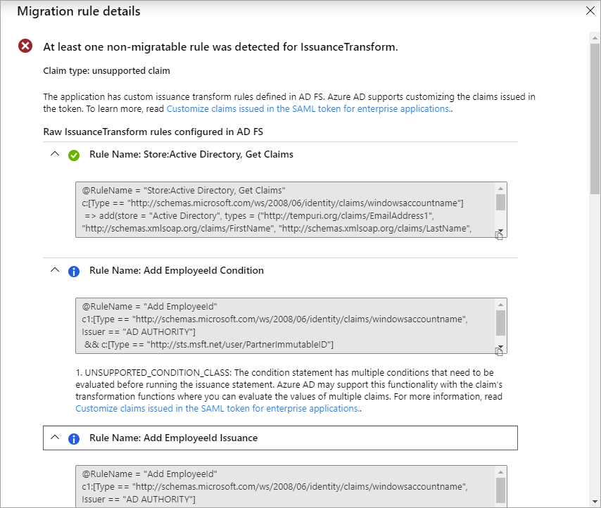

# Review the application activity report

Many organizations use Active Directory Federation Services (AD FS) to provide single sign-on to cloud applications. There are significant benefits to moving your AD FS applications to Azure AD for authentication, especially in terms of cost management, risk management, productivity, compliance, and governance. But understanding which applications are compatible with Azure AD and identifying specific migration steps can be time consuming.

The AD FS application activity report in the [Entra portal](https://entra.microsoft.com) lets you quickly identify which of your applications are capable of being migrated to Azure AD. It assesses all AD FS applications for compatibility with Azure AD, checks for any issues, and gives guidance on preparing individual applications for migration. With the AD FS application activity report, you can:

* **Discover AD FS applications and scope your migration.** The AD FS application activity report lists all AD FS applications in your organization that have had an active user login in the last 30 days. The report indicates an apps readiness for migration to Azure AD. The report doesn't display Microsoft related relying parties in AD FS such as Office 365. For example, relying parties with name 'urn:federation:MicrosoftOnline'.

* **Prioritize applications for migration.** Get the number of unique users who have signed in to the application in the past 1, 7, or 30 days to help determine the criticality or risk of migrating the application.
* **Run migration tests and fix issues.** The reporting service automatically runs tests to determine if an application is ready to migrate. The results are displayed in the AD FS application activity report as a migration status. If the AD FS configuration is not compatible with an Azure AD configuration, you get specific guidance on how to address the configuration in Azure AD.

The AD FS application activity data is available to users who are assigned any of these admin roles: global administrator, reports reader, security reader, application administrator, or cloud application administrator.

## Prerequisites

* Your organization must be currently using AD FS to access applications.
* Azure AD Connect Health must be enabled in your Azure AD tenant.
* The Azure AD Connect Health for AD FS agent must be installed.
* [Learn more about Azure AD Connect Health](../hybrid/how-to-connect-health-adfs.md)
* [Get started with setting up Azure AD Connect Health and install the AD FS agent](../hybrid/how-to-connect-health-agent-install.md)

>[!IMPORTANT]
>There are a couple reasons you won't see all the applications you are expecting after you have installed Azure AD Connect Health. The AD FS application activity report only shows AD FS relying parties with user logins in the last 30 days. Also, the report won't display Microsoft related relying parties such as Office 365.

## Discover AD FS applications that can be migrated

The AD FS application activity report is available in the [Entra portal](https://entra.microsoft.com) under Azure AD **Usage & insights** reporting. The AD FS application activity report analyzes each AD FS application to determine if it can be migrated as-is, or if additional review is needed.

1. Sign in to the [Entra portal](https://entra.microsoft.com) with an admin role that has access to AD FS application activity data (global administrator, reports reader, security reader, application administrator, or cloud application administrator).

2. Select **Azure Active Directory**, and then select **Enterprise applications**.

3. Under **Activity**, select **Usage & Insights**, and then select **AD FS application activity** to open a list of all AD FS applications in your organization.

   

4. For each application in the AD FS application activity list, view the **Migration status**:

   * **Ready to migrate** means the AD FS application configuration is fully supported in Azure AD and can be migrated as-is.

   * **Needs review** means some of the application's settings can be migrated to Azure AD, but you'll need to review the settings that can't be migrated as-is.

   * **Additional steps required** means Azure AD doesn't support some of the application's settings, so the application can’t be migrated in its current state.

## Evaluate the readiness of an application for migration

1. In the AD FS application activity list, click the status in the **Migration status** column to open migration details. You'll see a summary of the configuration tests that passed, along with any potential migration issues.

   

2. Click a message to open additional migration rule details. For a full list of the properties tested, see the [AD FS application configuration tests](#ad-fs-application-configuration-tests) table, below.

   

### AD FS application configuration tests

The following table lists all configuration tests that are performed on AD FS applications.

|Result  |Pass/Warning/Fail  |Description  |
|---------|---------|---------|
|Test-ADFSRPAdditionalAuthenticationRules   At least one non-migratable rule was detected for AdditionalAuthentication.       | Pass/Warning          | The relying party has rules to prompt for multi-factor authentication (MFA). To move to Azure AD, translate those rules into Conditional Access policies. If you're using an on-premises MFA, we recommend that you move to Azure AD MFA. [Learn more about Conditional Access](../authentication/concept-mfa-howitworks.md).        |
|Test-ADFSRPAdditionalWSFedEndpoint   Relying party has AdditionalWSFedEndpoint set to true.       | Pass/Fail          | The relying party in AD FS allows multiple WS-Fed assertion endpoints. Currently, Azure AD only supports one. If you have a scenario where this result is blocking migration, [let us know](https://feedback.azure.com/d365community/forum/22920db1-ad25-ec11-b6e6-000d3a4f0789).     |
|Test-ADFSRPAllowedAuthenticationClassReferences   Relying Party has set AllowedAuthenticationClassReferences.       | Pass/Fail          | This setting in AD FS lets you specify whether the application is configured to only allow certain authentication types. We recommend using Conditional Access to achieve this capability.  If you have a scenario where this result is blocking migration, [let us know](https://feedback.azure.com/d365community/forum/22920db1-ad25-ec11-b6e6-000d3a4f0789).  [Learn more about Conditional Access](../authentication/concept-mfa-howitworks.md).         |
|Test-ADFSRPAlwaysRequireAuthentication   AlwaysRequireAuthenticationCheckResult      | Pass/Fail          | This setting in AD FS lets you specify whether the application is configured to ignore SSO cookies and **Always Prompt for Authentication**. In Azure AD, you can manage the authentication session using Conditional Access policies to achieve similar behavior. [Learn more about configuring authentication session management with Conditional Access](../conditional-access/howto-conditional-access-session-lifetime.md).          |
|Test-ADFSRPAutoUpdateEnabled   Relying Party has AutoUpdateEnabled set to true       | Pass/Warning          | This setting in AD FS lets you specify whether AD FS is configured to automatically update the application based on changes within the federation metadata. Azure AD doesn’t support this today but should not block the migration of the application to Azure AD.           |
|Test-ADFSRPClaimsProviderName   Relying Party has multiple ClaimsProviders enabled       | Pass/Fail          | This setting in AD FS calls out the identity providers from which the relying party is accepting claims. In Azure AD, you can enable external collaboration using Azure AD B2B. [Learn more about Azure AD B2B](../external-identities/what-is-b2b.md).          |
|Test-ADFSRPDelegationAuthorizationRules      | Pass/Fail          | The application has custom delegation authorization rules defined. This is a WS-Trust concept that  Azure AD supports by using modern authentication protocols, such as OpenID Connect and OAuth 2.0. [Learn more about the Microsoft Identity Platform](../develop/v2-protocols-oidc.md).          |
|Test-ADFSRPImpersonationAuthorizationRules       | Pass/Warning          | The application has custom impersonation authorization rules defined. This is a WS-Trust concept that Azure AD supports by using modern authentication protocols, such as OpenID Connect and OAuth 2.0. [Learn more about the Microsoft Identity Platform](../develop/v2-protocols-oidc.md).          |
|Test-ADFSRPIssuanceAuthorizationRules   At least one non-migratable rule was detected for IssuanceAuthorization.       | Pass/Warning          | The application has custom issuance authorization rules defined in AD FS. Azure AD supports this functionality with Azure AD Conditional Access. [Learn more about Conditional Access](../conditional-access/overview.md).   You can also restrict access to an application by user or groups assigned to the application. [Learn more about assigning users and groups to access applications](./assign-user-or-group-access-portal.md).            |
|Test-ADFSRPIssuanceTransformRules   At least one non-migratable rule was detected for IssuanceTransform.       | Pass/Warning          | The application has custom issuance transform rules defined in AD FS. Azure AD supports customizing the claims issued in the token. To learn more, see [Customize claims issued in the SAML token for enterprise applications](../develop/active-directory-saml-claims-customization.md).           |
|Test-ADFSRPMonitoringEnabled   Relying Party has MonitoringEnabled set to true.       | Pass/Warning          | This setting in AD FS lets you specify whether AD FS is configured to automatically update the application based on changes within the federation metadata. Azure AD doesn’t support this today but should not block the migration of the application to Azure AD.           |
|Test-ADFSRPNotBeforeSkew   NotBeforeSkewCheckResult      | Pass/Warning          | AD FS allows a time skew based on the NotBefore and NotOnOrAfter times in the SAML token. Azure AD automatically handles this by default.          |
|Test-ADFSRPRequestMFAFromClaimsProviders   Relying Party has RequestMFAFromClaimsProviders set to true.       | Pass/Warning          | This setting in AD FS determines the behavior for MFA when the user comes from a different claims provider. In Azure AD, you can enable external collaboration using Azure AD B2B. Then, you can apply Conditional Access policies to protect guest access. Learn more about [Azure AD B2B](../external-identities/what-is-b2b.md) and [Conditional Access](../conditional-access/overview.md).          |
|Test-ADFSRPSignedSamlRequestsRequired   Relying Party has SignedSamlRequestsRequired set to true       | Pass/Fail          | The application is configured in AD FS to verify the signature in the SAML request. Azure AD accepts a signed SAML request; however, it will not verify the signature. Azure AD has different methods to protect against malicious calls. For example, Azure AD uses the reply URLs configured in the application to validate the SAML request. Azure AD will only send a token to reply URLs configured for the application. If you have a scenario where this result is blocking migration, [let us know](https://feedback.azure.com/d365community/forum/22920db1-ad25-ec11-b6e6-000d3a4f0789).          |
|Test-ADFSRPTokenLifetime   TokenLifetimeCheckResult        | Pass/Warning         | The application is configured for a custom token lifetime. The AD FS default is one hour. Azure AD supports this functionality using Conditional Access. To learn more, see [Configure authentication session management with Conditional Access](../conditional-access/howto-conditional-access-session-lifetime.md).          |
|Relying Party is set to encrypt claims. This is supported by Azure AD       | Pass          | With Azure AD, you can encrypt the token sent to the application. To learn more, see [Configure Azure AD SAML token encryption](./howto-saml-token-encryption.md).          |
|EncryptedNameIdRequiredCheckResult      | Pass/Fail          | The application is configured to encrypt the nameID claim in the SAML token. With Azure AD, you can encrypt the entire token sent to the application. Encryption of specific claims is not yet supported. To learn more, see [Configure Azure AD SAML token encryption](./howto-saml-token-encryption.md).         |

## Check the results of claim rule tests

If you have configured a claim rule for the application in AD FS, the experience will provide a granular analysis for all the claim rules. You'll see which claim rules can be moved to Azure AD and which ones need further review.

1. In the AD FS application activity list, click the status in the **Migration status** column to open migration details. You'll see a summary of the configuration tests that passed, along with any potential migration issues.

2. On the **Migration rule details** page, expand the results to display details about potential migration issues and to get additional guidance. For a detailed list of all claim rules tested, see the [Check the results of claim rule tests](#check-the-results-of-claim-rule-tests) table, below.

   The example below shows migration rule details for the IssuanceTransform rule. It lists the specific parts of the claim that need to be reviewed and addressed before you can migrate the application to Azure AD.

   

### Claim rule tests

The following table lists all claim rule tests that are performed on AD FS applications.

|Property  |Description  |
|---------|---------|
|UNSUPPORTED_CONDITION_PARAMETER      | The condition statement uses Regular Expressions to evaluate if the claim matches a certain pattern.  To achieve a similar functionality in Azure AD, you can use pre-defined transformation such as  IfEmpty(), StartWith(), Contains(), among others. For more information, see [Customize claims issued in the SAML token for enterprise applications](../develop/active-directory-saml-claims-customization.md).          |
|UNSUPPORTED_CONDITION_CLASS      | The condition statement has multiple conditions that need to be evaluated before running the issuance statement. Azure AD may support this functionality with the claim’s transformation functions where you can evaluate multiple claim values.  For more information, see [Customize claims issued in the SAML token for enterprise applications](../develop/active-directory-saml-claims-customization.md).          |
|UNSUPPORTED_RULE_TYPE      | The claim rule couldn’t be recognized. For more information on how to configure claims in Azure AD, see [Customize claims issued in the SAML token for enterprise applications](../develop/active-directory-saml-claims-customization.md).          |
|CONDITION_MATCHES_UNSUPPORTED_ISSUER      | The condition statement uses an Issuer that is not supported in Azure AD. Currently, Azure AD doesn’t source claims from stores different that Active Directory or Azure AD. If this is blocking you from migrating applications to Azure AD, [let us know](https://feedback.azure.com/d365community/forum/22920db1-ad25-ec11-b6e6-000d3a4f0789).         |
|UNSUPPORTED_CONDITION_FUNCTION      | The condition statement uses an aggregate function to issue or add a single claim regardless of the number of matches.  In Azure AD, you can evaluate the attribute of a user to decide what value to use for the claim with functions like IfEmpty(), StartWith(), Contains(), among others. For more information, see [Customize claims issued in the SAML token for enterprise applications](../develop/active-directory-saml-claims-customization.md).          |
|RESTRICTED_CLAIM_ISSUED      | The condition statement uses a claim that is restricted in Azure AD. You may be able to issue a restricted claim, but you can’t modify its source or apply any transformation. For more information, see [Customize claims emitted in tokens for a specific app in Azure AD](../develop/active-directory-claims-mapping.md).          |
|EXTERNAL_ATTRIBUTE_STORE      | The issuance statement uses an attribute store different that Active Directory. Currently, Azure AD doesn’t source claims from stores different that Active Directory or Azure AD. If this result is blocking you from migrating applications to Azure AD, [let us know](https://feedback.azure.com/d365community/forum/22920db1-ad25-ec11-b6e6-000d3a4f0789).          |
|UNSUPPORTED_ISSUANCE_CLASS      | The issuance statement uses ADD to add claims to the incoming claim set. In Azure AD, this may be configured as multiple claim transformations.  For more information, see [Customize claims issued in the SAML token for enterprise applications](../develop/active-directory-claims-mapping.md).         |
|UNSUPPORTED_ISSUANCE_TRANSFORMATION      | The issuance statement uses Regular Expressions to transform the value of the claim to be emitted. To achieve similar functionality in Azure AD, you can use pre-defined transformation such as Extract(), Trim(), ToLower, among others. For more information, see [Customize claims issued in the SAML token for enterprise applications](../develop/active-directory-saml-claims-customization.md).          |

## Troubleshooting

### Can't see all my AD FS applications in the report

 If you have installed Azure AD Connect health but you still see the prompt to install it or you don't see all your AD FS applications in the report it may be that you don't have active AD FS applications or your AD FS applications are microsoft application.

 The AD FS application activity report lists all the AD FS applications in your organization with active users sign-in in the last 30 days. Also, the report doesn't display microsoft related relying parties in AD FS such as Office 365. For example, relying parties with name 'urn:federation:MicrosoftOnline', 'microsoftonline', 'microsoft:winhello:cert:prov:server' won't show up in the list.

## Next steps

* [Video: How to use the AD FS activity report to migrate an application](https://www.youtube.com/watch?v=OThlTA239lU)
* [Managing applications with Azure Active Directory](what-is-application-management.md)
* [Manage access to apps](what-is-access-management.md)
* [Azure AD Connect federation](../hybrid/how-to-connect-fed-whatis.md)
