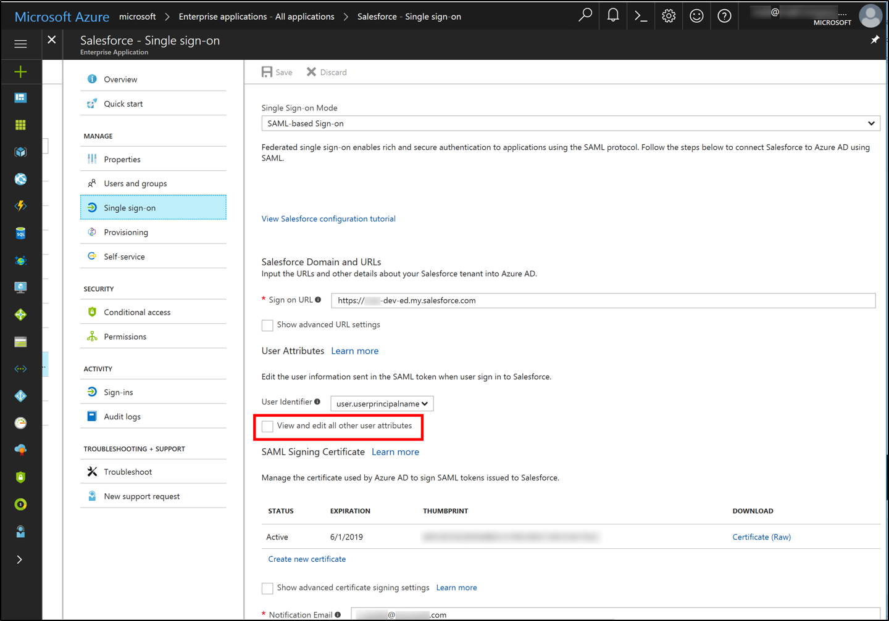
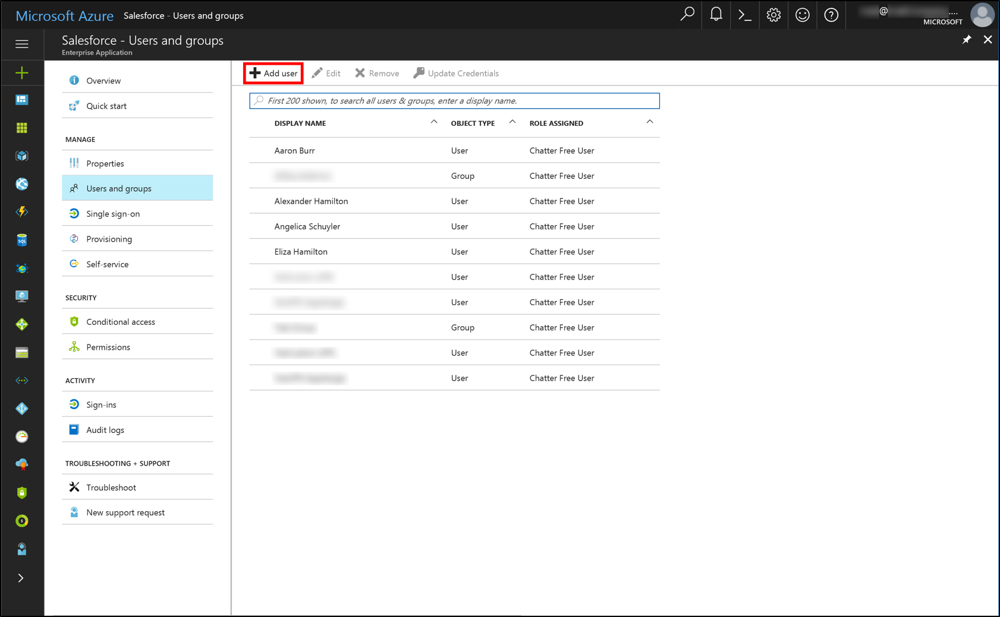
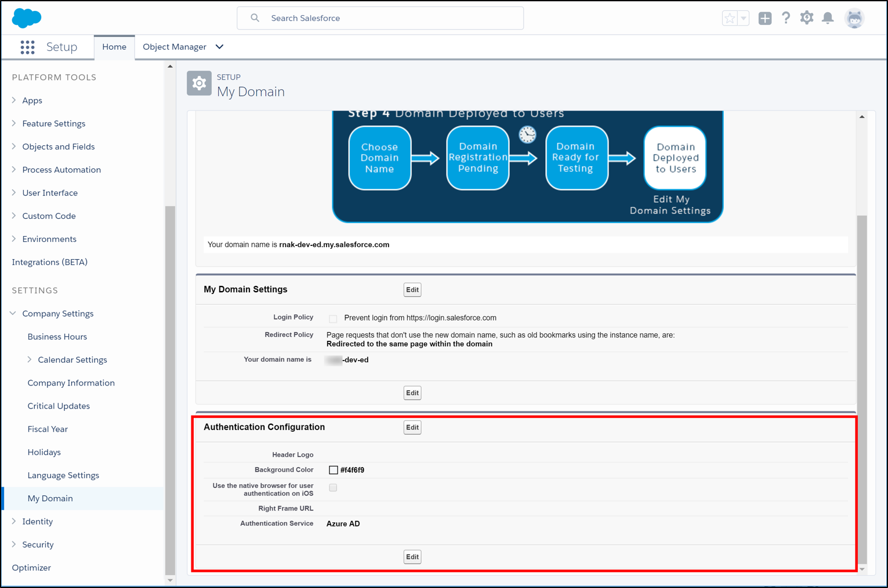

# Migrate AD FS on-premises apps to Azure 

This article helps you understand how to migrate on-premises applications to Azure Active Directory (Azure AD). It focuses on federated SaaS applications. 

This article does not provide step-by-step guidance. It provides conceptual guidance to help you achieve the migration by understanding how on-premises configurations translate to Azure AD. It also covers common scenarios.

## Introduction

If you have an on-premises directory that contains user accounts, chances are you have at least one or two apps. And these apps are configured for users to access by signing on with those identities.

And if you’re like most organizations, you’re probably somewhere along the road to adopting cloud applications and identities. Perhaps you’re up and running with Office 365 and Azure AD Connect. Maybe you’ve set up cloud-based SaaS applications for some key workloads but not all.  

Many organizations have SaaS or custom line-of-business (LOB) apps federated directly to an on-premises sign-on service such as Active Directory Federation Services (AD FS), alongside Office 365 and Azure AD-based apps. This migration guide describes why and how to migrate on-premises applications to Azure AD.

>[!NOTE]
>This guide provides detailed information on SaaS app configuration and migration, with high-level information about custom LOB apps. More detailed guidance for custom LOB apps is planned for the future.

## Reasons for migrating apps to Azure AD

For an organization that already uses AD FS, Ping, or another on-premises authentication provider, migrating apps to Azure AD enables the following benefits:

**More secure access**
- Configure granular per-application access controls, including Azure Multi-Factor Authentication, by using [Azure AD conditional access](../active-directory-conditional-access-azure-portal.md). The policies can be applied to SaaS and custom apps in the same way that you might be doing today for Office 365.
- To detect threats and help protect sign-on based on machine learning and heuristics that identify risky traffic, take advantage of [Azure AD Identity Protection](../active-directory-identityprotection.md).

**Azure AD B2B collaboration**
- After sign-on to SaaS apps is based on Azure AD, you can give partners access to cloud resources with [Azure AD B2B collaboration](../b2b/what-is-b2b.md).

**Easier admin experience and additional capabilities of Azure AD**
- Azure AD, as an identity provider for SaaS apps, supports additional capabilities such as:
  - Token signing certificates per application.
  - [Configurable certificate expiration dates](manage-certificates-for-federated-single-sign-on.md).
  - [Automated provisioning](user-provisioning.md) of user accounts (in key Azure Marketplace apps) based on Azure AD identities.

**Keeping the benefits of an on-premises identity provider**
- While you're gaining the Azure AD benefits, you can keep using your on-premises solution for authentication. That way, benefits like on-premises Multi-Factor Authentication solutions, logging, and auditing stay in place. 

**Helping with retirement of the on-premises identity provider**
- For organizations that want to retire the on-premises authentication product, migrating apps to Azure AD enables an easier transition by getting some of the work out of the way. 

## Mapping types of apps on-premises to types of apps in Azure AD
Most apps fit in one of a few categories based on the type of sign-on that they use. These categories determine how the app is represented in Azure AD.

In short, SAML 2.0 applications can be integrated with Azure AD either via the Azure AD application gallery in the Marketplace or as non-Marketplace applications. Apps that use OAuth 2.0 or OpenID Connect can be integrated with Azure AD similarly as *app registrations*. Read on for more details.

### Federated SaaS apps vs. custom LOB apps
Federated apps include apps that fall into these categories:

- SaaS apps 
    - If your users sign on to SaaS apps such as Salesforce, ServiceNow, or Workday, and you're integrating with an on-premises identity provider such as AD FS or Ping, you're using federated sign-on for SaaS apps.
    - Apps generally use the SAML 2.0 protocol for federated sign-on.
    - Apps that fall into this category can be integrated with Azure AD as enterprise applications, either from the Marketplace or as non-Marketplace applications.
- Custom LOB apps
    - This refers to non-SaaS apps, developed internally by your organization or available as a standard packaged product that's installed in your datacenter. This includes SharePoint apps and apps built on Windows Identity Foundation.
    - Apps can use SAML 2.0, WS-Federation, OAuth, or OpenID Connect for federated sign-on.
    - Custom apps that use OAuth 2.0, OpenID Connect, or WS-Federation can be integrated with Azure AD as app registrations. Custom apps that use SAML 2.0 or WS-Federation can be integrated as non-Marketplace applications within enterprise applications.

### Non-federated apps
You can integrate non-federated apps with Azure AD by using Azure AD Application Proxy and related capabilities. Non-federated apps include:
- Apps that use Windows Integrated Authentication directly with Active Directory. You can integrate these apps with Azure AD via [Azure AD Application Proxy](application-proxy-publish-azure-portal.md).
- Apps that integrate with your single sign-on provider via an agent and that use headers for authorization. On-premises apps that use an installed agent for sign-on and header-based authorization can be configured for Azure AD-based sign-on via Azure AD Application Proxy with [Ping Access for Azure AD](https://blogs.technet.microsoft.com/enterprisemobility/2017/06/15/ping-access-for-azure-ad-is-now-generally-available-ga/).

## Translating on-premises federated apps to Azure AD 
AD FS and Azure AD work similarly, so the concepts of configuring trust, sign-on and sign-out URLs, and identifiers apply in both cases. However, you need to understand some small differences as you make the transition.

The following tables map key ideas shared by AD FS, Azure AD, and SaaS apps to help you translate. 

### Representing the app in Azure AD or AD FS
Migration starts with assessing how the application is configured on-premises and mapping that configuration to Azure AD. The following table is a mapping of AD FS relying party configuration elements to the corresponding elements in Azure AD.  
- AD FS term: Relying party or relying party trust.
- Azure AD term: Enterprise application or app registration (depending on the type of app).

|App configuration element|Description|Location in AD FS configuration|Corresponding location in Azure AD configuration|SAML token element|
|-----|-----|-----|-----|-----|
|App sign-on URL|URL of the sign-in page of this application. This is where the user goes to sign in to the app in an SP-initiated SAML flow.|N/A|In Azure AD, the sign-on URL is configured within the Azure portal in the application’s **Single sign-on** properties as the sign-on URL.  (You might have to select **Show advanced URL settings** to see the sign-on URL.)|N/A|
|App reply URL|URL of the app from the identity provider's (IdP’s) perspective. This is where the user and token are sent after the user has signed on at the IdP.   This is sometimes called the “SAML assertion consumer endpoint.”|Find it in the AD FS relying party trust for the app. Right-click the relying party, select **Properties**, and then select the **Endpoints** tab.|In Azure AD, the reply URL is configured within the Azure portal in the application’s **Single sign-on** properties as the reply URL.  (You might have to select **Show advanced URL settings** to see the reply URL.)|Maps to the **Destination** element in the SAML token.   Example value: https://contoso.my.salesforce.com|
|App sign-out URL|URL to which “sign-out cleanup” requests are sent when a user signs out from an app, to sign out all other apps to which the IdP has signed on the user.|Find it in AD FS Management under **Relying Party Trusts**. Right-click the relying party, select **Properties**, and then select the **Endpoints** tab.|N/A. Azure AD does not support “single logout,” meaning sign-out of all apps. It simply signs out the user from Azure AD itself.|N/A|
|App identifier|Identifier of the app from the IdP’s perspective. The sign-on URL value is often used for the identifier (but not always).   Sometimes the app calls this the “entity ID."|In AD FS, this is the relying party ID. Right-click the relying party trust, select **Properties**, and then select the **Identifiers** tab.|In Azure AD, the identifier is configured within the Azure portal in the application’s **Single sign-on** properties as the identifier under **Domain and URLs**. (You might need to select the **Show advanced URL settings** check box.)|Corresponds to the **Audience** element in the SAML token.|
|App federation metadata|Location of the app’s federation metadata. The IdP uses it to automatically update specific configuration settings, such as endpoints or encryption certificates.|Find the app’s federation metadata URL in the AD FS relying party trust for the app. Right-click the trust, select **Properties**, and then select the **Monitoring** tab.|N/A. Azure AD does not support consuming application federation metadata directly.|N/A|
|User identifier/**NameID**|Attribute that is used to uniquely indicate the user identity from Azure AD or AD FS to your app.   This attribute is typically either the UPN or the email address of the user.|In AD FS, you can find this as a claim rule on the relying party. In most cases, the claim rule issues a claim with a type that ends with “nameidentifier.”|In Azure AD, you can find the user identifier within the Azure portal in the application’s **Single sign-on** properties under the header **User Attributes**.  By default, the UPN is used.|Communicated from the IdP to the app as the **NameID** element in the SAML token.|
|Other claims to be sent to the app|In addition to the user identifier/**NameID**, other claim information is commonly sent from the IdP to the app. Examples include first name, last name, email address, and groups that the user is a member of.|In AD FS, you can find this as other claim rules on the relying party.|In Azure AD, you can find it within the Azure portal in the application’s **Single sign-on** properties under the header **User Attributes**. Select **View** and edit all other user attributes.|N/A|	

### Representing Azure AD as an identity provider in an SaaS app
As part of migration, you need to configure the app to point to Azure AD (versus the on-premises identity provider). This section focuses on SaaS apps that use SAML protocol and not on custom LOB apps. However, the concepts would extend to custom LOB apps. 

At a high level, a few key things point an SaaS app to Azure AD:
- Identity provider issuer: https&#58;//sts.windows.net/{tenant-id}/
- Identity provider login URL: https&#58;//login.microsoftonline.com/{tenant-id}/saml2
- Identity provider logout URL: https&#58;//login.microsoftonline.com/{tenant-id}/saml2 
- Federation metadata location: https&#58;//login.windows.net/{tenant-id}/federationmetadata/2007-06/federationmetadata.xml?appid={application-id} 

Replace {tenant-id} with your tenant ID, found in the Azure portal under **Azure Active Directory** > **Properties** as **Directory ID**. Replace {application-id} with your application ID, found under the application’s properties as **Application ID**.

The following table describes the key IdP configuration elements to configure SSO settings in the app, and their values or locations within AD FS and Azure AD. The table's frame of reference is the SaaS app, which needs to know where to send authentication requests and how to validate the received tokens.

|Configuration element|Description|AD FS|Azure AD|
|---|---|---|---|
|IdP  sign-on  URL|Sign-on URL of the IdP from the app’s perspective (where the user is redirected for login).|The AD FS sign-on URL is the AD FS federation service name followed by “/adfs/ls/.” For example: https&#58;//fs.contoso.com/adfs/ls/|The corresponding value for Azure AD follows the pattern where {tenant-id} is replaced with your tenant ID. Find it in the Azure portal under **Azure Active Directory** > **Properties** as **Directory ID**.  For apps that use the SAML-P protocol: https&#58;//login.microsoftonline.com/{tenant-id}/saml2   For apps that use the WS-Federation protocol: https&#58;//login.microsoftonline.com/{tenant-id}/wsfed|
|IdP  sign-out  URL|Sign-out URL of the IdP from the app’s perspective (where the user is redirected when they choose to sign out of the app).|For AD FS, the sign-out URL is either the same as the sign-on URL, or the same URL with “wa=wsignout1.0” appended. For example: https&#58;//fs.contoso.com/adfs/ls/?wa=wsignout1.0|The corresponding value for Azure AD depends on whether the app supports SAML 2.0 sign-out.  If the app supports SAML sign-out, the value follows the pattern where the value for {tenant-id} is replaced with the tenant ID. Find it in the Azure portal under **Azure Active Directory** > **Properties** as **Directory ID**: https&#58;//login.microsoftonline.com/{tenant-id}/saml2  If the app does not support SAML sign-out: https&#58;//login.microsoftonline.com/common/wsfederation?wa=wsignout1.0|
|Token  signing  certificate|Certificate whose private key the IdP uses to sign issued tokens. It verifies that the token came from the same IdP that the app is configured to trust.|Find the AD FS token signing certificate in AD FS Management under **Certificates**.|In Azure AD, you can find the token signing certificate within the Azure portal in the application’s **Single sign-on** properties under the header **SAML Signing Certificate**. There, you can download the certificate for upload to the app.   If the application has more than one certificate, you can find all certificates in the federation metadata XML file.|
|Identifier/ “issuer”|Identifier of the IdP from the app’s perspective (sometimes called the “issuer ID”).  In the SAML token, the value appears as the **Issuer** element.|The identifier for AD FS is usually the federation service identifier in AD FS Management under **Service** > **Edit Federation Service Properties**. For example: http&#58;//fs.contoso.com/adfs/services/trust|The corresponding value for Azure AD follows the pattern where the value for {tenant-id} is replaced with the tenant ID. Find it in the Azure portal under **Azure Active Directory** > **Properties** as **Directory ID**: https&#58;//sts.windows.net/{tenant-id}/|
|IdP  federation  metadata|Location of the IdP’s publicly available federation metadata. (Some apps use federation metadata as an alternative to the administrator configuring URLs, identifier, and token signing certificate individually.)|Find the AD FS federation metadata URL in AD FS Management under **Service** > **Endpoints** > **Metadata** > **Type: Federation Metadata**. For example: https&#58;//fs.contoso.com/FederationMetadata/2007-06/FederationMetadata.xml|The corresponding value for Azure AD follows the pattern https&#58;//login.microsoftonline.com/{TenantDomainName}/FederationMetadata/2007-06/FederationMetadata.xml. The value for {TenantDomainName} is replaced with your tenant’s name in the format “contoso.onmicrosoft.com.”   For more information, see [Federation metadata](../develop/azure-ad-federation-metadata.md).

## Migrating SaaS apps
Migrating SaaS apps from AD FS or another identity provider to Azure AD is a manual process today. For app-specific guidance, see the [list of tutorials on integrating SaaS apps found in the Marketplace](../saas-apps/tutorial-list.md).

The integration tutorials assume that you're doing a green field integration. As you plan, assess, configure, and cut over your apps, you should know about a few key concepts that are specific to migration:  
- Some apps can be migrated easily. Apps with more complex requirements, such as custom claims, might require additional configuration in Azure AD and/or Azure AD Connect.
- In the most common scenarios, only the **NameID** claim and other common user identifier claims are required for an app. To determine if any additional claims are required, examine what claims you’re issuing from AD FS or your third-party identity provider.
- After you determine that additional claims are required, ensure that they're available in Azure AD. Check Azure AD Connect sync configuration to ensure that a required attribute--for example, **samAccountName**--is being synced to Azure AD.
- After the attributes are available in Azure AD, you can add claim issuance rules in Azure AD to include those attributes as claims in issued tokens. You add these rules in the **Single sign-on** properties of the app in Azure AD.

### Assess what can be migrated
SAML 2.0 applications can be integrated with Azure AD either via the Azure AD application gallery in the Marketplace or as non-Marketplace applications.  

Some configurations require additional steps to configure in Azure AD, and some configurations are not supported today. To determine what you can move, look at the current configuration of each of your apps. Specifically, look for:
- Claim rules configured (issuance transform rules).
- SAML **NameID** format and attribute.
- SAML token versions issued.
- Other configurations, such as issuance authorization rules or access control policies and Multi-Factor Authentication (additional authentication) rules.

#### What can be migrated today
Apps that you can migrate easily today include SAML 2.0 apps that use the standard set of configuration elements and claims. These apps can consist of:
- User principal name.
- Email address.
- Given name.
- Surname.
- Alternate attribute as SAML **NameID**, including the Azure AD mail attribute, mail prefix, employee ID, extension attributes 1-15, or on-premises **SamAccountName** attribute. For more information, see [Editing the NameIdentifier claim](../develop/active-directory-saml-claims-customization.md).
- Custom claims. For information about supported claims mappings, see [Claims mapping in Azure Active Directory](../develop/active-directory-claims-mapping.md) and [Customizing claims issued in the SAML token for enterprise applications in Azure Active Directory](../develop/active-directory-saml-claims-customization.md).

In addition to custom claims and **NameID** elements, configurations that require additional configuration steps in Azure AD as part of the migration are:
- Custom authorization or Multi-Factor Authentication rules in AD FS. You configure them by using the [Azure AD conditional access](../active-directory-conditional-access-azure-portal.md) feature.
- Apps with multiple SAML endpoints. You configure them in Azure AD by using PowerShell. (This capability is not available in the portal.)
- WS-Federation apps such as SharePoint apps that require SAML version 1.1 tokens. You must configure them manually by using PowerShell.

#### Apps and configurations not supported in Azure AD today
Apps that require the following capabilities cannot be migrated today. If you have apps that require these features, provide feedback in the comments section.
- Protocol capabilities:
    - Support for SAML Single Logout (SLO) of all signed-in apps.
    - Support for the WS-Trust ActAs pattern.
    - SAML artifact resolution.
    - Signature verification of signed SAML requests. Note that signed requests are accepted, but the signature is not verified.
- Token capabilities: 
    - SAML token encryption. 
    - SAML version 1.1 tokens within SAML protocol responses. 
- Claims in token capabilities:
    - Issuance of on-premises group names as claims.
    - Claims from stores other than Azure AD.
    - Complex claims issuance transform rules. For information about supported claims mappings, see [Claims mapping in Azure Active Directory](../develop/active-directory-claims-mapping.md) and [Customizing claims issued in the SAML token for enterprise applications in Azure Active Directory](../develop/active-directory-saml-claims-customization.md).
    - Issuance of directory extensions as claims.
    - Custom specification of the **NameID** format.
    - Issuance of multiple-value attributes.

>[!NOTE]
>Azure AD is constantly evolving to add capabilities in this area. We update this article on a regular basis. 

### Configure Azure AD    
#### Configure single sign-on (SSO) settings for the SaaS app

In Azure AD, you configure SAML sign-on (as required by your app) in the **Single sign-on** properties of the app, under **User Attributes**.

Select **View and edit all other user attributes** to see the attributes to send as claims in the security token.

Select a specific attribute row to edit, or select **Add attribute** to add a new attribute.

#### Assign users to the app
For your users in Azure AD to be able to sign in to an SaaS app, you need to give them access.

To assign users in the Azure AD portal, browse to the SaaS app’s page, and then select **Users and groups** in the sidebar. To add either a user or a group, select **Add user** at the top of the pane. 

 

To verify access, users should see the SaaS app in their [access panel](../user-help/active-directory-saas-access-panel-introduction.md) when they sign in. They can find the access panel at http://myapps.microsoft.com. In this example, a user has been successfully assigned access to both Salesforce and ServiceNow.

### Configure the SaaS app
The cutover process from on-premises federation to Azure AD depends on whether the SaaS app that you're working with supports multiple identity providers. Here are some common questions about support for multiple IdPs:

   **Q: What does it mean for an app to support multiple IdPs?**
    
   A: SaaS apps that support multiple IdPs enable you to enter all of the information about the new IdP (in our case, Azure AD) before you commit to changing the sign-on experience. After the configuration is done, you can switch the app’s authentication configuration to point at Azure AD.

   **Q: Why does it matter if the SaaS app supports multiple IdPs?**

   A: If multiple IdPs are not supported, the admin has to set aside a short window of time as a service or maintenance outage during which they configure Azure AD as an app’s new IdP. During this outage, users should be notified that they won't be able to sign in to their accounts.

   If an app does support multiple IdPs, the additional IdP can be configured in advance. The admin can then switch the IdP at Azure cutover.

   If the app supports multiple IdPs and you choose multiple IdPs to simultaneously handle authentication for sign-in, the user is given a choice of IdP to authenticate on their sign-in page.

#### Example: Support for multiple IdPs
For example, in Salesforce, you can find the IDP configuration under **Settings** > **Company Settings** > **My Domain** > **Authentication Configuration**.

Because of the configuration created earlier under **Identity** > **Single sign-on settings**, you should be able to change your IdP for authentication configuration. For example, you can change it from AD FS to Azure AD. 

### Optional: Configure user provisioning in Azure AD
If you want Azure AD to directly handle user provisioning for an SaaS app, see [Automate user provisioning and deprovisioning to SaaS applications with Azure Active Directory](user-provisioning.md).

## Next steps

- [Managing applications with Azure Active Directory](what-is-application-management.md)
- [Manage access to apps](what-is-access-management.md)
- [Azure AD Connect federation](../hybrid/how-to-connect-fed-whatis.md)
