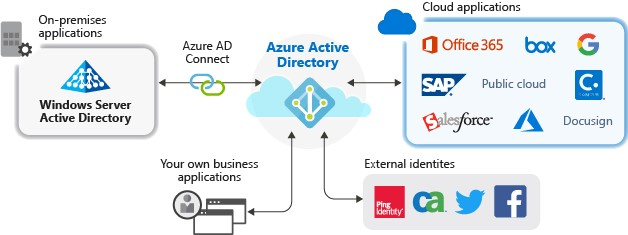
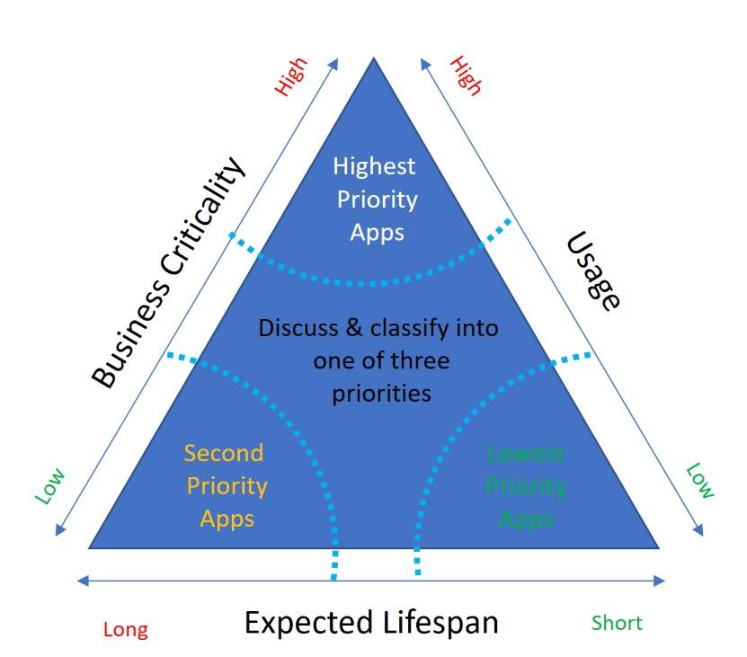

# Migrate application authentication to Azure Active Directory

## About this paper

This whitepaper details the planning for and benefits of migrating your application authentication to Azure AD. It is designed for Azure administrators and identity professionals.

Breaking the process into four phases, each with detailed planning and exit criteria, it is designed to help you plan your migration strategy and understand how Azure AD authentication supports your organizational goals.

## Introduction

Today, your organization requires a slew of applications (apps) for users to get work done. You likely continue to add, develop, or retire apps every day. Users access these applications from a vast range of corporate and personal devices, and locations. They open apps in many ways, including:

- through a company homepage or portal

- by bookmarking on their browsers

- via a vendor’s URL for software as a service (SaaS) apps

- links pushed directly to user’s desktops or mobile devices via a mobile device/application management (MDM/ MAM) solution

Your applications are likely using the following types of authentication:

- On-premises federation solutions (such as Active Directory Federation Services (ADFS) and Ping)

- Active Directory (such as Kerberos Auth and Windows-Integrated Auth)

- Other cloud-based identity and access management (IAM) solutions (such as Okta or Oracle)

- On-premises web infrastructure (such as IIS and Apache)

- Cloud-hosted infrastructure (such as Azure and AWS)

**To ensure that the users can easily and securely access applications, your goal is to have a single set of access controls and policies across your on-premises and cloud environments.**

[Azure Active Directory (Azure AD)](../fundamentals/active-directory-whatis.md) offers a universal identity platform that provides your people, partners, and customers a single identity to access the applications they want and collaborate from any platform and device.

Azure AD has a [full suite of identity management capabilities](../fundamentals/active-directory-whatis.md#which-features-work-in-azure-ad). Standardizing your app authentication and authorization to Azure AD enables you get the benefits these capabilities provide.

You can find more migration resources at [https://aka.ms/migrateapps](./migration-resources.md)

## Benefits of migrating app authentication to Azure AD

Moving app authentication to Azure AD will help you manage risk and cost, increase productivity, and address compliance and governance requirements.

### Manage risk

Safeguarding your apps requires that you have a full view of all the risk factors. Migrating your apps to Azure AD consolidates your security solutions. With it you can:

- Improve secure user access to applications and associated corporate data using [Conditional Access policies](../conditional-access/overview.md), [Multi-Factor Authentication](../authentication/concept-mfa-howitworks.md), and real-time risk-based [Identity Protection](../identity-protection/overview-identity-protection.md) technologies.

- Protect privileged user’s access to your environment with [Just-In-Time](../../azure-resource-manager/managed-applications/request-just-in-time-access.md) admin access.

- Use the [multi-tenant, geo-distributed, high availability design of Azure AD](https://cloudblogs.microsoft.com/enterprisemobility/2014/09/02/azure-ad-under-the-hood-of-our-geo-redundant-highly-available-distributed-cloud-directory/)for your most critical business needs.

- Protect your legacy applications with one of our [secure hybrid access partner integrations](https://aka.ms/secure-hybrid-access) that you may have already deployed.

### Manage cost

Your organization may have multiple Identity Access Management (IAM) solutions in place. Migrating to one Azure AD infrastructure is an opportunity to reduce dependencies on IAM licenses (on-premises or in the cloud) and infrastructure costs. In cases where you may have already paid for Azure AD via Microsoft 365 licenses, there is no reason to pay the added cost of another IAM solution.

**With Azure AD, you can reduce infrastructure costs by:**

- Providing secure remote access to on-premises apps using [Azure AD Application Proxy](../app-proxy/application-proxy.md).

- Decoupling apps from the on-prem credential approach in your tenant by [setting up Azure AD as the trusted universal identity provider](../hybrid/plan-connect-user-signin.md#choosing-the-user-sign-in-method-for-your-organization).

### Increase productivity

Economics and security benefits drive organizations to adopt Azure AD, but full adoption and compliance are more likely if users benefit too. With Azure AD, you can:

- Improve end-user [Single Sign-On (SSO)](./what-is-single-sign-on.md) experience through seamless and secure access to any application, from any device and any location.

- Use self-service IAM capabilities, such as [Self-Service Password Resets](../authentication/concept-sspr-howitworks.md) and [SelfService Group Management](../enterprise-users/groups-self-service-management.md).

- Reduce administrative overhead by managing only a single identity for each user across cloud and on-premises environments:

  - [Automate provisioning](../app-provisioning/user-provisioning.md) of user accounts (in [Azure AD Gallery](https://azuremarketplace.microsoft.com/marketplace/apps/category/azure-active-directory-apps))based on Azure AD identities
  - Access all your apps from MyApps panel in the [Azure portal](https://portal.azure.com/)

- Enable developers to secure access to their apps and improve the end-user experience by using the [Microsoft Identity Platform](../develop/v2-overview.md) with the Microsoft Authentication Library (MSAL).

- Empower your partners with access to cloud resources using [Azure AD B2B collaboration](../external-identities/what-is-b2b.md). Cloud resources remove the overhead of configuring point-to-point federation with your partners.

### Address compliance and governance

Ensure compliance with regulatory requirements by enforcing corporate access policies and monitoring user access to applications and associated data using integrated audit tools and APIs. With Azure AD, you can monitor application sign-ins through reports that use [Security Incident and Event Monitoring (SIEM) tools](../reports-monitoring/plan-monitoring-and-reporting.md). You can access the reports from the portal or APIs, and programmatically audit who has access to your applications and remove access to inactive users via access reviews.

## Plan your migration phases and project strategy

When technology projects fail, it is often due to mismatched expectations, the right stakeholders not being involved, or a lack of communication. Ensure your success by planning the project itself.

### The phases of migration

Before we get into the tools, you should understand how to think through the migration process. Through several direct-to-customer workshops, we recommend the following four phases:

### Assemble the project team

Application migration is a team effort, and you need to ensure that you have all the vital positions filled. Support from senior business leaders is important. Ensure that you involve the right set of executive sponsors, business decision-makers, and subject matter experts (SMEs.)

During the migration project, one person may fulfill multiple roles, or multiple people fulfill each role, depending on your organization’s size and structure. You may also have a dependency on other teams that play a key role in your security landscape.

The following table includes the key roles and their contributions:

| Role          | Contributions                                              |
| ------------- | ---------------------------------------------------------- |
| **Project Manager** | Project coach accountable for guiding the project, including:  - gain executive support  - bring in stakeholders  - manage schedules, documentation, and communications |
| **Identity Architect / Azure AD App Administrator** | They are responsible for the following:  - design the solution in cooperation with stakeholders  - document the solution design and operational procedures for handoff to the operations team  - manage the pre-production and production environments |
| **On premises AD operations team** | The organization that manages the different on-premises identity sources such as AD forests, LDAP directories, HR systems etc.  - perform any remediation tasks needed before synchronizing  - Provide the service accounts required for synchronization  - provide access to configure federation to Azure AD |
| **IT Support Manager** | A representative from the IT support organization who can provide input on the supportability of this change from a helpdesk perspective. |
| **Security Owner**  | A representative from the security team that can ensure that the plan will meet the security requirements of your organization. |
| **Application technical owners** | Includes technical owners of the apps and services that will integrate with Azure AD. They provide the applications’ identity attributes that should include in the synchronization process. They usually have a relationship with CSV representatives. |
| **Application business Owners** | Representative colleagues who can provide input on the user experience and usefulness of this change from a user’s perspective and owns the overall business aspect of the application, which may include managing access. |
| **Pilot group of users** | Users who will test as a part of their daily work, the pilot experience, and provide feedback to guide the rest of the deployments. |

### Plan communications

Effective business engagement and communication is the key to success. It is important to give stakeholders and end-users an avenue to get information and keep informed of schedule updates. Educate everyone about the value of the migration, what the expected timelines are, and how to plan for any temporary business disruption. Use multiple avenues such as briefing sessions, emails, one-to-one meetings, banners, and townhalls.

Based on the communication strategy that you have chosen for the app you may want to remind users of the pending downtime. You should also verify that there are no recent changes or business impacts that would require to postpone the deployment.

In the following table you will find the minimum suggested communication to keep your stakeholders informed:

**Plan phases and project strategy**:

| Communication      | Audience                                          |
| ------------------ | ------------------------------------------------- |
| Awareness and business / technical value of project | All except end users |
| Solicitation for pilot apps | - App business owners - App technical owners - Architects and Identity team |

**Phase 1- Discover and Scope**:

| Communication      | Audience                                          |
| ------------------ | ------------------------------------------------- |
| - Solicitation for application information - Outcome of scoping exercise | - App technical owners - App business owners |

**Phase 2- Classify apps and plan pilot**:

| Communication      | Audience                                          |
| ------------------ | ------------------------------------------------- |
| - Outcome of classifications and what that means for migration schedule - Preliminary migration schedule | - App technical owners  - App business owners |

**Phase 3 – Plan migration and testing**:

| Communication      | Audience                                          |
| ------------------ | ------------------------------------------------- |
| - Outcome of application migration testing | - App technical owners - App business owners |
| - Notification that migration is coming and explanation of resultant end-user experiences. - Downtime coming and complete communications, including what they should now do, feedback, and how to get help | - End users (and all others) |

**Phase 4 – Manage and gain insights**:

| Communication      | Audience                                          |
| ------------------ | ------------------------------------------------- |
| Available analytics and how to access | - App technical owners - App business owners |

### Migration states communication dashboard

Communicating the overall state of the migration project is crucial, as it shows progress, and helps app owners whose apps are coming up for migration to prepare for the move. You can put together a simple dashboard using Power BI or other reporting tools to provide visibility into the status of applications during the migration.

The migration states you might consider using are as follows:

| Migration states       | Action plan                                   |
| ---------------------- | --------------------------------------------- |
| **Initial Request** | Find the app and contact the owner for more information |
| **Assessment Complete** | App owner evaluates the app requirements and returns the app questionnaire</td>
| **Configuration in Progress** | Develop the changes necessary to manage authentication against Azure AD |
| **Test Configuration Successful** | Evaluate the changes and authenticate the app against the test Azure AD tenant in the test environment |
| **Production Configuration Successful** | Change the configurations to work against the production AD tenant and assess the app authentication in the test environment |
| **Complete / Sign Off** | Deploy the changes for the app to the production environment and execute the against the production Azure AD tenant |

This will ensure app owners know what the app migration and testing schedule are when their apps are up for migration, and what the results are from other apps that have already been migrated. You might also consider providing links to your bug tracker database for owners to be able to file and view issues for apps that are being migrated.

### Best practices

The following are our customer and partner’s success stories, and suggested best practices:

- [Five tips to improve the migration process to Azure Active Directory](https://techcommunity.microsoft.com/t5/Azure-Active-Directory-Identity/Five-tips-to-improve-the-migration-process-to-Azure-Active/ba-p/445364) by Patriot Consulting, a member of our partner network that focuses on helping customers deploy Microsoft cloud solutions securely.

- [Develop a risk management strategy for your Azure AD application migration](https://techcommunity.microsoft.com/t5/Azure-Active-Directory-Identity/Develop-a-risk-management-strategy-for-your-Azure-AD-application/ba-p/566488) by Edgile, a partner that focuses on IAM and risk management solutions.

## Phase 1: Discover and scope apps

**Application discovery and analysis is a fundamental exercise to give you a good start.** You may not know everything so be prepared to accommodate the unknown apps.

### Find your apps

The first decision point in an application migration is which apps to migrate, which if any should remain, and which apps to deprecate. There is always an opportunity to deprecate the apps that you will not use in your organization. There are several ways to find apps in your organization. **While discovering apps, ensure you are including in-development and planned apps. Use Azure AD for authentication in all future apps.**

**Using Active Directory Federation Services (AD FS) To gather a correct app inventory:**

- **Use Azure AD Connect Health.** If you have an Azure AD Premium license, we recommend deploying [Azure AD Connect Health](../hybrid/how-to-connect-health-adfs.md) to analyze the app usage in your on premises environment. You can use the [ADFS application report](./migrate-adfs-application-activity.md) (preview) to discover ADFS applications that can be migrated and evaluate the readiness of the application to be migrated. After completing your migration, deploy [Cloud Discovery](/cloud-app-security/set-up-cloud-discovery) that allows you to continuously monitor Shadow IT in your organization once you’re in the cloud.

- **AD FS log parsing**. If you don’t have Azure AD Premium licenses, we recommend using the ADFS to Azure AD app migration tools based on [PowerShell.](https://github.com/AzureAD/Deployment-Plans/tree/master/ADFS%20to%20AzureAD%20App%20Migration). Refer to [Solution guide](./migrate-adfs-apps-to-azure.md):

[Migrating apps from Active Directory Federation Services (AD FS) to Azure AD.](./migrate-adfs-apps-to-azure.md)

### Using other identity providers (IdPs)

For other identity providers (such as Okta or Ping), you can use their tools to export the application inventory. You may consider looking at service principles registered on Active Directory that correspond to the web apps in your organization.

### Using cloud discovery tools

In the cloud environment, you need rich visibility, control over data travel, and sophisticated analytics to find and combat cyber threats across all your cloud services. You can gather your cloud app inventory using the following tools:

- **Cloud Access Security Broker (CASB**) – A [CASB](/cloud-app-security/) typically works alongside your firewall to provide visibility into your employees’ cloud application usage and helps you protect your corporate data from cybersecurity threats. The CASB report can help you determine the most used apps in your organization, and the early targets to migrate to Azure AD.

- **Cloud Discovery** - By configuring [Cloud Discovery](/cloud-app-security/set-up-cloud-discovery), you gain visibility into the cloud app usage, and can discover unsanctioned or Shadow IT apps.

- **APIs** - For apps connected to cloud infrastructure, you can use the APIs and tools on those systems to begin to take an inventory of hosted apps. In the Azure environment:

  - Use the [Get-AzureWebsite](/powershell/module/servicemanagement/azure.service/get-azurewebsite) cmdlet to get information about Azure websites.

  - Use the [Get-AzureRMWebApp](/powershell/module/azurerm.websites/get-azurermwebapp) cmdlet to get information about your Azure Web Apps.
D
  - You can find all the apps running on Microsoft IIS from the Windows command line using [AppCmd.exe](/iis/get-started/getting-started-with-iis/getting-started-with-appcmdexe#working-with-sites-applications-virtual-directories-and-application-pools).

  - Use [Applications](/previous-versions/azure/ad/graph/api/entity-and-complex-type-reference#application-entity) and [Service Principals](/previous-versions/azure/ad/graph/api/entity-and-complex-type-reference#serviceprincipal-entity) to get you information on an app and app instance in a directory in Azure AD.

### Using manual processes

Once you have taken the automated approaches described above, you will have a good handle on your applications. However, you might consider doing the following to ensure you have good coverage across all user access areas:

- Contact the various business owners in your organization to find the applications in use in your organization.

- Run an HTTP inspection tool on your proxy server, or analyze proxy logs, to see where traffic is commonly routed.

- Review weblogs from popular company portal sites to see what links users access the most.

- Reach out to executives or other key business members to ensure that you have covered the business-critical apps.

### Type of apps to migrate

Once you find your apps, you will identify these types of apps in your organization:

- Apps that use modern authentication protocols already

- Apps that use legacy authentication protocols that you choose to modernize

- Apps that use legacy authentication protocols that you choose NOT to modernize

- New Line of Business (LoB) apps

### Apps that use modern authentication already

The already modernized apps are the most likely to be moved to Azure AD. These apps already use modern authentication protocols (such as SAML or OpenID Connect) and can be reconfigured to authenticate with Azure AD.

In addition to the choices in the [Azure AD app gallery,](https://azuremarketplace.microsoft.com/marketplace/apps/category/azure-active-directory-apps) these could be apps that already exist in your organization or any third-party apps from a vendor who is not a part of the Azure AD gallery ([non-gallery applications)](./add-application-portal.md).

Legacy apps that you choose to modernize

For legacy apps that you want to modernize, moving to Azure AD for core authentication and authorization unlocks all the power and data-richness that the [Microsoft Graph](https://developer.microsoft.com/graph/gallery/?filterBy=Samples,SDKs) and [Intelligent Security Graph](https://www.microsoft.com/security/operations/intelligence?rtc=1) have to offer.

We recommend **updating the authentication stack code** for these applications from the legacy protocol (such as Windows-Integrated Authentication, Kerberos Constrained Delegation, HTTP Headers-based authentication) to a modern protocol (such as SAML or OpenID Connect).

### Legacy apps that you choose NOT to modernize

For certain apps using legacy authentication protocols, sometimes modernizing their authentication is not the right thing to do for business reasons. These include the following types of apps:

- Apps kept on-premises for compliance or control reasons.

- Apps connected to an on-premises identity or federation provider that you do not want to change.

- Apps developed using on-premises authentication standards that you have no plans to move

Azure AD can bring great benefits to these legacy apps, as you can enable modern Azure AD security and governance features like [Multi-Factor Authentication](../authentication/concept-mfa-howitworks.md), [Conditional Access](../conditional-access/overview.md), [Identity Protection](../identity-protection/index.yml), [Delegated Application Access](./access-panel-manage-self-service-access.md), and [Access Reviews](../governance/manage-user-access-with-access-reviews.md#create-and-perform-an-access-review) against these apps without touching the app at all!

Start by **extending these apps into the cloud** with Azure AD [Application Proxy](../app-proxy/application-proxy-configure-single-sign-on-password-vaulting.md) using simple means of authentication (like Password Vaulting) to get your users migrated quickly, or via our [partner integrations](https://azure.microsoft.com/services/active-directory/sso/secure-hybrid-access/) with application delivery controllers you might have deployed already.

### New Line of Business (LoB) apps

You usually develop LoB apps for your organization’s in-house use. If you have new apps in the pipeline, we recommend using the [Microsoft Identity Platform](../develop/v2-overview.md) to implement OpenID Connect.

### Apps to deprecate

Apps without clear owners and clear maintenance and monitoring present a security risk for your organization. Consider deprecating applications when:

- their **functionality is highly redundant** with other systems • there is **no business owner**

- there is clearly **no usage**.

We recommend that you **do not deprecate high impact, business-critical applications**. In those cases, work with business owners to determine the right strategy.

### Exit criteria

You are successful in this phase with:

- A good understanding of the systems in scope for your migration (that you can retire once you have moved to Azure AD)

- A list of apps that includes:

  - What systems those apps connect to
  - From where and on what devices users access them
  - Whether they will be migrated, deprecated, or connected with [Azure AD Connect](../hybrid/whatis-azure-ad-connect.md).

> [!NOTE]
> You can download the [Application Discovery Worksheet](https://download.microsoft.com/download/2/8/3/283F995C-5169-43A0-B81D-B0ED539FB3DD/Application%20Discovery%20worksheet.xlsx) to record the applications that you want to migrate to Azure AD authentication, and those you want to leave but manage by using [Azure AD Connect](../hybrid/whatis-azure-ad-connect.md).

## Phase 2: Classify apps and plan pilot

Classifying the migration of your apps is an important exercise. Not every app needs to be migrated and transitioned at the same time. Once you have collected information about each of the apps, you can rationalize which apps should be migrated first and which may take added time.

### Classify in-scope apps

One way to think about this is along the axes of business criticality, usage, and lifespan, each of which is dependent on multiple factors.

### Business criticality

Business criticality will take on different dimensions for each business, but the two measures that you should consider are **features and functionality** and **user profiles**. Assign apps with unique functionality a higher point value than those with redundant or obsolete functionality.

### Usage

Applications with **high usage numbers** should receive a higher value than apps with low usage. Assign a higher value to apps with external, executive, or security team users. For each app in your migration portfolio, complete these assessments.

Once you have determined values for business criticality and usage, you can then determine the **application lifespan**, and create a matrix of priority. See one such matrix below:

### Prioritize apps for migration

You can choose to begin the app migration with either the lowest priority apps or the highest priority apps based on your organization’s needs.

In a scenario where you may not have experience using Azure AD and Identity services, consider moving your **lowest priority apps** to Azure AD first. This will minimize your business impact, and you can build momentum. Once you have successfully moved these apps and have gained the stakeholder’s confidence, you can continue to migrate the other apps.

If there is no clear priority, you should consider moving the apps that are in the [Azure AD Gallery](https://azuremarketplace.microsoft.com/marketplace/apps/category/azure-active-directory-apps) first and support multiple identity providers (ADFS or Okta) because they are easier to integrate. It is likely that these apps are the **highest-priority apps** in your organization. To help integrate your SaaS applications with Azure AD, we have developed a collection of [tutorials](../saas-apps/tutorial-list.md) that walk you through configuration.

When you have a deadline to migrate the apps, these highest priority apps bucket will take the major workload. You can eventually select the lower priority apps as they will not change the cost even though you have moved the deadline. Even if you must renew the license, it will be for a small amount.

In addition to this classification and depending on the urgency of your migration, you may also consider putting up a **migration schedule** within which app owners must engage to have their apps migrated. At the end of this process, you should have a list of all applications in prioritized buckets for migration.

### Document your apps

First, start by gathering key details about your applications. The [Application Discovery Worksheet](https://download.microsoft.com/download/2/8/3/283F995C-5169-43A0-B81D-B0ED539FB3DD/Application%20Discovery%20worksheet.xlsx)will help you to make your migration decisions quickly and get a recommendation out to your business group in no time at all.

Information that is important to making your migration decision includes:

- **App name** – what is this app known as to the business?

- **App type** – is it a third-party SaaS app? A custom line-of-business web app? An API?

- **Business criticality** – is its high criticality? Low? Or somewhere in between?

- **User access volume** – does everyone access this app or just a few people?

- **Planned lifespan** – how long will this app be around? Less than six months? More than two years?

- **Current identity provider** – what is the primary IdP for this app? Or does it rely on local storage?

- **Method of authentication** – does the app authenticate using open standards?

- **Whether you plan to update the app code** – is the app under planned or active development?

- **Whether you plan to keep the app on-premises** – do you want to keep the app in your datacenter long term?

- **Whether the app depends on other apps or APIs** – does the app currently call into other apps or APIs?

- **Whether the app is in the Azure AD gallery** – is the app currently already integrated with the [Azure AD Gallery](https://azuremarketplace.microsoft.com/marketplace/apps/category/azure-active-directory-apps)?

Other data that will help you later, but that you do not need to make an immediate migration decision includes:

- **App URL** – where do users go to access the app?

- **App description** – what is a brief description of what the app does?

- **App owner** – who in the business is the main POC for the app?

- **General comments or notes** – any other general information about the app or business ownership

Once you have classified your application and documented the details, then be sure to gain business owner buy-in to your planned migration strategy.

### Plan a pilot

The app(s) you select for the pilot should represent the key identity and security requirements of your organization, and you must have clear buy-in from the application owners. Pilots typically run in a separate test environment. See [best practices for pilots](../fundamentals/active-directory-deployment-plans.md#best-practices-for-a-pilot) on the deployment plans page.

**Don’t forget about your external partners.** Make sure that they participate in migration schedules and testing. Finally, ensure they have a way to access your helpdesk if there were breaking issues.

### Plan for limitations

While some apps are easy to migrate, others may take longer due to multiple servers or instances. For example, SharePoint migration may take longer due to custom sign in pages.

Many SaaS app vendors charge for changing the SSO connection. Check with them and plan for this.

Azure AD also has [service limits and restrictions](../enterprise-users/directory-service-limits-restrictions.md) you should be aware of.

### App owner sign-off

Business critical and universally used applications may need a group of pilot users to test the app in the pilot stage. Once you have tested an app in the pre-production or pilot environment, ensure that app business owners sign off on performance prior to the migration of the app and all users to production use of Azure AD for authentication.

### Plan the security posture

Before you initiate the migration process, take time to fully consider the security posture you wish to develop for your corporate identity system. This is based on gathering these valuable sets of information: **Identities, devices, and locations that are accessing your data.**

### Identities and data

Most organizations have specific requirements about identities and data protection that vary by industry segment and by job functions within organizations. Refer to [identity and device access configurations](/microsoft-365/enterprise/microsoft-365-policies-configurations) for our recommendations including a prescribed set of [conditional access policies](../conditional-access/overview.md) and related capabilities.

You can use this information to protect access to all services integrated with Azure AD. These recommendations are aligned with Microsoft Secure Score and the [identity score in Azure AD](../fundamentals/identity-secure-score.md). The score helps you to:

- Objectively measure your identity security posture

- Plan identity security improvements

- Review the success of your improvements

This will also help you implement the [five steps to securing your identity  infrastructure](../../security/fundamentals/steps-secure-identity.md). Use the guidance as a starting point for your organization and adjust the policies to meet your organization's specific requirements.

### Who is accessing your data?

There are two main categories of users of your apps and resources that Azure AD supports:

- **Internal:** Employees, contractors, and vendors that have accounts within your identity provider. This might need further pivots with different rules for managers or leadership versus other employees.

- **External:** Vendors, suppliers, distributors, or other business partners that interact with your organization in the regular course of business with [Azure AD B2B collaboration.](../external-identities/what-is-b2b.md)

You can define groups for these users and populate these groups in diverse ways. You may choose that an administrator must manually add members into a group, or you can enable selfservice group membership. Rules can be established that automatically add members into groups based on the specified criteria using [dynamic groups](../enterprise-users/groups-dynamic-membership.md).

External users may also refer to customers. [Azure AD B2C](../../active-directory-b2c/overview.md), a separate product supports customer authentication. However, it is outside the scope of this paper.

### Device/location used to access data

The device and location that a user uses to access an app are also important. Devices physically connected to your corporate network are more secure. Connections from outside the network over VPN may need scrutiny.

With these aspects of resource, user, and device in mind, you may choose to use [Azure AD Conditional Access](../conditional-access/overview.md) capabilities. Conditional access goes beyond user permissions: it is based on a combination of factors, such as the identity of a user or group, the network that the user is connected to, the device and application they are using, and the type of data they are trying to access. The access granted to the user adapts to this broader set of conditions.

### Exit criteria

You are successful in this phase when you:

- Know your apps
  - Have fully documented the apps you intend to migrate
  - Have prioritized apps based on business criticality, usage volume, and lifespan

- Have selected apps that represent your requirements for a pilot

- Business-owner buy-in to your prioritization and strategy

- Understand your security posture needs and how to implement them

## Phase 3: Plan migration and testing

Once you have gained business buy-in, the next step is to start migrating these apps to Azure AD authentication.

### Migration tools and guidance

Use the tools and guidance below to follow the precise steps needed to migrate your applications to Azure AD:

- **General migration guidance** – Use the whitepaper, tools, email templates, and applications questionnaire in the [Azure AD apps migration toolkit](./migration-resources.md) to discover, classify, and migrate your apps.

- **SaaS applications** – See our list of [hundreds of SaaS app tutorials](../saas-apps/tutorial-list.md) and the complete [Azure AD SSO deployment plan](https://aka.ms/ssodeploymentplan) to walk through the end-to-end process.

- **Applications running on-premises** – Learn all [about the Azure AD Application Proxy](../app-proxy/application-proxy.md) and use the complete [Azure AD Application Proxy deployment plan](https://aka.ms/AppProxyDPDownload) to get going quickly.

- **Apps you’re developing** – Read our step-by-step [integration](../develop/quickstart-register-app.md) and [registration](../develop/quickstart-register-app.md) guidance.

After migration, you may choose to send communication informing the users of the successful deployment and remind them of any new steps that they need to take.

### Plan testing

During the process of the migration, your app may already have a test environment used during regular deployments. You can continue to use this environment for migration testing. If a test environment is not currently available, you may be able to set one up using Azure App Service or Azure Virtual Machines, depending on the architecture of the application. You may choose to set up a separate test Azure AD tenant to use as you develop your app configurations. This tenant will start in a clean state and will not configured to sync with any system.

You can test each app by logging in with a test user and make sure all functionality is the same as prior to the migration. If you determine during testing that users will need to update their [MFA](../authentication/howto-mfa-userstates.md) or [SSPR](../authentication/tutorial-enable-sspr.md)settings, or you are adding this functionality during the migration, be sure to add that to your end-user communication plan. See [MFA](https://aka.ms/mfatemplates) and [SSPR](https://aka.ms/ssprtemplates) end-user communication templates.

Once you have migrated the apps, go to the [Azure portal](https://aad.portal.azure.com/) to test if the migration was a success. Follow the instructions below:

- Select **Enterprise Applications &gt; All applications** and find your app from the list.

- Select **Manage &gt; Users and groups** to assign at least one user or group to the app.

- Select **Manage &gt; Conditional Access**. Review your list of policies and ensure that you are not blocking access to the application with a [conditional access policy](../conditional-access/overview.md).

Depending on how you configure your app, verify that SSO works properly.

| Authentication type      | Testing                                             |
| ------------------------ | --------------------------------------------------- |
| **OAuth / OpenID Connect** | Select **Enterprise applications &gt; Permissions** and ensure you have consented to the application to be used in your organization in the user settings for your app. |
| **SAML-based SSO** | Use the [Test SAML Settings](./debug-saml-sso-issues.md) button found under **Single Sign-On.** |
| **Password-Based SSO** | Download and install the [MyApps Secure Sign-in Extension](../user-help/my-apps-portal-end-user-access.md#download-and-install-the-my-apps-secure-sign-in-extension). This extension helps you start any of your organization's cloud apps that require you to use an SSO process. |

| **[Application Proxy](../app-proxy/application-proxy.md)** | Ensure your connector is running and assigned to your application. Visit the [Application Proxy troubleshooting guide](../app-proxy/application-proxy-troubleshoot.md) for further assistance. |

### Troubleshoot

If you run into problems, check out our [apps troubleshooting guide](../app-provisioning/isv-automatic-provisioning-multi-tenant-apps.md) to get help. You can also check out our troubleshooting articles, see [Problems signing in to SAML-based single sign-on configured apps](/troubleshoot/azure/active-directory/troubleshoot-sign-in-saml-based-apps).

### Plan rollback

If your migration fails, the best strategy is to roll back and test. Here are the steps that you can take to mitigate migration issues:

- **Take screenshots** of the existing configuration of your app. You can look back if you must reconfigure the app once again.

- You might also consider **providing links to the legacy authentication**, if there was issues with cloud authentication.

- Before you complete your migration, **do not change your existing configuration** with the earlier identity provider.

- Begin by migrating **the apps that support multiple IdPs**. If something goes wrong, you can always change to the preferred IdP’s configuration.

- Ensure that your app experience has a **Feedback button** or pointers to your **helpdesk** issues.

### Exit criteria

You are successful in this phase when you have:

- Determined how each app will be migrated

- Reviewed the migration tools

- Planned your testing including test environments and groups

- Planned rollback

## Phase 4: Plan management and insights

Once apps are migrated, you must ensure that:

- Users can securely access and manage

- You can gain the appropriate insights into usage and app health

We recommend taking the following actions as appropriate to your organization.

### Manage your users’ app access

Once you have migrated the apps, you can enrich your user’s experience in many ways

**Make apps discoverable**

**Point your user** to the [MyApps](../user-help/my-apps-portal-end-user-access.md#download-and-install-the-my-apps-secure-sign-in-extension)portal experience. Here, they can access all cloud-based apps, apps you make available by using [Azure AD Connect](../hybrid/whatis-azure-ad-connect.md), and apps using [Application Proxy](../app-proxy/application-proxy.md) provided they have permissions to access those apps.

You can guide your users on how to discover their apps:

- Use the [Existing Single Sign-on](./view-applications-portal.md) feature to **link your users to any app**

- Enable [Self-Service Application Access](./manage-self-service-access.md)to an app and **let users add apps that you curate**

- [Hide applications from end-users](./hide-application-from-user-portal.md) (default Microsoft apps or other apps) to **make the apps they do need more discoverable**

### Make apps accessible

**Let users access apps from their mobile devices**. Users can access the MyApps portal with Intune-managed browser on their [iOS](./hide-application-from-user-portal.md) 7.0 or later or [Android](./hide-application-from-user-portal.md) devices.

Users can download an **Intune-managed browser**:

- **For Android devices**, from the [Google play store](https://play.google.com/store/apps/details?id=com.microsoft.intune)

- **For Apple devices**, from the [Apple App Store](https://apps.apple.com/us/app/intune-company-portal/id719171358) or they can download the [My Apps mobile app for iOS ](https://appadvice.com/app/my-apps-azure-active-directory/824048653)

**Let users open their apps from a browser extension.**

Users can [download the MyApps Secure Sign-in Extension](https://www.microsoft.com/p/my-apps-secure-sign-in-extension/9pc9sckkzk84?rtc=1&activetab=pivot%3Aoverviewtab) in [Chrome,](https://chrome.google.com/webstore/detail/my-apps-secure-sign-in-ex/ggjhpefgjjfobnfoldnjipclpcfbgbhl) [FireFox,](https://addons.mozilla.org/firefox/addon/access-panel-extension/) or [Microsoft Edge](https://www.microsoft.com/p/my-apps-secure-sign-in-extension/9pc9sckkzk84?rtc=1&activetab=pivot%3Aoverviewtab) and can launch apps right from their browser bar to:

- **Search for their apps and have their most-recently-used apps appear**

- **Automatically convert internal URLs** that you have configured in [Application Proxy](../app-proxy/application-proxy.md) to the appropriate external URLs. Your users can now work with the links they are familiar with no matter where they are.

**Let users open their apps from Office.com.**

Users can go to [Office.com](https://www.office.com/) to **search for their apps and have their most-recently-used apps appear** for them right from where they do work.

### Secure app access

Azure AD provides a centralized access location to manage your migrated apps. Go to the [Azure portal](https://portal.azure.com/) and enable the following capabilities:

- **Secure user access to apps.** Enable [Conditional Access policies](../conditional-access/overview.md)or [Identity Protection](../identity-protection/overview-identity-protection.md)to secure user access to applications based on device state, location, and more.

- **Automatic provisioning.** Set up [automatic provisioning of users](../app-provisioning/user-provisioning.md) with various third-party SaaS apps that users need to access. In addition to creating user identities, it includes the maintenance and removal of user identities as status or roles change.

- **Delegate user access** **management**. As appropriate, enable self-service application access to your apps and *assign a business approver to approve access to those apps*. Use [Self-Service Group Management](../enterprise-users/groups-self-service-management.md)for groups assigned to collections of apps.

- **Delegate admin access.** using **Directory Role** to assign an admin role (such as Application administrator, Cloud Application administrator, or Application developer) to your user.

### Audit and gain insights of your apps

You can also use the [Azure portal](https://portal.azure.com/) to audit all your apps from a centralized location,

- **Audit your app** using **Enterprise Applications, Audit**, or access the same information from the [Azure AD Reporting API](../reports-monitoring/concept-reporting-api.md) to integrate into your favorite tools.

- **View the permissions for an app** using **Enterprise Applications, Permissions** for apps using OAuth / OpenID Connect.

- **Get sign-in insights** using **Enterprise Applications, Sign-Ins**. Access the same information from the [Azure AD Reporting API.](../reports-monitoring/concept-reporting-api.md)

- **Visualize your app’s usage** from the [Azure AD Power BI content pack](../reports-monitoring/howto-use-azure-monitor-workbooks.md)

### Exit criteria

You are successful in this phase when you:

- Provide secure app access to your users

- Manage to audit and gain insights of the migrated apps

### Do even more with deployment plans

Deployment plans walk you through the business value, planning, implementation steps, and management of Azure AD solutions, including app migration scenarios. They bring together everything that you need to start deploying and getting value out of Azure AD capabilities. The deployment guides include content such as Microsoft recommended best practices, end-user communications, planning guides, implementation steps, test cases, and more.

Many [deployment plans](../fundamentals/active-directory-deployment-plans.md) are available for your use, and we’re always making more!

### Contact support

Visit the following support links to create or track support ticket and monitor health.

- **Azure Support:** You can call [Microsoft Support](https://azure.microsoft.com/support) and open a ticket for any Azure

Identity deployment issue depending on your Enterprise Agreement with Microsoft.

- **FastTrack**: If you have purchased Enterprise Mobility and Security (EMS) or Azure AD Premium licenses, you are eligible to receive deployment assistance from the [FastTrack program.](/enterprise-mobility-security/solutions/enterprise-mobility-fasttrack-program)

- **Engage the Product Engineering team:** If you are working on a major customer deployment with millions of users, you are entitled to support from the Microsoft account team or your Cloud Solutions Architect. Based on the project’s deployment complexity, you can work directly with the [Azure Identity Product Engineering team.](https://aad.portal.azure.com/#blade/Microsoft_Azure_Marketplace/MarketplaceOffersBlade/selectedMenuItemId/solutionProviders)

- **Azure AD Identity blog:** Subscribe to the [Azure AD Identity blog](https://techcommunity.microsoft.com/t5/Azure-Active-Directory-Identity/bg-p/Identity) to stay up to date with all the latest product announcements, deep dives, and roadmap information provided directly by the Identity engineering team.
