---

title: Tutorial to migrate your applications from Okta to Azure Active Directory
titleSuffix: Active Directory
description: Learn how to migrate your applications from Okta to Azure Active Directory
services: active-directory
author: gargi-sinha
manager: martinco

ms.service: active-directory
ms.workload: identity
ms.topic: how-to
ms.date: 08/10/2021
ms.author: gasinh
ms.subservice: app-mgmt
---

# Tutorial: Migrate your applications from Okta to Azure Active Directory

In this tutorial, learn how to migrate your applications from Okta to Azure Active Directory (Azure AD).

## Create an inventory of current Okta applications

When converting Okta applications to Azure AD, it's recommended to first document the current environment and application settings before migration.

Okta offers an API that can be used to collect this information from a centralized location. To use the API, an API explorer tool such as [Postman](https://www.postman.com/) is required.

Follow these steps to create an application inventory:

1. Install the Postman app. Post-installation, generate an API token from the Okta admin console.

2. Navigate to the API dashboard under the Security section, select **Tokens** > **Create Token**

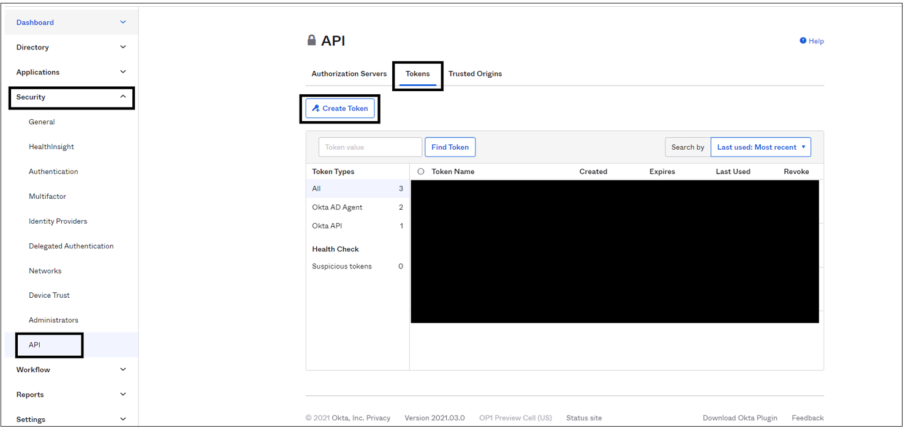

3. Insert a token name and then select **Create Token**.

4. After selecting **Create Token** record the value and save it, as it won;t be accessible after selecting **Ok, got it**.

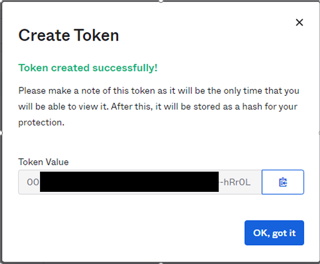

5. Once you've recorded the API token, return to the Postman app, and select **Import** under the workspace.

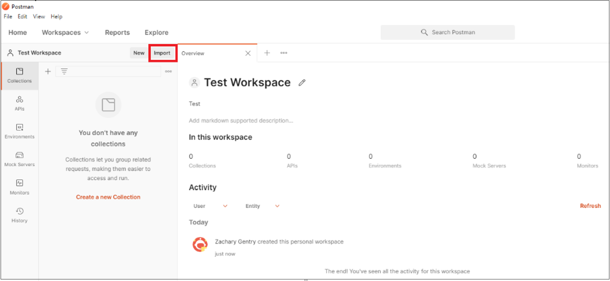

6. In the Import page, select **link**, and use the following link to import the API:
<https://developer.okta.com/docs/api/postman/example.oktapreview.com.environment>

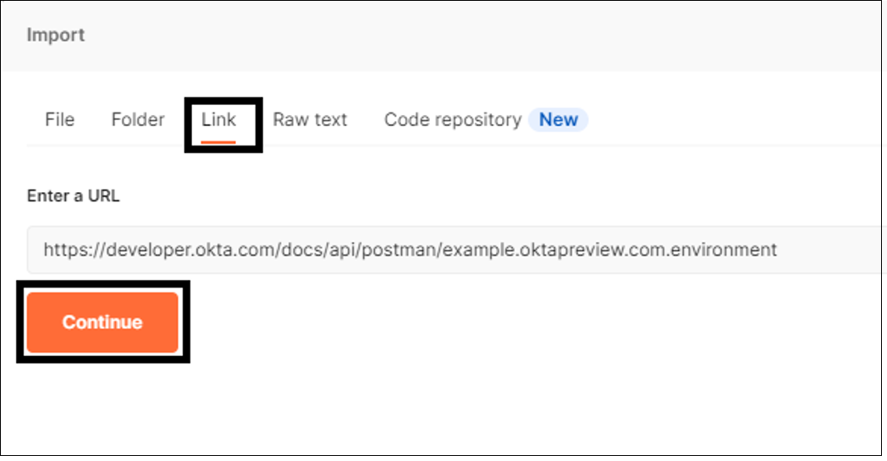

>[!NOTE]
>Do not modify the link with your tenant values.

7. Continue through the next menu by selecting **Import**.

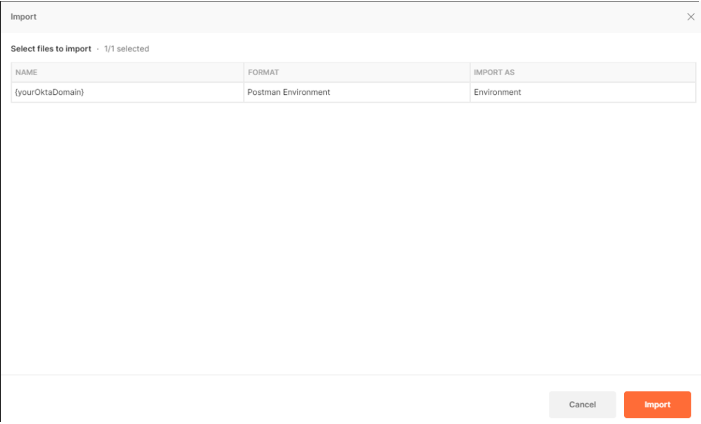

8. Once imported, change the Environment selection to **{yourOktaDomain}**

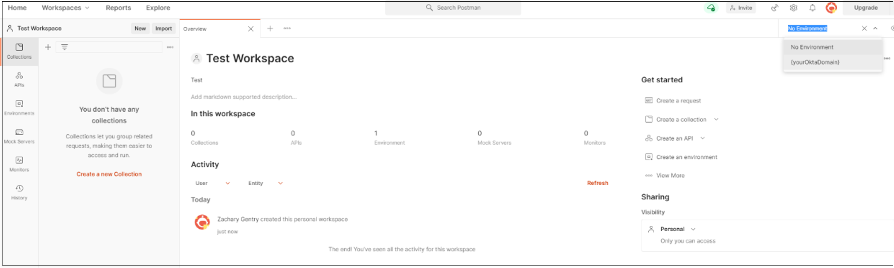

9. After changing the Environment selection, edit your Okta environment by selecting the eye, followed by **Edit**.

10. Update the values for URL and API key in both the **Initial Value** and **Current Value** fields also changing the name to reflect your environment, then save the values.

11. After saving the API key, [load the apps API into Postman](https://app.getpostman.com/run-collection/377eaf77fdbeaedced17).

12. Once the API has been loaded into Postman, select the **Apps** dropdown, followed by the **Get List Apps** and then select **Send**.

Now you can print all the applications in your Okta tenant to a JSON format.

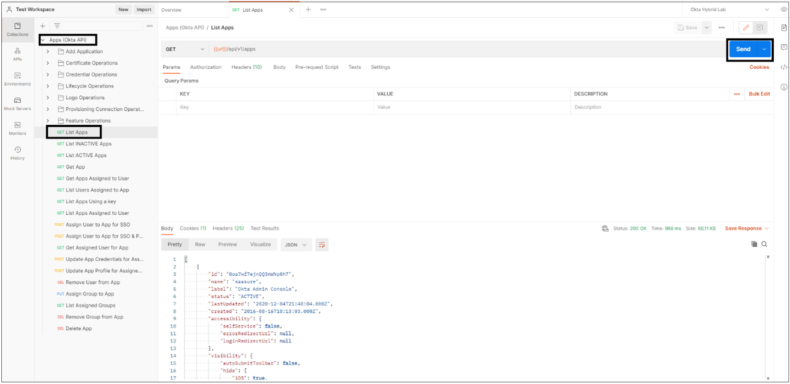

It's recommended to copy and convert this JSON list to CSV using a public converter such as <https://konklone.io/json/> or PowerShell using [ConvertFrom-Json](https://docs.microsoft.com/powershell/module/microsoft.powershell.utility/convertfrom-json?view=powershell-7.1)
and [ConvertTo-CSV.](https://docs.microsoft.com/powershell/module/microsoft.powershell.utility/convertto-csv?view=powershell-7.1)

After Downloading the CSV, the applications in your Okta tenant have been recorded successfully for future reference.

## Migrate a SAML application to Azure AD

To migrate a SAML 2.0 application to Azure AD, first configure the application in your Azure AD tenant for application access. In this example, we'll be converting a Salesforce instance. Follow [this tutorial](https://docs.microsoft.com/azure/active-directory/saas-apps/salesforce-tutorial) to onboard the applications.

To complete the migration process, repeat configuration steps for all applications discovered in the Okta tenant.

1. Navigate to [Azure AD portal](https://aad.portal.azure.com), and select **Azure Active Directory** > **Enterprise Applications** > **New Application**.

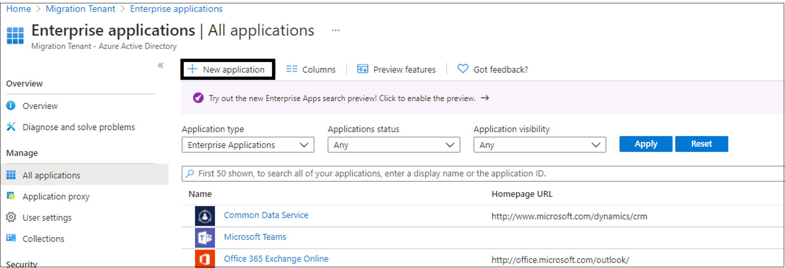

2. Salesforce is available in the Azure AD gallery. Search for salesforce, select the application and then select **Create**.

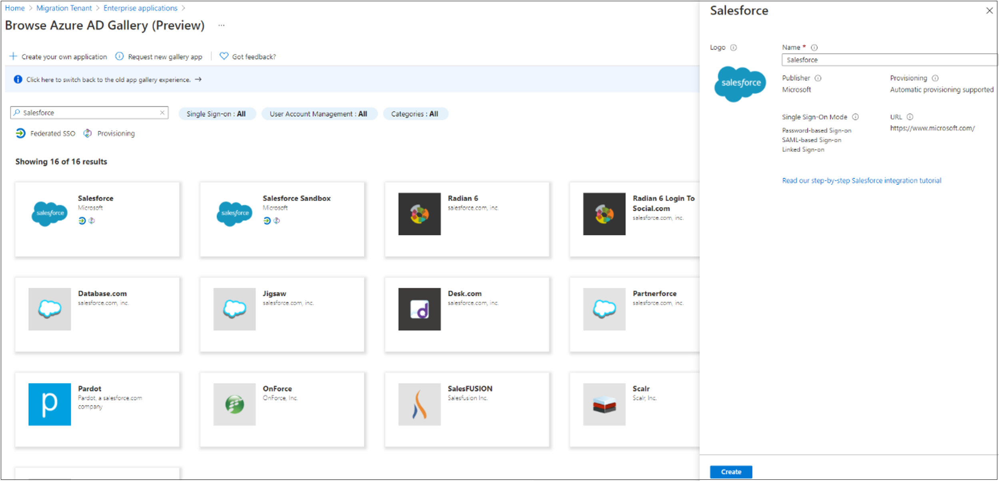

3. Once the application has been created, navigate to the **Single sign-on** (SSO) tab and select **SAML**.

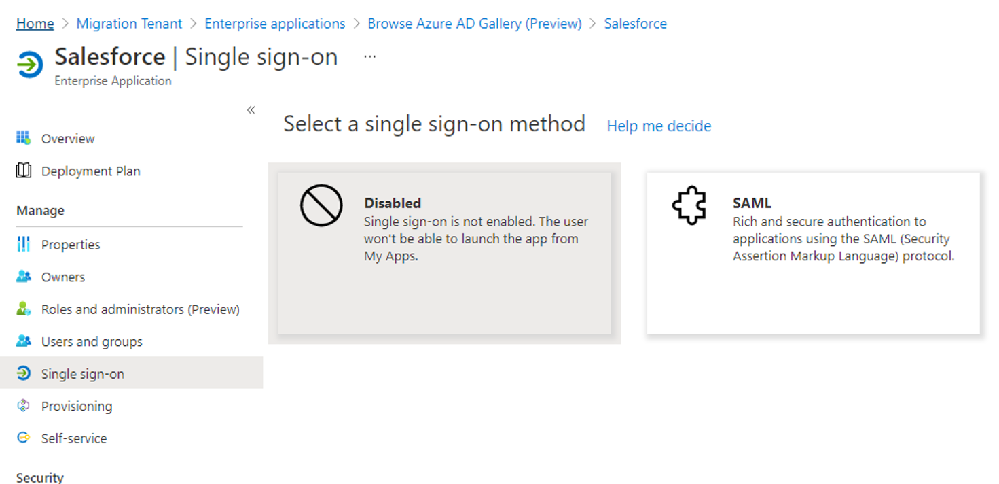

4. After selecting SAML, download the **Federation Metadata XML and Certificate (Raw)** for import into Salesforce.

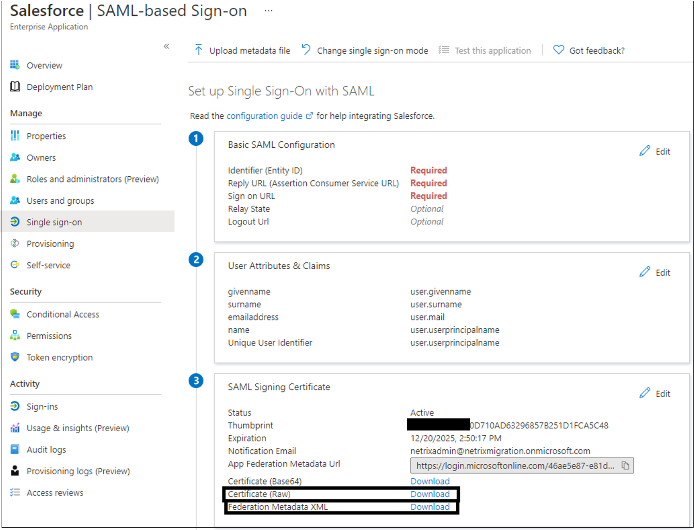

5. Once the XML has been captured, navigate to the Salesforce Admin console, and then select **Identity** > **Single sign-on
Settings** > **New from Metadata File**

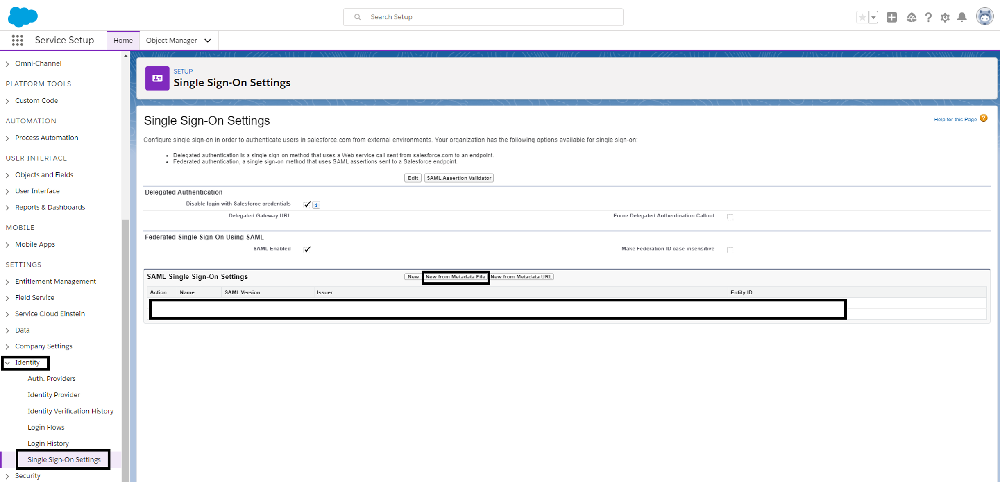

6. Upload the XML file downloaded from the Azure AD portal, followed by **Create**.

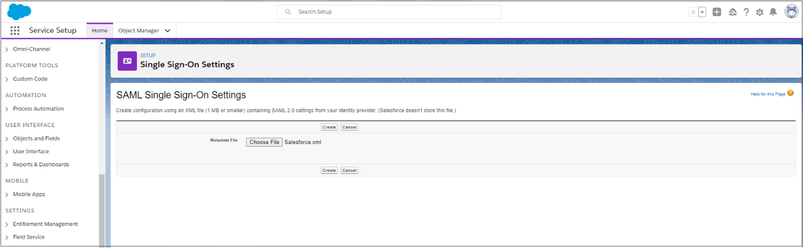

7. Upload the Certificate downloaded from Azure, and then continue to select **Save** in the next menu to create the SAML provider in Salesforce.

8. Record the following values for use in Azure - **Entity ID**, **Login URL**, and **Logout URL** and select the option to **Download Metadata**.

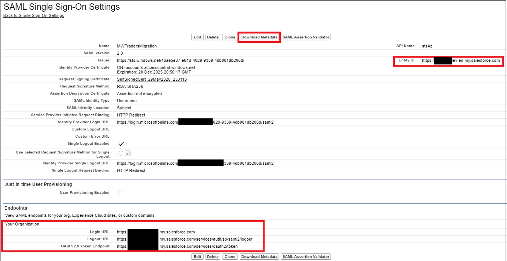

9. Return to the Azure AD Enterprise Applications menu and **Upload metadata file** into Azure AD portal in the SAML SSO settings. Confirm the imported values match the recorded values before saving.

10. Once the SSO configuration has been saved, return to the Salesforce administration console and select **Company Settings** > **My Domain**. Navigate to the **Authentication Configuration** and select **Edit**.

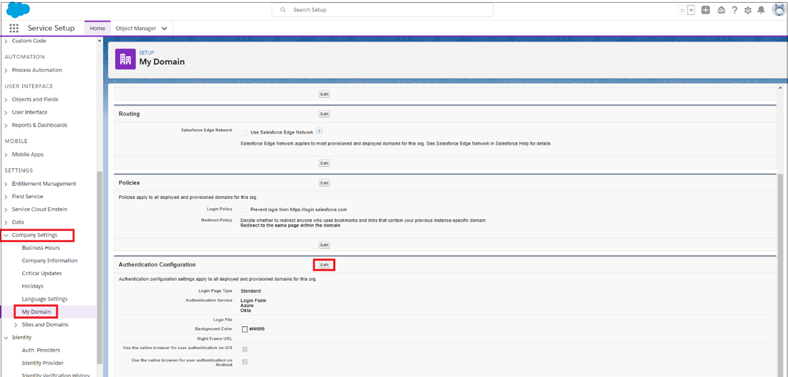

11. Select the new SAML provider configured in previous steps as an available sign-in option and select **Save**.

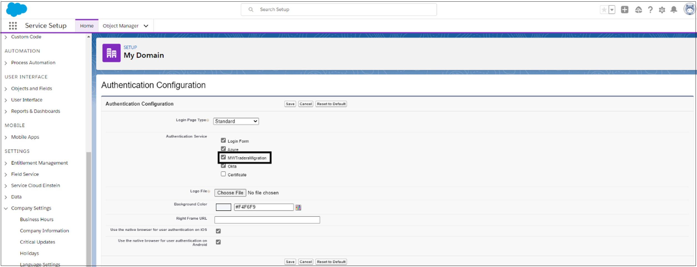

12. Return to the Enterprise Application in Azure AD, select **Users and Groups**, and add **test users**.

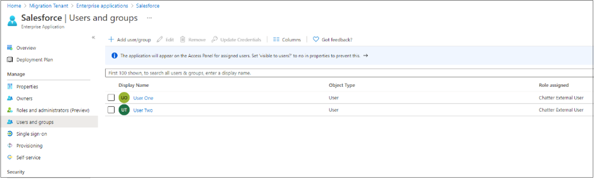

13. To test, sign in as one of the test users and navigate to
<https://aka.ms/myapps> and select the **Salesforce** tile.

14. After selecting the Salesforce tile, select the newly configured Identity Provider (IdP) to sign in.

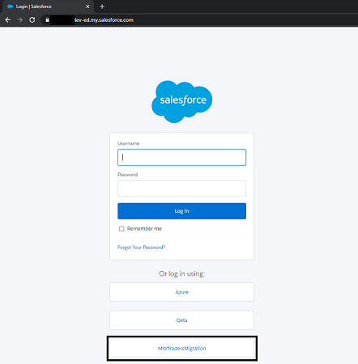

15. If everything has been correctly configured, the user will land at the Salesforce homepage. If there are any issues follow the [debugging guide](https://docs.microsoft.com/azure/active-directory/manage-apps/debug-saml-sso-issues).

16. After testing the SSO connection from Azure, return to the enterprise application and assign the remaining users to the Salesforce application with the correct roles.

>[!NOTE]
>After adding the remaining users to the Azure AD application, it is recommended to have users test the connection and ensure there are no issues with access prior to moving on to the next step.

17. Once users have confirmed there are no issues with signing in, return to the Salesforce administration console and select **Company Settings** > **My Domain**.

18. Navigate to the **Authentication Configuration**, select **Edit** and deselect Okta as an authentication service.

Salesforce has now been successfully configured to Azure AD for
SSO. Steps to clean up the Okta portal will be included later in this document.

## Migrate an OIDC/OAuth 2.0 application to Azure AD

First configure the application in your Azure AD tenant for application access. In this example, we'll be converting a custom OIDC app.

To complete the migration process, repeat configuration steps for all applications discovered in the Okta tenant.

1. Navigate to [Azure AD Portal](https://aad.portal.azure.com), and select **Azure Active Directory** > **Enterprise Applications**. Under the **All Applications** menu, select **New Application**.

2. Select **Create your own application**. On the side menu that pops up, give the OIDC app a name and select the radial for **Register an application you're working on to integrate with Azure AD** and then select **Create**.

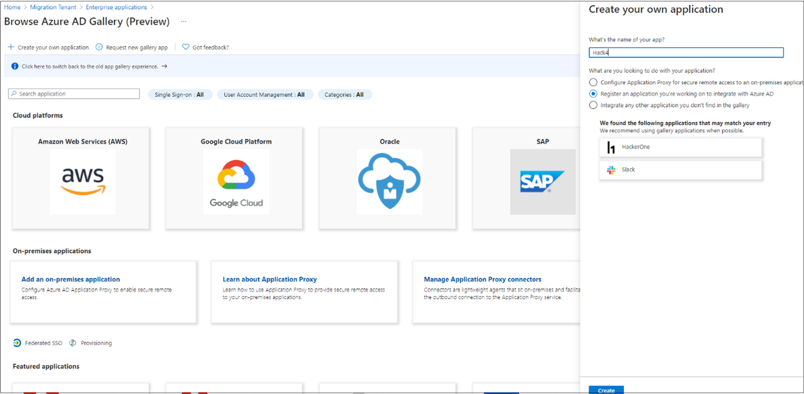

3. On the next page, you'll be presented with a choice about tenancy of your application registration. See [this article](https://docs.microsoft.com/azure/active-directory/develop/single-and-multi-tenant-apps) for details.

In this example, we are selecting **Accounts in any organizational
directory**, any Azure AD directory **Multitenant** followed by **Register**.

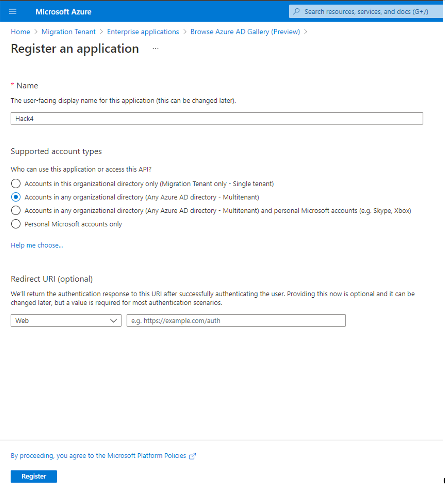

4. After registering the application, navigate to the **App Registrations** page under **Azure Active Directory**, and open the newly created registration.

Depending on the [application scenario,](https://docs.microsoft.com/azure/active-directory/develop/authentication-flows-app-scenarios) various configuration actions
might be needed. As most scenarios require App Client Secret, we'll cover those examples.

5. On the **Overview** page, record the Application (client) ID for use in your application later.

6. After recording the Application ID, select **Certificates & Secrets** on the left menu. Select **New Client Secret** and give it a name and set its expiration accordingly.

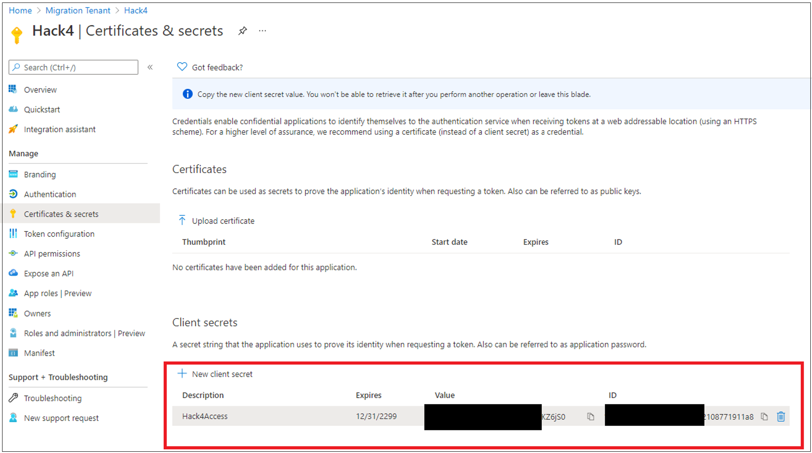

7. Record the value and ID of the secret before leaving this page.

>[!NOTE]
>You will not be able to record this information later and will instead have to regenerate a secret if lost.

8. After recording the information from the steps above, select **API Permissions** on the left, and grant the application access to the OIDC stack.

9. Select **Add Permission** followed by **Microsoft Graph** and **Delegated Permissions**.

10. From the **OpenId permissions** section, add email, OpenID, and profile, and then select **Add permissions**.

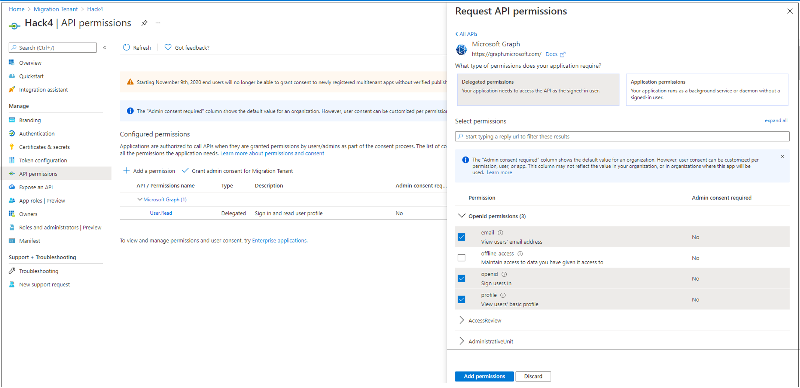

11. After adding the permissions, to improve user experience and suppress user consent prompts, select the **Grant admin consent for Tenant Domain Name** option and wait for the **Granted** status to appear.

12. If your application has a redirect URI, or reply URL navigates to the **Authentication** tab, followed by **Add a platform** and **Web**, enter the appropriate URL, followed by selecting Access Tokens, and ID tokens at the bottom, before selecting **Configure**.

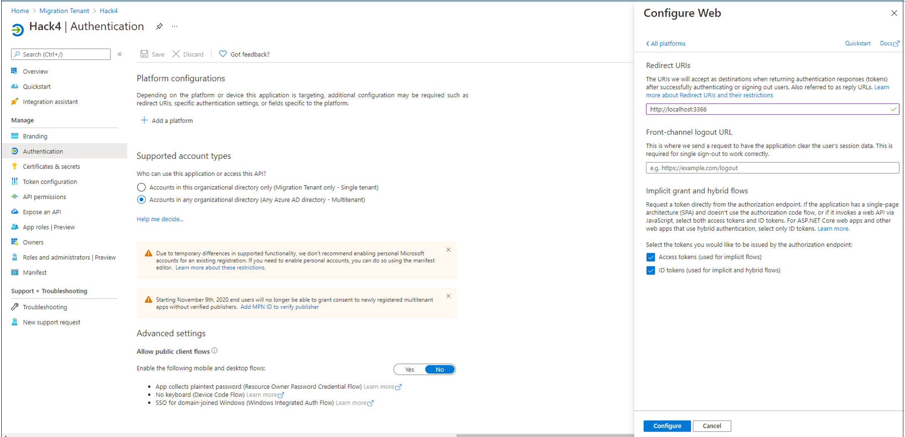

If necessary, under **Advanced** settings in the Authentication menu, flip **Allow public client flows** to yes.

13. Return to your OIDC configured application, and import the application ID, and client secret into your application before testing. Configure your application  to use the above configuration such as clientID, secret, and scopes.

## Migrate a custom authorization server to Azure AD

Okta authorization servers map one-to-one to application registrations that [expose an API](https://docs.microsoft.com/azure/active-directory/develop/quickstart-configure-app-expose-web-apis#add-a-scope).

Default Okta authorization server should be mapped to Microsoft Graph scopes/permissions.

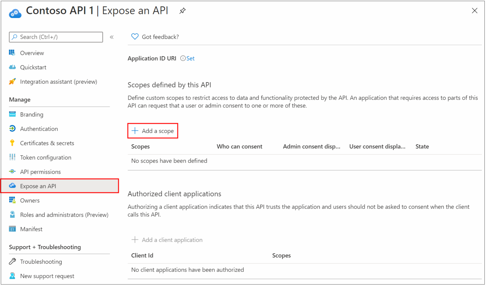

## Next steps

- [Migrate Okta federation to Azure AD](migrate-okta-federation-to-azure-active-directory.md)

- [Migrate Okta sync provisioning to Azure AD Connect based synchronization](migrate-okta-sync-provisioning-to-azure-active-directory-connect-based-synchronization.md)

- [Migrate Okta sign on policies to Azure AD Conditional Access](migrate-okta-sign-on-policies-to-azure-active-directory-conditional-access.md)
