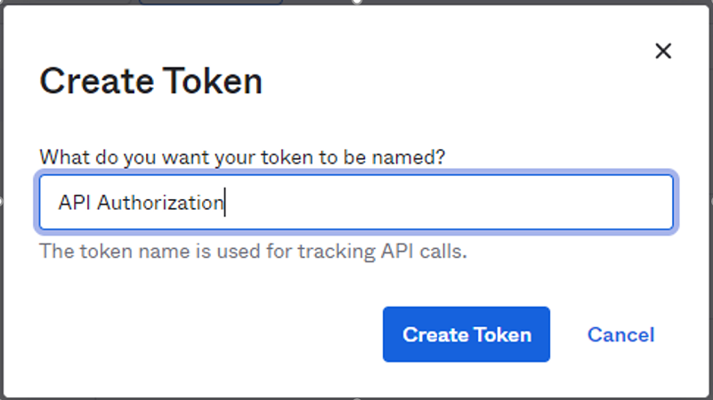
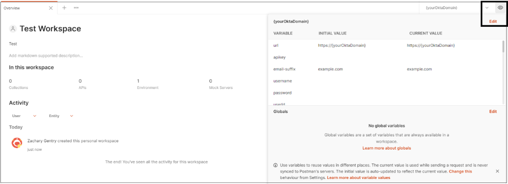
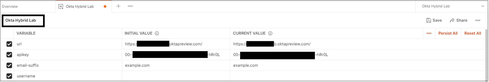
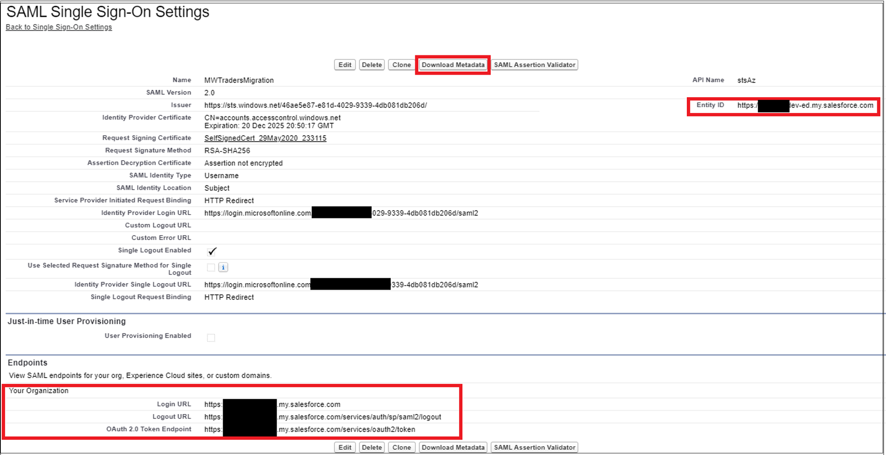
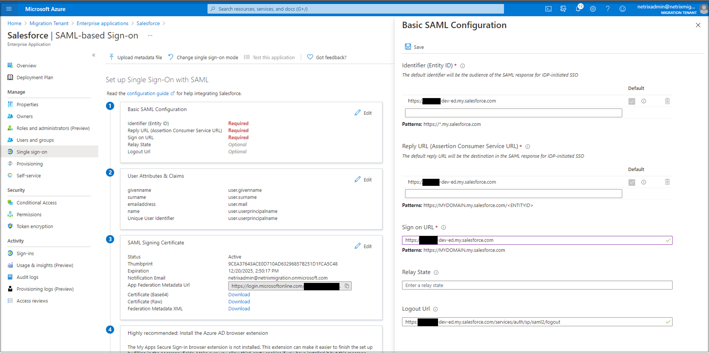
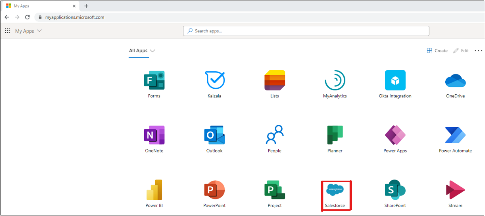
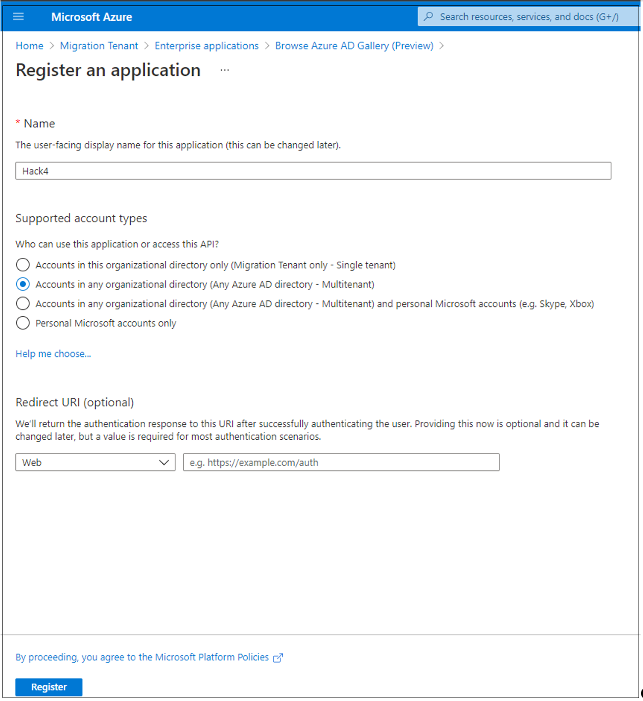
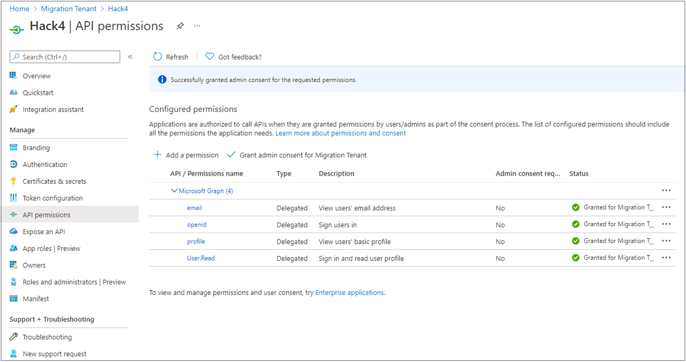
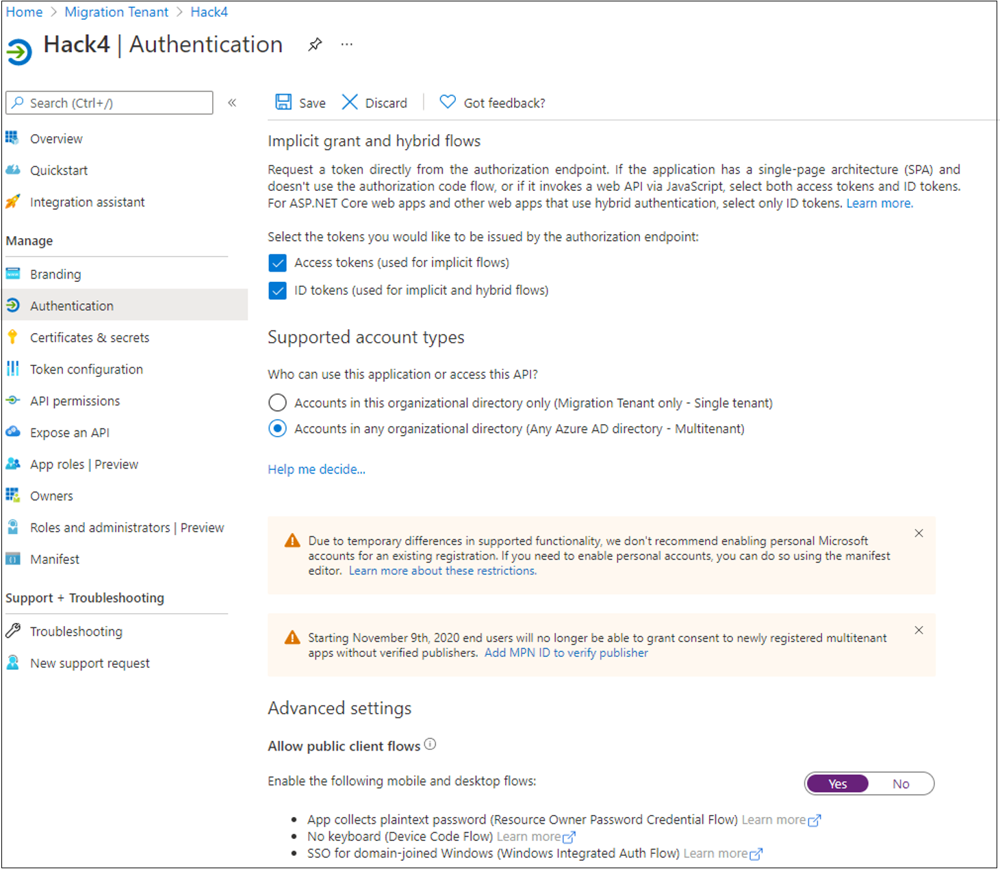

---

title: Tutorial to migrate your applications from Okta to Azure Active Directory
description: Learn how to migrate your applications from Okta to Azure Active Directory.
services: active-directory
author: gargi-sinha
manager: martinco
ms.service: active-directory
ms.workload: identity
ms.topic: how-to
ms.date: 12/14/2022
ms.author: gasinh
ms.subservice: app-mgmt
ms.custom: not-enterprise-apps
---

# Tutorial: Migrate your applications from Okta to Azure Active Directory 

In this tutorial, you'll learn how to migrate your applications from Okta to Azure Active Directory (Azure AD).

## Create an inventory of current Okta applications

Before migration, document the current environment and application settings. You can use the Okta API to collect this information. Use an API explorer tool such as [Postman](https://www.postman.com/).

To create an application inventory:

1. With the Postman app, from the Okta admin console, generate an API token.
2. On the API dashboard, under **Security**, select **Tokens** > **Create Token**.

    

3. Enter a token name and then select **Create Token**.

    

4. Record the token value and save it. After you select **OK, got it**, it is not accessible.

    

5. In the Postman app, in the workspace, select **Import**.

    

6. On the **Import** page, select **Link**. To import the API, insert the following link:

`https://developer.okta.com/docs/api/postman/example.oktapreview.com.environment`

   

>[!NOTE]
>Don't modify the link with your tenant values.

7. Select **Import**.

    

8. After the API is imported, change the **Environment** selection to **{yourOktaDomain}**.
9. To edit your Okta environment select the **eye** icon. Then select **Edit**.

    

10. In the **Initial Value** and **Current Value** fields, update the values for the URL and API key. Change the name to reflect your environment. 
11. Save the values.

     

12. [Load the API into Postman](https://app.getpostman.com/run-collection/377eaf77fdbeaedced17).
13. Select **Apps** > **Get List Apps** > **Send**.

>[!NOTE]
>You can print the applications in your Okta tenant. The list is in JSON format.

   

We recommend you copy and convert this JSON list to a CSV format:

* Use a public converter such as [Konklone](https://konklone.io/json/)
* Or for PowerShell, use [ConvertFrom-Json](/powershell/module/microsoft.powershell.utility/convertfrom-json) and [ConvertTo-CSV](/powershell/module/microsoft.powershell.utility/convertto-csv)

>[!NOTE]
>To have a record of the applications in your Okta tenant, download the CSV.

## Migrate a SAML application to Azure AD

To migrate a SAML 2.0 application to Azure AD, configure the application in your Azure AD tenant for application access. In this example, we convert a Salesforce instance. 

1. To configure the applications, follow the tutorial [Azure Active Directory single sign-on (SSO) integration with Salesforce](../saas-apps/salesforce-tutorial.md).

To complete the migration, repeat the configuration for all applications in the Okta tenant.

2. In the [Azure portal](https://portal.azure.com), select **Azure Active Directory** > **Enterprise applications** > **+ New application**.

    

3. In **Azure AD Gallery**, search for **Salesforce**, select the application, and then select **Create**.

    

4. After the application is created, on the **Single sign-on** (SSO) tab, select **SAML**.

    

5. Download the **Certificate (Raw)** and **Federation Metadata XML** to import it into Salesforce.

    

6. On the Salesforce administration console, select **Identity** > **Single Sign-On Settings** > **New from Metadata File**.

    

7. Upload the XML file you downloaded from the Azure portal. Then select **Create**.
8. Upload the certificate you downloaded from Azure. Select **Save**.

    

9. Record the values in the following fields. The values are in Azure.

   * **Entity ID**
   * **Login URL**
   * **Logout URL**

10. Select **Download Metadata**.

    

11. To upload the file to the Azure portal, in the Azure AD **Enterprise applications** page, in the SAML SSO settings, select **Upload metadata file**.  
12. Ensure the imported values match the recorded values. Select **Save**.

    

13. In the Salesforce administration console, select **Company Settings** > **My Domain**. Go to **Authentication Configuration** and then select **Edit**.

     

14. For a sign-in option, select the new SAML provider you configured. Select **Save**.

     

15. In Azure AD, on the **Enterprise applications** page, select **Users and groups**. Then add test users.

     

16. To test the configuration, sign in as a test user. Go to the Microsoft [apps gallery](https://aka.ms/myapps) and then select **Salesforce**.

     

17. To sign in, select the configured identity provider (IdP).

     

>[!NOTE]
>If configuration is correct, the test user lands on the Salesforce home page. For troubleshooting help, see the [debugging guide](../manage-apps/debug-saml-sso-issues.md).

18. On the **Enterprise applications** page, assign the remaining users to the Salesforce application, with the correct roles.

>[!NOTE]
>After you add the remaining users to the Azure AD application, users can test the connection to ensure they have access. Test the connection before the next step.

19. On the Salesforce administration console, select **Company Settings** > **My Domain**.

20. Under **Authentication Configuration**, select **Edit**. For authentication service, clear the selection for **Okta**.

    

## Migrate an OpenID Connect or OAuth 2.0 application to Azure AD

[!INCLUDE [portal updates](~/articles/active-directory/includes/portal-update.md)]

To migrate an OpenID Connect (OIDC) or OAuth 2.0 application to Azure AD, in your Azure AD tenant, configure the application for access. In this example, we convert a custom OIDC app.

To complete the migration, repeat configuration for all applications in the Okta tenant.

1. Sign in to the [Azure portal](https://portal.azure.com), then select **Azure Active Directory** > **Enterprise applications**. 
2. Under **All applications**, select **New application**.
3. Select **Create your own application**. 
4. On the menu that appears, name the OIDC app and then select **Register an application you're working on to integrate with Azure AD**. 
5. Select **Create**.
6. On the next page, set up the tenancy of your application registration. For more information, see [Tenancy in Azure Active Directory](../develop/single-and-multi-tenant-apps.md). Go to **Accounts in any organizational directory (Any Azure AD directory - Multitenant)** > **Register**.

    

7. On the **App registrations** page, under **Azure Active Directory**, open the created registration.

>[!NOTE]
>Depending on the [application scenario](../develop/authentication-flows-app-scenarios.md), there are various configuration actions. Most scenarios require an app client secret.

8. On the **Overview** page, record the **Application (client) ID**. You use this ID in your application.

    

9. On the left, select **Certificates & secrets**. Then select **+ New client secret**. Name the client secret and set its expiration.

    

10. Record the value and ID of the secret.

>[!NOTE]
>If you misplace the client secret, you can't retrieve it. Instead, regenerate a secret.

11. On the left, select **API permissions**. Then grant the application access to the OIDC stack.
12. Select **+ Add permission** > **Microsoft Graph** > **Delegated permissions**.
13. In the **OpenId permissions** section, select **email**, **openid**, and **profile**. Then select **Add permissions**.
14. To improve user experience and suppress user consent prompts, select **Grant admin consent for Tenant Domain Name**. Wait for the **Granted** status to appear.

    

15. If your application has a redirect URI, enter the URI. If the reply URL targets the **Authentication** tab, followed by **Add a platform** and **Web**, enter the URL. 
16. Select **Access tokens** and **ID tokens**. 
17. Select **Configure**.
18. If needed, on the **Authentication** menu, under **Advanced settings** and **Allow public client flows**, select **Yes**.

    

19. Before you test, in your OIDC-configured application, import the application ID and client secret. 

>[!NOTE]
>Use the previous steps to configure your application with settings such as Client ID, Secret, and Scopes.

## Migrate a custom authorization server to Azure AD

Okta authorization servers map one-to-one to application registrations that [expose an API](../develop/quickstart-configure-app-expose-web-apis.md#add-a-scope).

Map the default Okta authorization server to Microsoft Graph scopes or permissions.

   

## Next steps

- [Migrate Okta federation to Azure AD](migrate-okta-federation.md)
- [Migrate Okta sync provisioning to Azure AD Connect-based synchronization](migrate-okta-sync-provisioning.md)
- [Migrate Okta sign-on policies to Azure AD Conditional Access](migrate-okta-sign-on-policies-to-azure-active-directory-conditional-access.md)
