# Tutorial: Migrate Okta federation to Azure Active Directory managed authentication

In this tutorial, learn how to federate your existing Office 365 tenants with Okta for Single sign-on (SSO) capabilities.

Migrating federation to Azure Active Directory (AD) can be done in a staged manner to ensure the desired authentication experience for users. Also, to test reverse federation access back to remaining Okta SSO applications.

## Pre-requisites

- Office 365 tenant federated to Okta for SSO
- Configure Azure AD Connect server or Azure AD connect cloud provisioning agents for user provisioning to
Azure AD.

## High-level migration tasks

1. [Configure Azure AD Connect for authentication](#step-1---configure-azure-ad-connect-for-authentication)

2. [Configure staged rollout features](#step-2---configure-staged-rollout-features)

3. [Create Okta app in Azure AD](#step-3---create-okta-app-in-azure-ad)

4. [Test Okta app access on pilot members](#step-4---test-okta-app-access-on-pilot-members)

5. [Test managed Authentication on pilot members](#step-5---test-managed-authentication-on-pilot-members)

6. [Remove federation for Office 365 domains](#step-6---remove-federation-for-office-365-domains)

### Step 1 - Configure Azure AD Connect for authentication

Customers who have federated their Office 365 domains with Okta may not currently have a valid authentication method configured in Azure AD. Before migrating to managed authentication, Azure AD Connect should be validated and configured with one of the following options to allow user sign-in.

Use the following methods to determine which method is best suited for your environment:

- **Password hash synchronization** - [Password hash synchronization](https://docs.microsoft.com/azure/active-directory/hybrid/whatis-phs) is an extension to the directory synchronization feature implemented by Azure AD Connect server or Cloud provisioning agents. You can use this feature to sign into Azure AD services like Microsoft 365. You sign in to the service by using the same password you use to sign in to your on-premises Active Directory instance.

- **Pass-through authentication** - Azure AD [Pass-through authentication](https://docs.microsoft.com/azure/active-directory/hybrid/how-to-connect-pta) allows users to sign in to both on-premises and cloud-based applications using the same passwords. When users sign in using Azure AD, this feature validates users' passwords directly against the on-premises Active Directory via the Pass-through Authentication agent.

- **Seamless SSO** - [Azure AD Seamless SSO](https://docs.microsoft.com/azure/active-directory/hybrid/how-to-connect-sso) automatically signs in users when they are on their corporate desktops
that are connected to your corporate network. Seamless SSO provides your users with easy access to your cloud-based applications without needing any other on-premises components.

Seamless SSO can also be deployed to Password hash synchronization or Pass-through authentication to create a seamless authentication experience to users in Azure AD.

Ensure that you deploy all necessary pre-requisites of Seamless SSO to your end users by following the [deployment guide](https://docs.microsoft.com/azure/active-directory/hybrid/how-to-connect-sso-quick-start#step-1-check-the-prerequisites).

For our example, we'll be configuring Password hash sync and Seamless SSO.

#### Configure Azure AD Connect for password hash synchronization and seamless SSO

Follow these steps to configure Azure AD Connect for Password hash synchronization:

1. On your Azure AD Connect server, launch the **Azure AD Connect** app from the start menu or desktop icon and select **Configure**.


2. Select **Change user sign-in** > **Next**.

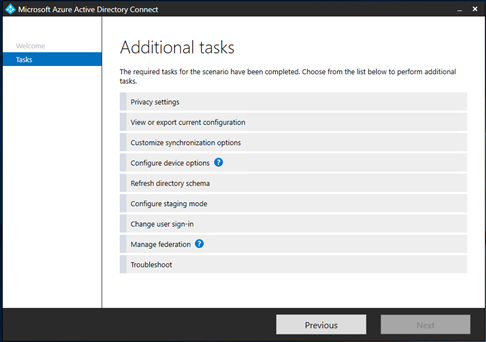

3. Enter Global Administrator credentials on the next page.

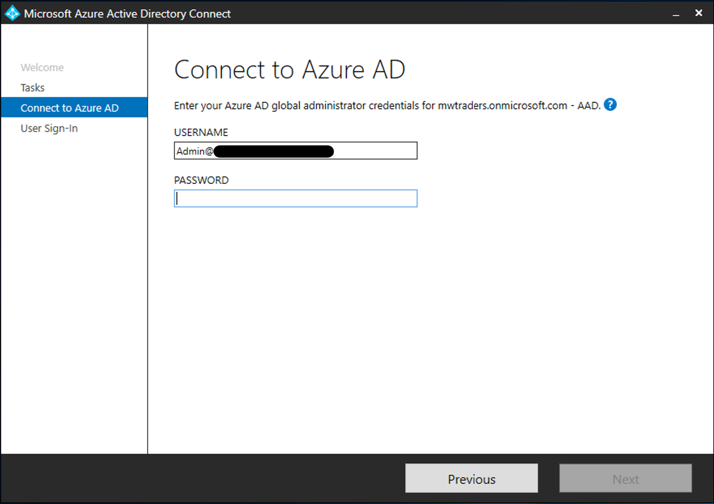

4. Currently the server is configured for Federation with Okta. Update the selection to Password hash synchronization. Select the checkbox to **Enable Single sign-on**

5. After updating the selection select **Next**.

Follow these steps to enable Seamless SSO:

1. Enter a domain administrator credential to the local on-premises and select **Next**


2. On the final page, select **Configure** to update the Azure AD Connect Server.


3. Ignore the warning for Hybrid Azure AD join for now, however the **Device options** needs to be reconfigured after disabling federation from Okta.

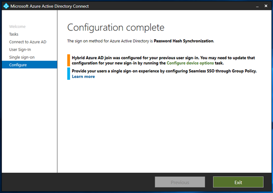

### Step 2 - Configure staged rollout features

[Staged rollout of cloud authentication](https://docs.microsoft.com/azure/active-directory/hybrid/how-to-connect-staged-rollout) is a feature of Azure AD that can be used to test de-federating users before de-federating an entire
domain. Before the deployment review the [pre-requisites](https://docs.microsoft.com/azure/active-directory/hybrid/how-to-connect-staged-rollout#prerequisites).

After enabling Password Hash Sync and Seamless SSO on the Azure AD Connect server, follow these steps to configure staged rollout.

1. Go to the [Azure portal](https://portal.azure.com/#home) and select **View** or **Manage Azure Active Directory**.

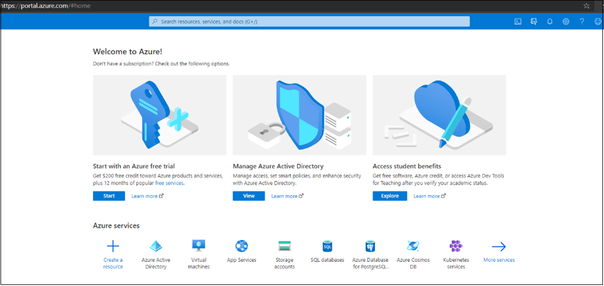

2. In the Azure Active directory menu, select **Azure AD Connect** and confirm that Password Hash Sync is showing as enabled in the tenant.

3. After confirming, select **Enable staged rollout for managed user sign-in**


4. Your Password hash sync setting may have been converted to **On** after configuring the server, if it's not, enable it now, you'll notice that Seamless SSO is set to **Off**. If you attempt to enable it in the menu, you'll get an error that its already enabled for users in the tenant.

5. After enabling Password Hash Sync, select **Manage Groups**.

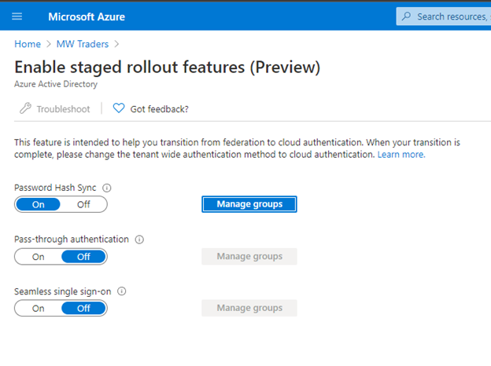

Follow the instructions for adding a group to the Password hash sync rollout. In the following example, a security group is used with 10 members to start with.

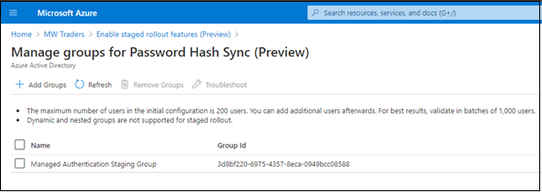

After adding in the group, wait about 30 minutes for the feature to take effect in your tenant. When the feature has taken effect, your users will no longer be redirected to Okta when they attempt to access Office 365 services.

The staged rollout feature have some unsupported scenarios, they are as follows:  

- Legacy authentication such as POP3 and SMTP aren't supported.

- If you have configured hybrid Azure AD join for use with Okta, all of the hybrid Azure AD join flows will still go to Okta until the domain has been de-federated. A sign-on policy should remain in Okta that allows Legacy authentication for Hybrid Azure AD join windows clients.

### Step 3 - Create Okta app in Azure AD

Users that are converted to managed authentication may still have
applications in Okta that they need to access, to allow the users easy access to those applications. Learn how to configure an Azure AD application registration that links to the Okta home page for users.

1. To configure the Enterprise application rRegistration for Okta, go to the [Azure portal](https://portal.azure.com/#home). Select **View** on **Manage Azure Active Directory**.

2. Next, select **Enterprise Applications** from the menu under the Manage section.


3. In the **All Applications** menu, select **New Application**.

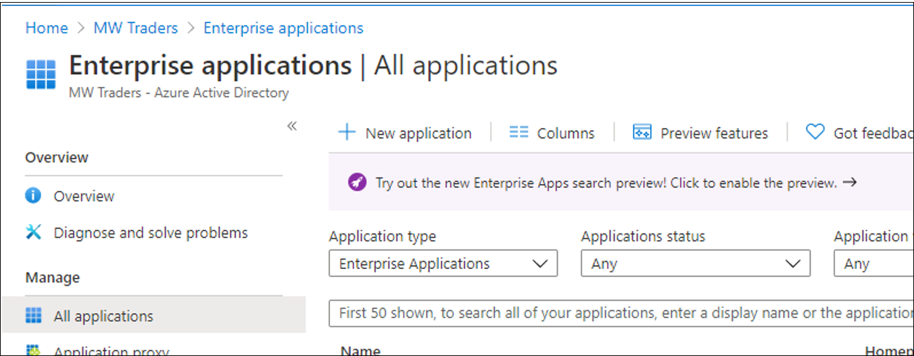

4. Select **Create your own application** and on the side menu that pops up, give the Okta app a name and select the radial for **Register an application you're working on to integrate with Azure AD** and then select **Create**.

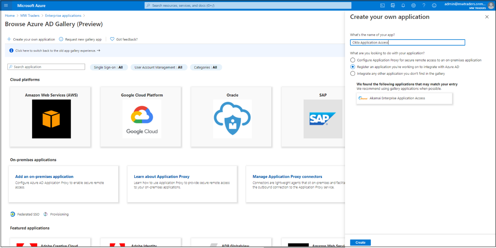

5. After registering the application, change the application to account in any organizational directory such as any Azure AD Directory - Multi-tenant and then select **register**.


6. After adding registration, go back to the Azure AD menu, and select **App Registrations** and then open the newly created registration.

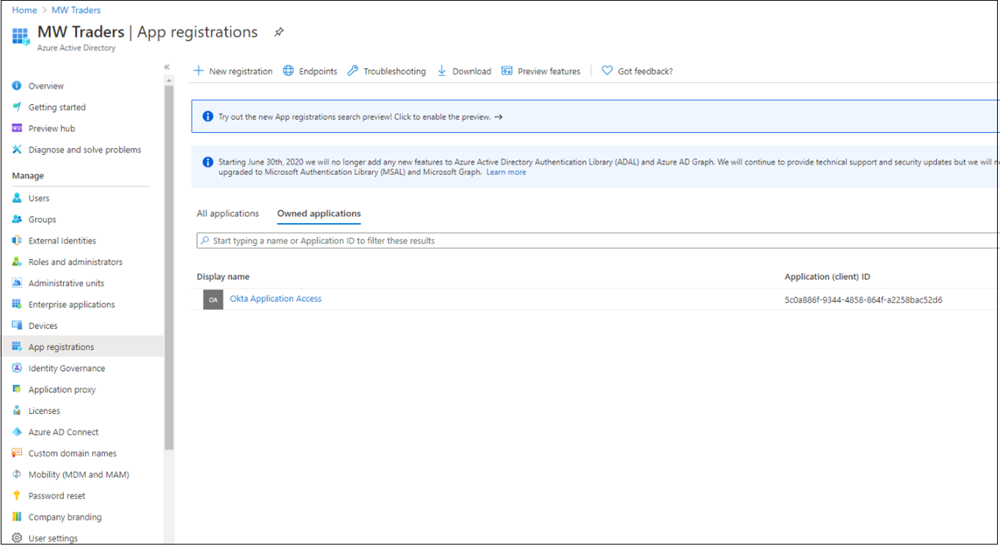

7. After opening the application, record your tenant ID and application ID.

>[!Note]
>You'll need tenant ID, and application ID later to configure Identity Provider in Okta.


8. Select **Certificates & Secrets** on the left menu. Select **New Client Secret** and give it a generic name and set its expiration time.

9. Record the value and ID of the secret before leaving this page.

>[!NOTE]
>You'll not be able to record this info later and will instead have to regenerate a secret if lost.

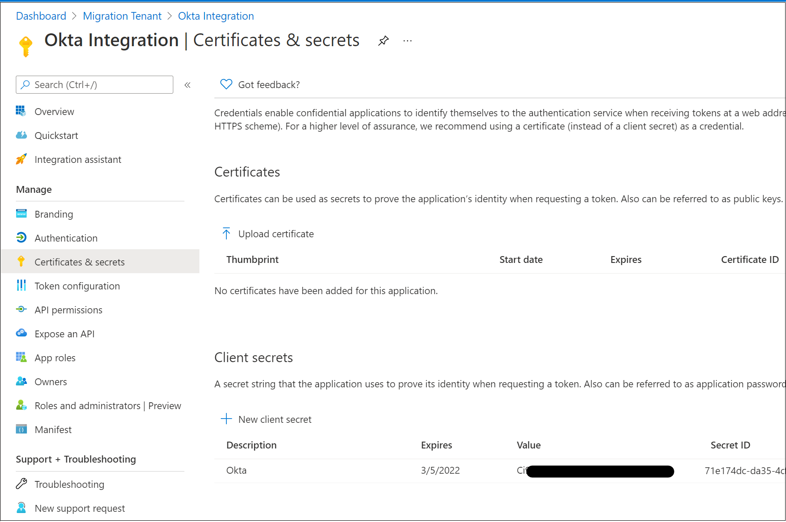

10. Select **API Permissions** on the left menu, and grant the application access to the OpenID Connect (OIDC) stack.

11. Select **Add Permission** > **Microsoft Graph** > **Delegated
Permissions**.

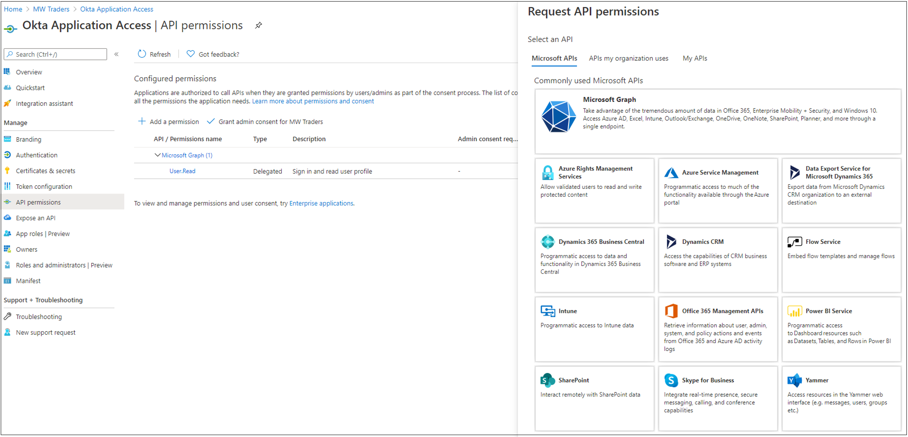

12. From the OpenID permissions section, add **Email**, **OpenID**, and **Profile**, then and select **Add permissions**.

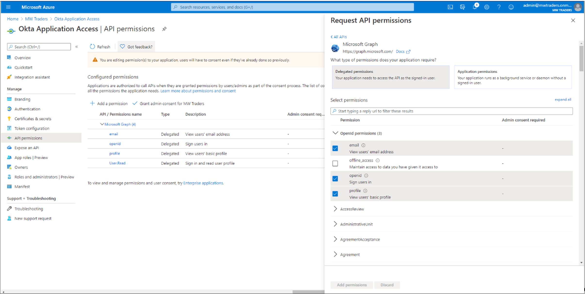

13. Select the **Grant admin consent for Tenant Domain Name** option and wait for the Granted status to appear.

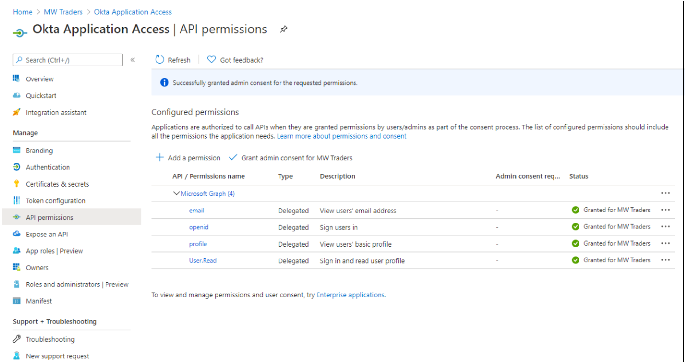

14. Once the permissions have been consented, add in the Home page URL under **Branding** for your user's application homepage.


15. After configuring the application, transition to the Okta Administration portal and configure Microsoft as an Identity Provider. Select **Security** > **Identity Providers** and add a new Identity Provider, and add the default **Microsoft** Option.


16. On the Identity Provider page, copy your application ID to the Client ID field, and the client secret to the Client Secret field.

17. Select **Show Advanced Settings**. By default this will tie User Principal Name (UPN) in Okta and Azure AD for the reverse federation access.

>[!IMPORTANT]
>If your UPNs do not match in Okta and Azure AD, select a
common attribute between users to match against.

18. Finalize your selection for auto provisioning. By default, if a user doesn't match to Okta, it will attempt to provision them in Azure AD. If you have migrated Provisioning away from Okta, select the **Redirect to Okta Sign-in page** option.

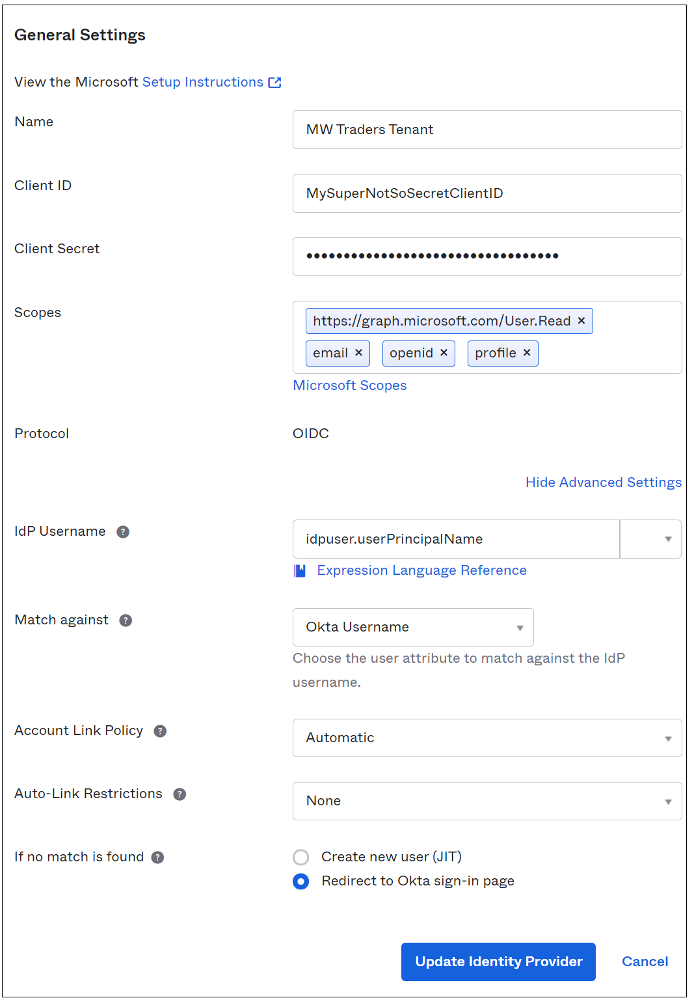

After creating the IDP, extra configuration is needed  to send users to the correct IDP.

19. Select **Routing Rules** from the Identity Providers menu, and then select **Add Routing Rule** using one of the available attributes in the Okta profile.

20. Configure the policy as shown to direct sign-ins from all
devices and IPs to Azure AD.

In the example, our attribute **Division** is unused on all our Okta profiles, which makes it an easy candidate to use for IDP routing.

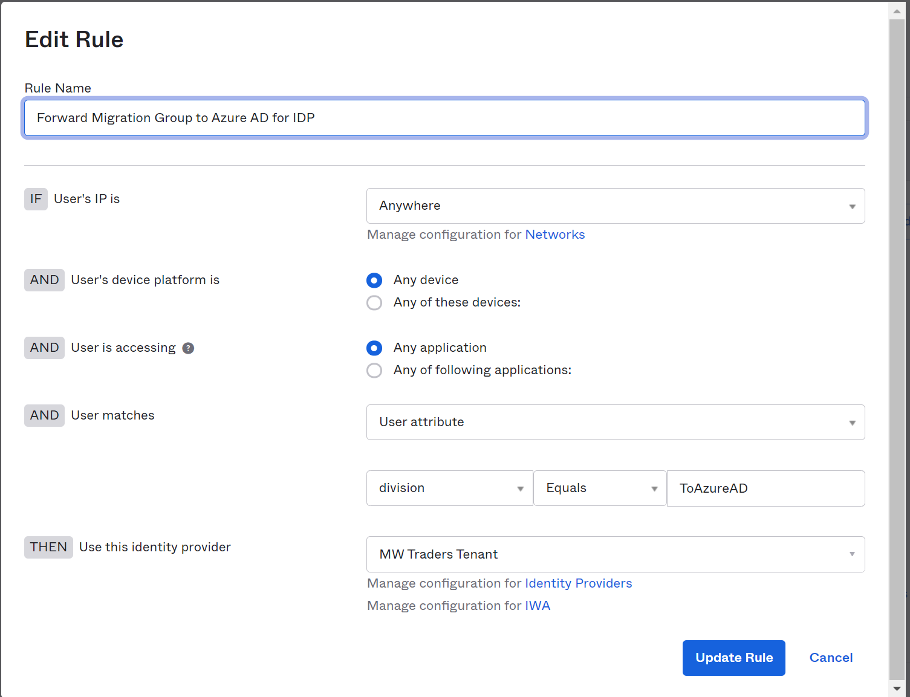

21. After adding the routing rule, record the Redirect URI, and add it to the **Application Registration**.


22. Navigate back to your application registration and select the
authentication tab, followed by **Add a platform** and **Web**.

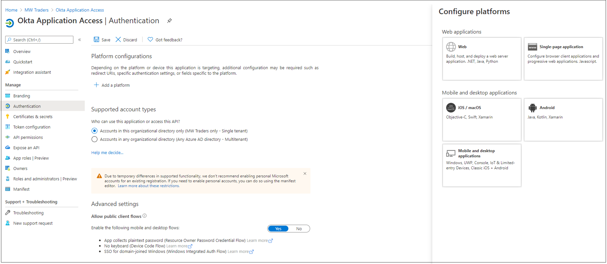

23. Add in the redirect URI from the IDP in Okta, then select **Access and ID tokens**.

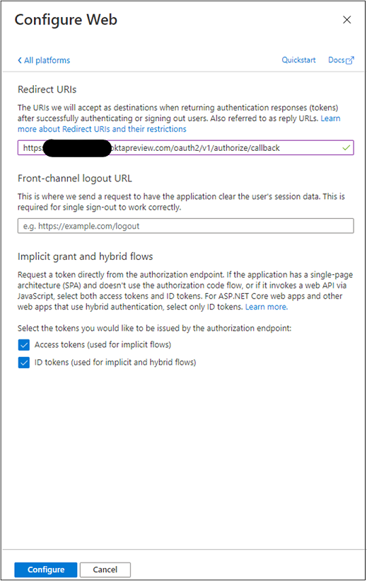

24. Select **Directory** > **People** from the admin console. Select your first test user, and their profile.

25. While editing the profile, add **ToAzureAD** to match the example and select **save**

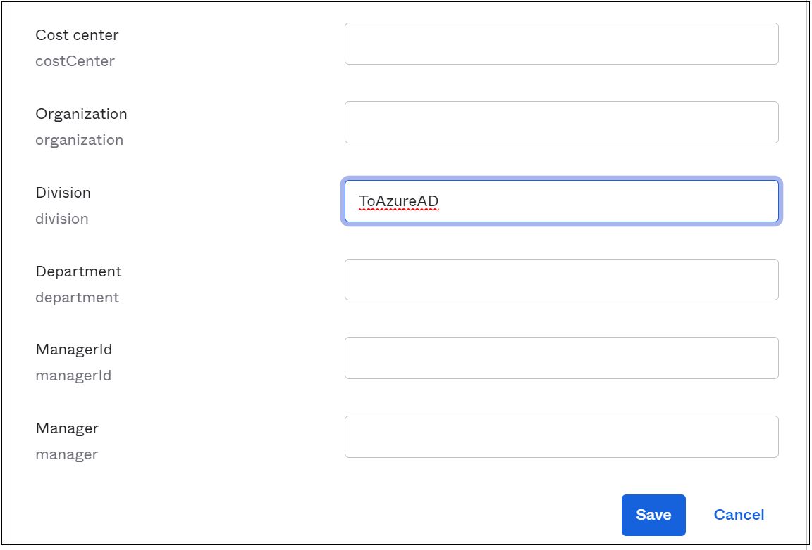

26. After saving the user attributes, attempt to sign in as the modified user to [Microsoft 356 portal](https://portal.office.com). You'll notice it loops if your user isn't a part of the Managed Authentication pilot. To have the users exit the loop, add them to the Managed Authentication experience.

### Step 4 - Test Okta app access on pilot members

After configuring the Okta app in Azure AD and the Identity Provider in the Okta portal, you must assign the application to users.

1. Navigate to Azure portal, select **Azure Active Directory** > **Enterprise Applications**.

2. Select the App registration created earlier, navigate to **Users and Groups**. Add the group that correlates with the Managed Authentication pilot.

>[!NOTE\]
>Users and groups can only be added from the Enterprise
Applications selection, you cannot add users under the App Registrations menu.

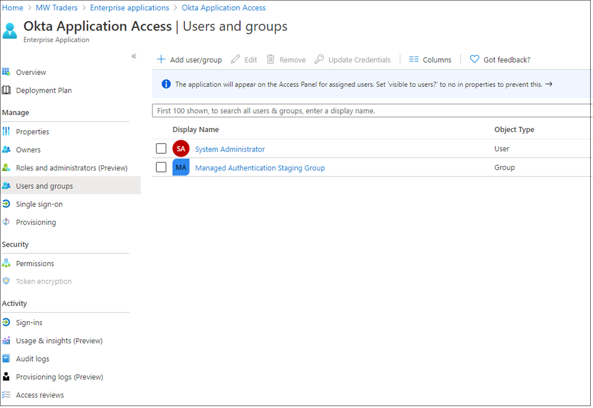

3. After about 15 minutes, sign in as one of the Managed
Authentication Pilot users and access [Myapplications](https://myapplications.microsoft.com).


4. Once authenticated, there will be an **Okta Application Access** tile, that will link the user back to the Okta homepage.

### Step 5 - Test-managed authentication on pilot members

After configuring the Okta reverse federation app, have your users conduct full testing on the Managed authentication experience. Its recommended to set up Company branding to help your users distinguish the proper tenant they are signing into. Get [guidance](https://docs.microsoft.com/azure/active-directory/fundamentals/customize-branding) for setting up company branding.

>[!IMPORTANT]
>Determine any additional Conditional Access Policies
that may be needed before de-federating the domains as a whole from Okta. Refer to **Okta sign-on policies to Azure AD Conditional Access migration for steps to secure your environment prior to full cut-off.

### Step 6 - Remove federation for Office 365 domains

Once your organization is comfortable with the Managed authentication experience, its time to de-federate your domain from Okta. To accomplish this connect to the MSOnline Powershell with the following commands- if you don't already have the MSOnline powershell module, you can download it first by doing an install-module MSOnline.

```Powershell

import-module MSOnline
Connect-Msolservice
Set-msoldomainauthentication 
-domainname yourdomain.com -authentication managed

```

After setting the domain to Managed authentication, you've
successfully de-federated your Office 365 Tenant from Okta, while
maintaining user access to the Okta homepage. 

## Next steps

- [Migrate Okta sync provisioning to Azure AD Connect based synchronization](migrate-okta-sync-provisioning-to-azure-active-directory-connect-based-synchronization.md)

- [Migrate Okta sign on policies to Azure AD Conditional Access](migrate-okta-sign-on-policies-to-azure-active-directory-conditional-access.md)

- [Migrate applications from Okta to Azure AD](migrate-applications-from-okta-to-azure-active-directory.md)
