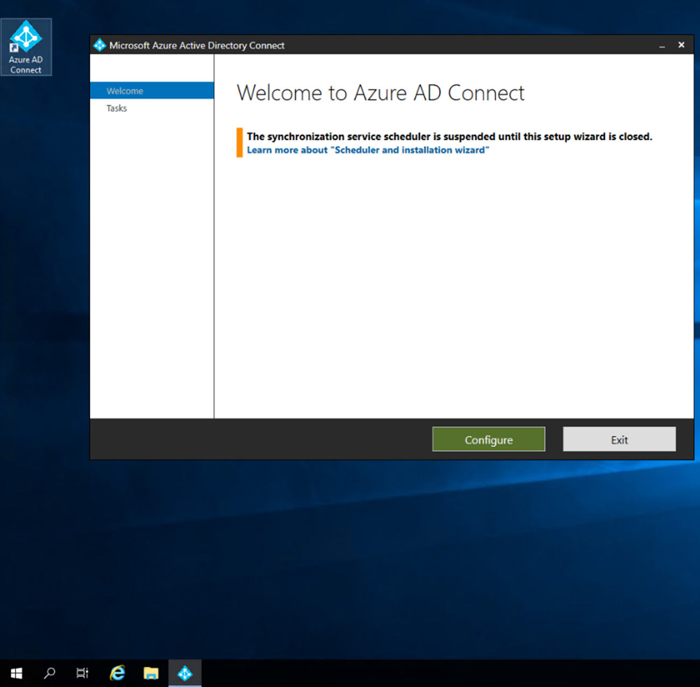
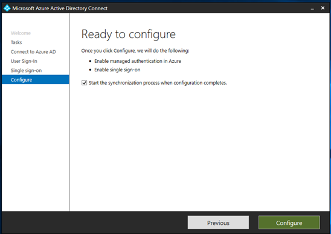
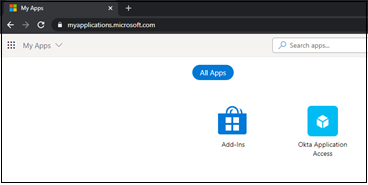

# Tutorial: Migrate Okta federation to Azure Active Directory-managed authentication

In this tutorial, you'll learn how to federate your existing Office 365 tenants with Okta for single sign-on (SSO) capabilities.

You can migrate federation to Azure Active Directory (Azure AD) in a staged manner to ensure a good authentication experience for users. In a staged migration, you can also test reverse federation access back to any remaining Okta SSO applications.

## Prerequisites

- An Office 365 tenant federated to Okta for SSO
- An Azure AD Connect server or Azure AD Connect cloud provisioning agents configured for user provisioning to Azure AD

## 1. Configure Azure AD Connect for authentication

Customers who have federated their Office 365 domains with Okta might not currently have a valid authentication method configured in Azure AD. Before you migrate to managed authentication, validate Azure AD Connect and configure it to allow user sign-in.

Set up the sign-in method that's best suited for your environment:

- **Password hash synchronization**: [Password hash synchronization](../hybrid/whatis-phs.md) is an extension of the directory synchronization feature that's implemented by Azure AD Connect server or cloud-provisioning agents. You can use this feature to sign in to Azure AD services like Microsoft 365. You sign in to the service by using the same password you use to sign in to your on-premises Active Directory instance.

- **Pass-through authentication**: Azure AD [Pass-through authentication](../hybrid/how-to-connect-pta.md) allows users to sign in to both on-premises and cloud-based applications by using the same passwords. When users sign in through Azure AD, the pass-through authentication agent validates passwords directly against the on-premises Active Directory.

- **Seamless SSO**: [Azure AD Seamless SSO](../hybrid/how-to-connect-sso.md) automatically signs in users when they're on their corporate desktops
that are connected to the corporate network. Seamless SSO provides users with easy access to cloud-based applications without needing any other on-premises components.

Seamless SSO can be deployed to password hash synchronization or pass-through authentication to create a seamless authentication experience for users in Azure AD.

Follow the [deployment guide](../hybrid/how-to-connect-sso-quick-start.md#step-1-check-the-prerequisites) to ensure that you deploy all necessary prerequisites of seamless SSO to your end users.

For our example, we'll configure password hash synchronization and seamless SSO.

### Configure Azure AD Connect for password hash synchronization and seamless SSO

Follow these steps to configure Azure AD Connect for password hash synchronization:

1. On your Azure AD Connect server, open the **Azure AD Connect** app and then select **Configure**.

   

2. Select **Change user sign-in** > **Next**.

   

3. Enter your global administrator credentials.

   

4. Currently, the server is configured for federation with Okta. Change the selection to **Password Hash Synchronization**. Then select **Enable single sign-on**.

5. Select **Next**.

Follow these steps to enable seamless SSO:

1. Enter the domain administrator credentials for the local on-premises system. Then select **Next**.

   

2. On the final page, select **Configure** to update the Azure AD Connect server.

   

3. Ignore the warning for hybrid Azure AD join for now. You'll reconfigure the device options after you disable federation from Okta.

   

## 2. Configure staged rollout features

In Azure AD, you can use a [staged rollout of cloud authentication](../hybrid/how-to-connect-staged-rollout.md) to test defederating users before you test defederating an entire
domain. Before you deploy, review the [prerequisites](../hybrid/how-to-connect-staged-rollout.md#prerequisites).

After you enable password hash sync and seamless SSO on the Azure AD Connect server, follow these steps to configure a staged rollout:

1. In the [Azure portal](https://portal.azure.com/#home), select **View** or **Manage Azure Active Directory**.

   

2. On the **Azure Active Directory** menu, select **Azure AD Connect**. Then confirm that **Password Hash Sync** is enabled in the tenant.

3. Select **Enable staged rollout for managed user sign-in**.

   

4. Your **Password Hash Sync** setting might have changed to **On** after the server was configured. If the setting isn't enabled, enable it now. 

   Notice that **Seamless SSO** is set to **Off**. If you attempt to enable it, you'll get an error because it's already enabled for users in the tenant.

5. Select **Manage groups**.

   

Follow the instructions to add a group to the password hash sync rollout. In the following example, the security group starts with 10 members.


After you add the group, wait for about 30 minutes while the feature takes effect in your tenant. When the feature has taken effect, your users will no longer be redirected to Okta when they attempt to access Office 365 services.

The staged rollout feature has some unsupported scenarios:  

- Legacy authentication such as POP3 and SMTP aren't supported.

- If you have configured hybrid Azure AD join for use with Okta, all of the hybrid Azure AD join flows go to Okta until the domain is defederated. A sign-on policy should remain in Okta to allow legacy authentication for hybrid Azure AD join Windows clients.

## 3. Create an Okta app in Azure AD

Users who have converted to managed authentication might still need to access
applications in Okta. To allow users easy access to those applications, you can register an Azure AD application that links to the Okta home page.

To configure the enterprise application registration for Okta: 
1. In the [Azure portal](https://portal.azure.com/#home), under **Manage Azure Active Directory**, select **View**.

2. On the left menu, under **Manage**, select **Enterprise applications**.

   

3. On the **All applications** menu, select **New application**.

   

4. Select **Create your own application**. On the menu that opens, name the Okta app and select **Register an application you're working on to integrate with Azure AD**. Then select **Create**.

   :::image type="content" source="media/migrate-okta-federation-to-azure-active-directory/register-application.png" alt-text="Screenshot that shows how to register an application." lightbox="media/migrate-okta-federation-to-azure-active-directory/register-application.png":::

5. Select **Accounts in any organizational directory (Any Azure AD Directory - Multitenant)** > **Register**.

   

6. On the Azure AD menu, select **App registrations**. Then open the newly created registration.

   

7. Record your tenant ID and application ID.

   >[!Note]
   >You'll need the tenant ID and application ID to configure the identity provider in Okta.

   

8. On the left menu, select **Certificates & secrets**. Then select **New client secret**. Give the secret a generic name and set its expiration date.

9. Record the value and ID of the secret.

   >[!NOTE]
   >The value and ID aren't shown later. If you fail to record this information now, you'll have to regenerate a secret.

   

10. On the left menu, select **API permissions**. Grant the application access to the OpenID Connect (OIDC) stack.

11. Select **Add a permission** > **Microsoft Graph** > **Delegated permissions**.

    :::image type="content" source="media/migrate-okta-federation-to-azure-active-directory/delegated-permissions.png" alt-text="Screenshot that shows delegated permissions." lightbox="media/migrate-okta-federation-to-azure-active-directory/delegated-permissions.png":::

12. In the OpenID permissions section, add **email**, **openid**, and **profile**. Then select **Add permissions**.

    :::image type="content" source="media/migrate-okta-federation-to-azure-active-directory/add-permissions.png" alt-text="Screenshot that shows how to add permissions." lightbox="media/migrate-okta-federation-to-azure-active-directory/add-permissions.png":::

13. Select **Grant admin consent for \<tenant domain name>** and wait until the **Granted** status appears.

    

14. On the left menu, select **Branding**. For **Home page URL**, add your user's application home page.

    

15. In the Okta administration portal, select **Security** > **Identity Providers** to add a new identity provider. Select **Add Microsoft**.

    

16. On the **Identity Provider** page, copy your application ID to the **Client ID** field. Copy the client secret to the **Client Secret** field.

17. Select **Show Advanced Settings**. By default, this configuration will tie the user principal name (UPN) in Okta to the UPN in Azure AD for reverse-federation access.

    >[!IMPORTANT]
    >If your UPNs in Okta and Azure AD don't match, select an attribute that's common between users.

18. Finish your selections for autoprovisioning. By default, if a user doesn't match in Okta, the system will attempt to provision the user in Azure AD. If you have migrated provisioning away from Okta, select **Redirect to Okta sign-in page**.

    

    Now that you've created the identity provider (IDP), you need to send users to the correct IDP.

19. On the **Identity Providers** menu, select **Routing Rules** > **Add Routing Rule**. Use one of the available attributes in the Okta profile.

20. To direct sign-ins from all devices and IPs to Azure AD, set up the policy as the following image shows.

    In this example, the **Division** attribute is unused on all Okta profiles, so it's a good choice for IDP routing.

    

21. Now that you've added the routing rule, record the redirect URI so you can add it to the application registration.

    

22. On your application registration, on the left menu, select **Authentication**. Then select **Add a platform** > **Web**.

    :::image type="content" source="media/migrate-okta-federation-to-azure-active-directory/add-platform.png" alt-text="Screenshot that shows how to add a web platform." lightbox="media/migrate-okta-federation-to-azure-active-directory/add-platform.png":::

23. Add the redirect URI that you recorded in the IDP in Okta. Then select **Access tokens** and **ID tokens**.

    

24. In the admin console, select **Directory** > **People**. Select your first test user to edit the profile.

25. In the profile, add **ToAzureAD** as in the following image. Then select **Save**.

    

26. Try to sign in to the [Microsoft 356 portal](https://portal.office.com) as the modified user. If your user isn't a part of the managed authentication pilot, you'll notice that your action loops. To exit the loop, add the user to the managed authentication experience.

## 4. Test Okta app access on pilot members

After you configure the Okta app in Azure AD and you configure the IDP in the Okta portal, you must assign the application to users.

1. In the Azure portal, select **Azure Active Directory** > **Enterprise applications**.

2. Select the app registration you created earlier and go to **Users and groups**. Add the group that correlates with the managed authentication pilot.

   >[!NOTE]
   >You can add users and groups only from the **Enterprise applications** page. You can't add users from the **App registrations** menu.

   

3. After about 15 minutes, sign in as one of the managed authentication pilot users and go to [My Apps](https://myapplications.microsoft.com).

   

4. Select the **Okta Application Access** tile to return the user to the Okta home page.

## 5. Test-managed authentication on pilot members

After you configure the Okta reverse-federation app, have your users conduct full testing on the managed authentication experience. We recommend that you set up company branding to help your users recognize the tenant they're signing in to. For more information, see [Add branding to your organization's Azure AD sign-in page](../fundamentals/customize-branding.md).

>[!IMPORTANT]
>Identify any additional Conditional Access policies
you might need before you completely defederate the domains from Okta. to secure your environment before the full cut-off, see [Okta sign-on policies to Azure AD Conditional Access migration](migrate-okta-sign-on-policies-to-azure-active-directory-conditional-access.md).

## 6. Defederate Office 365 domains

When your organization is comfortable with the managed authentication experience, you can defederate your domain from Okta. To begin, use the following commands to connect to MSOnline PowerShell. If you don't already have the MSOnline PowerShell module, you can download it by entering `install-module MSOnline`.

```PowerShell

import-module MSOnline
Connect-Msolservice
Set-msoldomainauthentication 
-domainname yourdomain.com -authentication managed

```

After you set the domain to managed authentication, you've
successfully defederated your Office 365 tenant from Okta while
maintaining user access to the Okta home page. 

## Next steps

- [Migrate Okta sync provisioning to Azure AD Connect-based synchronization](migrate-okta-sync-provisioning-to-azure-active-directory.md)

- [Migrate Okta sign-on policies to Azure AD Conditional Access](migrate-okta-sign-on-policies-to-azure-active-directory-conditional-access.md)

- [Migrate applications from Okta to Azure AD](migrate-applications-from-okta-to-azure-active-directory.md)
