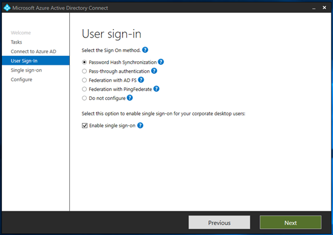
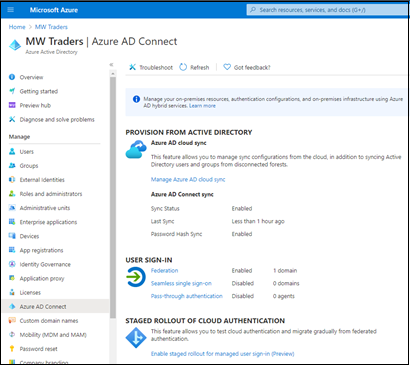
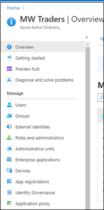
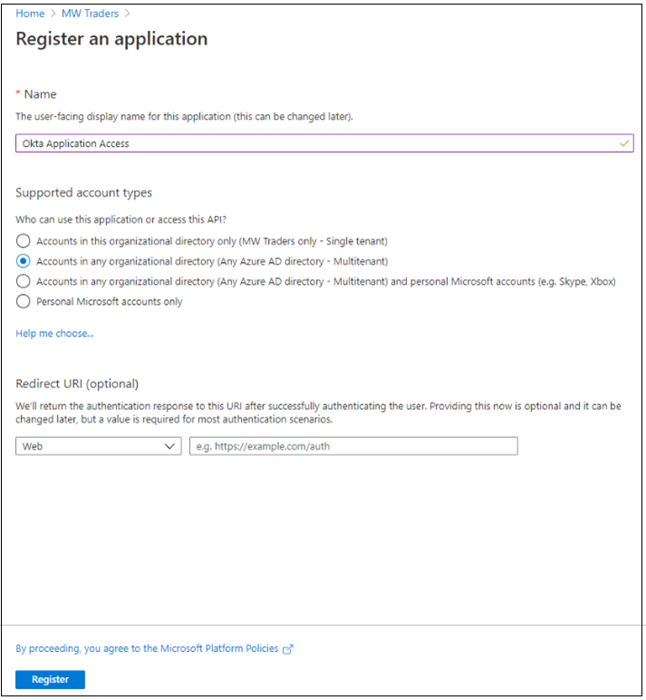
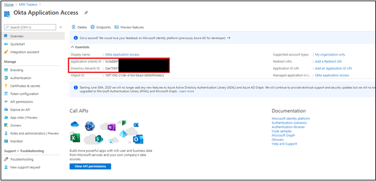
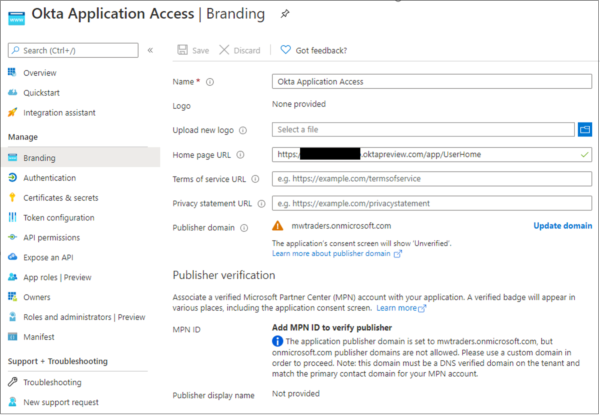
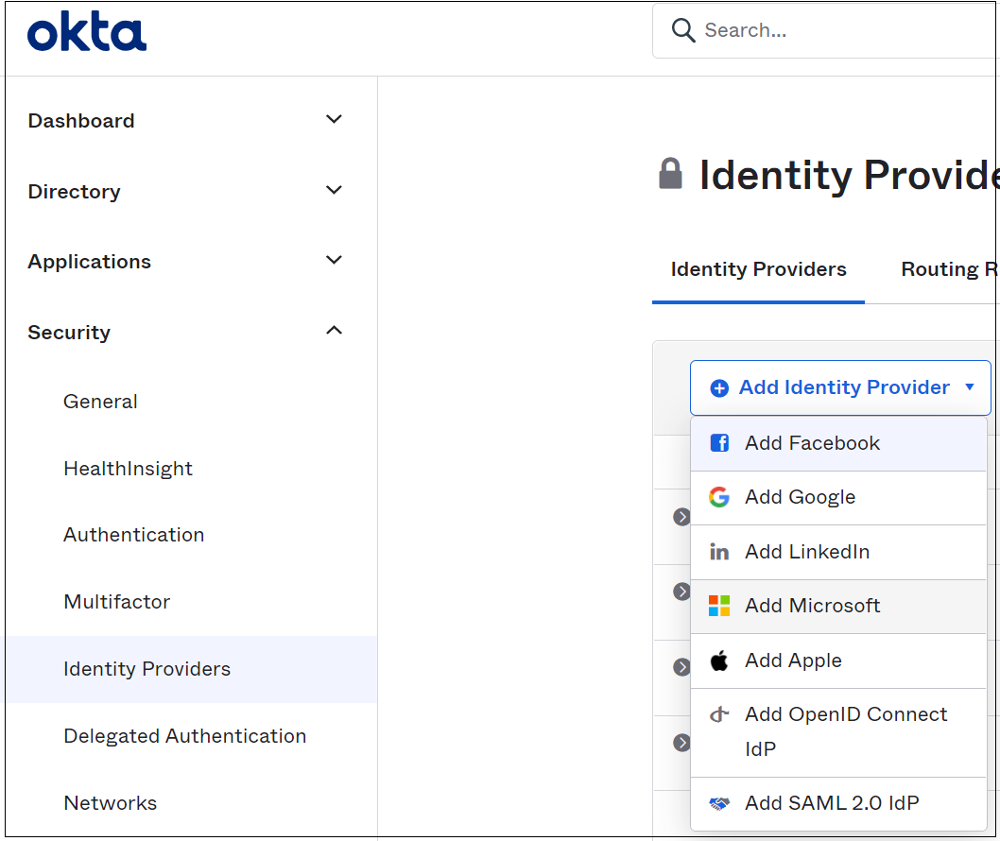
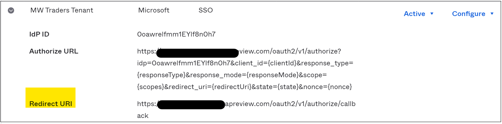

# Tutorial: Migrate Okta federation to Azure Active Directory-managed authentication

In this tutorial, learn to federate Office 365 tenants with Okta for single sign-on (SSO).

You can migrate federation to Azure Active Directory (Azure AD) in a staged manner to ensure a good authentication experience for users. In a staged migration, you can test reverse federation access to remaining Okta SSO applications.

## Prerequisites

- An Office 365 tenant federated to Okta for SSO
- An Azure AD Connect server or Azure AD Connect cloud provisioning agents configured for user provisioning to Azure AD

## Configure Azure AD Connect for authentication

Customers that federate their Office 365 domains with Okta might not have a valid authentication method in Azure AD. Before you migrate to managed authentication, validate Azure AD Connect and configure it for user sign-in.

Set up the sign-in method:

* **Password hash synchronization** - an extension of the directory synchronization feature implemented by Azure AD Connect server or cloud-provisioning agents
  * Use this feature to sign in to Azure AD services like Microsoft 365
  * Sign in to the service with the password to sign in to the on-premises Active Directory instance
  * See, [What is password hash synchronization with Azure AD?](../hybrid/whatis-phs.md)
* **Pass-through authentication** - sign in to on-premises and cloud applications with the same passwords 
  * When users sign in through Azure AD, the pass-through authentication agent validates passwords against the on-premises AD
  * See, [User sign-in with Azure Active Directory Pass-through Authentication](../hybrid/how-to-connect-pta.md)
* **Seamless SSO** - signs in users on corporate desktops connected to the corporate network
  * Users have access to cloud applications without other on-premises components
  * See, [Azure AD seamless SSO](../hybrid/how-to-connect-sso.md)

To create a seamless authentication user experience in Azure AD, deploy seamless SSO to password hash synchronization or pass-through authentication.

For prerequisites of seamless SSO see, [Quickstart: Azure Active Directory Seamless single sign-on](../hybrid/how-to-connect-sso-quick-start.md#step-1-check-the-prerequisites).

For this tutorial, you configure password hash synchronization and seamless SSO.

### Configure Azure AD Connect for password hash synchronization and seamless SSO

1. On the Azure AD Connect server, open the **Azure AD Connect** app.
2. Select **Configure**.

   

3. Select **Change user sign-in**.
4. Select **Next**.

   

5. Enter Global Administrator credentials.

   

6. The server is configured for federation with Okta. Change the selection to **Password Hash Synchronization**. 
7. Select **Enable single sign-on**.
8. Select **Next**.
9. For the local on-premises system, enter the domain administrator credentials. 
10. Select **Next**.

   

11. On the final page, select **Configure**.

   

12. Ignore the warning for hybrid Azure AD join. 

   

## Configure staged rollout features

[!INCLUDE [portal updates](~/articles/active-directory/includes/portal-update.md)]

Before you test defederating a domain, in Azure AD use a cloud authentication staged rollout to test defederating users. 

Learn more: [Migrate to cloud authentication using Staged Rollout](../hybrid/how-to-connect-staged-rollout.md)

After you enable password hash sync and seamless SSO on the Azure AD Connect server, configure a staged rollout:

1. Sign in to the [Azure portal](https://portal.azure.com), then select **View** or **Manage Azure Active Directory**.

   

2. On the **Azure Active Directory** menu, select **Azure AD Connect**. 
3. Confirm **Password Hash Sync** is enabled in the tenant.
4. Select **Enable staged rollout for managed user sign-in**.

   

5. After the server configuration, **Password Hash Sync** setting can change to **On**. 
6. Enable the setting.
7. **Seamless single sign-on** is **Off**. If you enable it, an error appears because it's enabled in the tenant.
8. Select **Manage groups**.

   

9. Add a group to the password hash sync rollout. In the following example, the security group starts with 10 members.

   

10. Wait about 30 minutes for the feature to take effect in your tenant. 
11. When the feature takes effect, users aren't redirected to Okta when attempting to access Office 365 services.

The staged rollout feature has some unsupported scenarios:

* Legacy authentication protocols such as POP3 and SMTP aren't supported.
* If you configured hybrid Azure AD join for Okta, the hybrid Azure AD join flows go to Okta until the domain is defederated. 
  * A sign-on policy remains in Okta for legacy authentication of hybrid Azure AD join Windows clients.

## Create an Okta app in Azure AD

Users that converted to managed authentication might need access to applications in Okta. For user access to those applications, register an Azure AD application that links to the Okta home page.

Configure the enterprise application registration for Okta.

1. Sign in to the [Azure portal](https://portal.azure.com), then under **Manage Azure Active Directory**, select **View**.
2. On the left menu, under **Manage**, select **Enterprise applications**.

   

3. On the **All applications** menu, select **New application**.

   

4. Select **Create your own application**. 
5. On the menu, name the Okta app.
6. Select **Register an application you're working on to integrate with Azure AD**. 
7. Select **Create**.
8. Select **Accounts in any organizational directory (Any Azure AD Directory - Multitenant)**.
9. Select **Register**.

   

10. On the Azure AD menu, select **App registrations**. 
11. Open the created registration.

   

12. Record the Tenant ID and Application ID.

   >[!Note]
   >You need the Tenant ID and Application ID to configure the identity provider in Okta.

   

13. On the left menu, select **Certificates & secrets**. 
14. Select **New client secret**. 
15. Enter a secret name.
16. Enter its expiration date.
17. Record the secret value and ID.

   >[!NOTE]
   >The value and ID don't appear later. If you don't record the information, you must regenerate a secret.

   

18. On the left menu, select **API permissions**. 
19. Grant the application access to the OpenID Connect (OIDC) stack.
20. Select **Add a permission**.
21. Select **Microsoft Graph**
22. Select **Delegated permissions**.
23. In the OpenID permissions section, add **email**, **openid**, and **profile**. 
24. Select **Add permissions**.
25. Select **Grant admin consent for \<tenant domain name>**.
26. Wait for the **Granted** status to appear.

    

27. On the left menu, select **Branding**. 
28. For **Home page URL**, add your user application home page.

    

29. In the Okta administration portal, to add a new identity provider, select **Security** then **Identity Providers**. 
30. Select **Add Microsoft**.

    

31. On the **Identity Provider** page, enter the Application ID in the **Client ID** field. 
32. Enter the client secret in the **Client Secret** field.
33. Select **Show Advanced Settings**. By default, this configuration ties the user principal name (UPN) in Okta to the UPN in Azure AD for reverse-federation access.

    >[!IMPORTANT]
    >If UPNs in Okta and Azure AD don't match, select an attribute that's common between users.

34. Complete autoprovisioning selections. 
35. By default, if no match appears for an Okta user, the system attempts to provision the user in Azure AD. If you migrated provisioning away from Okta, select **Redirect to Okta sign-in page**.

    

You created the identity provider (IDP). Send users to the correct IDP.

1. On the **Identity Providers** menu, select **Routing Rules** then **Add Routing Rule**. 
2. Use one of the available attributes in the Okta profile.
3. To direct sign-ins from devices and IPs to Azure AD, set up the policy seen in following image. In this example, the **Division** attribute is unused on all Okta profiles. It's a good choice for IDP routing.

    

4. Record the redirect URI to add it to the application registration.

    

5. On the application registration, on the left menu, select **Authentication**. 
6. Select **Add a platform**
7. Select **Web**.
8. Add the redirect URI you recorded in the IDP in Okta. 
9. Select **Access tokens** and **ID tokens**.

    

10. In the admin console, select **Directory**.
11. Select **People**. 
12. Select a test user to edit the profile.
13. In the profile, add **ToAzureAD**. See the following image. 
14. Select **Save**.

    

15. Sign in to the [Microsoft 356 portal](https://portal.office.com) as the modified user. If your user isn't in the managed authentication pilot, your action enters a loop. To exit the loop, add the user to the managed authentication experience.

## Test Okta app access on pilot members

After you configure the Okta app in Azure AD and configure the IDP in the Okta portal, assign the application to users.

1. In the Azure portal, select **Azure Active Directory** then **Enterprise applications**.
2. Select the app registration you created.
3. Go to **Users and groups**. 
4. Add the group that correlates with the managed authentication pilot.

   >[!NOTE]
   >You can add users and groups from the **Enterprise applications** page. You can't add users from the **App registrations** menu.

   

5. Wait about 15 minutes.
6. Sign in as a managed authentication pilot user.
7. Go to [My Apps](https://myapplications.microsoft.com).

   

8. To return to the Okta home page, select the **Okta Application Access** tile.

## Test managed authentication on pilot members

After you configure the Okta reverse-federation app, ask users to conduct testing on the managed authentication experience. We recommend you configure company branding to help users recognize the tenant.

Learn more: [Configure your company branding](../fundamentals/customize-branding.md).

  >[!IMPORTANT]
  >Before you defederate the domains from Okta, identify needed Conditional Access policies. You can secure your environment before cut-off. See, [Tutorial: Migrate Okta sign-on policies to Azure AD Conditional Access](migrate-okta-sign-on-policies-conditional-access.md).

## Defederate Office 365 domains

When your organization is comfortable with the managed authentication experience, you can defederate your domain from Okta. To begin, use the following commands to connect to Microsoft Graph PowerShell. If you don't have the Microsoft Graph PowerShell module, download it by entering `install-module MSOnline`.

```PowerShell

import-module MSOnline
Connect-MgGraph
New-MgDomainFederationConfiguration 
-domainname yourdomain.com -authentication managed

```

After you set the domain to managed authentication, you've defederated your Office 365 tenant from Okta while maintaining user access to the Okta home page.

## Next steps

- [Tutorial: Migrate Okta sync provisioning to Azure AD Connect-based synchronization](migrate-okta-sync-provisioning.md)
- [Tutorial: Migrate Okta sign-on policies to Azure AD Conditional Access](migrate-okta-sign-on-policies-conditional-access.md)
- [Tutorial: Migrate your applications from Okta to Azure AD](migrate-applications-from-okta.md)
