---

title: Tutorial to migrate Okta sign-on policies to Azure Active Directory conditional access
titleSuffix: Active Directory
description: In this tutorial, you learn how to migrate Okta sign-on policies to Azure Active Directory conditional access.
services: active-directory
author: gargi-sinha
manager: martinco

ms.service: active-directory
ms.workload: identity
ms.topic: how-to
ms.date: 09/01/2021
ms.author: gasinh
ms.subservice: app-mgmt
---

# Tutorial: Migrate Okta sign-on policies to Azure AD conditional access

In this tutorial, you'll learn how your organization can migrate from global or application-level sign-on policies in Okta to Azure Active Directory (Azure AD) conditional access policies to secure user access in Azure AD and connected applications.

This tutorial assumes you have an Office 365 tenant federated to Okta for sign-in and multifactor authentication (MFA). You should also have Azure AD Connect server or Azure AD Connect cloud provisioning agents configured for user provisioning to Azure AD.

## Prerequisites

When you switch from Okta sign-on to Azure AD conditional access, it's important to understand licensing requirements. Azure AD conditional access requires users to have an Azure AD Premium P1 License assigned before registration for Azure AD multifactor authentication.

Before you do any of the steps for Hybrid Azure AD Join, you'll need an enterprise administrator credential in the on-premises forest to configure the service connection point (SCP) record.

## Catalog current Okta sign-on policies

To complete a successful transition to conditional access, evaluate the existing Okta sign-on policies to determine use cases and requirements that will be transitioned to Azure AD.

1. Check the global sign-on policies by selecting **Security** > **Authentication** > **Sign On**.

   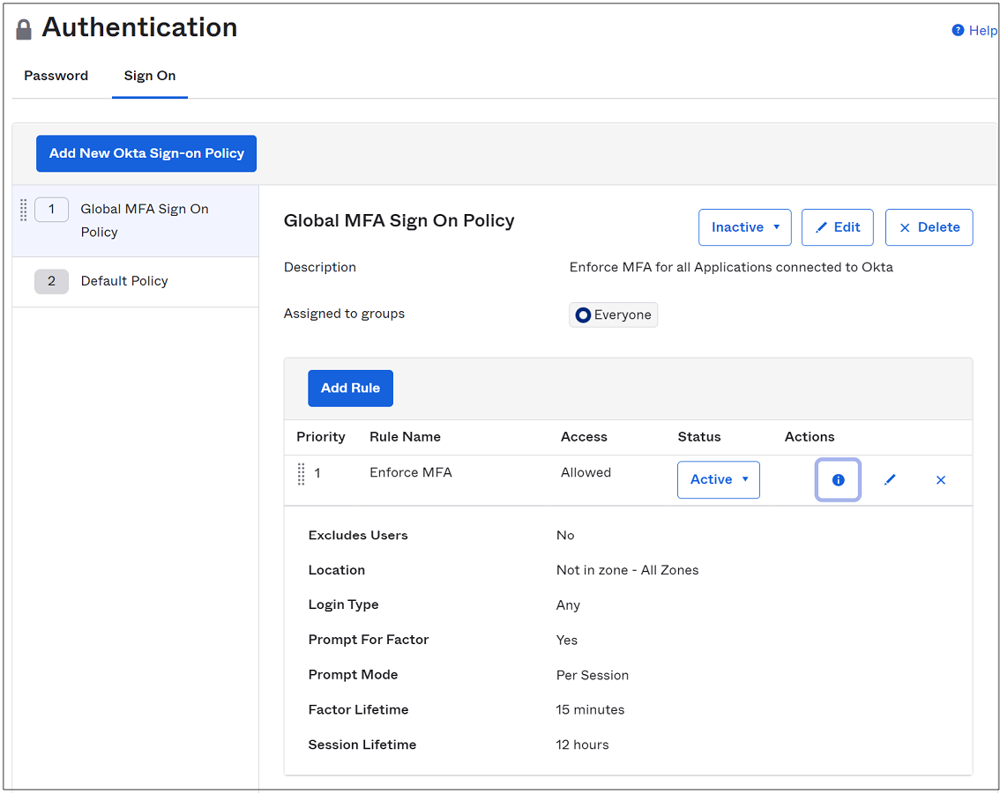

   In this example, the global sign-on policy enforces multifactor authentication on all sessions outside of our configured network zones.

   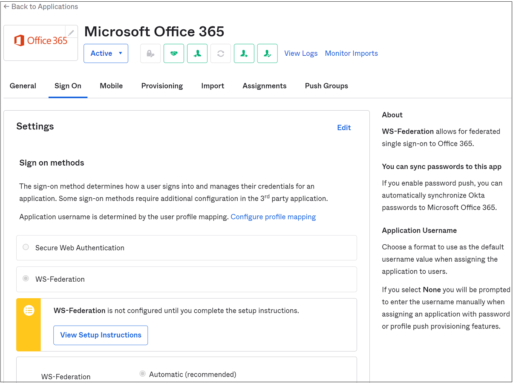

1. Go to **Applications**, and check the application-level sign-on policies. Select **Applications** from the submenu, and then select your Office 365 connected instance from the **Active apps list**.

1. Select **Sign On** and scroll to the bottom of the page.

   In the following example, our Office 365 application sign-on policy has four separate rules:

- **Enforce MFA for Mobile Sessions**: Requires multifactor authentication from every modern authentication or browser session on iOS or Android.
- **Allow Trusted Windows Devices**: Prevents your trusted Okta devices from being prompted for more verification or factors.
- **Require MFA from Untrusted Windows Devices**: Requires multifactor authentication from every modern authentication or browser session on untrusted Windows devices.
- **Block Legacy Authentication**: Prevents any legacy authentication clients from connecting to the service.

  

## Configure condition prerequisites

Azure AD conditional access policies can be configured to match Okta's conditions for most scenarios without more configuration.

In some scenarios, you might need more setup before you configure the conditional access policies. The two known scenarios at the time of writing this article are:

- **Okta network locations to named locations in Azure AD**: Follow the instructions in [Using the location condition in a conditional access policy](../conditional-access/location-condition.md#named-locations) to configure named locations in Azure AD.
- **Okta device trust to device-based CA**: Conditional access offers two possible options when you evaluate a user's device:

  - [Use Hybrid Azure AD Join](#hybrid-azure-ad-join-configuration), which is a feature enabled within the Azure AD Connect server that synchronizes Windows current devices, such as Windows 10, Windows Server 2016, and Windows Server 2019, to Azure AD.
  - [Enroll the device in Endpoint Manager](#configure-device-compliance), and assign a compliance policy.

### Hybrid Azure AD Join configuration

To enable Hybrid Azure AD Join on your Azure AD Connect server, run the configuration wizard. You'll need to take steps post-configuration to automatically enroll devices.

>[!NOTE]
>Hybrid Azure AD Join isn't supported with the Azure AD Connect cloud provisioning agents.

1. To enable Hybrid Azure AD Join, follow these [instructions](../devices/hybrid-azuread-join-managed-domains.md#configure-hybrid-azure-ad-join).

1. On the **SCP configuration** page, select the **Authentication Service** dropdown. Choose your Okta federation provider URL and select **Add**. Enter your on-premises enterprise administrator credentials, and then select **Next**.

   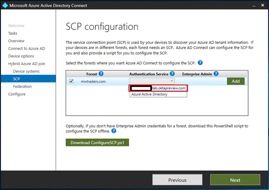

1. If you've blocked legacy authentication on Windows clients in either the global or app-level sign-on policy, make a rule to allow the Hybrid Azure AD Join process to finish.

1. Allow the entire legacy authentication stack through for all Windows clients. You can also contact Okta support to enable its custom client string on your existing app policies.

### Configure device compliance

Hybrid Azure AD Join is a direct replacement for Okta device trust on Windows. Conditional access policies can also look at device compliance for devices that have fully enrolled in Endpoint Manager:

- **Compliance overview**: Refer to [device compliance policies in Intune](/mem/intune/protect/device-compliance-get-started#:~:text=Reference%20for%20non-compliance%20and%20Conditional%20Access%20on%20the,applicable%20%20...%20%203%20more%20rows).
- **Device compliance**: Create [policies in Intune](/mem/intune/protect/create-compliance-policy).
- **Windows enrollment**: If you've opted to deploy Hybrid Azure AD Join, another group policy can be deployed to complete the [auto-enrollment process of these devices in Intune](/windows/client-management/mdm/enroll-a-windows-10-device-automatically-using-group-policy).
- **iOS/iPadOS enrollment**: Before you enroll an iOS device, [more configurations](/mem/intune/enrollment/ios-enroll) must be made in the Endpoint Management console.
- **Android enrollment**: Before you enroll an Android device, [more configurations](/mem/intune/enrollment/android-enroll) must be made in the Endpoint Management console.

## Configure Azure AD multifactor authentication tenant settings

Before you convert to conditional access, confirm the base Azure AD multifactor authentication tenant settings for your organization.

1. Go to the [Azure portal](https://portal.azure.com), and sign in with a global administrator account.

1. Select **Azure Active Directory** > **Users** > **Multi-Factor Authentication** to go to the legacy Azure multifactor authentication portal.

   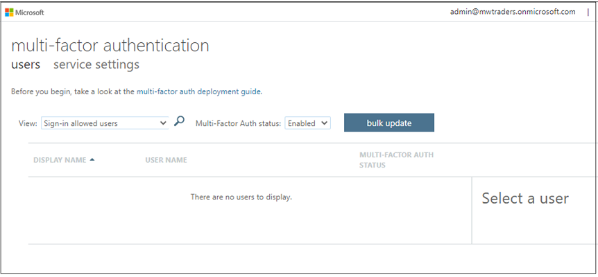

   You can also use the legacy link to the [Azure multifactor authentication portal](https://aka.ms/mfaportal).

1. On the legacy **Azure multifactor authentication** menu, change the status menu through **Enabled** and **Enforced** to confirm you have no users enabled for legacy multifactor authentication. If your tenant has users in the following views, you must disable them in the legacy menu. Only then will conditional access policies take effect on their account.

   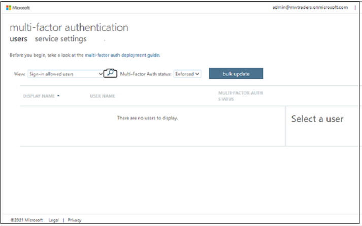

   The **Enforced** field should also be empty.

   

1. After you confirm that no users are configured for legacy multifactor authentication, select the **Service settings** option. Change the **App passwords** selection to **Do not allow users to create app passwords to sign in to non-browser apps**.

1. Ensure the **Skip multi-factor authentication for requests from federated users on my intranet** and **Allow users to remember multi-factor authentication on devices they trust (between one to 365 days)** checkboxes are cleared, and then select **Save**.

   >[!NOTE]
   >See [best practices for configuring the multifactor authentication prompt settings.](../authentication/concepts-azure-multi-factor-authentication-prompts-session-lifetime.md).

   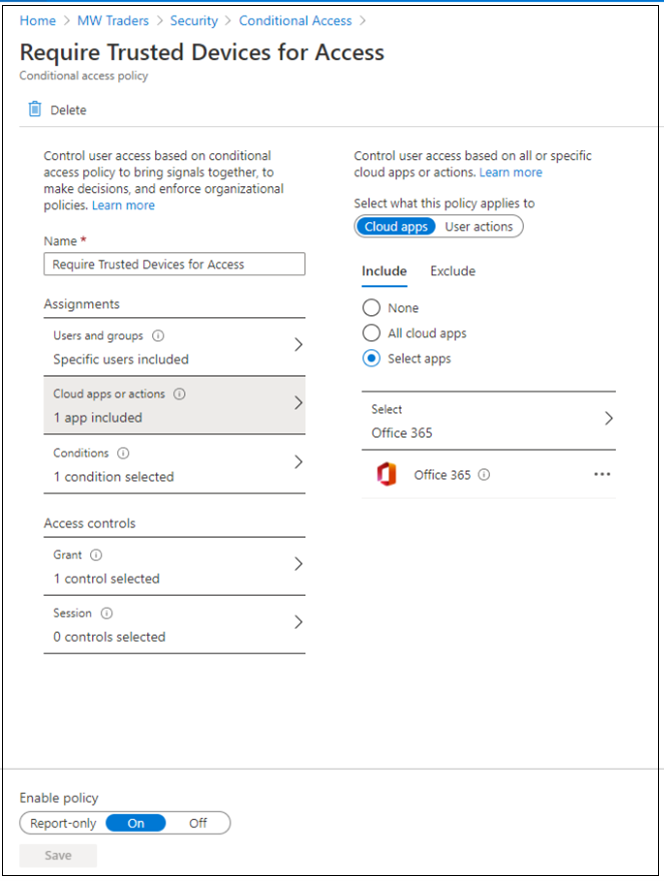

## Configure conditional access policies

After you've configured the prerequisites and established the base settings, its time to build the first conditional access policy.

1. To configure conditional access policies in Azure AD, go to the [Azure portal](https://portal.azure.com). On **Manage Azure Active Directory**, select **View**.

   Configure conditional access policies by following [best
practices for deploying and designing conditional access](../conditional-access/plan-conditional-access.md#understand-conditional-access-policy-components).

1. To mimic the global sign-on multifactor authentication policy from Okta, [create a policy](../conditional-access/howto-conditional-access-policy-all-users-mfa.md).

1. Create a [device trust-based conditional access rule.](../conditional-access/require-managed-devices.md).

   This policy as any other in this tutorial can be targeted to a specific application, a test group of users, or both.

   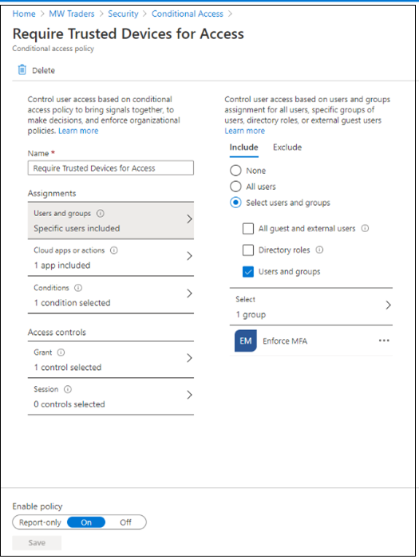

   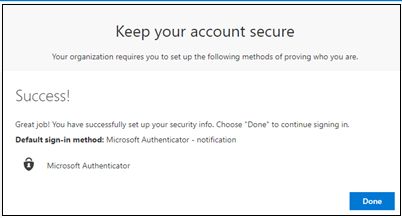

1. After you've configured the location-based policy and device trust policy, it's time to configure the equivalent [block legacy authentication](../conditional-access/howto-conditional-access-policy-block-legacy.md) policy.

With these three conditional access policies, the original Okta sign-on policies experience has been replicated in Azure AD. Next steps involve enrolling the user via Azure multifactor authentication and testing the policies.

## Enroll pilot members in Azure AD multifactor authentication

After you configure the conditional access policies, users must register for Azure multifactor authentication methods. Users can be required to register through several different methods.

1. For individual registration, direct users to the [Microsoft Sign-in pane](https://aka.ms/mfasetup) to manually enter the registration information.

1. Users can go to the [Microsoft Security info page](https://aka.ms/mysecurityinfo) to enter information or manage the form of multifactor authentication registration.

See [this guide](../authentication/howto-registration-mfa-sspr-combined.md) to fully understand the multifactor authentication registration process.  

Go to the [Microsoft Sign-in pane](https://aka.ms/mfasetup). After you sign in with Okta multifactor authentication, you're instructed to register for multifactor authentication with Azure AD.

>[!NOTE]
>If registration already happened in the past for a user, they'll be taken to the **My Security** information page after they satisfy the multifactor authentication prompt.

See the [user documentation for multifactor authentication enrollment](../user-help/security-info-setup-signin.md).

## Enable conditional access policies

1. To roll out testing, change the policies created in the earlier examples to **Enabled test user login**. 

   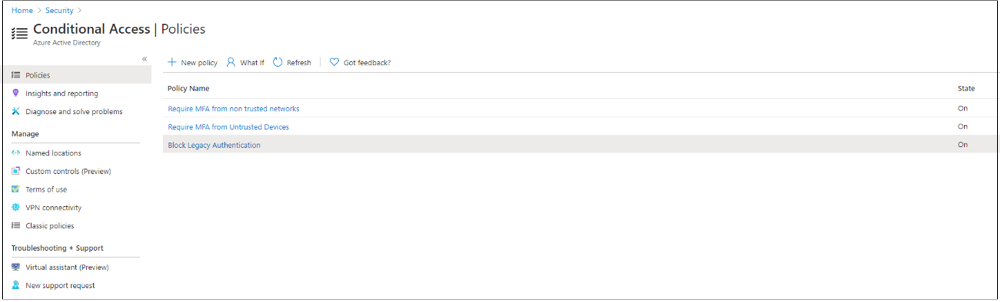

1. On the next Office 365 **Sign-In** pane, the test user John Smith is prompted to sign in with Okta multifactor authentication and Azure AD multifactor authentication.

   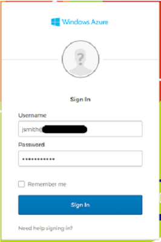

1. Complete the multifactor authentication verification through Okta.

   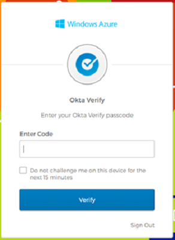

1. After the user completes the Okta multifactor authentication prompt, the user is prompted for conditional access. Ensure that the policies were configured appropriately and are within conditions to be triggered for multifactor authentication.

   

## Cut over from sign-on to conditional access policies

After you conduct thorough testing on the pilot members to ensure that conditional access is in effect as expected, the remaining organization members can be added to conditional access policies after registration has been completed.

To avoid double-prompting between Azure multifactor authentication and Okta multifactor authentication, opt out from Okta multifactor authentication by modifying sign-on policies.

The final migration step to conditional access can be done in a staged or cut-over fashion.

1. Go to the Okta admin console, select **Security** > **Authentication**, and then go to **Sign-on Policy**.

   >[!NOTE]
   > Set global policies to **Inactive** only if all applications from Okta are protected by their own application sign-on policies.

1. Set the **Enforce MFA** policy to **Inactive**. You can also assign the policy to a new group that doesn't include the Azure AD users.

   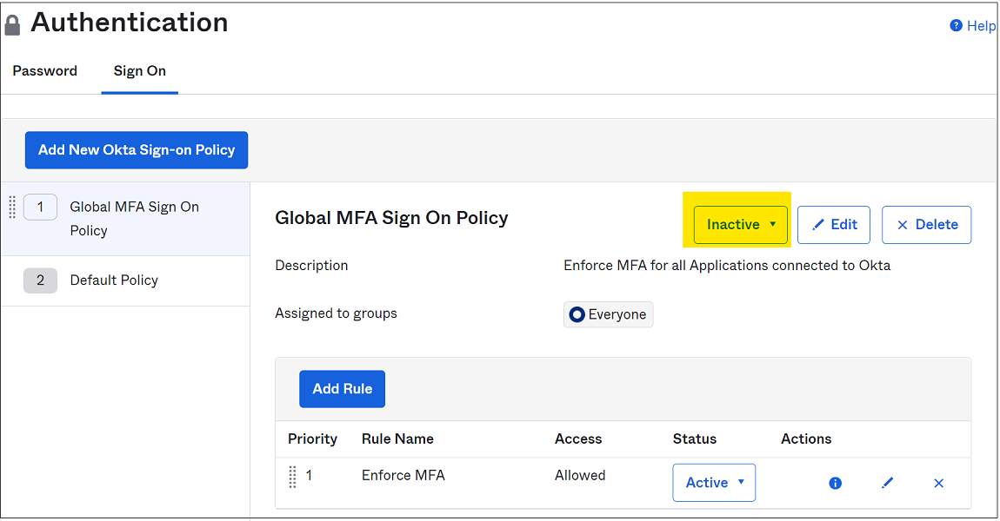

1. On the application-level sign-on policy, update the policies to **Inactive** by selecting the **Disable Rule** option. You can also assign the policy to a new group that doesn't include the Azure AD users.

1. Ensure there's at least one application-level sign-on policy that's enabled for the application that allows access without multifactor authentication.

   

1. After you disable the Okta sign-on policies or exclude the migrated Azure AD users from the enforcement groups, users are prompted *only* for conditional access the next time they sign in.

## Next steps

For more information about migrating from Okta to Azure AD, see:

- [Migrate applications from Okta to Azure AD](migrate-applications-from-okta-to-azure-active-directory.md)
- [Migrate Okta federation to Azure AD](migrate-okta-federation-to-azure-active-directory.md)
- [Migrate Okta sync provisioning to Azure AD Connect-based synchronization](migrate-okta-sync-provisioning-to-azure-active-directory.md)