---

title: Tutorial to migrate Okta sync provisioning to Azure AD Connect based synchronization
titleSuffix: Active Directory
description: Learn how to migrate your Okta sync provisioning to Azure AD Connect based synchronization
services: active-directory-b2c
author: gargi-sinha
manager: martinco

ms.service: active-directory
ms.workload: identity
ms.topic: how-to
ms.date: 08/10/2021
ms.author: gasinh
ms.subservice: app-mgmt
---


# Tutorial: Migrate Okta sync provisioning to Azure Active Directory Connect based synchronization

This document will guide organizations who currently use User provisioning from Okta to Azure Active Directory (Azure AD), migrate either User sync, or Universal sync to Azure AD Connect. This will enable further provisioning into Azure AD and Office 365.

Migrating synchronization platforms isn't a small change. Each step of the process mentioned in this article should be validated against your own environment before you remove the Azure AD Connect from staging mode or enable the Azure AD cloud provisioning agent.

## Prerequisites

When switching from Okta provisioning to Azure AD, customers have
two choices, either Azure AD Connect Server, or Azure AD cloud
provisioning. It is recommended to read the full [comparison article from Microsoft](https://docs.microsoft.com/azure/active-directory/cloud-sync/what-is-cloud-sync#comparison-between-azure-ad-connect-and-cloud-provisioning) to understand the differences between the two products.

Azure AD cloud provisioning will be most familiar migration path for Okta customers using Universal or User sync. The cloud provisioning agents are lightweight, and can be installed on or near domain controllers like the Okta directory sync agents. It is not recommended to install them on the same server.

Azure AD Connect server should be chosen if your organization needs to take advantage of any of the following technologies when synchronizing users.

- Device synchronization - Hybrid Azure AD join or Hello for
  Business

- Passthrough authentication

- More than 150k object support

- Support for writeback

>[!NOTE\]
>All pre-requisites should be taken into consideration when
installing Azure AD Connect or Azure AD cloud provisioning. Refer to [this article to learn more](https://docs.microsoft.com/azure/active-directory/hybrid/how-to-connect-install-prerequisites) before installation.  

## High-level migration tasks

1. [Confirm ImmutableID attribute synchronized by Okta](#step-1---confirm-immutableid-attribute-synchronized-by-okta)

2. [Build and deploy Windows VM for Azure AD Connect or cloud provisioning agent](#step-2---mass-validation-methods-for-objectguid)

3. [Install Azure AD Connect in **[Staging Mode]{.underline}**](#step-3---install-azure-ad-connect-in-staging-mode)

4. [Validate ImmutableID matches in the Azure AD Connect metaverse - (optional)](#step-4---install-azure-ad-cloud-sync-agents)

5. [Disable Okta provisioning to Azure AD](#step-5---disable-okta-provisioning-to-azure-ad)

6. [Disable staging mode in Azure AD Connect or enable cloud provisioning](#step-6---disable-staging-mode-in-azure-ad-connect)

7. [Enable cloud sync agents - (optional)](#step-7---enable-cloud-sync-agents)

### Step 1 - Confirm ImmutableID attribute synchronized by Okta

ImmutableID is the core attribute used to tie synchronized objects to their on-premises counterparts. Okta takes the Active Directory objectGUID of an on-premises object and converts it to a Base64 encoded string. Then, by default stamps that string to the ImmutableID field in Azure AD.

You can connect to Azure AD PowerShell and examine the current ImmutableID value. If you've never used the Azure AD PowerShell module, run an
Install-Module AzureAD in an administrative PowerShell session before you run the following commands.

```Powershell
Import-module AzureAD
Connect-AzureAD
```

In case you already have the module, you may receive a warning to update to the latest version if it is out of date.

After the module is installed, import it, and follow these steps to connect to the Azure AD service:

1. Enter your global administrator credentials in the modern authentication window.


2. After connecting to the tenant, verify what your ImmutableID's are set as. The example shown is using Okta defaults of objectGUID to ImmutableID.

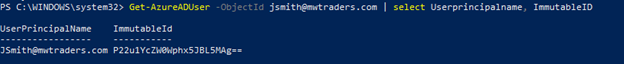

3. There are several ways to manually confirm the objectGUID to Base64 conversion on-premises, for individual validation use this example:

```PowerShell
Get-ADUser onpremupn \| fl objectguid\
\$objectguid = \'your-guid-here-1010\'

\[system.convert\]::ToBase64String((\[GUID\]\$objectGUID).ToByteArray())
```

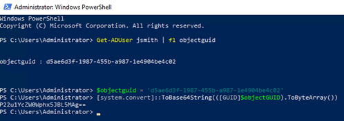

### Step 2 - Mass validation methods for objectGUID

Before cutting over to Azure AD Connect, it's critical to validate that the ImmutableID's in Azure AD are going to exactly match their on-premises values.

The example will grab **all** on-premises AD users, and export a list of their objectGUID's and ImmutableID's already calculated to a CSV file.

1. Run these commands in PowerShell on a domain controller on-premises.

```PowerShell
Get-ADUser -Filter \* -Properties objectGUID \| Select-Object
UserPrincipalName, Name, objectGUID, @{Name = \'ImmutableID\';
Expression = {
\[system.convert\]::ToBase64String((\[GUID\]\$\_.objectGUID).ToByteArray())
} } \| export-csv C:\\Temp\\OnPremIDs.csv
```

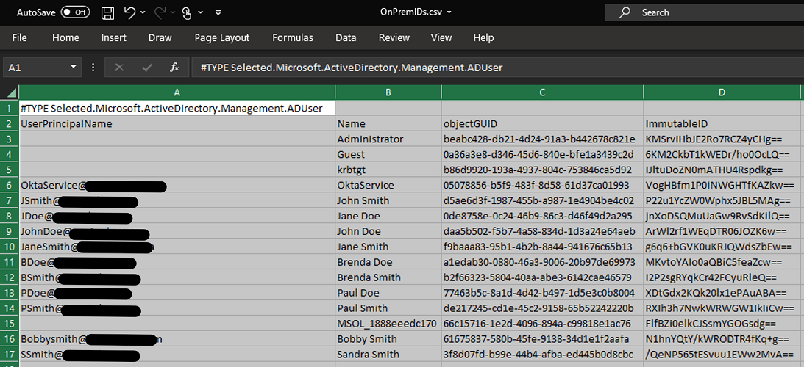

2. Run these commands in an Azure AD PowerShell session to gather the already synchronized values:

```powershell

Get-AzureADUser -all \$true \| Where-Object {\$\_.dirsyncenabled -like
\"true\"} \| Select-Object UserPrincipalName, @{Name = \'objectGUID\';
Expression = {
\[GUID\]\[System.Convert\]::FromBase64String(\$\_.ImmutableID) } },
ImmutableID \| export-csv C:\\temp\\AzureADSyncedIDS.csv
```


Once you have both exports, confirm that the ImmutableID for each user matches.

>[!IMPORTANT]
>If your ImmutableIDs in the cloud don;t match objectGUID values, you've modified the defaults for Okta sync. You've
likely chosen another attribute to determine ImmutableIDs. Before moving onto the next section, it's critical to identify which source attribute is populating ImmutableID's. Ensure that you update the attribute Okta is syncing before disabling Okta sync.

### Step 3 - Install Azure AD Connect in staging mode

Once you've prepared your list of source and destination targets, its time to install Azure AD Connect server. If you've opted to use Azure AD Connect cloud provisioning, skip this section.

1. Continue with downloading and installing Azure AD Connect to your chosen server. Follow [this guide](https://docs.microsoft.com/azure/active-directory/hybrid/how-to-connect-install-custom).

2. On the **Identifying Users** page, under the **select how users should be identified with Azure AD** select the radial for **Choose a specific attribute**. Then, select **mS-DS-ConsistencyGUID** if you haven't modified the Okta defaults.

>[!WARNING]
>This is the most critical step before selecting **next**
on this page. Ensure that the attribute you're selecting for source anchor is what **currently** populates your existing Azure AD users. If you select the wrong attribute, you must uninstall and reinstall AD Connect to reselect this option.

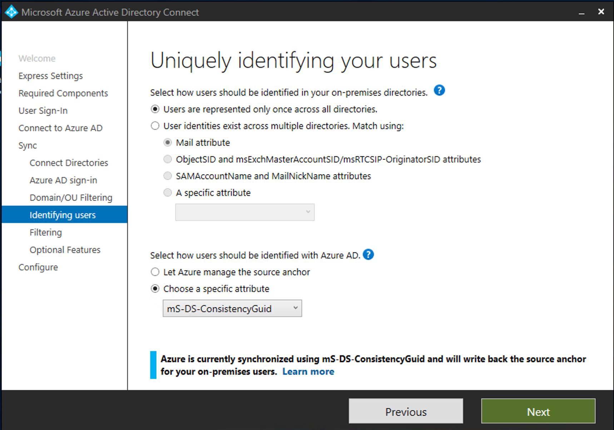

3. On the **Configure** page, make sure to select the checkbox for **Enable staging mode** followed by **Install**.

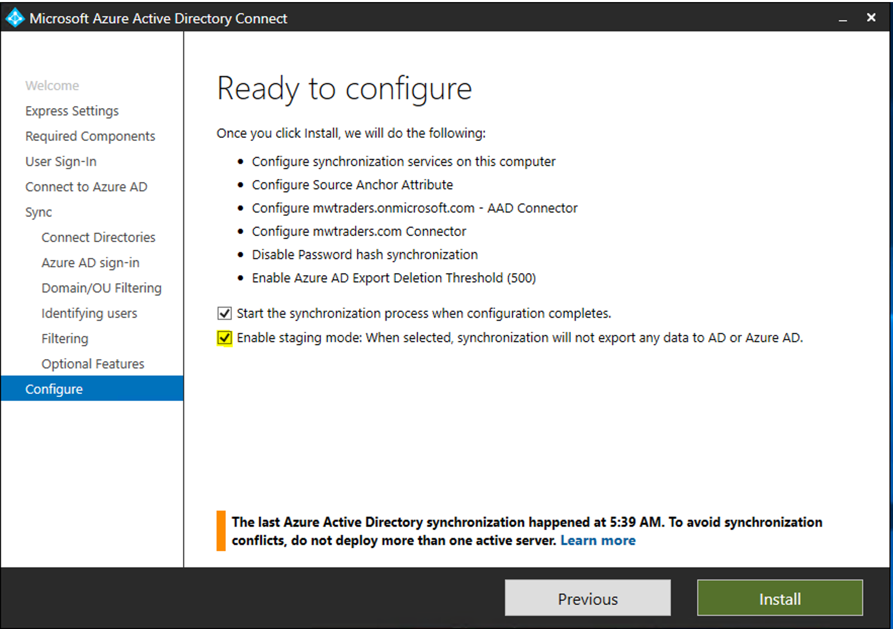

4. After the configuration is complete, select **Exit**.

Before exiting the staging mode, it's important to verify that the ImmutableID's have matched properly.

1. Open the Synchronization service as an **Administrator**.


2. First check that the Full Synchronization to the domain.onmicrosoft.com connector space has users displaying under the **Connectors with Flow Updates** tab.

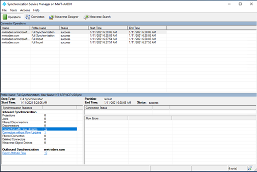

3. Next, verify there are no deletions pending in the export. Select the **Connectors** tab and then highlight the domain.onmicrosoft.com connector space. Then, select **Search Connector Space**.

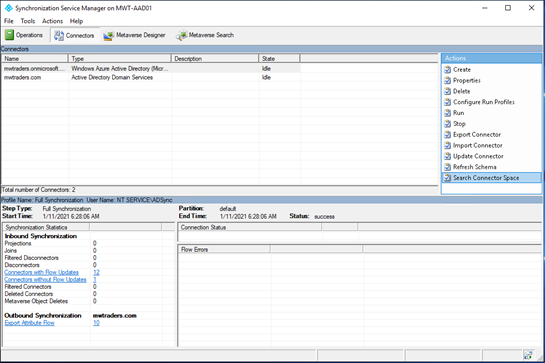

4. In the Connector Space search, select the Scope dropdown and select **Pending Export**.

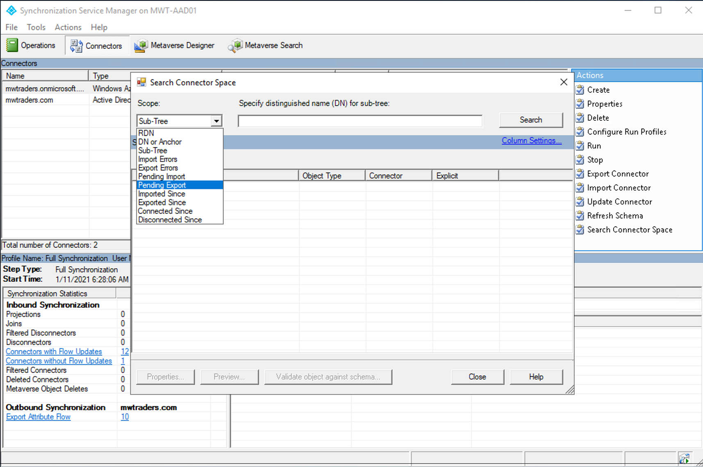

5. Select **Delete** followed by **Search** if all objects have matched properly, there should be zero matching records for Deletes. Record any objects pending deletion and their on-premises values.

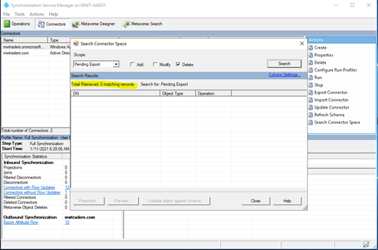

6. Next, uncheck **Delete**, and select **Add and Modify**, followed by a search. You should see update functions for all users currently being synchronized to Azure AD via Okta. Add any new objects that Okta isn't currently syncing, but exist in the Organizational unit (OU) structure that was selected during the Azure AD Connect install.

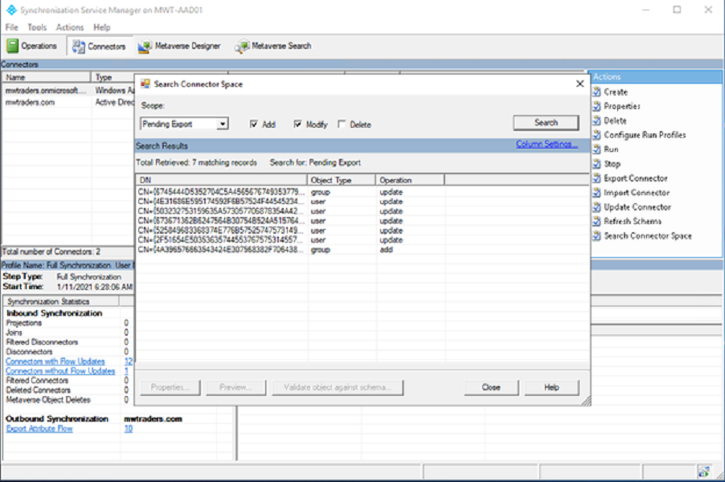

7. Double-clicking on updates will show what Azure AD Connect will communicate with Azure AD.

8. If there are any Add functions for a user who already exists in Azure AD, their on-premises account isn't matching to their cloud account and AD Connect has determined it will create a new object, record any new adds that are unexpected. Make sure to correct the ImmutableID value in Azure AD before exiting staging mode.

In this example, Okta had been stamping the Mail attribute to the user's account, even though the on-premises value wasn't properly filled in. When Azure AD connect takes over John Smith's account, the Mail attribute is deleted from his object.

Verify that your updates still include all attributes expected in Azure AD. If multiple attributes are being deleted, you may need to manually populate these on-premises AD values before removing staging mode.

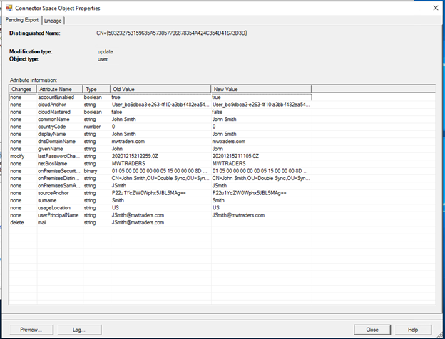

>[!NOTE] Before you continue to the next step, ensure all user attributes are syncing properly and are showing in the **Pending Export** tab as expected. If they're deleted, make sure their ImmutableID's match and the User is in one of the selected OUs for synchronization.

### Step 4 - Install Azure AD cloud sync agents

Once you've prepared your list of source and destination targets, its time to install Azure AD cloud sync agents. If you've opted to use Azure AD Connect server, skip this section.

Follow [this tutorial](https://docs.microsoft.com/azure/active-directory/cloud-sync/tutorial-single-forest) to install and configure Azure AD Connect cloud sync.

### Step 5 - Disable Okta provisioning to Azure AD

Once the Azure AD Connect install has been verified and your pending exports are in order, it's time to disable Okta provisioning to Azure AD.

1. Navigate to your Okta portal, select **Applications**, followed by your Okta app used to provision users to Azure AD. Open provisioning tab and **Integration** section

2. Select **Edit**, uncheck **Enable API integration** option and **Save**.

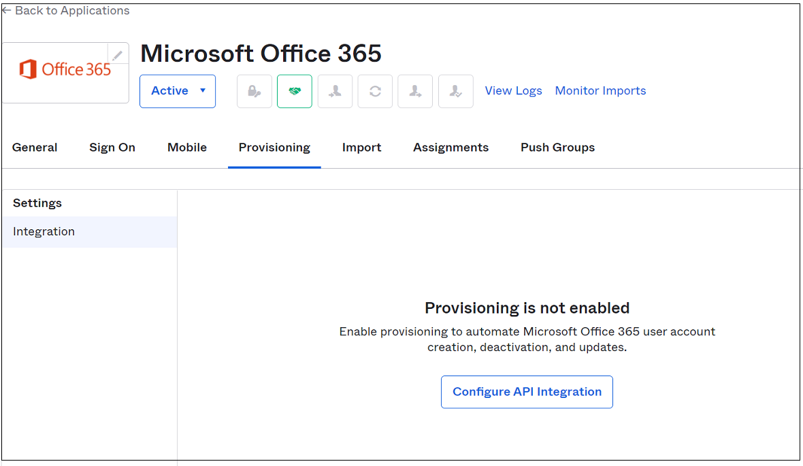

>[!NOTE\]
>If you have multiple Office 365 apps handling provisioning to Azure AD, ensure that all are switched off.

### Step 6 - Disable staging mode in Azure AD Connect

After disabling Okta Provisioning, the Azure AD Connect server is ready to begin synchronizing objects. If you have chosen to go with Azure AD cloud sync agents, skip this section.

1. Run the installation wizard from the desktop again, and select **Configure**.


2. Select **Configure Staging Mode** followed by **Next** and enter your global administrator credentials.


3. Uncheck **Enable Staging Mode** followed by next.

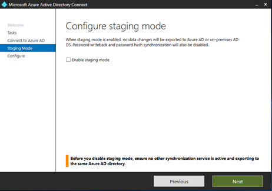

4. Select **Configure** to continue.


5. After the configuration completes, open the **Synchronization Service** as an administrator. View the Export on the domain.onmicrosoft.com connector. Verify all adds, updates, and deletes are done as expected.


You've now successfully migrated to Azure AD Connect server based provisioning. Updates and expansions to the feature set
of Azure AD connect can be done by rerunning to the installation wizard.

### Step 7 - Enable Cloud sync agents

After disabling Okta Provisioning, the Azure AD cloud sync agent is ready to begin synchronizing objects, return to the [Azure AD Portal](https://aad.portal.azure.com/).

1. Modify the **Configuration profile** to **Enabled**.

2. After enabling, return to the provisioning menu and select **Logs**.

3. Evaluate that the provisioning connector has properly updated in place objects. The Cloud sync agents are non-destructive. They'll fail their updates if a match didn't occur properly.

4. If a user is mismatched, make the necessary updates to bind the immutableID's, then restart the Cloud provisioning sync.

## Next steps 

- [Migrate applications from Okta to Azure AD](migrate-applications-from-okta-to-azure-active-directory.md)

- [Migrate Okta federation to Azure AD](migrate-okta-federation-to-azure-active-directory.md)

- [Migrate Okta sign on policies to Azure AD Conditional Access](migrate-okta-sign-on-policies-to-azure-ad-conditional-access.md)
