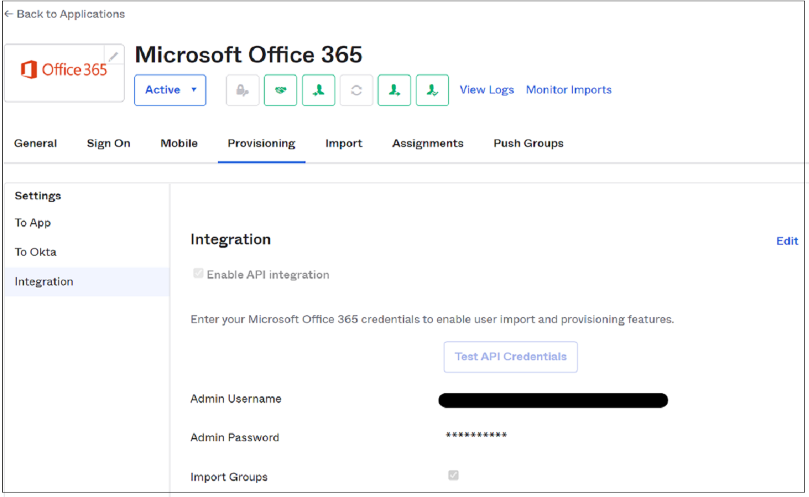

# Tutorial: Migrate Okta sync provisioning to Azure AD Connect-based synchronization

In this tutorial, you'll learn how your organization can migrate user provisioning from Okta to Azure Active Directory (Azure AD) and migrate either User Sync or Universal Sync to Azure AD Connect. This capability enables further provisioning into Azure AD and Office 365.

Migrating synchronization platforms isn't a small change. Each step of the process mentioned in this article should be validated against your own environment before you remove Azure AD Connect from staging mode or enable the Azure AD cloud provisioning agent.

## Prerequisites

When you switch from Okta provisioning to Azure AD, you have two choices. You can use either an Azure AD Connect server or Azure AD cloud provisioning. To understand the differences between the two, read the [comparison article from Microsoft](../cloud-sync/what-is-cloud-sync.md#comparison-between-azure-ad-connect-and-cloud-sync).

Azure AD cloud provisioning is the most familiar migration path for Okta customers who use Universal Sync or User Sync. The cloud provisioning agents are lightweight. You can install them on or near domain controllers like the Okta directory sync agents. Don't install them on the same server.

Use an Azure AD Connect server if your organization needs to take advantage of any of the following technologies when you synchronize users:

- Device synchronization: Hybrid Azure AD join or Hello for Business
- Pass-through authentication
- Support for more than 150,000 objects
- Support for writeback

>[!NOTE]
>Take all prerequisites into consideration when you install Azure AD Connect or Azure AD cloud provisioning. To learn more before you continue with installation, see [Prerequisites for Azure AD Connect](../hybrid/how-to-connect-install-prerequisites.md).

## Confirm ImmutableID attribute synchronized by Okta

ImmutableID is the core attribute used to tie synchronized objects to their on-premises counterparts. Okta takes the Active Directory objectGUID of an on-premises object and converts it to a Base64-encoded string. By default, it then stamps that string to the ImmutableID field in Azure AD.

You can connect to Azure AD PowerShell and examine the current ImmutableID value. If you've never used the Azure AD PowerShell module, run
`Install-Module AzureAD` in an administrative PowerShell session before you run the following commands:

```Powershell
Import-module AzureAD
Connect-AzureAD
```

If you already have the module, you might receive a warning to update to the latest version if it's out of date.

After the module is installed, import it and follow these steps to connect to the Azure AD service:

1. Enter your global administrator credentials in the authentication window.

   

1. After you connect to the tenant, verify the settings for your ImmutableID values. The following example uses the Okta default approach of converting the objectGUID into the ImmutableID.

   

1. There are several ways to manually confirm the conversion from objectGUID to Base64 on-premises. To test an individual value, use these commands:

   ```PowerShell
   Get-ADUser onpremupn | fl objectguid
   $objectguid = 'your-guid-here-1010'
   [system.convert]::ToBase64String(([GUID]$objectGUID).ToByteArray())
   ```

   

## Mass validation methods for objectGUID

Before you move to Azure AD Connect, it's critical to validate that the ImmutableID values in Azure AD exactly match their on-premises values.

The following command gets *all* on-premises Azure AD users and exports a list of their objectGUID values and ImmutableID values already calculated to a CSV file.

1. Run this command in PowerShell on an on-premises domain controller:

   ```PowerShell
   Get-ADUser -Filter * -Properties objectGUID | Select-Object
   UserPrincipalName, Name, objectGUID, @{Name = 'ImmutableID';
   Expression = {
   [system.convert]::ToBase64String((GUID).tobytearray())
   } } | export-csv C:\Temp\OnPremIDs.csv
   ```

   

1. Run this command in an Azure AD PowerShell session to list the already synchronized values:

   ```powershell
   Get-AzureADUser -all $true | Where-Object {$_.dirsyncenabled -like
   "true"} | Select-Object UserPrincipalName, @{Name = 'objectGUID';
   Expression = {
   [GUID][System.Convert]::FromBase64String($_.ImmutableID) } },
   ImmutableID | export-csv C:\\temp\\AzureADSyncedIDS.csv
   ```

   

   After you have both exports, confirm that each user's ImmutableID values match.

   >[!IMPORTANT]
   >If your ImmutableID values in the cloud don't match objectGUID values, you've modified the defaults for Okta sync. You've likely chosen another attribute to determine ImmutableID values. Before you move on to the next section, it's critical to identify which source attribute is populating ImmutableID values. Ensure that you update the attribute Okta is syncing before you disable Okta sync.

## Install Azure AD Connect in staging mode

After you've prepared your list of source and destination targets, it's time to install an Azure AD Connect server. If you've opted to use Azure AD Connect cloud provisioning, skip this section.

1. Download and install Azure AD Connect on your chosen server by following the instructions in [Custom installation of Azure Active Directory Connect](../hybrid/how-to-connect-install-custom.md).

1. In the left panel, select **Identifying users**.

1. On the **Uniquely identifying your users** page, under **Select how users should be identified with Azure AD**, select **Choose a specific attribute**. Then select **mS-DS-ConsistencyGUID** if you haven't modified the Okta defaults.

   >[!WARNING]
   >This step is critical. Ensure that the attribute that you select for a source anchor is what *currently* populates your existing Azure AD users. If you select the wrong attribute, you need to uninstall and reinstall Azure AD Connect to reselect this option.
   
   

1. Select **Next**.

1. In the left panel, select **Configure**.

1. On the **Ready to configure** page, select **Enable staging mode**. Then select **Install**.

   

1. After the configuration is complete, select **Exit**.

   Before you exit the staging mode, verify that the ImmutableID values match properly.

1. Open **Synchronization Service** as an administrator.

   

1. Find the **Full Synchronization** to the domain.onmicrosoft.com connector space. Check that there are users under the **Connectors with Flow Updates** tab.

   

1. Verify there are no deletions pending in the export. Select the **Connectors** tab, and then highlight the domain.onmicrosoft.com connector space. Then select **Search Connector Space**.

   

1. In the **Search Connector Space** dialog, under **Scope**, select **Pending Export**.

   

1. Select **Delete** and then select **Search**. If all objects have matched properly, there should be zero matching records for **Deletes**. Record any objects pending deletion and their on-premises values.

   

1. Clear **Delete**, and select **Add** and **Modify**. Then select **Search**. You should see update functions for all users currently being synchronized to Azure AD via Okta. Add any new objects that Okta isn't currently syncing, but that exist in the organizational unit (OU) structure that was selected during the Azure AD Connect installation.

   

1. To see what Azure AD Connect will communicate with Azure AD, double-click an update.

1. If there are any **add** functions for a user who already exists in Azure AD, their on-premises account doesn't match their cloud account. AD Connect has determined it will create a new object and record any new adds that are unexpected. Make sure to correct the ImmutableID value in Azure AD before you exit the staging mode.

   In this example, Okta stamped the **mail** attribute to the user's account, even though the on-premises value wasn't properly filled in. When Azure AD Connect takes over John Smith's account, the **mail** attribute is deleted from his object.

   Verify that your updates still include all attributes expected in Azure AD. If multiple attributes are being deleted, you might need to manually populate these on-premises AD values before you remove the staging mode.

   

   >[!NOTE]
   >Before you continue to the next step, ensure all user attributes are syncing properly and appear on the **Pending Export** tab as expected. If they're deleted, make sure their ImmutableID values match and the user is in one of the selected OUs for synchronization.

## Install Azure AD cloud sync agents

After you've prepared your list of source and destination targets, install and configure Azure AD cloud sync agents by following the instructions in [Tutorial: Integrate a single forest with a single Azure AD tenant](../cloud-sync/tutorial-single-forest.md). If you've opted to use an Azure AD Connect server, skip this section.

## Disable Okta provisioning to Azure AD

After you've verified the Azure AD Connect installation and your pending exports are in order, it's time to disable Okta provisioning to Azure AD.

1. Go to your Okta portal, select **Applications**, and then select your Okta app used to provision users to Azure AD. Open the **Provisioning** tab and select the **Integration** section.

   

1. Select **Edit**, clear the **Enable API integration** option, and select **Save**.

   

   >[!NOTE]
   >If you have multiple Office 365 apps that handle provisioning to Azure AD, ensure they're all switched off.

## Disable staging mode in Azure AD Connect

After you disable Okta provisioning, the Azure AD Connect server is ready to begin synchronizing objects. If you've chosen to go with Azure AD cloud sync agents, skip this section.

1. Run the installation wizard from the desktop again and select **Configure**.

   

1. Select **Configure staging mode** and then select **Next**. Enter your global administrator credentials.

   

1. Clear **Enable staging mode** and select **Next**.

   

1. Select **Configure** to continue.

   

1. After the configuration finishes, open the **Synchronization Service** as an administrator. View the **Export** on the domain.onmicrosoft.com connector. Verify that all additions, updates, and deletions are done as expected.

   

You've now successfully migrated to Azure AD Connect server-based provisioning. You can update and expand the feature set of Azure AD Connect by rerunning the installation wizard.

## Enable cloud sync agents

After you disable Okta provisioning, the Azure AD cloud sync agent is ready to begin synchronizing objects.

1. Go to the [Azure AD portal](https://aad.portal.azure.com/).

1. In the **Configuration** profile, select **Enable**.

1. Return to the provisioning menu and select **Logs**.

1. Check that the provisioning connector has properly updated in-place objects. The cloud sync agents are nondestructive. Their updates fail if a match isn't found.

1. If a user is mismatched, make the necessary updates to bind the ImmutableID values. Then restart the cloud provisioning sync.

## Next steps

For more information about migrating from Okta to Azure AD, see these resources:

- [Migrate applications from Okta to Azure AD](migrate-applications-from-okta-to-azure-active-directory.md)
- [Migrate Okta federation to Azure AD managed authentication](migrate-okta-federation-to-azure-active-directory.md)
- [Migrate Okta sign-on policies to Azure AD Conditional Access](migrate-okta-sign-on-policies-to-azure-active-directory-conditional-access.md)
