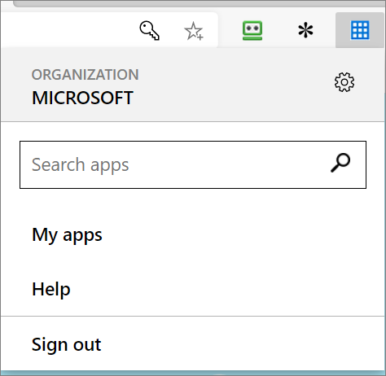
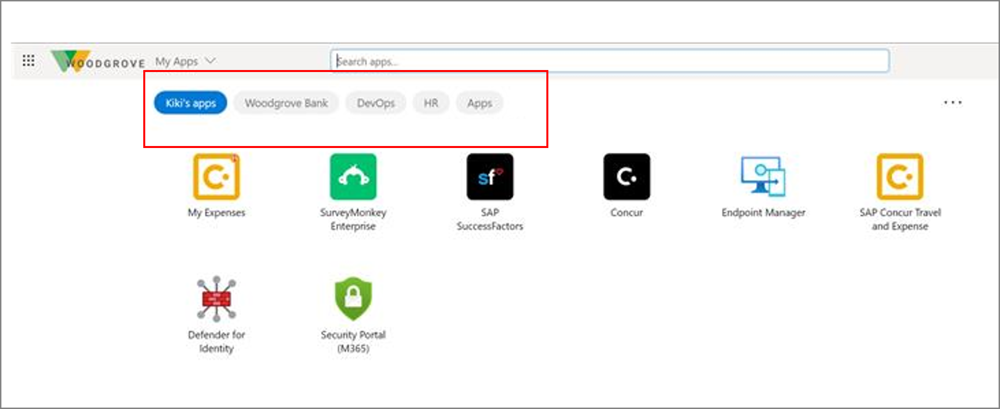

# Plan Azure Active Directory My Apps configuration

> [!NOTE]
> This article is designed for IT professionals who need to plan the configuration of their organization’s My Apps portal. 
>
> **For end user documentation, see [Sign in and start apps from the My Apps portal](../user-help/my-apps-portal-end-user-access.md)**.

Azure Active Directory (Azure AD) My Apps is a web-based portal for launching and managing apps. The My Apps page gives users a single place to start their work and find all the applications to which they have access. Users access My Apps at [https://myapps.microsoft.com](https://myapps.microsoft.com/).

> [!VIDEO https://www.youtube.com/embed/atj6Ivn5m0k]

## Why Configure My apps

The My Apps portal is available to users by default and cannot be turned off. It’s important to configure it so that they have the best possible experience, and the portal stays useful. 

Any application in the Azure Active Directory enterprise applications list appears when both of the following conditions are met:

* The visibility property for the app is set to true. 

* The app is assigned to any user or group. It appears for assigned users.

Configuring the portal ensures that the right people can easily find the right apps.

 
### How is the My Apps portal used?

Users access the My Apps portal to:

* Discover and access all their organization’s Azure AD-connected applications to which they have access.

   * It’s best to ensure apps are configured for single sign-on (SSO) to provide users the best experience.

* Request access to new apps that are configured for self-service.

* Create personal collections of apps.

* Manage access to apps for others when assigned the role of group owner or delegated control for the group used to grant access to the application(s).

Administrators can configure:

* [Consent experiences](../manage-apps/configure-user-consent.md)  including terms of service.

* [Self-service application discovery and access requests](../manage-apps/access-panel-manage-self-service-access.md).

* [Collections of applications](../manage-apps/access-panel-collections.md).

* Assignment of icons to applications

* User-friendly names for applications

* Company branding shown on My Apps

 

## Plan consent configuration

### User consent for applications 

Before a user can sign in to an application and the application can access your organization's data, a user or an admin must grant the application permissions. You can configure whether user consent is allowed, and under which conditions. **Microsoft recommends you only allow user consent for applications from verified publishers.**

For more information, see [Configure how end-users consent to applications](../manage-apps/configure-user-consent.md)

### Group owner consent for apps accessing data

Group and team owners can authorize applications, such as applications published by third-party vendors, to access your organization's data associated with a group. See [Resource-specific consent in Microsoft Teams](https://docs.microsoft.com/microsoftteams/resource-specific-consent) to learn more. 

You can configure whether you'd like to allow or disable this feature.

For more information, see [Configure group consent permissions](../manage-apps/configure-user-consent-groups.md).

### Plan communications

Communication is critical to the success of any new service. Proactively inform your users how and when their experience will change and how to gain support if needed.

Although My Apps doesn’t typically create user issues, it’s important to prepare. Create guides and a list of all resources for your support personnel before your launch.

#### Communications templates

Microsoft provides [customizable templates for emails and other communications](https://aka.ms/APTemplates) for My Apps. You can adapt these assets for use in other communications channels as appropriate for your corporate culture.

 

## Plan your SSO configuration

It's best if SSO is enabled for all apps in the My Apps portal so that users have a seamless experience without the need to enter their credentials.

Azure AD supports multiple SSO options. 

* To learn more, see [Single sign-on options in Azure AD](sso-options.md).

* To learn more about using Azure AD as an identity provider for an app, see the [Quickstart Series on Application Management](../manage-apps/view-applications-portal.md).

### Use federated SSO if possible

For the best user experience with the My Apps page, start with the integration of cloud applications that are available for federated SSO (OpenID Connect or SAML). Federated SSO allows users to have a consistent one-click experience across app launching surfaces and tends to be more robust in configuration control.

For more information on how to configure your software as a service (SaaS) applications for SSO, see the [SaaS SSO deployment plan]../Desktop/plan-sso-deployment.md).

### Considerations for special SSO circumstances

> [!TIP]
> For a better user experience, use Federated SSO with Azure AD (OpenID Connect/SAML) when an application supports it, instead of password-based SSO and ADFS.

To sign in to password-based SSO applications, or to applications that are accessed by Azure AD Application Proxy, users need to install and use the My Apps secure sign-in extension. Users are prompted to install the extension when they first launch the password-based SSO or Application Proxy application. 

For detailed information on the extension, see [Installing My Apps browser extension](../user-help/my-apps-portal-end-user-access.md).

If you must integrate these applications, you should define a mechanism to deploy the extension at scale with [supported browsers](../user-help/my-apps-portal-end-user-access.md). Options include:

* [User-driven download and configuration for Chrome, Firefox, Microsoft Edge, or IE](../user-help/my-apps-portal-end-user-access.md)

* [Configuration Manager for Internet Explorer](/mem/configmgr/core/clients/deploy/deploy-clients-to-windows-computers)

The extension allows users to launch any app from its search bar, finding access to recently used applications, and having a link to the My Apps page.

#### Plan for mobile access

For applications that use password-based SSO or accessed by using [Microsoft Azure AD Application Proxy](../manage-apps/application-proxy.md), you must use Microsoft Edge mobile. For other applications, any mobile browser can be used. 

### Linked SSO

Applications can be added by using the Linked SSO option. You can configure an application tile that links to the URL of your existing web application. Linked SSO allows you to start directing users to the My Apps portal without migrating all the applications to Azure AD SSO. You can gradually move to Azure AD SSO-configured applications without disrupting the users’ experience.

## Plan the user experience

By default, all applications to which the user has access and all applications configured for self-service discovery appear in the user’s My Apps panel. For many organizations, this can be a very large list, which can become burdensome if not organized

### Plan My Apps collections

Every Azure AD application to which a user has access will appear on My Apps in the All Apps collection. Use collections to group related applications and present them on a separate tab, making them easier to find. For example, you can use collections to create logical groupings of applications for specific job roles, tasks, projects, and so on. 

End users can also customize their experience by

* Creating their own app collections.

* [Hiding and reordering app collections](access-panel-collections.md).

There’s an option to hide apps from the My Apps portal, while still allowing access from other locations, such as the Microsoft 365 portal. Learn more: [Hide an application from user’s experience in Azure Active Directory](hide-application-from-user-portal.md).

> [!IMPORTANT]
> Only 950 apps to which a user has access can be accessed through My Apps. This includes apps hidden by either the user or the administrator. 

### Plan self-service group management membership

You can enable users to create and manage their own security groups or Microsoft 365 groups in Azure AD. The owner of the group can approve or deny membership requests and delegate control of group membership. Self-service group management features aren’t available for mail-enabled security groups or distribution lists.

To plan for self-service group membership, determine if you’ll allow all users in your organization to create and manage groups or only a subset of users. If you’re allowing a subset of users, you’ll need to set up a group to which those people are added. 

See [Set up self-service group management in Azure Active Directory](../enterprise-users/groups-self-service-management.md) for details on enabling these scenarios.

### Plan self-service application access

You can enable users to discover and request access to applications via the My Apps panel. To do so, you must first 

* enable self-service group management

* enable app for SSO

* create a group for application access

When users request access, they're requesting access to the underlying group, and group owners can be delegate permission to manage the group membership and thus application access. Approval workflows are available for explicit approval to access applications. Users who are approvers will receive notifications within the My Apps portal when there are pending request for access to the application.

## Plan reporting and auditing

Azure AD provides [reports that offer technical and business insights]../reports-monitoring/overview-reports.md). Work with your business and technical application owners to assume ownership of these reports and to consume them regularly. The following table provides some examples of typical reporting scenarios.

| Example| Manage risk| Increase productivity| Governance and compliance |
| - | - | - | -|
| Report types| Application permissions and usage| Account provisioning activity| Review who is accessing the applications |
| Potential actions| Audit access; revoke permissions| Remediate any provisioning errors| Revoke access |

Azure AD keeps most auditing data for 30 days. The data is available via Azure Admin Portal or API for you to download into your analysis systems.

#### Auditing

Audit logs for application access are available for 30 days. If your organization requires longer retention, export the logs to a Security Information Event and Management (SIEM) tool, such as Splunk or ArcSight.

For auditing, reporting, and disaster recovery backups, document the required frequency of download, what the target system is, and who’s responsible for managing each backup. You might not need separate auditing and reporting backups. Your disaster recovery backup should be a separate entity.

## Validate your deployment

Ensure your My Apps deployment is thoroughly tested and a rollback plan is in place.

Conduct the following tests with both corporate-owned devices and personal devices. These test cases should also reflect your business use cases. Following are a few cases based on typical technical scenarios. Add others specific to your needs.

#### Application SSO access test case examples:

| Business case| Expected result |
| - | - |
| User signs in into the My Apps portal| User can sign in and see their applications |
| User launches a federated SSO application| User is automatically signed in to the application |
| User launches a password SSO application for the first time| User needs to install the My Apps extension |
| User launches a password SSO application a subsequent time| User is automatically signed in to the application |
| User launches an app from Microsoft 365 Portal| User is automatically signed in to the application |
| User launches an app from the Managed Browser| User is automatically signed in to the application |

#### Application self-service capabilities test case examples

| Business case| Expected result |
| - | - |
| User can manage membership to the application| User can add/remove members who have access to the app |
| User can edit the application| User can edit the application’s description and credentials for password SSO applications |

### Rollback steps

It’s important to plan what to do if your deployment doesn’t go as planned. If SSO configuration fails during deployment, you must understand how to [troubleshoot SSO issues](../hybrid/tshoot-connect-sso.md) and reduce impact to your users. In extreme circumstances, you might need to [roll back SSO](plan-sso-deployment.md).

## Manage your implementation

Use the least privileged role to accomplish a required task within Azure Active Directory. [Review the different roles that are available](../roles/permissions-reference.md) and choose the right one to solve your needs for each persona for this application. Some roles might need to be applied temporarily and removed after the deployment is completed.

| Personas| Roles| Azure AD role |
| - | - | - |
| Helpdesk admin| Tier 1 support| None |
| Identity admin| Configure and debug when issues impact Azure AD| Global admin |
| Application admin| User attestation in application, configuration on users with permissions| None |
| Infrastructure admins| Cert rollover owner| Global admin |
| Business owner/stakeholder| User attestation in application, configuration on users with permissions| None |

You can use [Privileged Identity Management](../privileged-identity-management/pim-configure.md) to manage your roles to provide additional auditing, control, and access review for users with directory permissions.

## Next steps

[Plan a deployment of Azure AD Multi-Factor Authentication](../authentication/howto-mfa-getstarted.md)

[Plan an Application Proxy deployment](application-proxy-deployment-plan.md)

