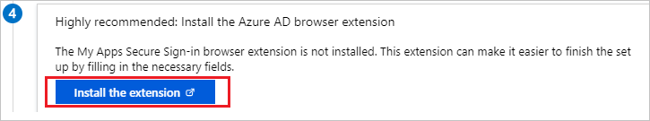
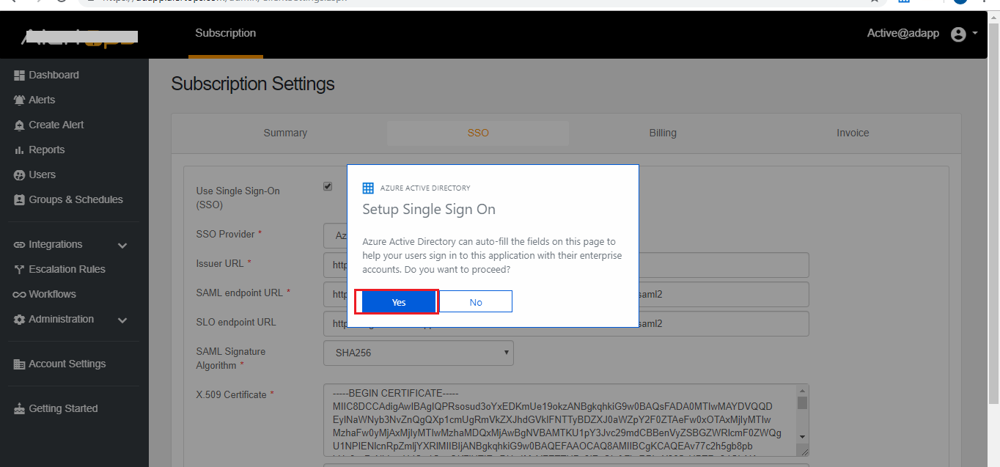
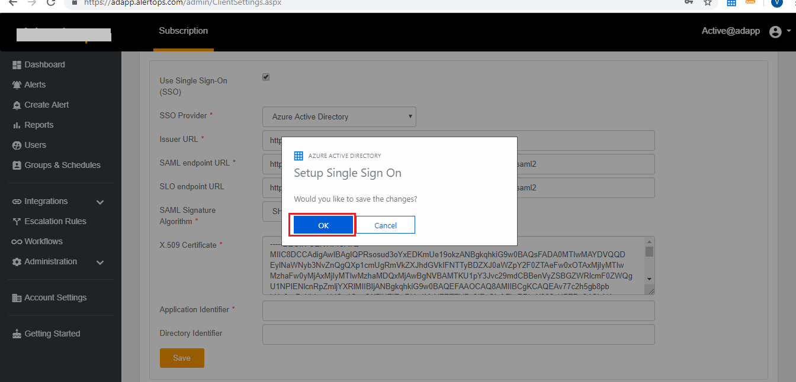
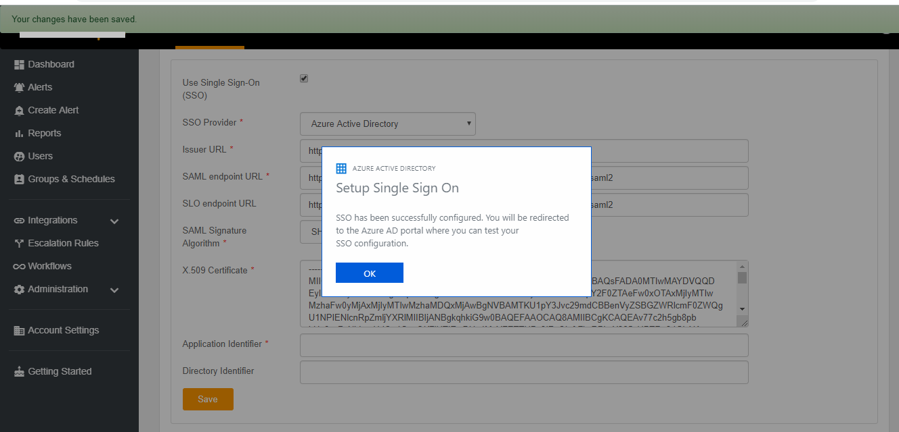

# One-click app configuration of single sign-on

 In this tutorial, you learn how to perform one-click, single sign-on (SSO) configuration for SAML-supporting, Microsoft Entra applications from the Azure Marketplace.

## Introduction to one-click SSO

The one-click SSO feature is designed to configure single sign-on for Azure Marketplace apps that support SAML protocol. On the Microsoft Entra SSO configuration page, this option allows you to automatically configure the Microsoft Entra metadata on the application side. In this way, you can quickly set up SSO with minimal manual effort.

## Advantages of one-click SSO

- Quick SSO configuration of Azure Marketplace applications that require manual setup on application side.
- More efficient and accurate SSO configuration.
- No partner communication or support needed for  setup. The application provides the UI for SAML configuration.

## Prerequisites

- An active subscription of the application to configure with SSO. You also need admin credentials.
- The **My Apps Secure Sign-in extension** from Microsoft installed in the browser. For more information, see [Access and use apps on the My Apps portal](https://support.microsoft.com/account-billing/sign-in-and-start-apps-from-the-my-apps-portal-2f3b1bae-0e5a-4a86-a33e-876fbd2a4510).

## One-click SSO configuration steps

1. Add the application from the Azure Marketplace.

2. Select **Single sign-on**.

3. Select **Enable single sign-on**.

4. Populate the mandatory configuration values in the **Basic SAML Configuration** section.

    > [!NOTE]
    > If the application has custom claims that you need to configure, handle them before performing one-click SSO.

5. If the one-click SSO feature is available for your Azure Marketplace application, you see following screen. You might have to install the **My Apps Secure Sign-in browser extension** by selecting **Install the extension**.

   

6. After you add the extension to the browser, select **Setup \<Application Name\>**. After you're redirected to the application admin portal, sign in as an administrator.

   

7. The browser extension automatically configures SSO on the application. Confirm by selecting **Yes**.

   

   > [!NOTE]
   > If SSO configuration for your application requires additional steps, following the prompts to perform the steps.

8. After the configuration has finished, select **OK** to save the changes.

   

9. A confirmation window displays to let you know that the SSO settings are successfully configured.

   

10. After the configuration is successful, you're signed out of the application and returned to the [Microsoft Entra admin center](https://entra.microsoft.com).

11. You can select **Test** to test single sign-on.

## Additional resources

- [List of tutorials on how to integrate SaaS apps with Microsoft Entra ID](../saas-apps/tutorial-list.md)
- [What is the My Apps Secure Sign-in browser extension?](https://support.microsoft.com/account-billing/sign-in-and-start-apps-from-the-my-apps-portal-2f3b1bae-0e5a-4a86-a33e-876fbd2a4510)
