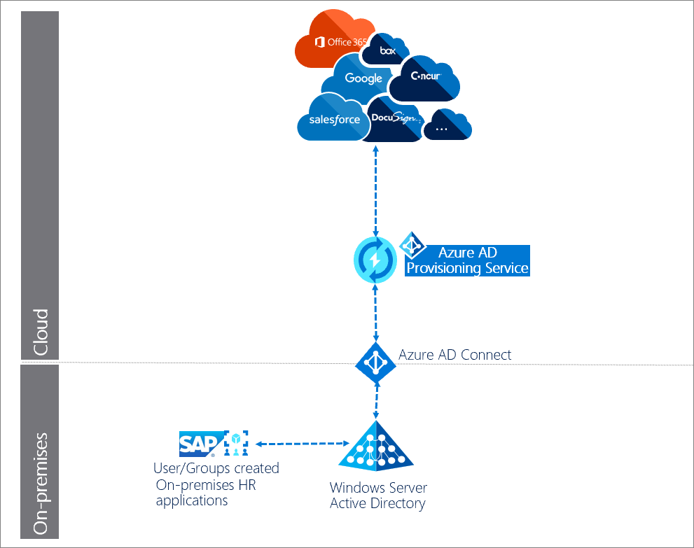
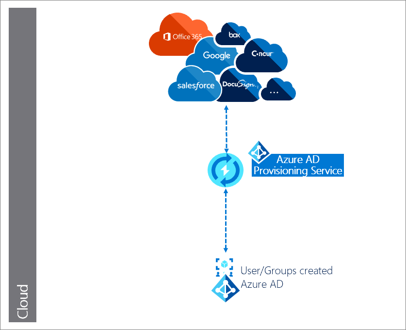
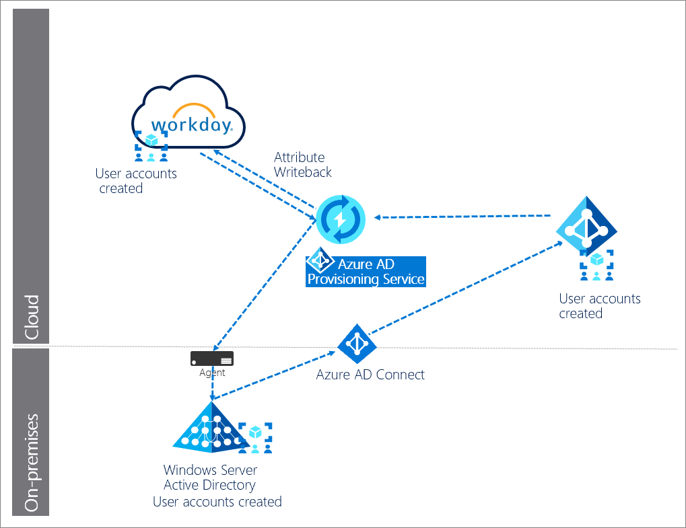

# Plan an automatic user provisioning deployment

Many organizations rely on software as a service (SaaS) applications such as ServiceNow, Zscaler, and Slack for end-user productivity. Historically IT staff have relied on manual provisioning methods such as uploading CSV files, or using custom scripts to securely manage user identities in each SaaS application. These processes are error prone, insecure, and hard to manage.

Azure Active Directory (Azure AD) automatic user provisioning simplifies this process by securely automating the creation, maintenance, and removal of user identities in SaaS applications based on business rules. This automation allows you to effectively scale your identity management systems on both cloud-only and hybrid environments as you expand their dependency on cloud-based solutions.

See [Automate user provisioning and deprovisioning to SaaS applications with Azure Active Directory](user-provisioning.md) to better understand the functionality.

## Learn

User provisioning creates a foundation for ongoing identity governance and enhances the quality of business processes that rely on authoritative identity data.

### Key benefits

The key benefits of enabling automatic user provisioning are:

* **Increased productivity**. You can manage user identities across SaaS applications with a single user provisioning management interface. This interface has a single set of provisioning policies.

* **Manage risk**. You can increase security by automating changes based on employee status or group memberships that define roles and/or access.

* **Address compliance and governance**. Azure AD supports native audit logs for every user provisioning request. Requests are executed in both the source and target systems. This enables you to track who has access to applications from a single screen.

* **Reduce cost**. Automatic user provisioning reduces costs by avoiding inefficiencies and human error associated with manual provisioning. It reduces the need for custom-developed user provisioning solutions, scripts, and audit logs.

### Licensing

Azure AD provides self-service integration of any application using templates provided in the application gallery menu. For a full list of license requirements, see [Azure AD licensing page](https://azure.microsoft.com/pricing/details/active-directory/).

#### Application licensing

You'll need the appropriate licenses for the application(s) you want to automatically provision. Discuss with the application owners whether the users assigned to the application have the proper licenses for their application roles. If Azure AD manages automatic provisioning based on roles, the roles assigned in Azure AD must align to application licenses. Incorrect licenses owned in the application may lead to errors during the provisioning/updating of a user.

### Terms

This article uses the following terms:

* CRUD operations - Actions taken on user accounts: Create, Read, Update, Delete.

* Single sign-on (SSO) - The ability for a user to sign-on once and access all SSO enabled applications. In the context of user provisioning, SSO is a result of users having a single account to access all systems that use automatic user provisioning.

* Source system - The repository of users that the Azure AD provisions from. Azure AD is the source system for most pre-integrated provisioning connectors. However, there are some exceptions for cloud applications such as SAP, Workday, and AWS. For example, see [User provisioning from Workday to AD](../saas-apps/workday-inbound-tutorial.md).

* Target system - The repository of users that the Azure AD provisions to. The Target system is typically a SaaS application such as ServiceNow, Zscaler, and Slack. The target system can also be an on-premises system such as AD.

* [System for Cross-domain Identity Management (SCIM)](https://aka.ms/scimoverview) -  An open standard that allows for the automation of user provisioning. SCIM communicates user identity data between identity providers such as Microsoft, and service providers like Salesforce or other SaaS apps that require user identity information.

### Training resources

| Resources| Link and Description |
| - | - |
| On-demand webinars| [Manage your Enterprise Applications with Azure AD](https://info.microsoft.com/CO-AZUREPLAT-WBNR-FY18-03Mar-06-ManageYourEnterpriseApplicationsOption1-MCW0004438_02OnDemandRegistration-ForminBody.html) ‎Learn how Azure AD can help you achieve SSO to your enterprise SaaS applications and best practices for controlling access. |
| Videos| [What is user provisioning in Active Azure Directory?](https://youtu.be/_ZjARPpI6NI)   [How to deploy user provisioning in Active Azure Directory?](https://youtu.be/pKzyts6kfrw)   [Integrating Salesforce with Azure AD: How to automate User Provisioning](https://azure.microsoft.com/resources/videos/integrating-salesforce-with-azure-ad-how-to-automate-user-provisioning/) |
| Online courses| SkillUp Online:  [Managing Identities](https://skillup.online/courses/course-v1:Microsoft+AZ-100.5+2018_T3/about)   Learn how to integrate Azure AD with many SaaS applications and to secure user access to those applications. |
| Books| [Modern Authentication with Azure Active Directory for Web Applications (Developer Reference) 1st Edition](https://www.amazon.com/Authentication-Directory-Applications-Developer-Reference/dp/0735696942/ref=sr_1_fkmr0_1?keywords=Azure+multifactor+authentication&qid=1550168894&s=gateway&sr=8-1-fkmr0).    ‎This is an authoritative, deep-dive guide to building Active Directory authentication solutions for these new environments. |
| Tutorials| See the [list of tutorials on how to integrate SaaS apps with Azure AD](../saas-apps/tutorial-list.md). |
| FAQ| [Frequently asked questions](user-provisioning.md) on automated user provisioning |

### Solution architectures

The Azure AD provisioning service provisions users to SaaS apps and other systems by connecting to user management API endpoints provided by each application vendor. These user management API endpoints allow Azure AD to programmatically create, update, and remove users.

#### Automatic user provisioning for hybrid enterprises

In this example, users and or groups are created in an HR database connected to an on-premises directory. The Azure AD provisioning service manages automatic user provisioning to the target SaaS applications.

 

**Description of workflow:**

1. Users/groups are created in an on-premises HR application/system, such as SAP. 

1. **Azure AD Connect agent** runs scheduled synchronizations of identities (users and groups) from the local AD to Azure AD.

1. **Azure AD provisioning service** begins an [initial cycle](user-provisioning.md) against the source system and target system. 

1. **Azure AD provisioning service** queries the source system for any users and groups changed since the initial cycle, and pushes changes in [incremental cycles](user-provisioning.md).

#### Automatic user provisioning for cloud-only enterprises

In this example, user creation occurs in Azure AD and the  Azure AD provisioning service manages automatic user provisioning to the target (SaaS) applications.

**Description of workflow:**

1. Users/groups are created in Azure AD.

1. **Azure AD provisioning service** begins an [initial cycle](user-provisioning.md) against the source system and target system. 

1. **Azure AD provisioning service** queries the source system for any users and groups updated since the initial cycle, and performs any [incremental cycles](user-provisioning.md).

#### Automatic user provisioning for cloud HR applications 

In this example, the users and or groups are created in a cloud HR application like such as Workday and SuccessFactors. The Azure AD provisioning service and Azure AD Connect provisioning agent provisions the user data from the cloud HR app tenant into AD. Once the accounts are updated in AD, it is synced with Azure AD through Azure AD Connect, and the email addresses and username attributes can be written back to the cloud HR app tenant.

1.	**HR team** performs the transactions in the cloud HR app tenant.
2.	**Azure AD provisioning service** runs the scheduled cycles from the cloud HR app tenant and identifies changes that need to be processed for sync with AD.
3.	**Azure AD provisioning service** invokes the Azure AD Connect provisioning agent with a request payload containing AD account create/update/enable/disable operations.
4.	**Azure AD Connect provisioning agent** uses a service account to manage AD account data.
5.	**Azure AD Connect** runs delta sync to pull updates in AD.
6.	**AD** updates are synced with Azure AD. 
7.	**Azure AD provisioning service** writebacks email attribute and username from Azure AD to the cloud HR app tenant.

## Plan the deployment project

Consider your organizational needs to determine the strategy for deploying user provisioning in your environment.

### Engage the right stakeholders

When technology projects fail, it's typically because of mismatched expectations on impact, outcomes, and responsibilities. To avoid these pitfalls, [ensure you're engaging the right stakeholders](https://aka.ms/deploymentplans) and that stakeholder roles in the project are well understood by documenting the stakeholders and their project input and accountabilities.

### Plan communications

Communication is critical to the success of any new service. Proactively communicate with your users how their experience will change, when it will change, and how to gain support if they experience issues.

### Plan a pilot

We recommend that the initial configuration of automatic user provisioning be in a test environment with a small subset of users before scaling it to all users in production. See [best practices](../fundamentals/active-directory-deployment-plans.md#best-practices-for-a-pilot) for running a pilot.

#### Best practices for a pilot  

A pilot allows you to test with a small group before deploying a capability for everyone. Ensure that as part of your testing, each use case within your organization is thoroughly tested.

In your first wave, target IT, usability, and other appropriate users who can test and provide feedback. Use this feedback to further develop the communications and instructions you send to your users, and to give insights into the types of issues your support staff may see.

Widen the rollout to larger groups of users by increasing the scope of the group(s) targeted. This can be done through [dynamic group membership](../users-groups-roles/groups-dynamic-membership.md), or by manually adding users to the targeted group(s).

## Plan application connections and administration

Use the Azure AD portal to view and manage all the applications that support provisioning. See [Finding your apps in the portal](configure-automatic-user-provisioning-portal.md).

### Determine the type of connector to use

The actual steps required to enable and configure automatic provisioning vary depending on the application. If the application you wish to automatically provision is listed in the [Azure AD SaaS app gallery](../saas-apps/tutorial-list.md), then you should select the [app-specific integration tutorial](../saas-apps/tutorial-list.md) to configure its pre-integrated user provisioning connector.

If not, follow the steps below:

1. [Create a request](../develop/howto-app-gallery-listing.md) for a pre-integrated user provisioning connector. Our team will work with you and the application developer to onboard your application to our platform if it supports SCIM.

1. Use the [BYOA SCIM](use-scim-to-provision-users-and-groups.md) generic user provisioning support for the app. This is a requirement for Azure AD to provision users to the app without a pre-integrated provisioning connector.

1. If the application is able to utilize the BYOA SCIM connector, then refer to [BYOA SCIM integration tutorial](use-scim-to-provision-users-and-groups.md) to configure the BYOA SCIM connector for the application.

For more information, see [What applications and systems can I use with Azure AD automatic user provisioning?](user-provisioning.md)

### Collect information to authorize application access

Setting up automatic user provisioning is a per-application process. For each application, you need to provide [administrator credentials](configure-automatic-user-provisioning-portal.md) to connect to the target system’s user management endpoint.

The image below shows one version of the required admin credentials:

While some applications require the admin username and password, others may require a bearer token.

## Plan user and group provisioning

If you enable user provisioning for enterprise apps, the [Azure portal](https://portal.azure.com/) controls its attribute values through attribute mapping.

### Determine operations for each SaaS app

Each application may have unique user or group attributes that must be mapped to the attributes in your Azure AD. Application may have only a subset of CRUD operations available.

For each application, document the following information:

* CRUD provisioning operations to be performed on the user and or Group objects for the target systems. For example, each SaaS app business owner may not want all possible operations.

* Attributes available in the source system

* Attributes available in the target system

* Mapping of attributes between systems.

### Choose which users and groups to provision

Before implementing automatic user provisioning, you must determine the users and groups to be provisioned to your application.

* Use [scoping filters](define-conditional-rules-for-provisioning-user-accounts.md) to define attribute-based rules that determine which users are provisioned to an application.

* Next, use [user and group assignments](assign-user-or-group-access-portal.md) as needed for additional filtering.

### Define user and group attribute mapping

To implement automatic user provisioning, you need to define the user and group attributes that are needed for the application. There's a pre-configured set of attributes and [attribute-mappings](configure-automatic-user-provisioning-portal.md) between Azure AD user objects, and each SaaS application’s user objects. Not all SaaS apps enable group attributes.

Azure AD supports by direct attribute-to-attribute mapping, providing constant values, or [writing expressions for attribute mappings](functions-for-customizing-application-data.md). This flexibility gives you fine control of what will be populated in the targeted system's attribute. You can use [Microsoft Graph API](export-import-provisioning-configuration.md) and Graph Explorer to export your user provisioning attribute mappings and schema to a JSON file and import it back into Azure AD.

For more information, see [Customizing User Provisioning Attribute-Mappings for SaaS Applications in Azure Active Directory](customize-application-attributes.md).

### Special considerations for user provisioning

Consider the following to reduce issues post-deployment:

* Ensure that the attributes used to map user/group objects between source and target applications are resilient. They shouldn't cause users/groups to be provisioned incorrectly if the attributes change (for example, a user moves to a different part of the company).

* Applications may have specific restrictions and/or requirements that need to be met for user provisioning to work correctly. For example, Slack truncates values for certain attributes. Refer to [automatic user provisioning tutorials](../saas-apps/tutorial-list.md) specific to each application.

* Confirm schema consistency between source and target systems. Common issues include attributes such as UPN or mail not matching. For example, UPN in Azure AD set as *john_smith@contoso.com* and in the app, it's *jsmith@contoso.com*. For more information, see The [User and group schema reference](use-scim-to-provision-users-and-groups.md).

## Plan testing and security

At each stage of your deployment ensure that you’re testing that results are as expected, and auditing the provisioning cycles.

### Plan testing

Once you have configured automatic user provisioning for the application, you'll run test cases to verify this solution meets your organization’s requirements.

| Scenarios| Expected results |
| - | - |
| User is added to a group assigned to the target system | User object is provisioned in target system.  User can sign-in to target system and perform the desired actions. |
| User is removed from a group that is assigned to target system | User object is deprovisioned in the target system. User can't sign-in to target system. |
| User information is updated in Azure AD by any method | Updated user attributes are reflected in target system after an incremental cycle |
| User is out of scope | User object is disabled or deleted.  Note: This behavior is overridden for [Workday provisioning](skip-out-of-scope-deletions.md). |

### Plan security

It's common for a security review to be required as part of a deployment. If you require a security review, see the many Azure AD [whitepapers](https://www.microsoft.com/download/details.aspx?id=36391) that provides an overview for identity as a service.

### Plan rollback

If the automatic user provisioning implementation fails to work as desired in the production environment, the following rollback steps below can assist you in reverting to a previous known good state:

1. Review the [provisioning summary report](check-status-user-account-provisioning.md) and [provisioning logs](check-status-user-account-provisioning.md#provisioning-logs-preview) to determine what incorrect operations occurred on the affected users and/or groups.

1. Use provisioning audit logs to determine the last known good state of the users and/or groups affected. Also review the source systems (Azure AD or AD).

1. Work with the application owner to update the users and/or groups affected directly in the application using the last known good state values.

## Deploy automatic user provisioning service

Choose the steps that align to your solution requirements.

### Prepare for the initial cycle

When the Azure AD provisioning service runs for the first time, the initial cycle against the source system and target systems creates a snapshot of all user objects for each target system.

When enabling automatic provisioning for an application, the initial cycle can take anywhere from 20 minutes to several hours. The duration depends on the size of the Azure AD directory and the number of users in scope for provisioning. See [How to improve provisioning performance](application-provisioning-when-will-provisioning-finish.md).

The provisioning service stores the state of both systems after the initial cycle, improving performance of subsequent incremental cycles.

### Configure automatic user provisioning

Use the [Azure portal](https://portal.azure.com/) to manage automatic user account provisioning and de-provisioning for applications that support it. Follow the steps in [How do I set up automatic provisioning to an application?](user-provisioning.md)

The Azure AD user provisioning service can also be configured and managed using the [Microsoft Graph API](https://developer.microsoft.com/graph/docs/api-reference/beta/resources/synchronization-overview).

## Manage automatic user provisioning

Now that you've deployed, you need to manage the solution.

### Monitor user provisioning operation health

After a successful [initial cycle](user-provisioning.md), the Azure AD provisioning service will run incremental updates indefinitely, at intervals specific to each application, until one of the following events occurs:

* The service is manually stopped, and a new initial cycle is triggered using the [Azure portal](https://portal.azure.com/), or using the appropriate [Microsoft Graph API](https://developer.microsoft.com/graph/docs/api-reference/beta/resources/synchronization-overview) command.

* A new initial cycle is triggered by a change in attribute mappings or scoping filters.

* The provisioning process goes into quarantine due to a high error rate and stays in quarantine for more than four weeks when it will be automatically disabled.

To review these events, and all other activities performed by the provisioning service, refer to Azure AD [provisioning logs](../reports-monitoring/concept-provisioning-logs.md?context=azure/active-directory/manage-apps/context/manage-apps-context).

To understand how long the provisioning cycles take and monitor the progress of the provisioning job, you can [check the status of user provisioning](application-provisioning-when-will-provisioning-finish-specific-user.md).

### Gain insights from reports

Azure AD can provide [additional insights](application-provisioning-when-will-provisioning-finish-specific-user.md) into your organization’s user provisioning usage and operational health through audit logs and reports.

Admins should check the  provisioning summary report to monitor the operational health of the provisioning job. All activities performed by the provisioning service are recorded in the Azure AD audit logs. See [Tutorial: Reporting on automatic user account provisioning](check-status-user-account-provisioning.md).

We recommend that you assume ownership of and consume these reports on a cadence that meets your organization’s requirements. Azure AD retains most audit data for 30 days.

### Troubleshoot

Refer to the following links to troubleshoot any issues that may turn up during provisioning:

* [Problem configuring user provisioning to an Azure AD Gallery application](application-provisioning-config-problem.md)

* [Sync an attribute from your on-premises Active Directory to Azure AD for provisioning to an application](user-provisioning-sync-attributes-for-mapping.md)

* [User provisioning to an Azure AD Gallery application is taking hours or more](application-provisioning-when-will-provisioning-finish.md)

* [Problem saving administrator credentials while configuring user provisioning to an Azure Active Directory Gallery application](application-provisioning-config-problem-storage-limit.md)

* [No users are being provisioned to an Azure AD Gallery application](application-provisioning-config-problem-no-users-provisioned.md)

* [Wrong set of users are being provisioned to an Azure AD Gallery application](application-provisioning-config-problem-wrong-users-provisioned.md)

### Helpful documentation

* [Writing expressions for attribute mappings](functions-for-customizing-application-data.md)

* [Azure AD synchronization API overview](https://developer.microsoft.com/graph/docs/api-reference/beta/resources/synchronization-overview)

* [Skip deletion of user accounts that go out of scope](skip-out-of-scope-deletions.md)

* [Azure AD Connect Provisioning Agent: Version release history](provisioning-agent-release-version-history.md)

#### Resources

* [Provide product feedback](https://feedback.azure.com/forums/169401-azure-active-directory)

* [Keep up to date on what's new with Azure AD](https://azure.microsoft.com/updates/?product=active-directory)

* [Stack overflow Azure AD forum](https://stackoverflow.com/questions/tagged/azure-active-directory)

## Next steps
* [Configure Automatic User Provisioning](configure-automatic-user-provisioning-portal.md)

* [Export or import your provisioning configuration by using Microsoft Graph API](export-import-provisioning-configuration.md)

* [Writing expressions for attribute mappings in Azure Active directory](functions-for-customizing-application-data.md)
