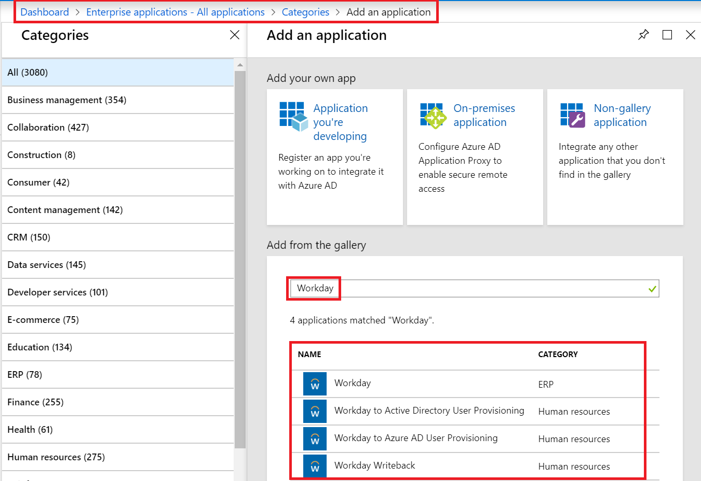
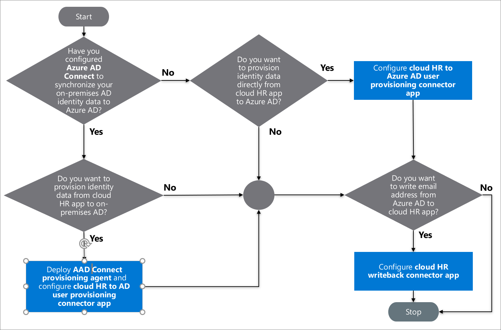

# Plan cloud HR application to Azure Active Directory user provisioning

Historically IT staff have relied on manual methods of creating, updating, and deleting employees such as uploading CSV files, or custom scripts to sync employee data. These provisioning processes are error-prone, insecure, and hard to manage.

To seamlessly manage the end-to-end identity lifecycles of employees, vendors, or contingent workers, [Azure Active Directory (Azure AD) user provisioning service](https://docs.microsoft.com/azure/active-directory/manage-apps/user-provisioning) offers integration with cloud-based Human Resources (HR) applications such as Workday or SuccessFactors.

Azure AD uses this integration to enable the following cloud HR application (app) workflows:

- **Provisioning users to AD** - provision-selected sets of users from a cloud HR app into one or more Active Directory (AD) domains.
- **Provisioning cloud-only users to Azure AD** - in scenarios where AD is not used, provision users directly from the cloud HR app to Azure AD.
- **Write back to the cloud HR app.** - write the email addresses and username attributes from Azure AD back to the cloud HR app.

> [!NOTE]
> This deployment plan guides how to deploy your cloud HR app workflows with Azure AD user provisioning. For information on deploying automatic user provisioning to SaaS apps, refer to [Plan an automatic user provisioning deployment](https://aka.ms/deploymentplans/provisioning).

## Enabled HR scenarios

The Azure AD user provisioning service enables automation of the following HR-based identity lifecycle management scenarios:

- **Hiring new employees** - when a new employee is added to the cloud HR app, a user account is automatically created in AD and Azure AD with the option to write back the email address and username attributes to the cloud HR app.
- **Employee attribute and profile updates** - when an employee record is updated in the cloud HR app (such as their name, title, or manager), their user account will be automatically updated in AD and Azure AD.
- **Employee terminations** - when an employee is terminated in the cloud HR app, their user account is automatically disabled in AD and Azure AD.
- **Employee rehires** - when an employee is rehired in the cloud HR app, their old account can be automatically reactivated or reprovisioned to AD and Azure AD.

## Who is this integration best suited for?

The cloud HR app integration with Azure AD user provisioning is ideally suited for organizations that:

- desire a pre-built, cloud-based solution for cloud HR user provisioning
- require direct user provisioning from cloud HR app to AD, or Azure AD
- require users to be provisioned using data obtained from the cloud HR app
- require joining, moving, and leaving users to be synced to one or more AD forests, domains, and OUs based only on change information detected in the Cloud HR app
- use Office 365 for email

## Learn

User provisioning creates a foundation for ongoing identity governance and enhances the quality of business processes that rely on authoritative identity data.

### Terms

This article uses the following terms:

- **Source system** - the repository of users that Azure AD provisions from (for example, a Cloud HR app such as Workday and SuccessFactors.)
- **Target system** - the repository of users that the Azure AD provisions to (for example, AD, Azure AD, Office365, or other SaaS apps.)
- **Joiners-Movers-Leavers process** - a term used for new hires, transfers, and termination using a cloud HR app as a system of records. The process completes when the service successfully provisions the necessary attributes to the target system.

### Key benefits

This capability of HR-driven IT provisioning offers significant business benefits as listed below:

- **Increase productivity** - you can now automate the assignment of user accounts, Office365 licenses, and provide access to key groups. Automating assignments give new hires immediate access to their job tools and increases productivity.
- **Manage risk** - you can increase security by automating changes based on employee status or group memberships with data flowing in from the cloud HR app. Automating changes ensures that user identities and access to key apps update automatically when users transition or leave the organization.
- **Address compliance and governance** - Azure AD supports native audit logs for user provisioning requests performed by apps of both source and target systems. Auditing enables you to track who has access to the apps from a single screen.
- **Manage cost** - automatic provisioning reduces costs by avoiding inefficiencies and human error associated with manual provisioning. It reduces the need for custom-developed user provisioning solutions built over time using legacy and outdated platforms.

### Licensing

To configure the cloud HR app to Azure AD user provisioning integration, you require a valid [Azure AD Premium license](https://azure.microsoft.com/pricing/details/active-directory/) and a license for the cloud HR app such as Workday or SuccessFactors.

You also need a valid Azure AD Premium P1 or higher subscription license for every user that will be sourced from the cloud HR app and provisioned to either AD or Azure AD. Any Improper number of licenses owned in the cloud HR app may lead to errors during user provisioning.

### Prerequisites

- Azure AD global administrator access to configure the Azure AD Connect provisioning agent.
- A test and production instance of the cloud HR app.
- Administrator permissions in the cloud HR app to create a system integration user and make changes to test employee data for testing purposes.
- For user provisioning to AD, a server running Windows Server 2012 or greater with .NET 4.7.1+ runtime is required to host the [Azure AD Connect provisioning agent](https://go.microsoft.com/fwlink/?linkid=847801).
- [Azure AD Connect](https://docs.microsoft.com/azure/active-directory/hybrid/whatis-azure-ad-connect) for synchronizing users between AD and Azure AD.

### Training resources

| **Resources** | **Link and Description** |
|:-|:-|
| Videos | [What is user provisioning in Active Azure Directory?](https://youtu.be/_ZjARPpI6NI) |
| | [How to deploy user provisioning in Active Azure Directory?](https://youtu.be/pKzyts6kfrw) |
| Tutorials | See the [list of tutorials on how to integrate SaaS apps with Azure AD](https://docs.microsoft.com/azure/active-directory/active-directory-saas-tutorial-list) |
| | [Tutorial: Configure Workday for automatic user provisioning](https://docs.microsoft.com/azure/active-directory/saas-apps/workday-inbound-tutorial#frequently-asked-questions-faq) |
| FAQ | [Automated user provisioning](https://docs.microsoft.com/azure/active-directory/manage-apps/user-provisioning#what-applications-and-systems-can-i-use-with-azure-ad-automatic-user-provisioning) |
| | [Provisioning from Workday to Azure AD](https://docs.microsoft.com/azure/active-directory/saas-apps/workday-inbound-tutorial#frequently-asked-questions-faq) |

### Solution architecture

The following example describes the end-to-end user provisioning solution architecture for common hybrid environments and includes:

- **Authoritative HR data flow – from cloud HR app to AD** - in this flow, the HR event (Joiners-Movers-Leavers process) is initiated in the cloud HR app tenant. The Azure AD provisioning service and Azure AD Connect provisioning agent provisions the user data from the cloud HR app tenant into AD. Depending on the event, it may lead to create/update/enable/disable operations in AD.
- **Sync with Azure AD and Writeback email and username from on-premises AD to cloud HR app** - once the accounts are updated in AD, it is synced with Azure AD through Azure AD Connect, and the email addresses and username attributes can be written back to the cloud HR app tenant.

#### Description of workflow

The key steps indicated in the diagram are:  

1. **HR team** performs the transactions in the cloud HR app tenant.
2. **Azure AD provisioning service** runs the scheduled cycles from the cloud HR app tenant and identifies changes that need to be processed for sync with AD.
3. **Azure AD provisioning service** invokes the Azure AD Connect provisioning agent with a request payload containing AD account create/update/enable/disable operations.
4. **Azure AD Connect provisioning agent** uses a service account to manage AD account data.
5. **Azure AD Connect** runs delta [sync](https://docs.microsoft.com/azure/active-directory/hybrid/how-to-connect-sync-whatis) to pull updates in AD.
6. **AD** updates are synced with Azure AD.
7. **Azure AD provisioning service** writebacks email attribute and username from Azure AD to the cloud HR app tenant.

## Plan the deployment project

Consider your organizational needs while you determine the strategy for this deployment in your environment.

### Engage the right stakeholders

When technology projects fail, they typically do so due to mismatched expectations on impact, outcomes, and responsibilities. To avoid these pitfalls, [ensure that you are engaging the right stakeholders](https://aka.ms/deploymentplans) and that stakeholder roles in the project are well understood by documenting the stakeholders and their project input and accountabilities.

You must include a representative from the HR organization who can provide inputs on existing HR business processes and worker identity + job data processing requirements.

### Plan communications

Communication is critical to the success of any new service. You should proactively communicate with your users how their experience will change, when it will change, and how to gain support if they experience issues.

### Plan a pilot

Integrating HR business processes and identity workflows from the cloud HR app to target systems requires a considerable amount of data validation, data transformation, data cleansing, and end-to-end testing before deploying the solution into production.

We recommend that the initial configuration should be run in a [pilot environment](https://docs.microsoft.com/azure/active-directory/fundamentals/active-directory-deployment-plans#best-practices-for-a-pilot) before scaling it to all users in production.

## Select cloud HR provisioning connector apps

To facilitate Azure AD provisioning workflows between the cloud HR app and AD, there are multiple provisioning connector apps that you can add from the Azure AD app gallery:

- **Cloud HR app to AD user provisioning** – this provisioning connector app facilitates user account provisioning from the Cloud HR app to a single AD domain. If you have multiple domains, you can add one instance of this app from the Azure AD app gallery for each AD domain you need to provision to.
- **Cloud HR app to Azure AD user provisioning** - while Azure AD Connect is the tool that should be used to synchronize AD users to Azure AD, this provisioning connector app can be used to facilitate the provisioning of cloud-only users from the cloud HR app to a single Azure AD tenant.
- **Cloud HR app Writeback** - this provisioning connector app facilitates the write-back of the user's email addresses from Azure AD to the cloud HR app.

For example, the image below lists the Workday connector apps available in the Azure AD app gallery.

### Decision flowchart

Use the decision flow chart below to identify which cloud HR provisioning apps are relevant to your scenario.

## Design Azure AD Connect provisioning agent deployment topology

The provisioning integration between the Cloud HR app and AD requires these four components:

- Cloud HR app tenant
- Provisioning connector app
- Azure AD Connect provisioning agent
- AD domain

The Azure AD Connect provisioning agent deployment topology depends on the number of cloud HR app tenants and AD child domains that you plan to integrate. If you have multiple AD domains, it depends on whether the AD domains are contiguous or [disjoint](https://docs.microsoft.com/windows-server/identity/ad-ds/plan/disjoint-namespace).

Based on your decision, choose one of the deployment scenarios:

- Single cloud HR app tenant -> target single or multiple AD child domains in a trusted forest
- Single cloud HR app tenant -> target multiple child domains in a disjoint AD forest

### Single Cloud HR app tenant -> single or multiple target AD child domains in a trusted forest

We recommend the following production configuration:

|Requirement|Recommendation|
|:-|:-|
|Number of Azure AD Connect provisioning agents to deploy|2 (for high-availability and fail over)
|Number of provisioning connector apps to configure|One app per child domain|
|Server host for Azure AD Connect provisioning agent|Windows 2012 R2+ with line of sight to geo-located AD domain controllers Can coexist with Azure AD Connect service|

### Single cloud HR app tenant -> target multiple child domains in a disjoint AD forest

This scenario involves provisioning users from the cloud HR app to domains in disjoint AD forests.

We recommend the following production configuration:

|Requirement|Recommendation|
|:-|:-|
|Number of Azure AD Connect provisioning agents to deploy on-premises|2 per disjoint AD forest|
|Number of provisioning connector apps to configure|One app per child domain|
|Server host for Azure AD Connect provisioning agent|Windows 2012 R2+ with line of sight to geo-located AD domain controllers Can coexist with Azure AD Connect service|

### Azure AD Connect provisioning agent requirements

The cloud HR app to AD user provisioning solution requires deploying one or more Azure AD Connect provisioning agents on servers running Windows 2012 R2 or greater with a minimum of 4-GB RAM and .NET 4.7.1+ runtime. Ensure that the host server has network access to the target AD domain.

To prepare the on-prem environment, the Azure AD Connect provisioning agent configuration wizard registers the agent with your Azure AD tenant, [opens ports](https://docs.microsoft.com/azure/active-directory/manage-apps/application-proxy-add-on-premises-application#open-ports), [allows access to URLs](https://docs.microsoft.com/azure/active-directory/manage-apps/application-proxy-add-on-premises-application#allow-access-to-urls), and supports [outbound HTTPS proxy configuration](https://docs.microsoft.com/azure/active-directory/saas-apps/workday-inbound-tutorial#how-do-i-configure-the-provisioning-agent-to-use-a-proxy-server-for-outbound-http-communication).

The provisioning agent uses a service account to communicate with the AD domain(s). Before the installation of the agent, we recommend that you create a service account in AD Users and Computers that meet the following requirements:

- A password that does not expire
- Delegated control permissions to read, create, delete, and manage user accounts

You can select domain controllers that should handle provisioning requests. If you have several geographically distributed domain controllers, install the provisioning agent in the same site as your preferred domain controller(s) to improve the reliability and performance of the end-to-end solution.

For high availability, you can deploy more than one Azure AD Connect provisioning agent and register it to handle the same set of on-premises AD domains.

## Plan scoping filters and attribute mapping

When you enable provisioning from the cloud HR app to AD or Azure AD, the Azure portal controls the attribute values through attribute mapping.

### Define scoping filters

Use [scoping filters](https://docs.microsoft.com/azure/active-directory/active-directory-saas-scoping-filters) to define the attribute-based rules that determine which users should be provisioned from the cloud HR app to AD or Azure AD.

When you initiate the Joiners process, gather the following requirements:

- Is the cloud HR app used to on-board both employees and contingent workers?
- Do you plan to use the cloud HR app to Azure AD user provisioning to manage both employees and contingent workers?
- Do you plan to roll out the cloud HR app to Azure AD user provisioning only for a subset of the cloud HR app users (For example, employees only)?

Depending on your requirements, when you configure attribute mappings, you can set the **Source Object Scope** field to select which sets of users in the cloud HR app should be in scope for provisioning to AD. Refer to the cloud HR app tutorial for commonly used scoping filters.

### Determine matching attribute(s)

With provisioning, you get the ability to match existing accounts between the source and target system. When you integrate the Cloud HR app with Azure AD provisioning service, you can [configure attribute mapping](https://docs.microsoft.com/azure/active-directory/manage-apps/configure-automatic-user-provisioning-portal#mappings) to determine what user data should flow from the cloud HR app to AD or Azure AD.

When you initiate the Joiners process, gather the following requirements:

- What is the unique ID in this cloud HR app that is used to identify each user?
- From an identity lifecycle perspective, how do you handle rehires? Do rehires retain their old employee ID?
- Do you process future-dated hires and created AD accounts for them in advance?
- From an identity lifecycle perspective, how do you handle Employee to Contingent Worker conversion, or otherwise?
- Do converted users retain their old AD account or do they get new ones?

Depending on your requirement, Azure AD supports by direct attribute-to-attribute mapping, providing constant values, or [writing expressions for attribute mappings](https://docs.microsoft.com/azure/active-directory/active-directory-saas-writing-expressions-for-attribute-mappings). This flexibility gives you ultimate control of what will be populated in the targeted app attribute. You can use [Microsoft Graph API](https://docs.microsoft.com/azure/active-directory/manage-apps/export-import-provisioning-configuration) and Graph Explorer to export your user provisioning attribute mappings and schema to a JSON file and import it back into Azure AD.

**By default**, the attribute in the cloud HR app that represents the unique Employee ID is used as the matching attribute *mapped to the unique attribute in AD.* For example, in the Workday app scenario, The *Workday* *WorkerID* attribute is mapped to the AD *employeeID* attribute.

You can set multiple matching attributes and assign matching precedence. They are evaluated on matching precedence. As soon as a match is found, no further matching attributes are evaluated.

You can also [customize the default attribute-mappings](https://docs.microsoft.com/azure/active-directory/manage-apps/customize-application-attributes#understanding-attribute-mapping-types) such as change or delete existing attribute-mappings, or create new attribute-mappings according to your business needs. Refer to the cloud HR app tutorial (such as [Workday](https://docs.microsoft.com/azure/active-directory/saas-apps/workday-inbound-tutorial#planning-workday-to-active-directory-user-attribute-mapping-and-transformations)) for a list of custom attributes to map.

### Determine user account status

By default, the provisioning connector app maps the **HR user profile status** to the **user account status** in AD/ Azure AD to determine whether to enable or disable the user account.

When you initiate the Joiners/Leavers process, gather the following requirements:

| Process | Requirements |
| - | - |
| **Joiners** | From an identity lifecycle perspective, how do you handle rehires? Do rehires retain their old employee ID? |
| | Do you process future-dated hires and create AD accounts for them in advance? Are these accounts created in enabled/ disabled state? |
| | From an identity lifecycle perspective, how do you handle Employee to Contingent Worker conversion, or otherwise? |
| | Do converted users retain their old AD account or do they get new ones? |
| **Leavers** | Are terminations handled differently for employees and contingent workers in AD? |
| | What effective dates are considered for processing user termination? |
| | How do employee and contingent worker conversions impact existing AD accounts? |
| | How do you process the "Rescind" operation in AD? Rescind operations need to be handled if future dated hires are created in AD as part of the Joiner Process. |

Depending on your requirements, you may customize the mapping logic using [Azure AD expressions](https://docs.microsoft.com/azure/active-directory/manage-apps/functions-for-customizing-application-data) so that the AD Account is enabled or disabled based on a combination of data points.

### Map cloud HR app to AD user attributes

Each cloud HR app ships with default cloud HR app to AD mappings.

When you initiate the Joiners/Movers/Leavers process, gather the following requirements:

| Process | Requirements |
| - | - |
| **Joiners** | Is the AD account creation process manual, automated, or partially automated? |
| | Do you plan to propagate custom attributes from Cloud HR app to AD? |
| **Movers** | What attributes would you like to process whenever a "Movers" operation takes place in the cloud HR app? |
| | Do you perform any specific attribute validations at the time of user updates? If yes, please provide details. |
| **Leavers** | Are terminations handled differently for employees and contingent workers in AD? |
| | What effective dates are considered for processing user termination? |
| | How do employee and contingent worker conversions impact existing AD accounts? |

Depending on your requirements, you can modify the mappings to meet your integration goals. Refer to the specific cloud HR app tutorial (such as [Workday](https://docs.microsoft.com/azure/active-directory/saas-apps/workday-inbound-tutorial#planning-workday-to-active-directory-user-attribute-mapping-and-transformations)) for a list of custom attributes to map.

### Generate unique attribute value

When you initiate the Joiners process, you may need to generate unique attribute values when setting attributes like CN, samAccountName, and UPN that has unique constraints.

The Azure AD function [SelectUniqueValues](https://docs.microsoft.com/azure/active-directory/manage-apps/functions-for-customizing-application-data#selectuniquevalue) evaluates each rule and then checks the value generated for uniqueness in the target system. See example [Generate unique value for the userPrincipalName (UPN) attribute](https://docs.microsoft.com/azure/active-directory/manage-apps/functions-for-customizing-application-data#generate-unique-value-for-userprincipalname-upn-attribute).

> [!NOTE]
> This function is currently only supported for "Workday to Active Directory User Provisioning." It cannot be used with other provisioning apps.

### Configure AD OU container assignment

It is a common requirement to place AD user accounts into containers based on business units, locations, and departments. When you initiate a Movers process and if there is a supervisory organization change, you may need to move the user from one OU to another in AD.

Use the [Switch()](https://docs.microsoft.com/azure/active-directory/manage-apps/functions-for-customizing-application-data#switch) function to configure the business logic for the OU assignment and map it to the AD attribute *parentDistinguishedName*.

For example, if you want to create users in OU based on the HR attribute "Municipality" then you can use the following expression.

`
Switch([Municipality], "OU=Default,OU=Users,DC=contoso,DC=com", "Dallas", "OU=Dallas,OU=Users,DC=contoso,DC=com", "Austin", "OU=Austin,OU=Users,DC=contoso,DC=com", "Seattle", "OU=Seattle,OU=Users,DC=contoso,DC=com", "London", "OU=London,OU=Users,DC=contoso,DC=com")
`

With this expression, if the Municipality value is Dallas, Austin, Seattle, or London, then the user account will be created in the corresponding OU. If there is no match, then the account will be created in the default OU.

## Plan for password delivery of new user accounts

When you initiate the Joiners process, you will need to set and deliver a temporary password of new user accounts. With cloud HR to Azure AD user provisioning, you can roll out Azure AD [self-service password reset](https://docs.microsoft.com/azure/active-directory/authentication/quickstart-sspr) (SSPR) capability for the user on Day 1.

SSPR is a simple means for IT administrators to enable users to reset their passwords or unlock their accounts. You can provision **Mobile Number** attribute from Cloud HR app to AD, and sync it with Azure AD. Once the **Mobile Number** attribute is in Azure AD, you can enable SSPR for the user’s account so that on Day 1, the new users can use the registered and verified mobile number for authentication.

## Plan for initial cycle

When the Azure AD provisioning service runs for the first time, it performs an [initial cycle](https://docs.microsoft.com/azure/active-directory/manage-apps/how-provisioning-works#initial-cycle) against the cloud HR app to create a snapshot of all user objects in the cloud HR app. The time taken for initial cycles is directly dependent on how many users are present in the source system. The initial cycle for some cloud HR app tenants with over 100,000 users can take a long time.

**For large cloud HR app tenants (> 30,000 users), we recommend** you run the initial cycle in progressive stages and launch the incremental updates only after validating that the correct attributes are set in AD for different user provisioning scenarios. Follow the order below:

1. Run the initial cycle only for a limited set of users by setting the [scoping filter](#plan-scoping-filters-and-attribute-mapping).
2. Verify AD account provisioning and attribute values set for the users selected for the first run. If the result meets your expectations, expand the scoping filter to progressively include more users and verify the results for the second run.

Once you are satisfied with the results of the initial cycle for test users, you can launch the [incremental updates](https://docs.microsoft.com/azure/active-directory/manage-apps/how-provisioning-works#incremental-cycles).

## Plan testing and security

At each stage of your deployment from initial pilot through enabling user provisioning, ensure that you’re testing that results are as expected, and auditing the provisioning cycles.

### Plan testing

Once you have configured the cloud HR app to Azure AD user provisioning, you will need to run test cases to verify whether this solution meets your organization’s requirements.

|Scenarios|Expected results|
|:-|:-|
|New employee hire in cloud HR app| - The user account is provisioned in AD. - Users can log into AD-domain apps and perform the desired actions. - If AAD Connect Sync is configured, then the user account will also get created in Azure AD.
|User is terminated in the cloud HR app|- The user account is disabled in AD. - User cannot log into any enterprise apps protected by AD.
|User supervisory organization is updated in Cloud HR app|Based on the attribute mapping, user account moves from one OU to another in AD.|
|HR updates user’s manager in Cloud HR app|The manager field in AD is updated to reflect the new manager’s name.|
|HR rehires an employee into a new role.|Behavior depends on how the cloud HR app is configured to generate Employee IDs: - If the old employee ID is reused for rehires, then the connector will enable the existing AD account for the user. - If rehires get a new employee ID, then the connector will create a new AD account for the user.|
|HR converts the employee to contract worker or vice versa|A new AD account is created for the new persona and the old account gets disabled on the conversion effective date.|

Use the results above to determine how to transition your automatic user provisioning implementation into production based on your established timelines.

> [!TIP]
> We recommend using techniques such as data reduction and data scrubbing when refreshing the test environment with production data to remove/mask sensitive PII (Personally Identifiable Information) data to comply with privacy and security standards.

### Plan security

It is common for a security review to be required as part of the deployment of a new service. If a security review is required or has not yet been conducted, please review the many Azure AD [whitepapers](https://www.microsoft.com/download/details.aspx?id=36391) that provide an overview of the identity as a service.

### Plan rollback

If the Cloud HR user provisioning implementation fails to work as desired in the production environment, the following rollback steps below can assist you in reverting to a previous known good state:

1. Review the [provisioning summary report](check-status-user-account-provisioning.md#getting-provisioning-reports-from-the-azure-portal) and [provisioning logs](check-status-user-account-provisioning.md#provisioning-logs-preview) (see [Manage cloud HR app user provisioning](#manage-your-configuration)) to determine what the incorrect operations were performed on the affected users and/or groups.
2. The last known good state of the users and/or groups affected can be determined through the provisioning audit logs or by reviewing the target systems (Azure AD or AD).
3. Work with the app owner to update the users and/or groups affected directly in the app using the last known good state values.

## Deploy the cloud HR app

Please choose the cloud HR app that aligns to your solution requirements.

**Workday** - Refer [Tutorial: Configure Workday for automatic user provisioning](https://docs.microsoft.com/azure/active-directory/saas-apps/workday-inbound-tutorial#planning-your-deployment) for the steps you need to perform to import worker profiles from Workday into both AD and Azure AD, with optional write-back of the email address and username to Workday.

## Manage your configuration

Azure AD can provide additional insights into your organization’s user provisioning usage and operational health through audit logs and reports.

### Gain insights from reports and logs

After a successful [initial cycle](https://docs.microsoft.com/azure/active-directory/manage-apps/how-provisioning-works#initial-cycle), the Azure AD provisioning service will continue to run back-to-back incremental updates indefinitely, at intervals defined in the tutorials specific to each app, until one of the following events occurs:

- The service is manually stopped, and a new initial cycle triggered using the [Azure portal](https://portal.azure.com/) or using the appropriate [Microsoft Graph API](https://developer.microsoft.com/graph/docs/api-reference/beta/resources/synchronization-overview) command.
- A new initial cycle is triggered due to a change in attribute mappings or scoping filters.
- The provisioning process goes into quarantine due to a high error rate and stays in quarantine for more than four weeks at which it will automatically be disabled.

To review these events, and all other activities performed by the provisioning service, [learn how to review logs and get reports on provisioning activity](https://docs.microsoft.com/azure/active-directory/manage-apps/check-status-user-account-provisioning).

#### Azure Monitor logs

All activities performed by the provisioning service are recorded in the **Azure AD audit logs**. You can route Azure AD audit logs to Azure Monitor logs for further analysis. **Azure Monitor logs (also known as Log Analytics workspace)** allows you to query data to find events, analyze trends, and perform correlation across various data sources. Watch this [video](https://youtu.be/MP5IaCTwkQg) to learn the benefits of using Azure Monitor logs for Azure AD logs in practical user scenarios.

You can install the [Log analytics views for Azure AD activity logs](https://docs.microsoft.com/azure/active-directory/reports-monitoring/howto-install-use-log-analytics-views) to get access to [pre-built reports](https://github.com/AzureAD/Deployment-Plans/tree/master/Log%20Analytics%20Views) around provisioning events in your environment.

For more information, see [how to analyze the Azure AD activity logs with your Azure Monitor logs](https://docs.microsoft.com/azure/active-directory/reports-monitoring/howto-analyze-activity-logs-log-analytics)

### Manage personal data

The Azure AD Connect provisioning agent installed on the Windows server creates logs in the Windows event log that may contain personal data depending on your Cloud HR app to AD attribute mappings. To comply with user privacy obligations, you can set up a Windows scheduled task to clear the event log and ensure that no data is retained beyond 48 hours.

Azure AD provisioning service does not generate reports, perform analytics, or provide insights beyond 30 days. Therefore, Azure AD provisioning service does not store, process, or retain any data beyond 30 days. 

### Troubleshoot

Refer to the following links to troubleshoot any issues that may turn up during provisioning:

- [Problem configuring user provisioning to an Azure AD Gallery application](https://docs.microsoft.com/azure/active-directory/manage-apps/application-provisioning-config-problem)
- [Sync an attribute from your on-premises Active Directory to Azure AD for provisioning to an application](https://docs.microsoft.com/azure/active-directory/manage-apps/user-provisioning-sync-attributes-for-mapping)
- [User provisioning to an Azure AD Gallery application is taking hours or more](https://docs.microsoft.com/azure/active-directory/manage-apps/application-provisioning-when-will-provisioning-finish)
- [Problem saving administrator credentials while configuring user provisioning to an Azure Active Directory Gallery application](https://docs.microsoft.com/azure/active-directory/manage-apps/application-provisioning-config-problem-storage-limit)
- [No users are being provisioned to an Azure AD Gallery application](https://docs.microsoft.com/azure/active-directory/manage-apps/application-provisioning-config-problem-no-users-provisioned)
- [Wrong set of users are being provisioned to an Azure AD Gallery application](https://docs.microsoft.com/azure/active-directory/manage-apps/application-provisioning-config-problem-wrong-users-provisioned)
- [Setting up Windows Event Viewer for agent troubleshooting](https://docs.microsoft.com/azure/active-directory/saas-apps/workday-inbound-tutorial#setting-up-windows-event-viewer-for-agent-troubleshooting)
- [Setting up Azure portal Audit Logs for service troubleshooting](https://docs.microsoft.com/azure/active-directory/saas-apps/workday-inbound-tutorial#setting-up-azure-portal-audit-logs-for-service-troubleshooting)
- [Understanding logs for AD User Account create operations](https://docs.microsoft.com/azure/active-directory/saas-apps/workday-inbound-tutorial#understanding-logs-for-ad-user-account-create-operations)
- [Understanding logs for Manager update operations](https://docs.microsoft.com/azure/active-directory/saas-apps/workday-inbound-tutorial#understanding-logs-for-manager-update-operations)
- [Resolving commonly encountered errors](https://docs.microsoft.com/azure/active-directory/saas-apps/workday-inbound-tutorial#resolving-commonly-encountered-errors)

### Next steps

- [Writing expressions for attribute mappings](https://docs.microsoft.com/azure/active-directory/manage-apps/functions-for-customizing-application-data)
- [Azure AD synchronization API overview](https://developer.microsoft.com/graph/docs/api-reference/beta/resources/synchronization-overview)
- [Skip deletion of user accounts that go out of scope](https://docs.microsoft.com/azure/active-directory/manage-apps/skip-out-of-scope-deletions)
- [Azure AD Connect Provisioning Agent: Version release history](https://docs.microsoft.com/azure/active-directory/manage-apps/provisioning-agent-release-version-history)
