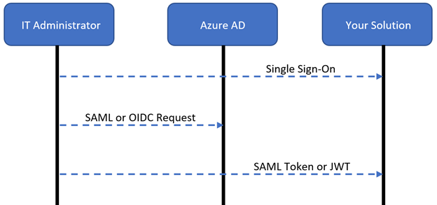
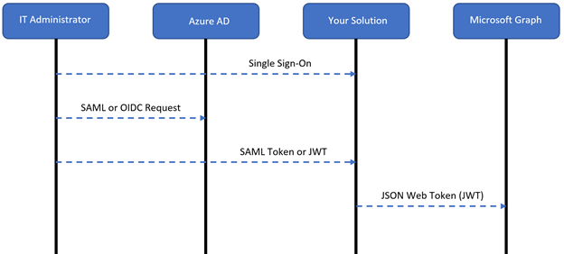
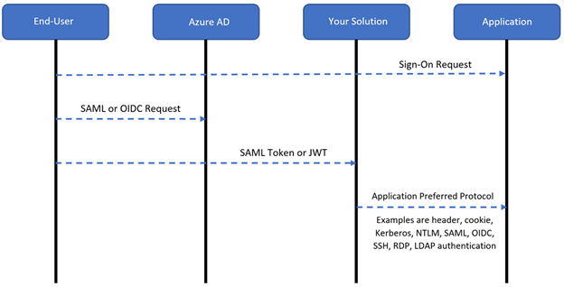

# Secure hybrid access with Azure Active Directory partner integrations

Azure Active Directory (Azure AD) supports modern authentication protocols that help keep applications secure. However, many business applications work in a protected corporate network, and some use legacy authentication methods. As companies build Zero Trust strategies and support hybrid and cloud environments, there are solutions that connect apps to Azure AD and provide authentication for legacy applications.

Learn more: [Zero Trust security](../../security/fundamentals/zero-trust.md)

Azure AD natively supports modern protocols:

* Security Assertion Markup Language (SAML)
* Web Service Federation (WS-Fed)
* OpenID Connect (OIDC)

Azure Active Directory Application Proxy, or Azure AD App Proxy supports Kerberos and header-based authentication. Other protocols, like Secure Shell (SSH), (Microsoft Windows NT LAN Manager) NTLM, Lightweight Directory Access Protocol (LDAP), and cookies, aren't supported. But, independent software vendors (ISVs) can create solutions to connect these applications with Azure AD.

ISVs can help customers discover and migrate software as a service (SaaS) applications into Azure AD. They can connect apps that use legacy authentication methods with Azure AD. Customers can consolidate onto Azure AD to simplify their app management and implement Zero Trust principles.

## Solution overview

The solution that you build can include the following parts:

* **App discovery** - Often, customers aren't aware of every application in use
  * Application discovery finds applications, facilitating app integrating with Azure AD
* **App migration** - Create a workflow to integrate apps with Azure AD without using the Azure portal
  * Integrate apps that customers use today
* **Legacy authentication support** - Connect apps with legacy authentication methods and single sign-on (SSO)
* **Conditional Access** - Enable customers to apply Azure AD policies to apps in your solution without using the Azure portal

Learn more: [What is Conditional Access?](../conditional-access/overview.md) 

See the following sections for technical considerations and recommendations.

## Publishing applications to Azure Marketplace

Azure Marketplace is a trusted source of applications for IT admins. Applications are compatible with Azure AD and support SSO, automate user provisioning, and integrate into customer tenants with automated app registration.

You can pre-integrate your application with Azure AD to support SSO and automated provisioning. See, [Submit a request to publish your application in Azure Active Directory application gallery](../manage-apps/v2-howto-app-gallery-listing.md). 

We recommend you become a verified publisher, so customers know you're the trusted publisher. See, [Publisher verification](../develop/publisher-verification-overview.md).

## Enable single sign-on for IT admins

There are several ways to enable SSO for IT administrators to your solution. See, [Plan a single sign-on deployment, SSO options](./plan-sso-deployment.md#single-sign-on-options).

Microsoft Graph uses OIDC/OAuth. Customers use OIDC to sign in to your solution. Use the JSON Web Token (JWT) Azure AD issues to interact with Microsoft Graph. See, [OpenID Connect on the Microsoft identity platform](../develop/v2-protocols-oidc.md).

If your solution uses SAML for IT administrator SSO, the SAML token won't enable your solution to interact with Microsoft Graph. You can use SAML for IT administrator SSO, but your solution needs to support OIDC integration with Azure AD, so it can get a JWT from Azure AD to interact with Microsoft Graph. See, [How the Microsoft identity platform uses the SAML protocol](../develop/active-directory-saml-protocol-reference.md).

You can use one of the following SAML approaches:

* **Recommended SAML approach**: Create a new  registration in Azure Marketplace, which is an OIDC app. Customers add the SAML and OIDC apps to their tenant. If your application isn't in the Azure AD gallery, you can start with a non-gallery multi-tenant app.
  *  [Configure an OpenID Connect OAuth application from Azure AD app gallery](../saas-apps/openidoauth-tutorial.md)
  *  [Making your application multi-tenant](../develop/howto-convert-app-to-be-multi-tenant.md)
* **Alternate SAML approach**: Customers can create an OIDC application registration in their Azure AD tenant and set the URIs, endpoints, and permissions

Use the client credentials grant type, which requires the solution to allow customers to enter a client ID and secret. The solution also requires you store this information. Get a JWT from Azure AD, and then use it to interact with Microsoft Graph. See, [Get a token](../develop/v2-oauth2-client-creds-grant-flow.md#get-a-token). We recommend you repare customer documentation about how to create application registration in their Azure AD tenant. Include endpoints, URIs, and permissions.

> [!NOTE]
> Before applications are used for IT administrator or user SSO, the customer IT administrator must consent to the application in their tenant. See, [Grant tenant-wide admin consent to an application](./grant-admin-consent.md).

## Authentication flows

The solution authentication flows support the following scenarios:

- The customer IT administrator signs in with SSO to administer your solution
- The customer IT administrator uses your solution to integrate applications with Azure AD with Microsoft Graph
- Users sign in to legacy applications secured by your solution and Azure AD

### Your customer IT administrator does single sign-on to your solution

Your solution can use SAML or OIDC for SSO, when the customer IT administrator signs in. We recommend the IT administrator signs in to your solution with their Azure AD credentials, which enables use of current security controls. Integrate your with Azure AD for SSO through SAML or OIDC.

The following diagram illustrates the user authentication flow:

   

1. The IT administrator signs in to your solution with their Azure AD credentials
2. The solution redirects the IT administrator to Azure AD with a SAML or an OIDC sign-in request
3. Azure AD authenticates the IT administrator and redirects them to your solution, with a SAML token or JWT to be authorized in your solution

### IT administrators integrate applications with Azure AD 

IT administrators integrate applications with Azure AD by using your solution, which employs Microsoft Graph to create application registrations and Azure AD Conditional Access policies.

The following diagram illustrates the user authentication flow:

   


1. The IT administrator signs in to your solution with their Azure AD credentials
2. The solution redirects the IT administrator to Azure AD with a SAML or an OIDC sign-in request
3. Azure AD authenticates the IT administrator and redirects them to your solution with a SAML token or JWT for authorization
4. When the IT administrator integrates an application with Azure AD, the solution calls Microsoft Graph with their JWT to register applications, or apply Azure AD Conditional Access policies

### Users sign in to the applications

When users sign in to applications, they use OIDC or SAML. If the applications need to interact with Microsoft Graph or Azure AD-protected API, we recommend you configure them to use OICD. This configuration ensures the JWT is applied to interact with Microsoft Graph. If there's no need for applications to interact with Microsoft Graph, or Azure AD protected APIs, then use SAML.

The following diagram shows user authentication flow:

   

1. The user signs in to an application
2. The solution redirects the user to Azure AD with a SAML or an OIDC sign-in request
3. Azure AD authenticates the user and redirects them to your solution with a SAML token or JWT for authorization
4. The solution allows the request by using the application protocol

## Microsoft Graph API

We recommend use of the following APIs. Use Azure AD to configure delegated permissions or application permissions. For this solution, use delegated permissions.

* **Applications templates API** - In Azure Marketplace, use this API to find a matching application template
  * Permissions required: Application.Read.All
* **Application registration API** - Create OIDC or SAML application registrations for users to sign in to applications secured with your solution
  * Permissions required: Application.Read.All, Application.ReadWrite.All
* **Service principal API** - After you register the app, update the service principal object to set SSO properties
  * Permissions required: Application.ReadWrite.All, Directory.AccessAsUser.All, AppRoleAssignment.ReadWrite.All (for assignment)
* **Conditional Access API** - Apply Azure AD Conditional Access policies to user applications 
  * Permissions required: Policy.Read.All, Policy.ReadWrite.ConditionalAccess, and Application.Read.All

Learn more [Use the Microsoft Graph API](/graph/use-the-api?context=graph%2Fapi%2F1.0&view=graph-rest-1.0&preserve-view=true)

## Microsoft Graph API scenarios

Use the following information to implement application registrations, connect legacy applications, and enable Conditional Access policies. Learn to automate admin consent, get the token-signing certificate, and assign users and groups. 

### Use Microsoft Graph API to register apps with Azure AD

#### Add apps in Azure Marketplace

Some applications your customers use are in the [Azure Marketplace](https://azuremarketplace.microsoft.com/marketplace/apps). You can create a solution that adds applications to the customer tenant. Use the following example with Microsoft Graph API to search Azure Marketplace for a template. 

> [!NOTE]
> In Application Templates API, the display name is case-sensitive.
 
```http
Authorization: Required with a valid Bearer token
Method: Get

https://graph.microsoft.com/v1.0/applicationTemplates?$filter=displayname eq "Salesforce.com"
```

If you find a match from the API call, capture the ID. Make the following API call and provide a display name for the application in the JSON body:

```https
Authorization: Required with a valid Bearer token
Method: POST
Content-type: application/json

https://graph.microsoft.com/v1.0/applicationTemplates/cd3ed3de-93ee-400b-8b19-b61ef44a0f29/instantiate
{
    "displayname": "Salesforce.com"
}
```

After you make the API call, you generate a service principal object. Capture the application ID and the service principal ID to use in the next API calls.

Patch the service principal object with the SAML protocol and a login URL:

```https
Authorization: Required with a valid Bearer token
Method: PATCH
Content-type: servicePrincipal/json

https://graph.microsoft.com/v1.0/servicePrincipals/3161ab85-8f57-4ae0-82d3-7a1f71680b27
{
    "preferredSingleSignOnMode":"saml",
    "loginURL": "https://www.salesforce.com"
}
```

Patch the application object with redirect URIs and the identifier URIs:

```https
Authorization: Required with a valid Bearer token
Method: PATCH
Content-type: application/json

https://graph.microsoft.com/v1.0/applications/54c4806b-b260-4a12-873c-967116983792
{
    "web": {
    "redirectUris":["https://www.salesforce.com"]},
    "identifierUris":["https://www.salesforce.com"]
}
```

#### Add apps not in Azure Marketplace

If there's no match in Azure Marketplace, or to integrate a custom application, register a custom application in Azure AD with the template ID: 8adf8e6e-67b2-4cf2-a259-e3dc5476c621. Then, make the following API call and provide an application display name in the JSON body:

```https
Authorization: Required with a valid Bearer token
Method: POST
Content-type: application/json

https://graph.microsoft.com/v1.0/applicationTemplates/8adf8e6e-67b2-4cf2-a259-e3dc5476c621/instantiate
{
    "displayname": "Custom SAML App"
}
```

After you make the API call, you generate a service principal object. Capture the application ID and the service principal ID to use in the next API calls.

Patch the service principal object with the SAML protocol and a login URL:

```https
Authorization: Required with a valid Bearer token
Method: PATCH
Content-type: servicePrincipal/json

https://graph.microsoft.com/v1.0/servicePrincipals/3161ab85-8f57-4ae0-82d3-7a1f71680b27
{
    "preferredSingleSignOnMode":"saml",
    "loginURL": "https://www.samlapp.com"
}
```

Patch the application object with redirect URIs and identifier URIs:

```https
Authorization: Required with a valid Bearer token
Method: PATCH
Content-type: application/json

https://graph.microsoft.com/v1.0/applications/54c4806b-b260-4a12-873c-967116983792
{
    "web": {
    "redirectUris":["https://www.samlapp.com"]},
    "identifierUris":["https://www.samlapp.com"]
}
```

#### Use Azure AD single sign-on

After the SaaS applications are registered in Azure AD, the applications need to start using Azure AD as the identity provider (IdP):

- **Applications support one-click SSO** - Azure AD enables the applications. In the Azure portal, the customer performs one-click SSO with the administrative credentials for the supported SaaS applications. 
  - Learn more: [One-click app configuration of single sign-on](./one-click-sso-tutorial.md)
- **Applications don't support one-click SSO** - The customer enables the applications to use Azure AD. 
  - [Tutorials for integrating SaaS applications with Azure Active Directory](../saas-apps/tutorial-list.md)

### Connect apps to Azure AD with legacy authentication

Your solution can enable the customer to use SSO and Azure Active Directory features, even unsupported applications. To allow access with legacy protocols, your application calls Azure AD to authenticate the user and apply [Azure AD Conditional Access policies](../conditional-access/overview.md). Enable this integration from your console. Create a SAML or an OIDC application registration between your solution and Azure AD.

#### Create a SAML application registration

Use the following custom application template ID: 8adf8e6e-67b2-4cf2-a259-e3dc5476c621. Then, make the following API call and provide a display name in the JSON body:

```https
Authorization: Required with a valid Bearer token
Method: POST
Content-type: application/json

https://graph.microsoft.com/v1.0/applicationTemplates/8adf8e6e-67b2-4cf2-a259-e3dc5476c621/instantiate
{
    "displayname": "Custom SAML App"
}
```

After you make the API call, you generate a service principal object. Capture the application ID and the service principal ID to use in the next API calls.

Patch the service principal object with the SAML protocol and a login URL:

```https
Authorization: Required with a valid Bearer token
Method: PATCH
Content-type: servicePrincipal/json

https://graph.microsoft.com/v1.0/servicePrincipals/3161ab85-8f57-4ae0-82d3-7a1f71680b27
{
    "preferredSingleSignOnMode":"saml",
    "loginURL": "https://www.samlapp.com"
}
```

Patch the application object with redirect URIs and identifier URIs:

```https
Authorization: Required with a valid Bearer token
Method: PATCH
Content-type: application/json

https://graph.microsoft.com/v1.0/applications/54c4806b-b260-4a12-873c-967116983792
{
    "web": {
    "redirectUris":["https://www.samlapp.com"]},
    "identifierUris":["https://www.samlapp.com"]
}
```

#### Create an OIDC application registration

Use the following template ID for a custom application: 8adf8e6e-67b2-4cf2-a259-e3dc5476c621. Make the following API call and provide a display name in the JSON body:

```https
Authorization: Required with a valid Bearer token
Method: POST
Content-type: application/json

https://graph.microsoft.com/v1.0/applicationTemplates/8adf8e6e-67b2-4cf2-a259-e3dc5476c621/instantiate
{
    "displayname": "Custom OIDC App"
}
```

From the API call, capture the application ID and the service principal ID to use in the next API calls.

```https
Authorization: Required with a valid Bearer token
Method: PATCH
Content-type: application/json

https://graph.microsoft.com/v1.0/applications/{Application Object ID}
{
    "web": {
    "redirectUris":["https://www.samlapp.com"]},
    "identifierUris":["[https://www.samlapp.com"],
    "requiredResourceAccess": [
    {
        "resourceAppId": "00000003-0000-0000-c000-000000000000",
        "resourceAccess": [
        {
            "id": "7427e0e9-2fba-42fe-b0c0-848c9e6a8182",
            "type": "Scope"
        },
        {
            "id": "e1fe6dd8-ba31-4d61-89e7-88639da4683d",
            "type": "Scope"
        },
        {
            "id": "37f7f235-527c-4136-accd-4a02d197296e",
            "type": "Scope"
        }]
    }]
}
```

> [!NOTE]
> The API permissions in the `resourceAccess` node grant the application the openid, User.Read, and offline_access permissions, which enable sign-in. See, [Overview of Microsoft Graph permissions](/graph/permissions-overview).

### Apply Conditional Access policies

Customers and partners can use the Microsoft Graph API to create or apply per application [Conditional Access policies](../conditional-access/overview.md). For partners, customers can apply these policies from your solution without using the Azure portal. There are two options to apply Azure AD Conditional Access policies:

- [Assign the application to a Conditional Access policy](#use-a-conditional-access-policy)
- [Create a new Conditional Access policy and assign the application to it](#create-a-new-conditional-access-policy)

#### Use a Conditional Access policy

For a list of Conditional Access policies, run the following query. Get the policy object ID to modify.

```https
Authorization: Required with a valid Bearer token
Method:GET

https://graph.microsoft.com/v1.0/identity/conditionalAccess/policies
```

To patch the policy, include the application object ID to be in scope of `includeApplications`, in the JSON body:

```https
Authorization: Required with a valid Bearer token
Method: PATCH

https://graph.microsoft.com/v1.0/identity/conditionalAccess/policies/{policyid}
{
    "displayName":"Existing Conditional Access Policy",
    "state":"enabled",
    "conditions": 
    {
        "applications": 
        {
            "includeApplications":[
                "00000003-0000-0ff1-ce00-000000000000", 
                "{Application Object ID}"
            ]
        },
        "users": {
            "includeUsers":[
                "All"
            ] 
        }
    },
    "grantControls": 
    {
        "operator":"OR",
        "builtInControls":[
            "mfa"
        ]
    }
}
```

#### Create a new Conditional Access policy

Add the application object ID to be in scope of `includeApplications`, in the JSON body:

```https
Authorization: Required with a valid Bearer token
Method: POST

https://graph.microsoft.com/v1.0/identity/conditionalAccess/policies/
{
    "displayName":"New Conditional Access Policy",
    "state":"enabled",
    "conditions": 
    {
        "applications": {
            "includeApplications":[
                "{Application Object ID}"
            ]
        },
        "users": {
            "includeUsers":[
                "All"
            ]
        }
    },
    "grantControls": {
        "operator":"OR",
        "builtInControls":[
            "mfa"
        ]
    }
}
```

To create new Azure AD Conditional Access policies, see [Conditional Access: Programmatic access](../conditional-access/howto-conditional-access-apis.md).

```https
#Policy Template for Requiring Compliant Device

{
    "displayName":"Enforce Compliant Device",
    "state":"enabled",
    "conditions": {
        "applications": {
            "includeApplications":[
                "{Application Object ID}"
            ]
        },
        "users": {
            "includeUsers":[
                "All"
            ]
        }
    },
    "grantControls": {
        "operator":"OR",
        "builtInControls":[
            "compliantDevice",
            "domainJoinedDevice"
        ]
    }
}

#Policy Template for Block

{
    "displayName":"Block",
    "state":"enabled",
    "conditions": {
        "applications": {
            "includeApplications":[
                "{Application Object ID}"
            ]
        },
        "users": {
            "includeUsers":[
                "All"
            ] 
        }
    },
    "grantControls": {
        "operator":"OR",
        "builtInControls":[
            "block"
        ]
    }
}
```

### Automate admin consent

If the customer is adding applications from your solution to Azure AD, you can automate administrator consent with Microsoft Graph. You need the application service principal object ID you created in API calls, and the Microsoft Graph service principal object ID from the customer tenant.

Get the Microsoft Graph service principal object ID by making the following API call:

```https
Authorization: Required with a valid Bearer token
Method:GET

https://graph.microsoft.com/v1.0/serviceprincipals/?$filter=appid eq '00000003-0000-0000-c000-000000000000'&$select=id,appDisplayName
```

To automate admin consent, make the following API call:

```https
Authorization: Required with a valid Bearer token
Method: POST
Content-type: application/json

https://graph.microsoft.com/v1.0/oauth2PermissionGrants
{
    "clientId":"{Service Principal Object ID of Application}",
    "consentType":"AllPrincipals",
    "principalId":null,
    "resourceId":"{Service Principal Object ID Of Microsoft Graph}",
    "scope":"openid user.read offline_access}"
}
```

### Get the token-signing certificate

To get the public portion of the token-signing certificate, use `GET` from the Azure AD metadata endpoint for the application:

```https
Method:GET

https://login.microsoftonline.com/{Tenant_ID}/federationmetadata/2007-06/federationmetadata.xml?appid={Application_ID}
```

### Assign users and groups

After you publish the application to Azure AD, you can assign the app to users and groups to ensure it appears on the My Apps portal. This assignment is on the service principal object generated when you created the application. See, [My Apps portal overview](./myapps-overview.md).

Get `AppRole` instances the application might have associated with it. It's common for SaaS applications to have various `AppRole` instances associated with them. Typically, for custom applications, there's one default `AppRole` instance. Get the `AppRole` instance ID you want to assign:

```https
Authorization: Required with a valid Bearer token
Method:GET

https://graph.microsoft.com/v1.0/servicePrincipals/3161ab85-8f57-4ae0-82d3-7a1f71680b27
```

From Azure AD, get the user or group object ID that you want to assign to the application. Take the app role ID from the previous API call and submit it with the patch body on the service principal:

```https
Authorization: Required with a valid Bearer token
Method: PATCH
Content-type: servicePrincipal/json

https://graph.microsoft.com/v1.0/servicePrincipals/3161ab85-8f57-4ae0-82d3-7a1f71680b27
{
    "principalId":"{Principal Object ID of User -or- Group}",
    "resourceId":"{Service Principal Object ID}",
    "appRoleId":"{App Role ID}"
}
```

## Partnerships

To help protect legacy applications, while using networking and delivery controllers, Microsoft has partnerships with the following application delivery controller (ADC) providers.

* **Akamai Enterprise Application Access**
  * [Tutorial: Azure AD SSO integration with Akamai](../saas-apps/akamai-tutorial.md)
* **Citrix ADC**
  * [Tutorial: Azure AD SSO integration with Citrix ADC SAML Connector for Azure AD (Kerberos-based authentication)](../saas-apps/citrix-netscaler-tutorial.md)
* **F5 BIG-IP Access Policy Manager**
  * [Tutorial: Azure AD SSO integration with Citrix ADC SAML Connector for Azure AD (Kerberos-based authentication)](./f5-integration.md)
* **Kemp LoadMaster**
  * [Tutorial: Azure AD SSO integration with Kemp LoadMaster Azure AD integration](../saas-apps/kemp-tutorial.md)
* **Pulse Secure Virtual Traffic Manager**
  * [Tutorial: Azure AD SSO integration with Pulse Secure Virtual Traffic Manager](../saas-apps/pulse-secure-virtual-traffic-manager-tutorial.md)

The following VPN solution providers connect with Azure AD to enable modern authentication and authorization methods like SSO and multifactor authentication (MFA).

* **Cisco AnyConnect**
  * [Tutorial: Azure AD SSO integration with Cisco AnyConnect](../saas-apps/cisco-anyconnect.md)
* **Fortinet FortiGate**
  * [Tutorial: Azure AD SSO integration with FortiGate SSL VPN](../saas-apps/fortigate-ssl-vpn-tutorial.md)
* **F5 BIG-IP Access Policy Manager**
  * [Tutorial: Configure F5 BIG-IP SSL-VPN for Azure AD SSO](./f5-passwordless-vpn.md)
* **Palo Alto Networks GlobalProtect**
  * [Tutorial: Azure AD SSO integration with Palo Alto Networks - Admin UI](../saas-apps/paloaltoadmin-tutorial.md)
* **Pulse Connect Secure**
  * [Tutorial: Azure AD SSO integration with Pulse Secure PCS](../saas-apps/pulse-secure-pcs-tutorial.md)

The following software-defined perimeter (SDP) solutions providers connect with Azure AD for authentication and authorization methods like SSO and MFA.

* **Datawiza Access Broker**
  * [Tutorial: Configure Secure Hybrid Access with Azure AD and Datawiza](./datawiza-with-azure-ad.md)
* **Perimeter 81**
  * [Tutorial: Azure AD SSO integration with Perimeter 81](../saas-apps/perimeter-81-tutorial.md)
* **Silverfort Authentication Platform**
  * [Tutorial: Configure Secure Hybrid Access with Azure AD and Silverfort](./silverfort-integration.md)
* **Strata Maverics Identity Orchestrator**
  * [Integrate Azure AD SSO with Maverics Identity Orchestrator SAML Connector](../saas-apps/maverics-identity-orchestrator-saml-connector-tutorial.md)
* **Zscaler Private Access**
  * [Tutorial: Integrate Zscaler Private Access with Azure AD](../saas-apps/zscalerprivateaccess-tutorial.md)
