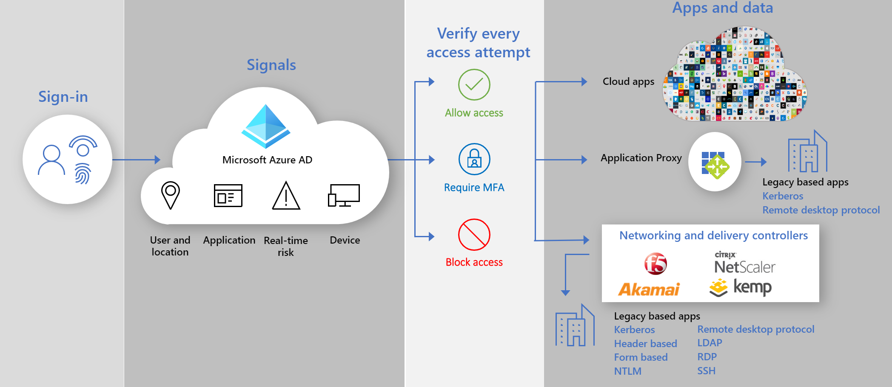

# Secure hybrid access: Protect legacy apps with Microsoft Entra ID

In this article, learn to protect your on-premises and cloud legacy authentication applications by connecting them to Microsoft Entra ID.

* **[Application Proxy](#secure-hybrid-access-with-application-proxy)**:
  * [Remote access to on-premises applications through Microsoft Entra application proxy](../app-proxy/application-proxy.md)
  * Protect users, apps, and data in the cloud and on-premises 
  * [Use it to publish on-premises web applications externally](../app-proxy/what-is-application-proxy.md)
  
* **[Secure hybrid access through Microsoft Entra ID partner integrations](#partner-integrations-for-apps-on-premises-and-legacy-authentication)**:

  * [Pre-built solutions](#secure-hybrid-access-through-azure-ad-partner-integrations)
  * [Apply Conditional Access policies per application](secure-hybrid-access-integrations.md#apply-conditional-access-policies)
 
In addition to Application Proxy, you can strengthen your security posture with [Microsoft Entra Conditional Access](../conditional-access/overview.md) and [Identity Protection](../identity-protection/overview-identity-protection.md). 

## Single sign-on and multifactor authentication

With Microsoft Entra ID as an identity provider (IdP), you can use modern authentication and authorization methods like [single sign-on (SSO)](what-is-single-sign-on.md) and [Microsoft Entra multifactor authentication](../authentication/concept-mfa-howitworks.md) to secure legacy, on-premises applications.

## Secure hybrid access with Application Proxy

Use Application Proxy to protect users, apps, and data in the cloud, and on premises. Use this tool for secure remote access to on-premises web applications. Users don’t need to use a virtual private network (VPN); they connect to applications from devices with SSO. 

Learn more:

* [Remote access to on-premises applications through Microsoft Entra application proxy](../app-proxy/application-proxy.md)
* [Tutorial: Add an on-premises application for remote access through Application Proxy in Microsoft Entra ID](../app-proxy/application-proxy-add-on-premises-application.md)
* [How to configure SSO to an Application Proxy application](../app-proxy/application-proxy-config-sso-how-to.md)
* [Using Microsoft Entra application proxy to publish on-premises apps for remote users](../app-proxy/what-is-application-proxy.md)

### Application publishing and access management

Use Application Proxy remote access as a service to publish applications to users outside the corporate network. Help improve your cloud access management without requiring modification to your on-premises applications. Plan an [Microsoft Entra application proxy deployment](../app-proxy/application-proxy-deployment-plan.md).

## Partner integrations for apps: on-premises and legacy authentication

Microsoft partners with various companies that deliver pre-built solutions for on-premises applications, and applications that use legacy authentication. The following diagram illustrates a user flow from sign-in to secure access to apps and data.

   

### Secure hybrid access through Microsoft Entra ID partner integrations

The following partners offer solutions to support [Conditional Access policies per application](secure-hybrid-access-integrations.md#apply-conditional-access-policies). Use the tables in the following sections to learn about the partners and Microsoft Entra integration documentation.

|Partner|Integration documentation|
|---|---|
|Akamai Technologies|[Tutorial: Microsoft Entra SSO integration with Akamai](../saas-apps/akamai-tutorial.md)|
|Citrix Systems, Inc.|[Tutorial: Microsoft Entra SSO integration with Citrix ADC SAML Connector for Microsoft Entra ID (Kerberos-based authentication)](../saas-apps/citrix-netscaler-tutorial.md)|
|Cloudflare, Inc.|[Tutorial: Configure Cloudflare with Microsoft Entra ID for secure hybrid access](cloudflare-integration.md)|
|Datawiza|[Tutorial: Configure Secure Hybrid Access with Microsoft Entra ID and Datawiza](./datawiza-configure-sha.md)|
|F5, Inc.|[Integrate F5 BIG-IP with Microsoft Entra ID](f5-integration.md) [Tutorial: Configure F5 BIG-IP SSL-VPN for Microsoft Entra SSO](f5-passwordless-vpn.md)|
|Progress Software Corporation, Progress Kemp|[Tutorial: Microsoft Entra SSO integration with Kemp LoadMaster Microsoft Entra integration](../saas-apps/kemp-tutorial.md)|
|Perimeter 81 Ltd.|[Tutorial: Microsoft Entra SSO integration with Perimeter 81](../saas-apps/perimeter-81-tutorial.md)|
|Silverfort|[Tutorial: Configure Secure Hybrid Access with Microsoft Entra ID and Silverfort](silverfort-integration.md)|
|Strata Identity, Inc.|[Integrate Microsoft Entra SSO with Maverics Identity Orchestrator SAML Connector](../saas-apps/maverics-identity-orchestrator-saml-connector-tutorial.md)|

#### Partners with pre-built solutions and integration documentation

|Partner|Integration documentation|
|---|---|
|Amazon Web Service, Inc.|[Tutorial: Microsoft Entra SSO integration with AWS ClientVPN](../saas-apps/aws-clientvpn-tutorial.md)|
|Check Point Software Technologies Ltd.|[Tutorial: Microsoft Entra single SSO integration with Check Point Remote Secure Access VPN](../saas-apps/check-point-remote-access-vpn-tutorial.md)|
|Cisco Systems, Inc.|[Tutorial: Microsoft Entra SSO integration with Cisco AnyConnect](../saas-apps/cisco-anyconnect.md)|
|Fortinet, Inc.|[Tutorial: Microsoft Entra SSO integration with FortiGate SSL VPN](../saas-apps/fortigate-ssl-vpn-tutorial.md)|
|Palo Alto Networks|[Tutorial: Microsoft Entra SSO integration with Palo Alto Networks Admin UI](../saas-apps/paloaltoadmin-tutorial.md)|
|Pulse Secure|[Tutorial: Microsoft Entra SSO integration with Pulse Connect Secure (PCS)](../saas-apps/pulse-secure-pcs-tutorial.md) [Tutorial: Microsoft Entra SSO integration with Pulse Secure Virtual Traffic Manager](../saas-apps/pulse-secure-virtual-traffic-manager-tutorial.md)|
|Zscaler, Inc.|[Tutorial: Integrate Zscaler Private Access with Microsoft Entra ID](../saas-apps/zscalerprivateaccess-tutorial.md)|

## Next steps 
Select a partner in the tables mentioned to learn how to integrate their solution with Microsoft Entra ID.
