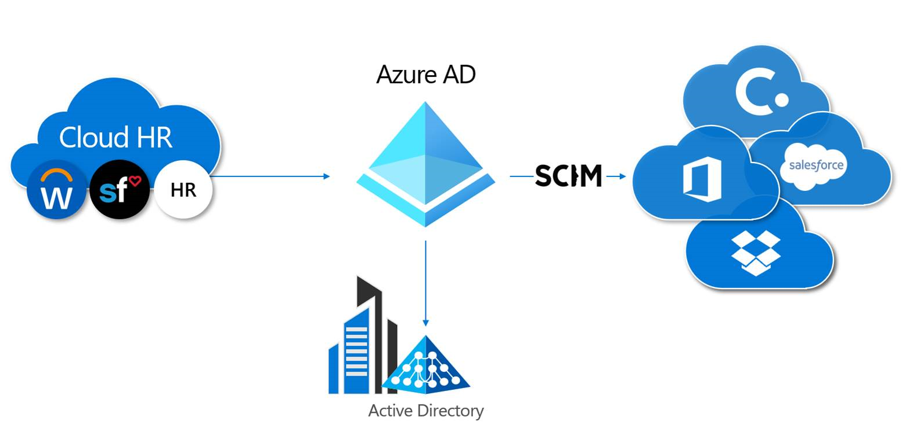

# Automate user provisioning and deprovisioning to applications with Azure Active Directory

In Azure Active Directory (Azure AD), the term **app provisioning** refers to automatically creating user identities and roles in the cloud ([SaaS](https://azure.microsoft.com/overview/what-is-saas/)) applications that users need access to. In addition to creating user identities, automatic provisioning includes the maintenance and removal of user identities as status or roles change. Common scenarios include provisioning an Azure AD user into applications like [Dropbox](../saas-apps/dropboxforbusiness-provisioning-tutorial.md), [Salesforce](../saas-apps/salesforce-provisioning-tutorial.md), [ServiceNow](../saas-apps/servicenow-provisioning-tutorial.md), and more.

This feature lets you:

- **Automate provisioning**: Automatically create new accounts in the right systems for new people when they join your team or organization.
- **Automate deprovisioning:** Automatically deactivate accounts in the right systems when people leave the team or organization.
- **Synchronize data between systems:** Ensure that the identities in your apps and systems are kept up to date based on changes in the directory or your human resources system.
- **Provision groups:** Provision groups to applications that support them.
- **Govern access:** Monitor and audit who has been provisioned into your applications.
- **Seamlessly deploy in brown field scenarios:** Match existing identities between systems and allow for easy integration, even when users already exist in the target system.
- **Use rich customization:** Take advantage of customizable attribute mappings that define what user data should flow from the source system to the target system.
- **Get alerts for critical events:** The provisioning service provides alerts for critical events, and allows for Log Analytics integration where you can define custom alerts to suite your business needs.

## Benefits of automatic provisioning

As the number of applications used in modern organizations continues to grow, IT admins are tasked with access management at scale. Standards such as Security Assertions Markup Language (SAML) or Open ID Connect (OIDC) allow admins to quickly set up single sign-on (SSO), but access also requires users to be provisioned into the app. To many admins, provisioning means manually creating every user account or uploading CSV files each week, but these processes are time-consuming, expensive, and error-prone. Solutions such as SAML just-in-time (JIT) have been adopted to automate provisioning, but enterprises also need a solution to deprovision users when they leave the organization or no longer require access to certain apps based on role change.

Some common motivations for using automatic provisioning include:

- Maximizing the efficiency and accuracy of provisioning processes.
- Saving on costs associated with hosting and maintaining custom-developed provisioning solutions and scripts.
- Securing your organization by instantly removing users' identities from key SaaS apps when they leave the organization.
- Easily importing a large number of users into a particular SaaS application or system.
- Having a single set of policies to determine who is provisioned and who can sign in to an app.

Azure AD user provisioning can help address these challenges. To learn more about how customers have been using Azure AD user provisioning, you can read the [ASOS case study](https://aka.ms/asoscasestudy). The video below provides an overview of user provisioning in Azure AD:

> [!VIDEO https://www.youtube.com/embed/_ZjARPpI6NI]

## What applications and systems can I use with Azure AD automatic user provisioning?

Azure AD features pre-integrated support for many popular SaaS apps and human resources systems, and generic support for apps that implement specific parts of the [SCIM 2.0 standard](https://techcommunity.microsoft.com/t5/Identity-Standards-Blog/Provisioning-with-SCIM-getting-started/ba-p/880010).

* **Pre-integrated applications (gallery SaaS apps)**. You can find all applications for which Azure AD supports a pre-integrated provisioning connector in the [list of application tutorials for user provisioning](../saas-apps/tutorial-list.md). The pre-integrated applications listed in the gallery generally use SCIM 2.0-based user management APIs for provisioning. 

   

   If you want to request a new application for provisioning, you can [request that your application be integrated with our app gallery](../develop/howto-app-gallery-listing.md). For a user provisioning request, we require the application to have a SCIM-compliant endpoint. Please request that the application vendor follow the SCIM standard so we can onboard the app to our platform quickly.

* **Applications that support SCIM 2.0**. For information on how to generically connect applications that implement SCIM 2.0-based user management APIs, see [Build a SCIM endpoint and configure user provisioning](use-scim-to-provision-users-and-groups.md).

## What is SCIM?

To help automate provisioning and deprovisioning, apps expose proprietary user and group APIs. However, anyone who’s tried to manage users in more than one app will tell you that every app tries to perform the same simple actions, such as creating or updating users, adding users to groups, or deprovisioning users. Yet, all these simple actions are implemented just a little bit differently, using different endpoint paths, different methods to specify user information, and a different schema to represent each element of information.

To address these challenges, the SCIM specification provides a common user schema to help users move into, out of, and around apps. SCIM is becoming the de facto standard for provisioning and, when used in conjunction with federation standards like SAML or OpenID Connect, provides administrators an end-to-end standards-based solution for access management.

For detailed guidance on using SCIM to automate the provisioning and deprovisioning of users and groups to an application, see [Build a SCIM endpoint and configure user provisioning](use-scim-to-provision-users-and-groups.md).

## Manual vs. automatic provisioning

Applications in the Azure AD gallery support one of two provisioning modes:

* **Manual** provisioning means there is no automatic Azure AD provisioning connector for the app yet. User accounts must be created manually, for example by adding users directly into the app's administrative portal, or uploading a spreadsheet with user account detail. Consult the documentation provided by the app, or contact the app developer to determine what mechanisms are available.

* **Automatic** means that an Azure AD provisioning connector has been developed for this application. You should follow the setup tutorial specific to setting up provisioning for the application. App tutorials can be found at [List of Tutorials on How to Integrate SaaS Apps with Azure Active Directory](../saas-apps/tutorial-list.md).

In the Azure AD gallery, applications that support automatic provisioning are designated by a **Provisioning** icon. Switch to the new gallery preview experience to see these icons (in the banner at the top of the **Add an application page**, select the link that says **Click here to try out the new and improved app gallery**).

The provisioning mode supported by an application is also visible on the **Provisioning** tab once you've added the application to your **Enterprise apps**.

## How do I set up automatic provisioning to an application?

For pre-integrated applications listed in the gallery, step-by-step guidance is available for setting up automatic provisioning. See the [list of tutorials for integrated gallery apps](../saas-apps/tutorial-list.md). The following video demonstrates how to set up automatic user provisioning for SalesForce.

> [!VIDEO https://www.youtube.com/embed/pKzyts6kfrw]

For other applications that support SCIM 2.0, follow the steps in the article [Build a SCIM endpoint and configure user provisioning](use-scim-to-provision-users-and-groups.md).

## Related articles

- [List of tutorials on how to integrate SaaS apps](../saas-apps/tutorial-list.md)
- [Customizing attribute mappings for user provisioning](customize-application-attributes.md)
- [Writing expressions for attribute mappings](functions-for-customizing-application-data.md)
- [Scoping filters for user provisioning](define-conditional-rules-for-provisioning-user-accounts.md)
- [Build a SCIM endpoint and configure user provisioning](use-scim-to-provision-users-and-groups.md)
- [Azure AD synchronization API overview](https://developer.microsoft.com/graph/docs/api-reference/beta/resources/synchronization-overview)
