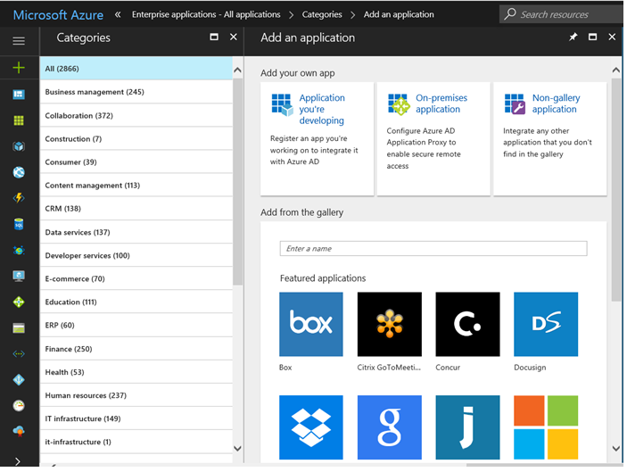

# Automate user provisioning and deprovisioning to SaaS applications with Azure Active Directory

## What is automated user provisioning for SaaS apps?
Azure Active Directory (Azure AD) allows you to automate the creation, maintenance, and removal of user identities in cloud ([SaaS](https://azure.microsoft.com/overview/what-is-saas/)) applications such as Dropbox, Salesforce, ServiceNow, and more.

> [!VIDEO https://www.youtube.com/embed/_ZjARPpI6NI]

**Below are some examples of what this feature allows you to do:**

* Automatically create new accounts in the right systems for new people when they join your team or organization.
* Automatically deactivate accounts in the right systems when people leave the team or organization.
* Ensure that the identities in your apps and systems are kept up-to-date based on changes in the directory, or your human resources system.
* Provision non-user objects, such as groups, to applications that support them.

**Automated user provisioning also includes the following functionality:**

* The ability to match existing identities between source and target systems.
* Customizable attribute mappings that define what user data should flow from the source system to the target system.
* Optional email alerts for provisioning errors
* Reporting and activity logs to help with monitoring and troubleshooting.

## Why use automated provisioning?

Some common motivations for using this feature include:

* Avoiding the costs, inefficiencies, and human error associated with manual provisioning processes.
* Avoiding the costs associated with hosting and maintaining custom-developed provisioning solutions and scripts
* To secure your organization by instantly removing users' identities from key SaaS apps when they leave the organization.
* To easily import a large number of users into a particular SaaS application or system.
* To enjoy having a single set of policies to determine who is provisioned and who can sign in to an app.

## How does automatic provisioning work?
	
The **Azure AD Provisioning Service** provisions users to SaaS apps and other systems, by connecting to user management API endpoints provided by each application vendor. These user management API endpoints allow Azure AD to programmatically create, update, and remove users. For selected applications the provisioning service can also create, update, and remove additional identity-related objects, such as groups and roles. 

*Figure 1: The Azure AD Provisioning Service*

*Figure 2: "Outbound" user provisioning workflow from Azure AD to popular SaaS applications*

*Figure 3: "Inbound" user provisioning workflow from popular Human Capital Management (HCM) applications to Azure Active Directory and Windows Server Active Directory*

## What applications and systems can I use with Azure AD automatic user provisioning?

Azure AD features pre-integrated support for a variety of popular SaaS apps and human resources systems, as well as generic support for apps that implement specific parts of the SCIM 2.0 standard.

### Pre-integrated applications

For a list of all applications for which Azure AD supports a pre-integrated provisioning connector, see the [list of application tutorials for user provisioning](../saas-apps/tutorial-list.md).

To contact the Azure AD engineering team to request provisioning support for additional applications, submit a message through the [Azure Active Directory feedback forum](https://feedback.azure.com/forums/374982-azure-active-directory-application-requests/filters/new?category_id=172035).

> [!NOTE]
> In order for an application to support automated user provisioning, it must first provide the necessary user management APIs that allow for external programs to automate the creation, maintenance, and removal of users. Therefore, not all SaaS apps are compatible with this feature. For apps that do support user management APIs, the Azure AD engineering team will then be able to build a provisioning connector to those apps, and this work is prioritized by the needs of current and prospective customers. 

### Connecting applications that support SCIM 2.0

For information on how to generically connect applications that implement SCIM 2.0 -based user management APIs, see [Using SCIM to automatically provision users and groups from Azure Active Directory to applications](use-scim-to-provision-users-and-groups.md).

	
## How do I set up automatic provisioning to an application?

> [!VIDEO https://www.youtube.com/embed/pKzyts6kfrw]

Configuration of the Azure AD provisioning service for a selected application starts in the **[Azure portal](https://portal.azure.com)**. In the **Azure Active Directory > Enterprise Applications** section, select **Add**, then **All**, and then add either of the following depending on your scenario:

* All applications in the **Featured applications** section support automatic provisioning. See the [list of application tutorials for user provisioning](../saas-apps/tutorial-list.md) for additional ones.

* Use the “non-gallery application” option for custom-developed SCIM integrations

In the application management screen, provisioning is configured in the **Provisioning** tab.

* **Admin credentials** must be provided to the Azure AD provisioning service that will allow it to connect to the user management API provided by the application. This section also allows you to enable email notifications if the credentials fail, or the provisioning job goes into [quarantine](#quarantine).

* **Attribute mappings** can be configured that specify which fields in the source system (example: Azure AD) will have their contents synchronized to which fields in the target system (example: ServiceNow). If the target application supports it, this section will allow you to optionally configure provisioning of groups in addition to user accounts. "Matching properties" allow you to select which fields are used to match accounts between the systems. "[Expressions](functions-for-customizing-application-data.md)" allow you to modify and transform the values retrieved from the source system before they are written to the target system. For more information, see [Customizing Attribute Mappings](customize-application-attributes.md).

* **Scoping filters** tell the provisioning service which users and group in the source system should be provisioned and/or deprovisioned to the target system. There are two aspects to scoping filters that are evaluated together that determine who is in scope for provisioning:

    * **Filter on attribute values** - The "Source Object Scope" menu in the attribute mappings allows filtering on specific attribute values. For example, you can specify that only users with a "Department" attribute of "Sales" should be in scope for provisioning. For more information, see [Using scoping filters](define-conditional-rules-for-provisioning-user-accounts.md).

    * **Filter on assignments** - The "Scope" menu in the Provisioning > Settings section of the portal allows you to specify whether only "assigned" users and groups should be in scope for provisioning, or if all users in the Azure AD directory should be provisioned. For information on "assigning" users and groups, see [Assign a user or group to an enterprise app in Azure Active Directory](assign-user-or-group-access-portal.md).
	
* **Settings** control the operation of the provisioning service for an application, including whether it is currently running or not.

* **Audit logs** provide records of every operation performed by the Azure AD provisioning service. For more details, see the [provisioning reporting guide](check-status-user-account-provisioning.md).

> [!NOTE]
> The Azure AD user provisioning service can also be configured and managed using the [Microsoft Graph API](https://developer.microsoft.com/graph/docs/api-reference/beta/resources/synchronization-overview).

## What happens during provisioning?

When Azure AD is the source system, the provisioning service uses the [Differential Query feature of the Azure AD Graph API](https://msdn.microsoft.com/Library/Azure/Ad/Graph/howto/azure-ad-graph-api-differential-query) to monitor users and groups. The provisioning service runs an initial sync against the source system and target system, followed by periodic incremental syncs. 

### Initial sync

When the provisioning service is started, the first sync ever performed will:

1. Query all users and groups from the source system, retrieving all attributes defined in the [attribute mappings](customize-application-attributes.md).
2. Filter the users and groups returned, using any configured [assignments](assign-user-or-group-access-portal.md) or [attribute-based scoping filters](define-conditional-rules-for-provisioning-user-accounts.md).
3. When a user is found to be assigned or in scope for provisioning, the service queries the target system for a matching user using the designated [matching attributes](customize-application-attributes.md#understanding-attribute-mapping-properties). Example: If the userPrincipal name in the source system is the matching attribute and maps to userName in the target system, then the provisioning service queries the target system for userNames that match the userPrincipal name values in the source system.
4. If a matching user is not found in the target system, it is created using the attributes returned from the source system. After the user account is created, the provisioning service detects and caches the target system's ID for the new user, which is used to perform all future operations on that user.
5. If a matching user is found, it is updated using the attributes provided by the source system. After the user account is matched, the provisioning service detects and caches the target system's ID for the new user, which is used to perform all future operations on that user.
6. If the attribute mappings contain "reference" attributes, the service performs additional updates on the target system to create and link the referenced objects. For example, a user may have a "Manager" attribute in the target system, which is linked to another user created in the target system.
7. Persist a watermark at the end of the initial sync, which provides the starting point for the subsequent incremental syncs.

Some applications such as ServiceNow, Google Apps, and Box support not only provisioning users, but also provisioning groups and their members. In those cases, if group provisioning is enabled in the [mappings](customize-application-attributes.md), the provisioning service synchronizes the users and the groups, and then subsequently synchronizes the group memberships. 

### Incremental syncs

After the initial sync, all subsequent syncs will:

1. Query the source system for any users and groups that were updated since the last watermark was stored.
2. Filter the users and groups returned, using any configured [assignments](assign-user-or-group-access-portal.md) or [attribute-based scoping filters](define-conditional-rules-for-provisioning-user-accounts.md).
3. When a user is found to be assigned or in scope for provisioning, the service queries the target system for a matching user using the designated [matching attributes](customize-application-attributes.md#understanding-attribute-mapping-properties).
4. If a matching user is not found in the target system, it is created using the attributes returned from the source system. After the user account is created, the provisioning service detects and caches the target system's ID for the new user, which is used to perform all future operations on that user.
5. If a matching user is found, it is updated using the attributes provided by the source system. If it is a newly-assigned account that is matched, the provisioning service detects and caches the target system's ID for the new user, which is used to perform all future operations on that user.
6. If the attribute mappings contain "reference" attributes, the service performs additional updates on the target system to create and link the referenced objects. For example, a user may have a "Manager" attribute in the target system, which is linked to another user created in the target system.
7. If a user that was previously in scope for provisioning is removed from scope (including being unassigned), the service disables the user in the target system via an update.
8. If a user that was previously in scope for provisioning is disabled or soft-deleted in the source system, the service disables the user in the target system via an update.
9. If a user that was previously in scope for provisioning is hard-deleted in the source system, the service deletes the user in the target system. In Azure AD, users are hard-deleted 30 days after they are soft-deleted.
10. Persist a new watermark at the end of the incremental sync, which provides the starting point for the subsequent incremental syncs.

>[!NOTE]
> You can optionally disable the create, update, or delete operations by using the **Target object actions** check boxes in the [Attribute Mappings](customize-application-attributes.md) section. The logic to disable a user during an update is also controlled via an attribute mapping from a field such as "accountEnabled".

The provisioning service will continue to run back-to-back incremental syncs indefinitely, at intervals defined in the [tutorial specific to each application](../saas-apps/tutorial-list.md), until one of the following events occurs:

* The service is manually stopped using the Azure portal, or using the appropriate Graph API command 
* A new initial sync is triggered using the **Clear state and restart** option in the Azure portal, or using the appropriate Graph API command. This clears any stored watermark and causes all source objects to be evaluated again.
* A new initial sync is triggered due to a change in attribute mappings or scoping filters. This also clears any stored watermark and causes all source objects to be evaluated again.
* The provisioning process goes into quarantine (see below) due to a high error rate, and stays in quarantine for more than four weeks. In this event, the service will be automatically disabled.

### Errors and retries

If an individual user can't be added, updated, or deleted in the target system due to an error in the target system, then the operation will be retried in the next sync cycle. If the user continues to fail, then the retries will begin to occur at a reduced frequency, gradually scaling back to just one attempt per day. To resolve the failure, administrators will need to check the [audit logs](check-status-user-account-provisioning.md) for "process escrow" events to determine the root cause and take the appropriate action. Common failures can include:

* Users not having an attribute populated in the source system that is required in the target system
* Users having an attribute value in the source system for which there is a unique constraint in the target system, and the same value is present in another user record

These failures can be resolved by adjusting the attribute values for the affected user in the source system, or by adjusting the attribute mappings to not cause conflicts.   

### Quarantine

If most or all of the calls made against the target system consistently fail due to an error (such as in the case of invalid admin credentials), then the provisioning job goes into a "quarantine" state. This is indicated in the [provisioning summary report](check-status-user-account-provisioning.md), and via email if email notifications were configured in the Azure portal. 

When in quarantine, the frequency of incremental syncs is gradually reduced to once per day. 

The provisioning job will be removed from quarantine after all of the offending errors being fixed, and the next sync cycle starts. If the provisioning job stays in quarantine for more than four weeks, the provisioning job is disabled.

## How long will it take to provision users?

Performance depends on whether your provisioning job is performing an initial sync or an incremental sync, as described in the previous section.

For **initial syncs**, the job time depends on a variety of factors, including the number of users and groups in scope for provisioning, and the total number of users and group in the source system. A comprehensive list of factors that affect initial sync performance are summarized later in this section.

For **incremental syncs**, the job time depends on the number of changes detected in that sync cycle. If there are fewer than 5,000 user or group membership changes, the job can finish within a single incremental sync cycle. 

The following table summarizes synchronization times for common provisioning scenarios. In these scenarios, the source system is Azure AD and the target system is a SaaS application. The sync times are derived from a statistical analysis of sync jobs for the SaaS applications ServiceNow, Workplace, Salesforce, and Google Apps.

| Scope configuration | Users, groups, and members in scope | Initial sync time | Incremental sync time |
| -------- | -------- | -------- | -------- |
| Sync assigned users and groups only |  < 1,000 |  < 30 minutes | < 30 minutes |
| Sync assigned users and groups only |  1,000 - 10,000 | 142 - 708 minutes | < 30 minutes |
| Sync assigned users and groups only |   10,000 - 100,000 | 1,170 - 2,340 minutes | < 30 minutes |
| Sync all users and groups in Azure AD |  < 1,000 | < 30 minutes  | < 30 minutes |
| Sync all users and groups in Azure AD |  1,000 - 10,000 | < 30 - 120 minutes | < 30 minutes |
| Sync all users and groups in Azure AD |  10,000 - 100,000  | 713 - 1,425 minutes | < 30 minutes |
| Sync all users in Azure AD|  < 1,000  | < 30 minutes | < 30 minutes |
| Sync all users in Azure AD | 1,000 - 10,000  | 43 - 86 minutes | < 30 minutes |

For the configuration **Sync assigned user and groups only**, you can use the following formulas to determine the approximate minimum and maximum expected **initial sync** times:

	Minimum minutes =  0.01 x [Number of assigned users, groups, and group members]
	Maximum minutes = 0.08 x [Number of assigned users, groups, and group members] 
	
Summary of factors that influence the time it takes to complete an **initial sync**:

* The total number of users and groups in scope for provisioning

* The total number of users, groups, and group members present in the source system (Azure AD)

* Whether or not users in scope for provisioning are matched to existing users in the target application, or need to be created for the first time. Sync jobs for which all users are created for the first time take approximately *twice as long* as sync jobs for which all users are matched to existing users.

* Number of errors in the [audit logs](check-status-user-account-provisioning.md). Performance is slower if there are many errors and the provisioning service has gone into a quarantine state	

* Request rate limits and throttling implemented by the target system. Some target systems implement request rate limits and throttling which can impact performance during large sync operations. Under these conditions, an app that receives too many requests too fast might slow its response rate or close the connection. To improve performance, the connector needs to adjust by not sending the app requests faster than the app can process them. Provisioning connectors built by Microsoft make this adjustment. 

* The number and sizes of assigned groups. Syncing assigned groups takes longer than syncing users. Both the number and the sizes of the assigned groups impact performance. If an application has [mappings enabled for group object sync](customize-application-attributes.md#editing-group-attribute-mappings), group properties such as group names and memberships are synced in addition to users. These additional syncs will take longer than only syncing user objects.

## How can I tell if users are being provisioned properly?

All operations performed by the user provisioning service are recorded in the Azure AD audit logs. This includes all read and write operations made to the source and target systems, as well as what user data was read or written during each operation.

For information on how the read the audit logs in the Azure portal, see the [provisioning reporting guide](check-status-user-account-provisioning.md).

## How do I troubleshoot issues with user provisioning?

For scenario-based guidance on how to troubleshoot automatic user provisioning, see [Problems configuring and provisioning users to an application](application-provisioning-config-problem.md).

## What are the best practices for rolling out automatic user provisioning?

> [!VIDEO https://www.youtube.com/embed/MAy8s5WSe3A]

For an example step-by-step deployment plan for outbound user provisioning to an application, see the [Identity Deployment Guide for User Provisioning](https://aka.ms/userprovisioningdeploymentplan).

## More frequently asked questions

### Does automatic user provisioning to SaaS apps work with B2B users in Azure AD?

Yes, it is possible to use the Azure AD user provisioning service to provision B2B (or guest) users in Azure AD to SaaS applications.

However, for B2B users to be able to sign in to the SaaS application using Azure AD, the SaaS application must have its SAML-based single sign-on capability configured in a specific way. For more information on how to configure SaaS applications to support sign-ins from B2B users, see [Configure SaaS apps for B2B collaboration]( https://docs.microsoft.com/azure/active-directory/b2b/configure-saas-apps).

### Does automatic user provisioning to SaaS apps work with dynamic groups in Azure AD?

Yes. When configured to "sync only assigned users and groups", the Azure AD user provisioning service can provision or de-provision users in a SaaS application based on whether or not they are members of a [dynamic group](https://docs.microsoft.com/azure/active-directory/users-groups-roles/groups-create-rule]). Dynamic groups also work with the "sync all users and groups" option.

However, usage of dynamic groups can impact the overall performance of end-to-end user provisioning from the Azure AD to SaaS applications. When using dynamic groups, please keep these caveats and recommendations in mind:

* How fast a user in a dynamic group is provisioned or deprovisioned in a SaaS application depends on how fast the dynamic group can evaluate membership changes. For information on how to check the processing status of a dynamic group, see [Check processing status for a membership rule](https://docs.microsoft.com/azure/active-directory/users-groups-roles/groups-create-rule#check-processing-status-for-a-membership-rule).

* When using dynamic groups, the rules must be carefully considered with user provisioning and de-provisioning in mind, as a loss of membership will result in a deprovisioning event.

### Does automatic user provisioning to SaaS apps work with nested groups in Azure AD?

No. When configured to "sync only assigned users and groups", the Azure AD user provisioning service is not able to read or provision users that are in nested groups. It is only able to read and provision users that are immediate members of the explicitly-assigned group.

This is a limitation of "group-based assignments to applications", which also affects single sign-on and is described in [Using a group to manage access to SaaS applications](https://docs.microsoft.com/en-us/azure/active-directory/users-groups-roles/groups-saasapps ).

As a workaround, you should explicitly-assign (or otherwise [scope in](https://docs.microsoft.com/en-us/azure/active-directory/manage-apps/define-conditional-rules-for-provisioning-user-accounts)) the groups that contain the users who need to be provisioned.

## Related articles

* [List of Tutorials on How to Integrate SaaS Apps](../saas-apps/tutorial-list.md)
* [Customizing Attribute Mappings for User Provisioning](customize-application-attributes.md)
* [Writing Expressions for Attribute Mappings](functions-for-customizing-application-data.md)
* [Scoping Filters for User Provisioning](define-conditional-rules-for-provisioning-user-accounts.md)
* [Using SCIM to enable automatic provisioning of users and groups from Azure Active Directory to applications](use-scim-to-provision-users-and-groups.md)
* [Azure AD synchronization API overview](https://developer.microsoft.com/graph/docs/api-reference/beta/resources/synchronization-overview)
