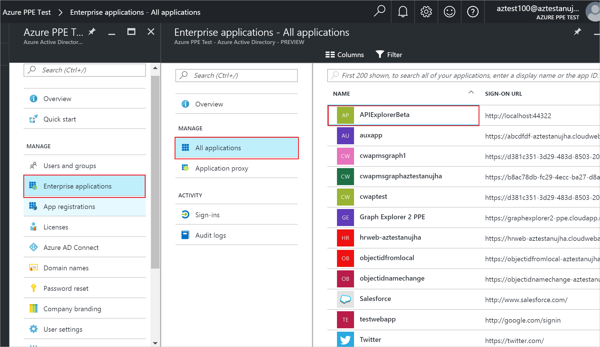
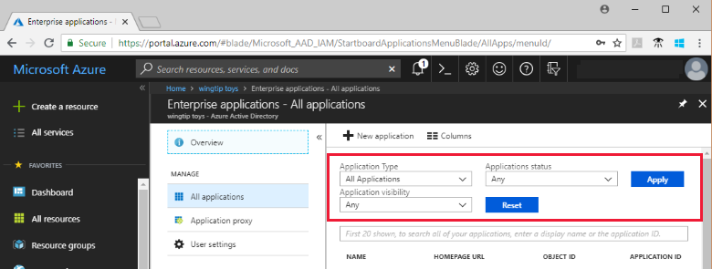

# View your Azure Active Directory tenant applications

This quickstart uses the Azure portal to view the applications in your Azure Active Directory (Azure AD) tenant.

## Before you begin

To see results, you need to have at least one application in your Azure AD tenant. To add an application, see the [Add an application](add-application-portal.md) quickstart.

Sign in to the [Azure portal](https://portal.azure.com) as a global admin for your Azure AD tenant, a cloud application admin, or an application admin.

## Find the list of tenant applications

Your Azure AD tenant applications are viewable in the **Enterprise apps** section of the Azure portal.

To find your tenant applications:

1. In the **[Azure portal](https://portal.azure.com)**, on the left navigation panel, click **Azure Active Directory**. 

2. In the Azure Active Directory blade, click **Enterprise applications**. 

3. From the **Application Type** drop-down menu, select **All Applications**, and click **Apply**. A random sample of your tenant applications appears.

    
   
4. To view more applications, click **Show more** at the bottom of the list. Depending on the number of applications in your tenant, it might be easier to [search for a particular application](#search-for-a-tenant-application), instead of scrolling through the list.

## Select viewing options

In this section, select the options according to what you are looking for.

1. You can view the applications according to options for **Application Type**, **Application Status**, and **Application visibility**. 

    

2. Under **Application Type**, choose one of these options:

    - **Enterprise Applications** shows non-Microsoft applications.
    - **Microsoft Applications** shows Microsoft applications.
    - **All Applications** shows both non-Microsoft and Microsoft applications.

3. Under **Application Status**, choose **Any**, **Disabled**, or **Enabled**. The **Any** option includes both disabled and enabled applications.

4. Under **Application Visibility**, choose **Any**, or **Hidden**. The **Hidden** option shows applications that are in the tenant, but are not visible to users.

5. After choosing the options you want, click **Apply**.
 

## Search for a tenant application

To search for an particular application:

1. In the **Application Type** menu, select **All applications**, and click **Apply**.

2. Enter the name of the application you want to find. If the application has been added to your Azure AD tenant, it will appear in the search results. This example shows that GitHub has not been added to the tenant applications.

    

3. Try entering the first few letters of an application name.  This example shows all the applications that start with **Sales**.

    

## Next steps

In this quickstart, you learned how to view the applications in your Azure AD tenant, and how to filter the list of applications by application type, status, and visibility. You also learned how to search for a particular application.

Now that you have found the application you were looking for, you can continue to [Add more applications to your tenant](add-application-portal.md), or click the application to view or edit properties and configuration options. For example, you could configure single sign-on. 

> [!div class="nextstepaction"]
> [Configure single sign-on](configure-single-sign-on-portal.md)

