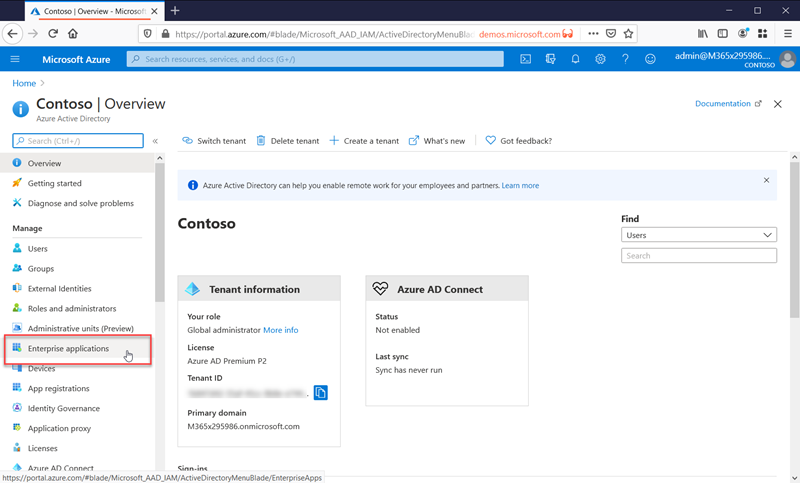

# What is application management?

Azure AD is an Identity and Access Management (IAM) system. It provides a single place to store information about digital identities. You can configure your software applications to use Azure AD as the place where user information is stored.

Azure AD must be configured to integrate with an application. In other words, it needs to know what apps are using it for identities. Making Azure AD aware of these apps, and how it should handle them, is known as application management.

You manage applications on the **Enterprise applications** page located in the Manage section of the Azure Active Directory portal.

## What is an Identity and Access Management (IAM) system?

An application is a piece of software that is used for some purpose. Most apps require users to sign in.

A centralized identity system provides a single place to store user information that can then be used by all applications. These systems have come to be known as Identity and Access Management (IAM) systems. Azure Active Directory is the IAM system for the Microsoft cloud.

>[!TIP]
>An IAM system provides a single place to keep track of user identities. Azure AD is the IAM system for the Microsoft cloud.

## Why manage applications with a cloud solution?

Organizations often have hundreds of applications that users depend on to get their work done. Users access these applications from many devices and locations. New applications are added, developed, and sunset all the time. With so many apps and access points, it's important to use an identity solution that works with them all.

>[!TIP]
>The Azure AD app gallery contains many popular applications that are already pre-configured to work with Azure AD as an identity provider.

## How does Azure AD work with apps?

Azure AD sits in the middle and provides identity management for cloud and on-premises apps.

>[!TIP]
>Reduce administrative costs by [automating user provisioning](../app-provisioning/user-provisioning.md) so that users are automatically added to Azure AD when you add them to your company HR system.

## What types of applications can I integrate with Azure AD?

You can use Azure AD as your identity system for just about any app. Many apps are already pre-configured and can be set up with minimal effort. These pre-configured apps are published in the [Azure AD App Gallery](/azure/active-directory/saas-apps/).

You can manually configure most apps for single sign-on if they aren't already in the gallery. Azure AD provides several SSO options. Some of the most popular are SAML-based SSO and OIDC-based SSO. To learn more about integrating apps to enable SSO, see [single sign-on options](sso-options.md).

Does your organization use on-premises apps? You can integrate them using App Proxy. To learn more, see [Provide remote access to on-premises applications through Azure AD's Application Proxy](../app-proxy/application-proxy.md).

>[!TIP]
>When building your own line-of-business applications, you can integrate them with Azure AD to support single sign-on. To learn more about developing apps for Azure AD, see [Microsoft identity platform](..//develop/v2-overview.md).

## Manage risk with Conditional Access policies

Coupling Azure AD single sign-on (SSO) with [Conditional Access](../conditional-access/concept-conditional-access-cloud-apps.md) provides high levels of security for accessing applications. Conditional Access policies provide granular control to apps based on conditions you set.

## Improve productivity with single sign-on

Single sign-on (SSO) provides a unified user experience between Microsoft 365 and all the other apps you use. Say goodbye to constantly entering your username and password!

To learn more about single sign-on, see [what is single sign-on](what-is-single-sign-on.md).

## Address governance and compliance

Monitor apps through reports that use Security Incident and Event Monitoring (SIEM) tools. You can access the reports from the portal, or from APIs. Programmatically audit who has access to your applications, and remove access to inactive users via access reviews.

## Manage costs

By migrating to Azure AD, you can save costs and remove the hassle of managing your on-premises infrastructure. Azure AD also provides self-service access to applications, which saves time for both administrators and users. Single sign-on eliminates application-specific passwords. This ability to sign on once saves costs related to password reset for applications, and lost productivity while retrieving passwords.

For Human Resources focused applications, or other applications with a large set of users, you can use app provisioning to make your life easier. App provisioning automates the process of adding and removing users. To learn more, see [What is application provisioning?](../app-provisioning/user-provisioning.md)

## Next steps

- [Quickstart Series on Application Management](view-applications-portal.md)
- [Get started with application integration](plan-an-application-integration.md)
- [Learn how to automate provisioning](../app-provisioning/user-provisioning.md)
