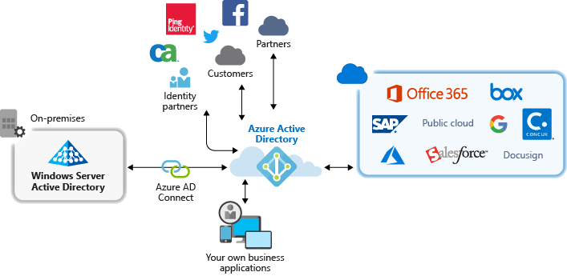

# Application management with Azure Active Directory

Azure Active Directory (Azure AD) simplifies the way you manage your applications by providing a single identity system for your cloud and on-premises apps. You can add your software as a service (SaaS) applications, on-premises applications, and line of business (LOB) apps to Azure AD. Then users sign in once to securely and seamlessly access these applications, along with Office 365 and other business applications from Microsoft. You can reduce administrative costs by [automating user provisioning](../app-provisioning/user-provisioning.md). You can also use multi-factor authentication and Conditional Access policies to provide secure application access.

## Why manage applications with a cloud solution?

Organizations often have hundreds of applications that users depend on to get their work done. Users access these applications from many devices and locations. New applications are added, developed, and sunset every day. With so many applications and access points, it's more critical than ever to use a cloud-based solution to manage user access to all applications.

## What types of applications can I integrate with Azure AD?

There are four main types of applications that you can add to your **Enterprise applications** and manage with Azure AD:

- **Azure AD Gallery applications** – Azure AD has a gallery that contains thousands of applications that have been pre-integrated for single sign-on with Azure AD. Some of the applications your organization uses are probably in the gallery. [Learn about planning your app integration](plan-an-application-integration.md), or get detailed integration steps for individual apps in the [SaaS application tutorials](https://docs.microsoft.com/azure/active-directory/saas-apps/).

- **On-premises applications with Application Proxy** – With Azure AD Application Proxy, you can integrate your on-premises web apps with Azure AD to support single sign-on. Then end users can access your on-premises web apps in the same way they access Office 365 and other SaaS apps. [Learn why to use Application Proxy and how it works](what-is-application-proxy.md).

- **Custom-developed applications** – When building your own line-of-business applications, you can integrate them with Azure AD to support single sign-on. By registering your application with Azure AD, you have control over the authentication policy for the application. For more information, see [guidance for developers](developer-guidance-for-integrating-applications.md).

- **Non-Gallery applications** – Bring your own applications! Support single sign-on for other apps by adding them to Azure AD. You can integrate any web link you want, or any application that renders a username and password field, supports SAML or OpenID Connect protocols, or supports SCIM. For more information, see [Configure single sign-on for non-gallery apps](configure-single-sign-on-non-gallery-applications.md).

## Manage risk with Conditional Access policies

Coupling Azure AD single sign-on (SSO) with [Conditional Access](../conditional-access/concept-conditional-access-cloud-apps.md) provides high levels of security for accessing applications. Security capabilities include cloud-scale identity protection, risk-based access control, native multi-factor authentication, and Conditional Access policies. These capabilities allow for granular control policies based on applications, or on groups that need higher levels of security.

## Improve productivity with single sign-on

Enabling single sign-on (SSO) across applications and Office 365 provides a superior sign-in experience for existing users by reducing or eliminating sign-in prompts. The user’s environment feels more cohesive and is less distracting without multiple prompts, or the need to manage multiple passwords. The business group can manage and approve access through self-service and dynamic membership. Allowing the right people in the business to manage access to an application improves the security of the identity system.

SSO improves security. *Without single sign-on*, administrators need to create and update user accounts for each individual application, which takes time. Also, users have to track multiple credentials to access their applications. As a result, users tend to write down their passwords or use other password management solutions, which introduce data security risks. [Read more about single sign-on](what-is-single-sign-on.md).

## Address governance and compliance

With Azure AD, you can monitor application sign-ins through reports that leverage Security Incident and Event Monitoring (SIEM) tools. You can access the reports from the portal, or from APIs. Programmatically audit who has access to your applications, and remove access to inactive users via access reviews.

## Manage costs

By migrating to Azure AD, you can save costs and remove the hassle of managing your on-premises infrastructure. Azure AD also provides self-service access to applications, which saves time for both administrators and users. Single sign-on eliminates application-specific passwords. This ability to sign on once saves costs related to password reset for applications, and lost productivity while retrieving passwords.

## Next steps

- [What is Application Proxy?](what-is-application-proxy.md)
- [Quickstart: Add a gallery application to your Azure AD tenant](add-application-portal.md)
