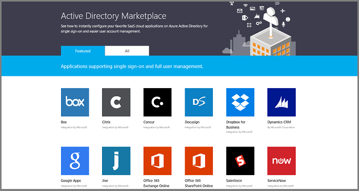
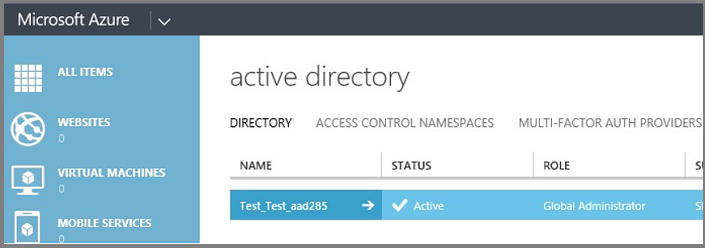
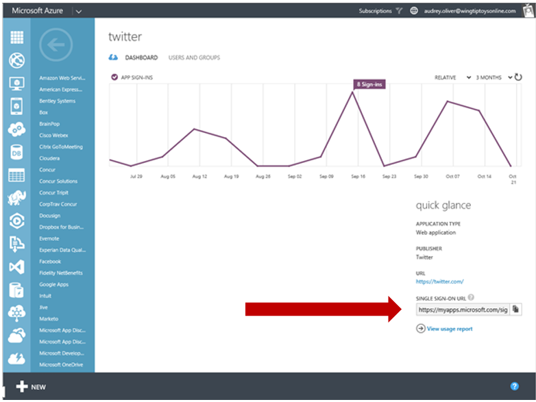

# What is application access and single sign-on with Azure Active Directory?
Single sign-on means being able to access all of the applications and resources that you need to do business, by signing in only once using a single user account. Once signed in, you can access all of the applications you need without being required to authenticate (for example, type a password) a second time.

Many organizations rely upon software as a service (SaaS) applications such as Office 365, Box and Salesforce for end-user productivity. Historically, IT staff needs to individually create and update user accounts in each SaaS application, and users have to remember a password for each SaaS application.

Azure Active Directory extends on-premises Active Directory into the cloud, enabling users to use their primary organizational account to not only sign in to their domain-joined devices and company resources, but also all of the web and SaaS applications needed for their job.

So not only do users not have to manage multiple sets of usernames and passwords, their applications access can be automatically provisioned or de-provisioned based on their organization group members, and also their status as an employee. Azure Active Directory introduces security and access governance controls that enable you to centrally manage users' access across SaaS applications.

Azure AD enables easy integration to many of today’s popular SaaS applications; it provides identity and access management, and enables users to single sign-on to applications directly, or discover and launch them from a portal such as Office 365 or the Azure AD access panel.

The architecture of the integration consists of the following four main building blocks:

* Single sign-on enables users to access their SaaS applications based on their organizational account in Azure AD. Single sign-on is what enables users to authenticate to an application using their single organizational account.
* User provisioning enables user provisioning and de-provisioning into target SaaS based on changes made in Windows Server Active Directory and/or Azure AD. A provisioned account is what enables a user to be authorized to use an application, after they have authenticated through single sign-on.
* Centralized application access management in the Azure portal enables single point of SaaS application access and management, with the ability to delegate application access decision making and approvals to anyone in the organization
* Unified reporting and monitoring of user activity in Azure AD

## How does single sign-on with Azure Active Directory work?
When users sign in to an application, they go through an authentication process where they are required to prove that they are who they say they are. Without single sign-on, this authentication process is typically done by entering a password that is stored at the application, and users are required to know this password.

Azure AD supports three different ways to sign in to applications:

* **Federated single sign-on** enables applications to redirect to Azure AD for user authentication instead of prompting for its own password. Federated single sign-on is supported for applications that support protocols such as SAML 2.0, WS-Federation, or OpenID Connect, and is the richest mode of single sign-on.
* **Password-based single sign-on** enables secure application password storage and replay using a web browser extension or mobile app. Password-based single sign-on uses the existing process provided by the application, but enables an administrator to manage the passwords and does not require the user to know the password.
* **Linked single sign-on** enables Azure AD to leverage any existing single sign-on that has been set up for the application, but enables these applications to be linked to the Office 365 or Azure AD access panel portals, and also enables additional reporting in Azure AD when the applications are launched there.

Once a user has authenticated with an application, they also need to have an account record provisioned at the application that tells the application where the permissions and level of access are inside the application. The provisioning of this account record can either occur automatically, or it can occur manually by an administrator before the user is provided single sign-on access.

 More details on these single sign-on modes and provisioning below.

### Federated single sign-on
Federated single sign-on enables the users in your organization to be automatically signed in to a third-party SaaS application by Azure AD using the user account information from Azure AD.

In this scenario, when you have already been logged into Azure AD, and you want to access resources that are controlled by a third-party SaaS application, federation eliminates the need for a user to be reauthenticated.

Azure AD can support federated single sign-on with applications that support the SAML 2.0, WS-Federation, or OpenID connect protocols.

See also: [Managing Certificates for Federated Single Sign-On](manage-certificates-for-federated-single-sign-on.md)

### Password-based single sign-on
Configuring password-based single sign-on enables the users in your organization to be automatically signed in to a third-party SaaS application by Azure AD using the user account information from the third-party SaaS application. When you enable this feature, Azure AD collects and securely stores the user account information and the related password.

Azure AD can support password-based single sign-on for any cloud-based app that has an HTML-based sign-in page. By using a custom browser plugin, AAD automates the sign-in process via securely retrieving application credentials such as the username and the password from the directory, and enters these credentials into the application sign-in page on behalf of the user. There are two use cases:

1. **Administrator manages credentials** – Administrators can create and manage application credentials, and assign those credentials to users or groups who need access to the application. In these cases, the end user does not need to know the credentials, but still gains single sign-on access to the application simply by clicking on it in their access panel or via a provided link. This process enables both, lifecycle management of the credentials by the administrator, as well as convenience for end users whereby they do not need to remember or manage app-specific passwords. The credentials are obfuscated from the end user during the automated sign-in process; however they are technically discoverable by the user using web-debugging tools, and users and administrators should follow the same security policies as if the credentials were presented directly by the user. Administrator-provided credentials are useful when providing account access that is shared among many users, such as social media or document sharing applications.
2. **User manages credentials** – Administrators can assign applications to end users or groups, and allow the end users to enter their own credentials directly upon accessing the application for the first time in their access panel. This creates a convenience for end users whereby they do not need to continually enter the app-specific passwords each time they access the application. Users can continue to manage their passwords by updating or deleting them as needed. This use case can also be used as a stepping stone to administrative management of the credentials, whereby the administrator can set new credentials for the application at a future date without changing the app access experience of the end user.

In both cases, credentials are stored in an encrypted state in the directory, and are only passed over HTTPS during the automated sign-in process. Using password-based single sign-on, Azure AD offers a convenient identity access management solution for apps that are not capable of supporting federation protocols.

Password-based SSO relies on a browser extension to securely retrieve the application and user-specific information from Azure AD and apply it to the service. Most third-party SaaS applications that are supported by Azure AD support this feature.

For password-based SSO, the end user’s browsers can be:
* Internet Explorer 11 -- on Windows 7 or later
* Edge on Windows 10 Anniversary Edition or later 
* Chrome -- on Windows 7 or later, and on MacOS X or later
* Firefox 26.0 or later -- on Windows XP SP2 or later, and on Mac OS X 10.6 or later

### Linked single sign-on
When configuring single sign-on for an application, the Azure portal provides a third option of “Linked Single Sign-On”. This option simply allows the administrator to create a link to an application, and place it on the access panel for selected users.

For example, if there is an application that is configured to authenticate users using Active Directory Federation Services 2.0, an administrator can use the “Linked Single Sign-On” option to create a link to it on the access panel. When users access the link, they are authenticated using Active Directory Federation Services 2.0, or whatever existing single sign-on solution is provided by the application.

### User provisioning
For select applications, Azure AD enables automated user provisioning and de-provisioning of accounts in third-party SaaS applications from within the Azure portal, using your Windows Server Active Directory or Azure AD identity information. When a user is given permissions in Azure AD for one of these applications, an account can be automatically created (provisioned) in the target SaaS application.

When a user is deleted or their information changes in Azure AD, these changes are also reflected in the SaaS application. This means, configuring automated identity lifecycle management enables administrators to control and provide automated provisioning and de-provisioning from SaaS applications. In Azure AD, this automation of identity lifecycle management is enabled by user provisioning.

To learn more, see [Automated User Provisioning and Deprovisioning to SaaS Applications](user-provisioning.md)

## Get started with the Azure AD application gallery
Ready to get started? To deploy single sign-on between Azure AD and SaaS applications that your organization uses, follow these guidelines.

### Using the Azure AD application gallery
The [Azure Active Directory Application Gallery](https://azure.microsoft.com/marketplace/active-directory/all/) provides a listing of applications that are known to support a form of single sign-on with Azure Active Directory.

Here are some tips for finding apps by what capabilities they support:

* Azure AD supports automatic provisioning and de-provisioning for all “Featured” apps in the [Azure Active Directory Application Gallery](https://azure.microsoft.com/marketplace/active-directory/all/).
* A list of federated applications that specifically support federated single sign-on using a protocol such as SAML, WS-Federation, or OpenID Connect can be found [here](http://social.technet.microsoft.com/wiki/contents/articles/20235.azure-active-directory-application-gallery-federated-saas-apps.aspx).

Once you’ve found your application, you can get started by following the step-by-step instructions in the app gallery and in the Azure portal to enable single sign-on.

### Application not in the gallery?
If your application is not found in the Azure AD application gallery, then you have these options:

* **Add an unlisted app you are using** - Use the Custom category in the app gallery within the Azure portal to connect an unlisted application that your organization is using. You can add any application that supports SAML 2.0 as a federated app, or any application that has an HTML-based sign-in page as a password SSO app. For more details, see this article on [adding your own application](configure-federated-single-sign-on-non-gallery-applications.md).
* **Add your own app you are developing** - If you have developed the application yourself, follow the guidelines in the Azure AD developer documentation to implement federated single sign-on or provisioning using the Azure AD graph API. For more information, see these resources:
  
  * [Authentication Scenarios for Azure AD](../develop/authentication-scenarios.md)
  * [https://github.com/AzureADSamples/WebApp-MultiTenant-OpenIdConnect-DotNet](https://github.com/AzureADSamples/WebApp-MultiTenant-OpenIdConnect-DotNet)
  * [https://github.com/AzureADSamples/WebApp-WebAPI-MultiTenant-OpenIdConnect-DotNet](https://github.com/AzureADSamples/WebApp-WebAPI-MultiTenant-OpenIdConnect-DotNet)
  * [https://github.com/AzureADSamples/NativeClient-WebAPI-MultiTenant-WindowsStore](https://github.com/AzureADSamples/NativeClient-WebAPI-MultiTenant-WindowsStore)
* **Request an app integration** - Request support for the application you need using the [Azure AD feedback forum](https://feedback.azure.com/forums/169401-azure-active-directory/).

### Using the Azure portal
You can use the Active Directory extension in the Azure portal to configure the application single sign-on. As a first step, you need to select a directory from the Active Directory section in the portal:

To manage your third-party SaaS applications, you can switch into the Applications tab of the selected directory. This view enables administrators to:

* Add new applications from the Azure AD gallery, as well as apps you are developing
* Delete integrated applications
* Manage the applications they have already integrated

Typical administrative tasks for a third-party SaaS application are:

* Enabling single sign-on with Azure AD, using password SSO or, if available for the target SaaS, federated SSO
* Optionally, enabling user provisioning for user provisioning and de-provisioning (identity lifecycle management)
* For applications 
* where user provisioning is enabled, selecting which users have access to that application

For gallery apps that support federated single sign-on, configuration typically requires you to provide additional configuration settings such as certificates and metadata to create a federated trust between the third-party app and Azure AD. The configuration wizard walks you through the details and provides you with easy access to the SaaS application-specific data and instructions.

For gallery apps that support automatic user provisioning, this requires you to give Azure AD permissions to manage your accounts in the SaaS application. At a minimum, you need to provide credentials Azure AD should use when authenticating over to the target application. Whether additional configuration settings need to be provided depends on the requirements of the application.

## Deploying Azure AD-integrated applications to users
Azure AD provides several customizable ways to deploy applications to end users in your organization:

* Azure AD access panel
* Office 365 application launcher
* Direct sign-on to federated apps
* Deep links to federated, password-based, or existing apps

Which method(s) you choose to deploy in your organization is your discretion.

### Azure AD access panel
The Access Panel at https://myapps.microsoft.com is a web-based portal that allows an end user with an organizational account in Azure Active Directory to view and launch cloud-based applications to which they have been granted access by the Azure AD administrator. If you are an end user with [Azure Active Directory Premium](https://azure.microsoft.com/pricing/details/active-directory/), you can also utilize self-service group management capabilities through the Access Panel.

The Access Panel is separate from the Azure portal and does not require users to have an Azure subscription or Office 365 subscription.

For more information on the Azure AD access panel, see the [introduction to the access panel](../user-help/active-directory-saas-access-panel-introduction.md).

### Office 365 application launcher
For organizations that have deployed Office 365, applications assigned to users through Azure AD will also appear in the Office 365 portal at https://portal.office.com/myapps. This makes it easy and convenient for users in an organization to launch their apps without having to use a second portal, and is the recommended app launching solution for organizations using Office 365.

For more information about the Office 365 application launcher, see [Have your app appear in the Office 365 app launcher](https://msdn.microsoft.com/office/office365/howto/connect-your-app-to-o365-app-launcher).

### Direct sign-on to federated apps
Most federated applications that support SAML 2.0, WS-Federation, or OpenID connect also support the ability for users to start at the application, and then get signed in through Azure AD either by automatic redirection or by clicking on a link to sign in. This is known as service provider -initiated sign-on, and most federated applications in the Azure AD application gallery support this (see the documentation linked from the app’s single sign-on configuration wizard in the Azure portal for details).

### Direct sign-on links for federated, password-based, or existing apps
Azure AD also supports direct single sign-on links to individual applications that support password-based single sign-on, linked single sign-on, and any form of federated single sign-on.

These links are specifically crafted URLs that send a user through the Azure AD sign-in process for a specific application without requiring the user launch them from the Azure AD access panel or Office 365. These Single Sign-On URLs can be found under the Dashboard tab of any pre-integrated application in the Active Directory section of the Azure portal, as shown in the screenshot below.

These links can be copied and pasted anywhere you want to provide a sign-in link to the selected application. This could be in an email, or in any custom web-based portal that you have set up for user application access. Here's an example of an Azure AD direct single sign-on URL for Twitter:

`https://myapps.microsoft.com/signin/Twitter/230848d52c8745d4b05a60d29a40fced`

Similar to organization-specific URLs for the access panel, you can further customize this URL by adding one of the active or verified domains for your directory after the myapps.microsoft.com domain. This ensures any organizational branding is loaded immediately on the sign-in page without the user needing to enter their user ID first:

`https://myapps.microsoft.com/contosobuild.com/signin/Twitter/230848d52c8745d4b05a60d29a40fced`

When an authorized user clicks on one of these application-specific links, they first see their organizational sign-in page (assuming they are not already signed in), and after sign-in are redirected to their app without stopping at the access panel first. If the user is missing pre-requisites to access the application, such as the password-based single sign browser extension, then the link will prompt the user to install the missing extension. The link URL also remains constant if the single sign-on configuration for the application changes.

These links use the same access control mechanisms as the access panel and Office 365, and only those users or groups who have been assigned to the application in the Azure portal will be able to successfully authenticate. However, any user who is unauthorized will see a message explaining that they have not been granted access, and are given a link to load the access panel to view available applications for which they do have access.

## Related articles
* [List of Tutorials on How to Integrate SaaS Apps with Azure Active Directory](../saas-apps/tutorial-list.md)
* [Set up Cloud Discovery](/cloud-app-security/set-up-cloud-discovery)
* [Introduction to Managing Access to Apps](what-is-access-management.md)
* [Comparing Capabilities for Managing External Identities in Azure AD](../active-directory-b2b-compare-b2c.md)

