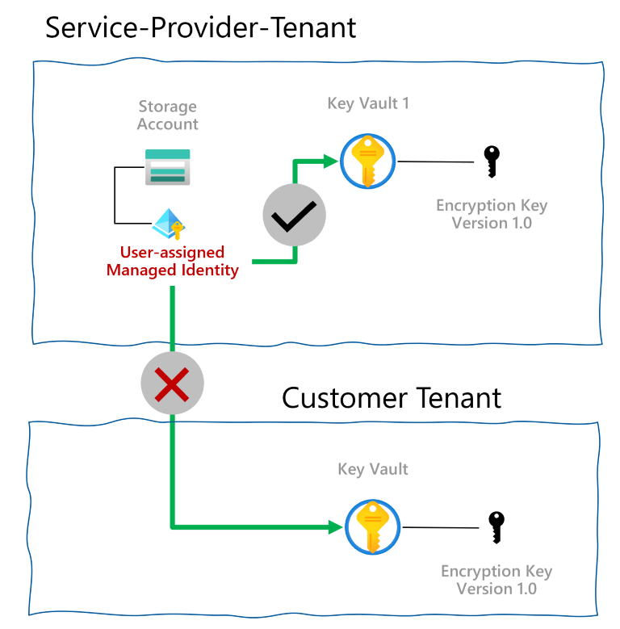
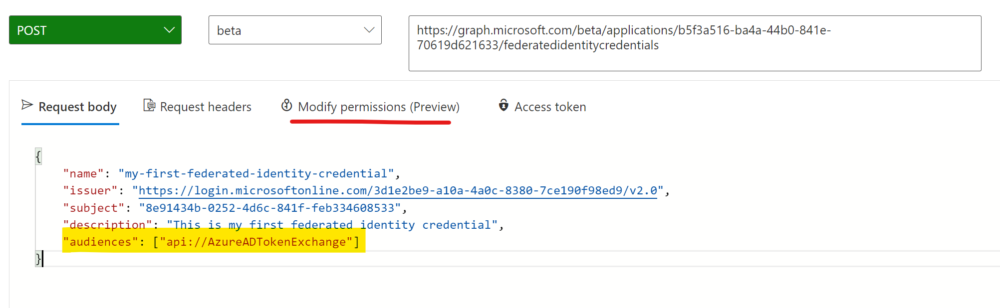

# Cross tenant Customer Managed Keys with Managed identity
Private Preview Documentation | Version 2.1 | Last updated on October 1, 2021

```
Microsoft Confidential | Contact: crosstenantcmkvteam@service.microsoft.com
```
## Scenario overview

There are serveral scenarios that require Azure resources to access other Azure services. Today, Managed Identities for Azure resources make it easy to facilitate such access by eliminating the need for credential management. However, that is only an option if all resources belong to the same Azure AD Tenant. Multiple service providers building SaaS offerings on Azure want to offer Customer Managed Keys to encrypt all customer data using an encryption key managed by the service provider’s customer using Azure Key Vault managed using the customer’s Azure AD Tenant and subscription. The Azure resources owned by the Service Provider in the Service-Provider Tenant require access to the key from the customer’s tenant to perform the encryption/decryption operations. In this private-preview we will enable a mechanism using a new feature of Azure AD called workload identity federation. Thank you for your participation in the private preview!



## Solution

As part of this private preview, the service provider/ISV can create a multi-tenant application in Azure AD. Azure AD allows the creation of a “federated identity credential" for the application. With this new type of credential, you can configure an existing Managed Identity's service principal in Azure AD to impersonate the identity of the Azure AD Application in a tenant where the application is installed. Using this configuration a managed identity, both system-assigned and user-assigned managed identities, can impersonate, get tokens, as a multi-tenant application in any tenant in which the application is installed. 

>[!NOTE]
>A user-assigned managed identity can be assigned one or more Azure resources. With the assignment, Azure resources can now request tokens as the multi-tenant Azure AD application.

In the customer's tenant, (the service provider's customer) users with the appropriate permissions can install the enterprise application, represented as a service principal. You can achieve this either using the application consent experience or simply calling Microsoft Graph API to create the service principal. Once provisioned, the service principal can be granted access to the necessary Azure resources, like an Azure Key Vault, where the CMK is stored. From the customer’s perspective, they are installing an application in Azure AD (thus creating an identity to represent the application) that is published by the service provider they trust and allowing that application access to the required resources. They do not have other visibility into how the application is implemented. We divide the end-to-end solution into three phases as described further. Phase 1 can be a one-time setup. Phases 2 and 3 would be repeated for each other customer. 


### Phase 1 - Service Provider configures Identities

| No | Step | Least privileged Azure Roles | Least privileged Azure AD Roles | 
| -- | ----------------------------------- | -------------- | --------------| 
| 1. | Create a multi-tenant Azure AD application registration or start with an existing application registration. Note the ApplicationId (aka ClientId) of the application registration. <br>[Azure Portal](../develop/quickstart-register-app) / [Microsoft Graph API](https://docs.microsoft.com/graph/api/application-post-applications?view=graph-rest-1.0&tabs=http) / [Azure AD owerShell](https://docs.microsoft.com/powershell/module/azuread/new-azureadapplication?view=azureadps-2.0) / [Azure CLI](https://docs.microsoft.com/cli/azure/ad/app?view=azure-cli-latest#az_ad_app_create) | None | User with permissions to create Applications 
| 2. | Create a user-assigned managed identity (to be used as a Federated Identity Credential). <br> [Azure Portal](https://docs.microsoft.com/azure/active-directory/managed-identities-azure-resources/how-manage-user-assigned-managed-identities?pivots=identity-mi-methods-azp) / [Azure CLI](https://docs.microsoft.com/azure/active-directory/managed-identities-azure-resources/how-manage-user-assigned-managed-identities?pivots=identity-mi-methods-azcli) / [Azure PowerShell](https://docs.microsoft.com/azure/active-directory/managed-identities-azure-resources/how-manage-user-assigned-managed-identities?pivots=identity-mi-methods-powershell)/ [Azure Resource Manager Templates](https://docs.microsoft.com/azure/active-directory/managed-identities-azure-resources/how-manage-user-assigned-managed-identities?pivots=identity-mi-methods-arm) | [Manage identity contributor](https://docs.microsoft.com/azure/role-based-access-control/built-in-roles#managed-identity-contributor) | None | 
| 3. | Configure user-assigned managed identity as a *federated identity credential* on the application, so that it can impersonate the identity of the application. <br> [Graph API reference](https://aka.ms/fedcredentialapi) | None | Owner of the application | 
| 4. | Share the ApplicationId with the customer, so that they can install the application. | None | None| 


### Phase 2 - Customer authorizes Azure Key Vault
| No | Step | Least privileged Azure Roles | Least privileged Azure AD Roles | 
| -- | ----------------------------------- | -------------- | --------------| 
| 1. | Install the Service Provider Application with any one of the following options <br>[Graph API](https://docs.microsoft.com/graph/api/serviceprincipal-post-serviceprincipals?view=graph-rest-1.0&tabs=http) / [Azure AD PowerShell](https://docs.microsoft.com/powershell/module/azuread/new-azureadserviceprincipal?view=azureadps-2.0) / [Azure CLI](https://docs.microsoft.com/cli/azure/ad/sp?view=azure-cli-latest#az_ad_sp_create) <br> OR Using the consent URL: Navigate to the URL such as below by replacing the appropriate clientId: https://login.microsoftonline.com/common/oauth2/authorize?response_type=code&client_id=248e869f-0e5c-484d-b5ea1fba9563df41&redirect_uri=https://www.your-app-url.com <br> Navigating to this URL from a web browser will invoke the consent experience and install the application in the tenant used to authenticate. | None | Users with permissions to install applications | 
| 2. | Create Azure Key Vault and a key used as Customer Managed Key. | Contributor, Key Vault Crypto Officer | None | 
| 3. | Grant the consented Application Identity access to Azure Key Vault using Azure Role Based Access Control using the role [“Key Vault Crypto Service Encryption User”](https://docs.microsoft.com/azure/key-vault/general/rbac-guide?tabs=azure-cli#azure-built-in-roles-for-key-vault-data-plane-operations) | Key Vault Administrator | None | 
| 4. | Copy the Key Vault URL and Key Name into the Customer-Managed-Keys configuration of the SaaS offering.| None| None| 


### Phase 3 – Service Provider configures Customer-Managed Keys
| No | Step | Least privileged Azure Roles | Least privileged Azure AD Roles |
| -- | ----------------------------------- | -------------- | --------------| 
| 1. | Create an Azure Storage account with Cross Tenant Customer Managed Keys. Shared as attachment - [Azure Storage - Private Preview Cross-tenant CMK for Azure Storage.docx](https://microsoft-my.sharepoint.com/:w:/r/personal/ozgun_microsoft_com/_layouts/15/guestaccess.aspx?e=z0Ao18&share=EQPgS2S0xA9CnctR01TA9BsBOdnQ0H2UC-tlzzTaciiIIA) <br> [Azure portal](https://microsoft-my.sharepoint.com/:w:/r/personal/ozgun_microsoft_com/_layouts/15/guestaccess.aspx?e=z0Ao18&share=EQPgS2S0xA9CnctR01TA9BsBOdnQ0H2UC-tlzzTaciiIIA) / [Azure CLI](https://microsoft-my.sharepoint.com/:w:/r/personal/ozgun_microsoft_com/_layouts/15/guestaccess.aspx?e=z0Ao18&share=EQPgS2S0xA9CnctR01TA9BsBOdnQ0H2UC-tlzzTaciiIIA)/ [ARM Templates](https://microsoft-my.sharepoint.com/:w:/r/personal/ozgun_microsoft_com/_layouts/15/guestaccess.aspx?e=z0Ao18&share=EQPgS2S0xA9CnctR01TA9BsBOdnQ0H2UC-tlzzTaciiIIA)/ [Azure PowerShell](https://microsoft-my.sharepoint.com/:w:/r/personal/ozgun_microsoft_com/_layouts/15/guestaccess.aspx?e=z0Ao18&share=EQPgS2S0xA9CnctR01TA9BsBOdnQ0H2UC-tlzzTaciiIIA) / [REST APIs](https://microsoft-my.sharepoint.com/:w:/r/personal/ozgun_microsoft_com/_layouts/15/guestaccess.aspx?e=z0Ao18&share=EQPgS2S0xA9CnctR01TA9BsBOdnQ0H2UC-tlzzTaciiIIA) : Microsoft internal link shared as attachment | Contributor | None | 
| 2. | Create an Azure SQL server with Cross Tenant Customer Managed Keys <br> [Azure portal](https://microsoft.sharepoint.com/:w:/r/teams/sqlsecurity/_layouts/15/guestaccess.aspx?e=6Zj9BK&share=EUbQ0ix9o91IjlgNbfvpgakBLoRa4hMHUrU9OglX4q3Tig) / [Azure CLI](https://microsoft.sharepoint.com/:w:/r/teams/sqlsecurity/_layouts/15/guestaccess.aspx?e=6Zj9BK&share=EUbQ0ix9o91IjlgNbfvpgakBLoRa4hMHUrU9OglX4q3Tig)/ [ARM Templates](https://microsoft.sharepoint.com/:w:/r/teams/sqlsecurity/_layouts/15/guestaccess.aspx?e=6Zj9BK&share=EUbQ0ix9o91IjlgNbfvpgakBLoRa4hMHUrU9OglX4q3Tig)/ [Azure PowerShell](https://microsoft.sharepoint.com/:w:/r/teams/sqlsecurity/_layouts/15/guestaccess.aspx?e=6Zj9BK&share=EUbQ0ix9o91IjlgNbfvpgakBLoRa4hMHUrU9OglX4q3Tig) / [REST APIs](https://microsoft.sharepoint.com/:w:/r/teams/sqlsecurity/_layouts/15/guestaccess.aspx?e=6Zj9BK&share=EUbQ0ix9o91IjlgNbfvpgakBLoRa4hMHUrU9OglX4q3Tig) : Microsoft internal link shared as attachment  | Contributor | None | 


### Important callouts
 
1. In the customer tenant, an admin can set policies to block non-admin users from consenting to or installing Applications. Such policies can prevent non-admin users (users without a specific Azure AD role) from creating the desired service principal in the customer tenant. If such a policy is configured, then users with permissions to create service principals will have to be involved.
2. Today it is not possible to create new Azure AD Application registrations using ARM templates. It is on the roadmap, but the timelines are unknown and beyond the scope of this private preview. 
3. Azure Key Vault can be configured with [network protection](https://docs.microsoft.com/azure/key-vault/general/overview-vnet-service-endpoints). Accessing a key vault configured to be accessed from specific networks is out of scope of this private preview.

## Requirements

### Service Provider Tenant
1. Service-Provider Azure AD Tenant (for example -BestServiceProvider.com)
2. An Azure subscription associated with Service-Provider Tenant–(for example, AppSubscription1)
3. A user account in Service Provider tenant (for example, demouser@bestserviceprovider.com) with the following permissions
    a. Owner role for “AppSubscription1”.(Created using Azure RBAC Role assignments).
    b. One of the following Azure AD roles (Granted using [Azure AD RBAC](https://docs.microsoft.com/azure/active-directory/roles/custom-overview))
        i.Application Administrator
        ii.Application Developer
        iii.Cloud application administrator
4. Fill out the Private Preview request survey using https://aka.ms/ami/xtcmk/privatepreview
    a. Include the Service-Provider Tenant (for example -BestServiceProvider.com) and the corresponding subscription (for example -AppSubscription1)

5. For Azure Storage enable the preview feature with the following instructions: 
    Check the registration status for the feature and then register the Microsoft.Storage Resource Provider 
    PSH: To check the status of your registration with PowerShell, call the Get-AzProviderFeature command.
    ```
    Get-AzProviderFeature -ProviderNamespace Microsoft.Storage -FeatureName FederatedClientIdentity
    Register-AzResourceProvider -ProviderNamespace "Microsoft.Storage" 
    ```
    CLI:
    ```azcli-interactive
    az feature show --namespace Microsoft.Storage --name FederatedClientIdentity
    az provider register --namespace Microsoft.Storage
    ```       
#### Customer Tenant 
6. At least 1 Customer Azure AD Tenant -Contoso.com
7. An Azure subscription associated with Customer Tenant.“KVSubscription2”
8. An account in the Customer tenant (for example, demouser@contoso.com) with the “Owner” role for “KVSubscription2” (Created using Azure RBAC Role Assignments)

#### Tools

You will need the following tools to complete this tutorial.
1. [Azure CLI](https://docs.microsoft.com/cli/azure/install-azure-cli)
2. [Microsoft Graph Explorer](https://developer.microsoft.com/graph/graph-explorer) - No installation needed.


## Step-by-step instructions for Private Preview with Azure Storage 

This section provides step-by-step tutorial to create a working setup. At the end of this tutorial, you will have a new Azure storage account that is configured for encryption with a key vault from another tenant.


### Phase 1 - Service Provider configures identities
#### Step 0 - Log in to Azure
Log in to Azure to use Azure CLI 
```azurecli-interactive
az login
```
#### Step 1 - Create a new Multi-tenant AAD Application registration
Pick a name for your Multi-Tenant Azure AD Application. For example: “XTCMKDemoApp”. This name is used by your customers to identify the Application. Note the “AppId” generated for this application. Also note the “ObjectId”generated for this application–referred as appObjectId in this document. 

```azurecli-interactive
username=$(az account show --query user.name --out tsv)
tenantId=$(az account show --query tenantId --out tsv)
echo "Logged in as username = $username from Tenant = $tenantId"
# Create Multi-Tenant App registration
appName="XTCMKDemoApp"
appObjectId=$(az ad app create --display-name $appName --available-to-other-tenants true --query objectId --out tsv)
appId=$(az ad app show --id $appObjectId --query appId --out tsv)
echo "Multi-tenant AAD Application has appId = $appId and ObjectId = $appObjectId"
```

#### Step 2 - Create a resource group and a user-assigned managed identity

```azurecli-interactive
subscriptionId="<replace-with-your-subscriptionId"
rgName="XTCMKDemo"
location="eastus2euap" # This is the Azure canary.
az group create --location $location --resource-group $rgName --subscription $subscriptionId
echo "Created a new resource group with name = $rgName, location = $location in subscriptionid = $subscriptionId"
uamiName="xtcmkFIC"
uamiObjectId=$(az identity create --name $uamiName --resource-group $rgName --location $location --subscription $subscriptionId --query principalId --out tsv)
```
#### Step 3 - Configure user-assigned managed identity as a *federated identity credential* on the application

Make sure to use `api://AzureADTokenExchange` as the `audience` value in the federated identity credential. See the [API reference](https://aka.ms/fedcredentialapi) for more details.

```azurecli-interactive
az rest --method POST --uri 'https://graph.microsoft.com/beta/applications/<replace-with-appObjectId>/federatedIdentityCredentials' --body '{"name":"test01","issuer":"https://login.microsoftonline.com/<replace-with-tenantId>/v2.0","subject":"<replace-with-uamiObjectId","description":"This is a new test federated identity credential","audiences":["api://AzureADTokenExchange"]}'
```
You can also complete this step using the Microsoft Graph Explorer.
1. Navigate to [https://developer.microsoft.com/graph/graph-explorer](https://developer.microsoft.com/graph/graph-explorer)
2. Sign-in with the appropriate account that has permissions to managed Azure AD applications.
3. Select method as `POST`, version as `beta` and the URL path to be `https://graph.microsoft.com/beta/applications/<replace-applicationObjectId>/federatedidentitycredentials`
4. Enter the request body by changing the appropriate values: 
```json 
{
    "name": "xtcmk-fic-for-abcd",
    "issuer": "https://login.microsoftonline.com/<replace-with-tenantId>/v2.0",
    "subject": "<replace-with-managed-identity-ObjectId",
    "description": "This is my first federated identity credential",
    "audiences": [
        "api://AzureADTokenExchange"
    ]
}
```
For example:



 - Please ensure to click `Modify permissions` and grant Graph Explorer the required consents, so that Graph Explorer website can call the Graph APIs on your behalf.
 - Please double check the `audience` value. The authentication flows may result in errors if the audience value does not match the above.

 
 #### Step 4 - Share the AppId with the customers.
Find the “AppId” of the Azure AD MT application and share it with the customers. In this example, it is "appId"

### Phase 2 - Customer Tenant authorizes Azure Key Vault
#### Step 1 Install the Azure AD Application using AppId in the customer tenant.
Once you receive the “AppId” from the Service Provider Tenant, install the application using the following command(installation of the application is equivalent to creation of service principal).

```azurecli-interactive
#Login to Azure
az login

# Install the application
appId='<replace-the-multi-tenant-ApplicationId' #appId from Phase 1.
appObjectId=$(az ad sp create --id $appId --query objectId --out tsv)
appObjectId=$(az ad sp show --id $appId --query objectId --out tsv)
```

#### Step 2 Create a key vault and encryption keys

1. Create Azure RBAC role assignments for the current user. This role assignment is required so that the user continues to have access to the key vault via Azure RBAC after its creation. 

```azurecli-interactive
#Role assignments to manageresourcesandkeyvaultsintheresourcegroup.
rgName='CMKKeys'
subscriptionId='<replace-your-subscriptionId'

az group create --location $location --name $rgName
currentUserObjectId=$(az ad signed-in-user show --query objectId --out tsv)
# Create Azure RBAC Role assignment to manage resouces and key vaults in the resource group.
az role assignment create --role "00482a5a-887f-4fb3-b363-3b7fe8e74483" --scope /subscriptions/$subscriptionId/resourceGroups/$rgName --assignee-object-id $currentUserObjectId
az role assignment create --role 8e3af657-a8ff-443c-a75c-2fe8c4bcb635 --scope /subscriptions/$subscriptionId/resourceGroups/$rgName --assignee-object-id $currentUserObjectId
```

2. Create a new Azure key vault

```azurecli-interactive
vaultName='<provide-a-name-for-keyvault'
location='pick-a-location' # for example: location='centralus'
az keyvault create --location $location --name $vaultName --resource-group $rgName --subscription $subscriptionId --enable-purge-protection true --enable-rbac-authorization true --query name --out tsv
```
3. Create an encryption key in the Key Vault.

```azurecli-interactive
az keyvault key create --name mastercmkkey --vault-name $vaultName
```

#### Grant Service Provider Application access to the key vault.
Assign the **Key Vault Crypto Service user** role to the service-provider application at the resource group scope.

```azurecli-interactive
az role assignment create --role e147488a-f6f5-4113-8e2d-b22465e65bf6 --scope /subscriptions/$subscriptionId/resourceGroups/$rgName/providers/Microsoft.KeyVault/vaults/$vaultName --assignee-object-id $appObjectId

```

### Phase 3 - Service Provider Tenant- Configures Customer Managed Keys 

In this phase we will deploy ARM templates that configure Customer-Managed-Key configurations for Azure resources using identity objects from previous steps and customer-provided values for Azure Key Vault.   

#### Azure Storage 
Create a file for an ARM template called `XTCMK-storage.json` with the following contents. Be sure to update the `parameter` values based on your configuration.

```json
{
    "$schema": "https://schema.management.azure.com/schemas/2019-04-01/deploymentTemplate.json#",
    "contentVersion": "1.0.0.0",
    "parameters": {
      "storagename": {
        "defaultValue": "20210802templatetest",
        "type": "String"
      },
      "userassignedmicmk": {
        "defaultValue": "/subscriptions/af13be3e-55c8-4bb8-974e-ccd023ca4f21/resourcegroups/0728XTCMK/providers/Microsoft.ManagedIdentity/userAssignedIdentities/xtcmkFIC01",
        "type": "String"
      },
      "cmkfederatedclientId" : {
        "type" : "string",
        "defaultValue": "e5658e5f-ccb7-47ac-9e07-cccbb66abafa"
      },
      "keyVaultURL" : 
      {
        "type": "string",
        "defaultValue" : "https://contosovault1122.vault.azure.net"
      },
      "CMKkeyName" : {
        "type": "string",
        "defaultValue" : "mastercmkkey"
      } 
    },
    "variables": {},
    "resources": [
      {
        "type": "Microsoft.Storage/storageAccounts",
        "apiVersion": "2021-05-01",
        "name": "[parameters('storagename')]",
        "location": "eastus2euap",
        "sku": {
          "name": "Standard_LRS",
          "tier": "Standard"
        },
        "kind": "StorageV2",
        "identity": {
          "type": "UserAssigned",
          "userAssignedIdentities": {
            "[parameters('userassignedmicmk')]": {}
          }
        },
        "properties": {
          "minimumTlsVersion": "TLS1_2",
          "allowBlobPublicAccess": true,
          "allowSharedKeyAccess": true,
          "networkAcls": {
            "bypass": "AzureServices",
            "virtualNetworkRules": [],
            "ipRules": [],
            "defaultAction": "Allow"
          },
          "supportsHttpsTrafficOnly": true,
          "encryption": {
            "identity": {
              "userAssignedIdentity": "[parameters('userassignedmicmk')]",
              "federatedIdentityClientId": "[parameters('cmkfederatedclientId')]"
            },
            "keyvaultproperties": {
              "keyvaulturi": "[parameters('keyVaultURL')]",
              "keyname": "[parameters('CMKkeyName')]"
            },
            "services": {
              "file": {
                "keyType": "Account",
                "enabled": true
              },
              "blob": {
                "keyType": "Account",
                "enabled": true
              }
            },
            "keySource": "Microsoft.Keyvault"
          },
          "accessTier": "Hot"
        }
      }      
    ]
  }

```

Then run the following command:

```azurecli-interactive
az deployment group create --resource-group $rgName --template-file .\XTCMK-Storage.json
```


