# View update and sign-in activities for Managed identities

This article will explain how to view updates carried out to managed identities, and sign-in attempts made by managed identities.

## Prerequisites

- If you're unfamiliar with managed identities for Azure resources, check out the [overview section](overview.md).
- If you don't already have an Azure account, [sign up for a free account](https://azure.microsoft.com/free/).

## View updates made to user-assigned managed identities

This procedure demonstrates how to view updates carried out to user-assigned managed identities

1. In the Azure portal, browse to **Activity Log**.

 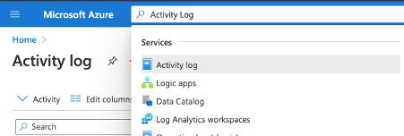

2. Select the **Add Filter** search pill and select **Operation** from the list.

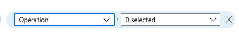

3. In the **Operation** dropdown list, enter these operation names: "Delete User Assigned Identity" and "Write UserAssignedIdentities".

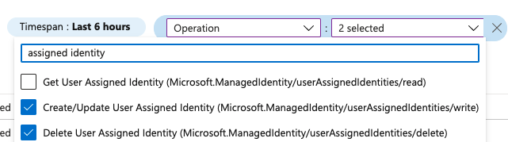

4. When matching operations are displayed, select one to view the summary.

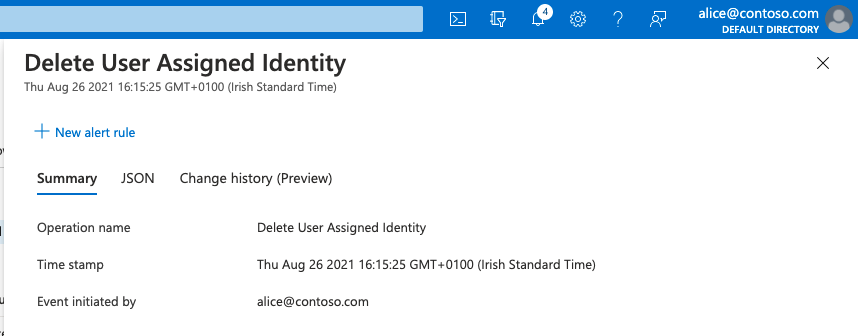

5. Select the **JSON** tab to view more detailed information about the operation, and scroll to the **properties** node to view information about the identity that was modified.

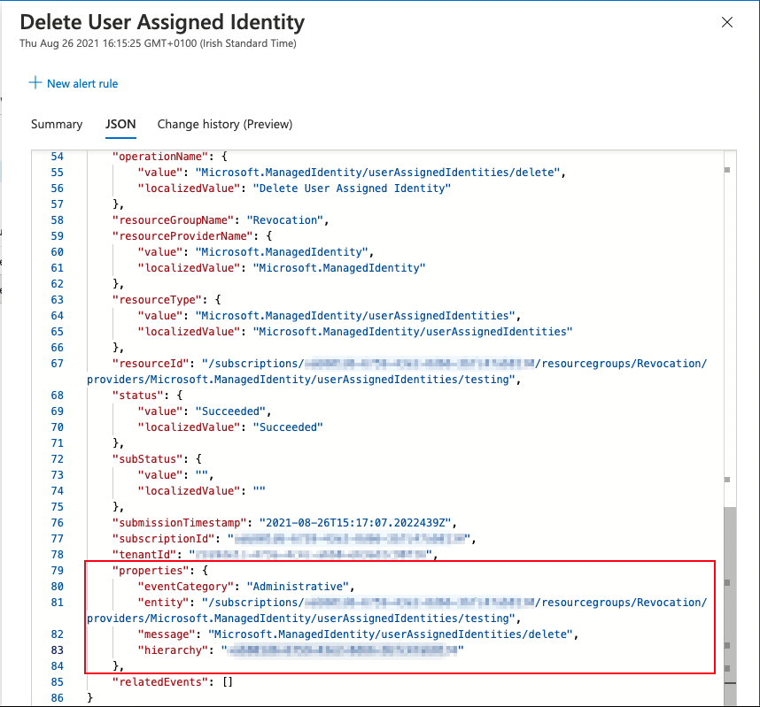

## View role assignments added and removed for managed identities

 > [!NOTE] 
 > You will need to search by the object (principal) ID of the managed identity you want to view role assignment changes for

1. Locate the managed identity you wish to view the role assignment changes for. If you're looking for a system-assigned managed identity, the object ID will be displayed in the **Identity** screen under the resource. If you're looking for a user-assigned identity, the object ID will be displayed in the **Overview** page of the managed identity.

User-assigned identity:

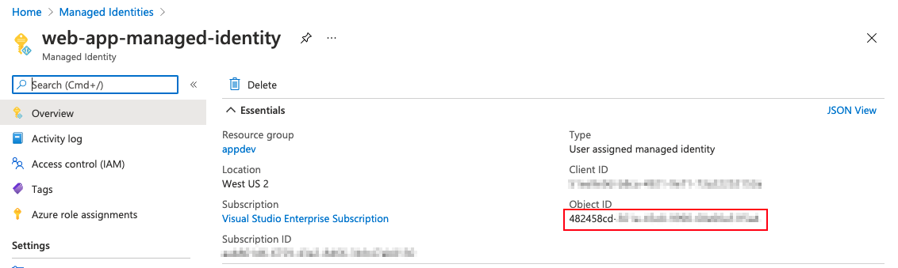

System-assigned identity:

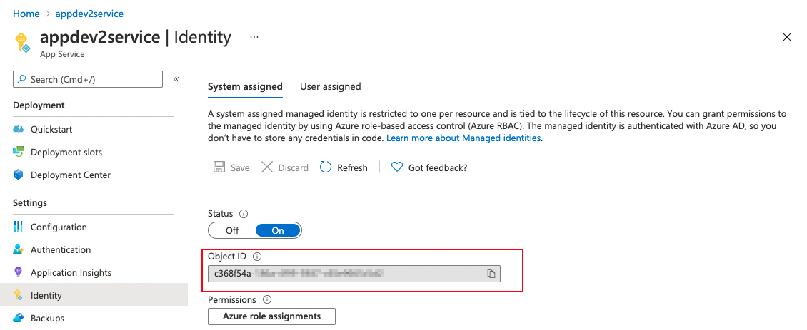

2. Copy the object ID.
3. Browse to the **Activity log**.

 

4. Select the **Add Filter** search pill and select **Operation** from the list.

5. In the **Operation** dropdown list, enter these operation names: "Create role assignment" and "Delete role assignment".

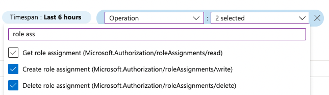

6. Paste the object ID in the search box; the results will be filtered automatically.

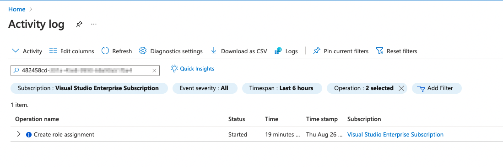
 
7. When matching operations are displayed, select one to view the summary.
 
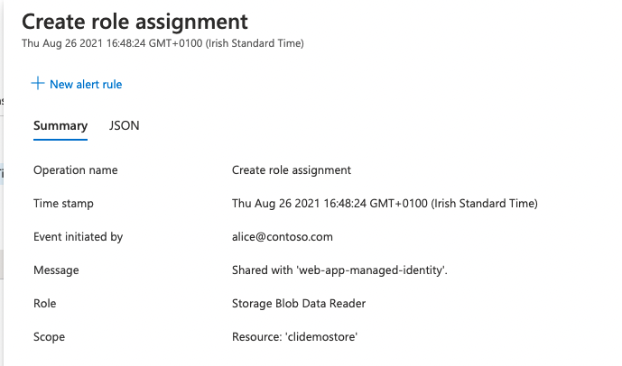

## View authentication attempts by managed identities

1. Browse to **Microsoft Entra ID**.

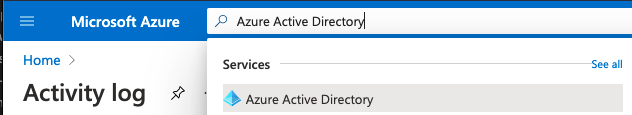

2. Select **Sign-in logs** from the **Monitoring** section.

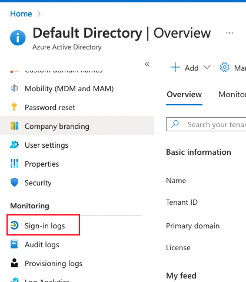

3. Select the **Managed identity sign-ins** tab.

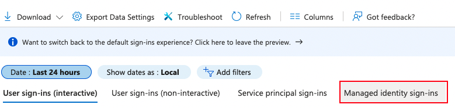

4. The sign-in events will now be filtered by managed identities.

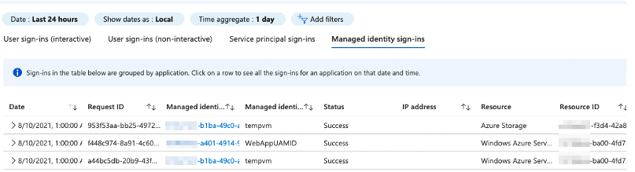 

5. To view the identity's Enterprise application in Microsoft Entra ID, select the “Managed Identity ID” column.
6. To view the Azure resource or user-assigned managed identity, search by name in the search bar of the Azure portal.

 > [!NOTE] 
 > Since managed identity authentication requests originate within the Azure infrastructure, the IP Address value is excluded here.

## Next steps

* [Managed identities for Azure resources](./overview.md)
* [Azure Activity log](../../azure-monitor/essentials/activity-log.md)
* [Microsoft Entra sign-ins log](../reports-monitoring/concept-sign-ins.md)
