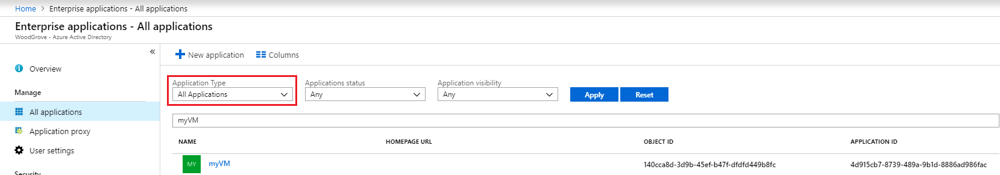

# View the service principal of a managed identity in the Azure portal

Managed identities provide Azure services with an automatically managed identity in Microsoft Entra ID. You can use this identity to authenticate to any service that supports Microsoft Entra authentication, without having credentials in your code. 

In this article, you learn how to view the service principal of a managed identity using the Azure portal.

 > [!NOTE] 
 > Service principals are Enterprise Applications. 

## Prerequisites

- If you're unfamiliar with managed identities for Azure resources, check out the [overview section](overview.md).
- If you don't already have an Azure account, [sign up for a free account](https://azure.microsoft.com/free/).
- Enable [system assigned identity on a virtual machine](./qs-configure-portal-windows-vm.md#system-assigned-managed-identity) or [application](../../app-service/overview-managed-identity.md#add-a-system-assigned-identity).

## View the service principal

This procedure demonstrates how to view the service principal of a VM with system assigned identity enabled (the same steps apply for an application).

1. Select **Microsoft Entra ID** and then select **Enterprise applications**.
2. Under **Application Type**, choose **All Applications** and then select **Apply**.
3. In the search filter box, type the name of the Azure resource that has managed identities enabled or choose it from the list.

   

## Next steps

[Managed identities for Azure resources](./overview.md)
