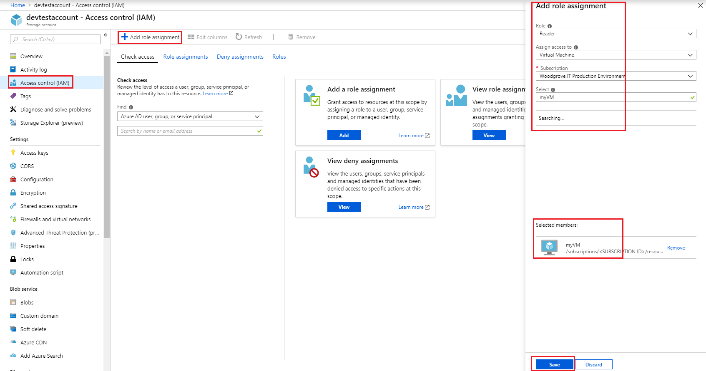

# Assign a Managed Service Identity access to a resource by using the Azure portal

[!INCLUDE [preview-notice](../../../includes/active-directory-msi-preview-notice.md)]

After you've configured an Azure resource with a Managed Service Identity (MSI), you can give the MSI access to another resource, just like any security principal. This article shows you how to give an Azure virtual machine or virtual machine scale set's MSI access to an Azure storage account, by using the Azure portal.

## Prerequisites

[!INCLUDE [msi-qs-configure-prereqs](../../../includes/active-directory-msi-qs-configure-prereqs.md)]

## Use RBAC to assign the MSI access to another resource

After you've enabled MSI on an Azure resource, such as an [Azure VM](qs-configure-portal-windows-vm.md) or [Azure VMSS](qs-configure-portal-windows-vmss.md):

1. Sign in to the [Azure portal](https://portal.azure.com) using an account associated with the Azure subscription under which you have configured the MSI.

2. Navigate to the desired resource on which you want to modify access control. In this example, we are giving an Azure virtual machine and Azure virtual machine scale set access to a storage account, so we navigate to the storage account.

3. For an Azure virtual machine, select the **Access control (IAM)** page of the resource, and select **+ Add**. Then specify the **Role**, **Assign access to Virtual Machine**, and specify the corresponding **Subscription** and **Resource Group** where the resource resides. Under the search criteria area, you should see the resource. Select the resource, and select **Save**. 

     
   For an Azure virtual machine scale set, select the **Access control (IAM)** page of the resource, and select **+ Add**. Then specify the **Role**, **Assign access to**. Under the search criteria area, search for  your virtual machine scale set. Select the resource, and select **Save**.
   
     

4. You are returned to the main **Access control (IAM)** page, where you see a new entry for the resource's MSI.

    Azure virtual machine:

   

    Azure virtual machine scale set:

    

## Troubleshooting

If the MSI for the resource does not show up in the list of available identities, verify that the MSI has been enabled correctly. In our case, we can go back to the Azure virtual machine, and check the following:

- Look at the **Configuration** page and ensure that the value for **MSI enabled** is **Yes**.
- Look at the **Extensions** page and ensure that the MSI extension deployed successfully (**Extensions** page is not available for an Azure virtual machine scale set).

If either is incorrect, you might need to redeploy the MSI on your resource again, or troubleshoot the deployment failure.

## Related content

- For an overview of MSI, see [Managed Service Identity overview](overview.md).
- To enable MSI on an Azure virtual machine, see [Configure an Azure VM Managed Service Identity (MSI) using the Azure portal](qs-configure-portal-windows-vm.md).
- To enable MSI on an Azure virtual machine scale set, see [Configure an Azure Virtual Machine Scale Set Managed Service Identity (MSI) using the Azure portal](qs-configure-portal-windows-vmss.md)

