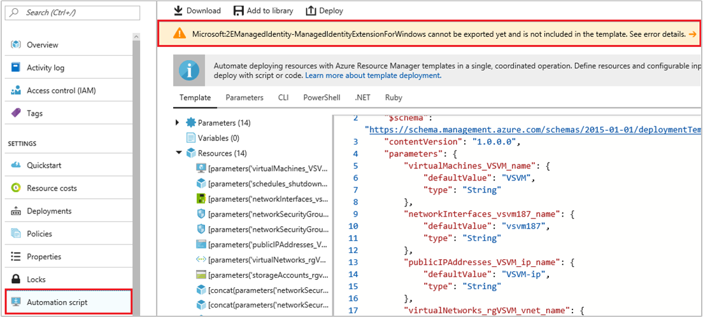

# How to stop using the virtual machine managed identities extension and start using the Azure Instance Metadata Service

## Virtual machine extension for managed identities

The virtual machine extension for managed identities is used to request tokens for a managed identity within the virtual machine. The workflow consists of the following steps:

1. First, the workload within the resource calls the local endpoint `http://localhost/oauth2/token` to request an access token.
2. The virtual machine extension then uses the credentials for the managed identity, to request an access token from Azure AD.. 
3. The access token is returned to the caller, and can be used to authenticate to services that support Azure AD authentication, like Azure Key Vault or Azure Storage.

Due to several limitations outlined in the next section, the managed identity VM extension has been deprecated in favor of using the equivalent endpoint in the Azure Instance Metadata Service (IMDS)

### Provision the extension 

When you configure a virtual machine or virtual machine scale set to have a managed identity, you may optionally choose to provision the managed identities for Azure resources VM extension using the `-Type` parameter on the [Set-AzVMExtension](https://docs.microsoft.com/powershell/module/az.compute/set-azvmextension) cmdlet. You can pass either `ManagedIdentityExtensionForWindows` or `ManagedIdentityExtensionForLinux`, depending on the type of virtual machine, and name it using the `-Name` parameter. The `-Settings` parameter specifies the port used by the OAuth token endpoint for token acquisition:

```powershell
   $settings = @{ "port" = 50342 }
   Set-AzVMExtension -ResourceGroupName myResourceGroup -Location WestUS -VMName myVM -Name "ManagedIdentityExtensionForWindows" -Type "ManagedIdentityExtensionForWindows" -Publisher "Microsoft.ManagedIdentity" -TypeHandlerVersion "1.0" -Settings $settings 
```

You can also use the Azure Resource Manager deployment template to provision the VM extension, by adding the following JSON to the `resources` section to the template (use `ManagedIdentityExtensionForLinux` for the name and type elements for the Linux version).

    ```json
    {
        "type": "Microsoft.Compute/virtualMachines/extensions",
        "name": "[concat(variables('vmName'),'/ManagedIdentityExtensionForWindows')]",
        "apiVersion": "2018-06-01",
        "location": "[resourceGroup().location]",
        "dependsOn": [
            "[concat('Microsoft.Compute/virtualMachines/', variables('vmName'))]"
        ],
        "properties": {
            "publisher": "Microsoft.ManagedIdentity",
            "type": "ManagedIdentityExtensionForWindows",
            "typeHandlerVersion": "1.0",
            "autoUpgradeMinorVersion": true,
            "settings": {
                "port": 50342
            }
        }
    }
    ```
    
    
If you're working with virtual machine scale sets, you can also provision the managed identities for Azure resources virtual machine scale set extension using the [Add-AzVmssExtension](/powershell/module/az.compute/add-azvmssextension) cmdlet. You can pass either `ManagedIdentityExtensionForWindows` or `ManagedIdentityExtensionForLinux`, depending on the type of virtual machine scale set, and name it using the `-Name` parameter. The `-Settings` parameter specifies the port used by the OAuth token endpoint for token acquisition:

   ```powershell
   $setting = @{ "port" = 50342 }
   $vmss = Get-AzVmss
   Add-AzVmssExtension -VirtualMachineScaleSet $vmss -Name "ManagedIdentityExtensionForWindows" -Type "ManagedIdentityExtensionForWindows" -Publisher "Microsoft.ManagedIdentity" -TypeHandlerVersion "1.0" -Setting $settings 
   ```
To provision the virtual machine scale set extension with the Azure Resource Manager deployment template, add the following JSON to the `extensionpProfile` section to the template (use `ManagedIdentityExtensionForLinux` for the name and type elements for the Linux version).

    ```json
    "extensionProfile": {
        "extensions": [
            {
                "name": "ManagedIdentityWindowsExtension",
                "properties": {
                    "publisher": "Microsoft.ManagedIdentity",
                    "type": "ManagedIdentityExtensionForWindows",
                    "typeHandlerVersion": "1.0",
                    "autoUpgradeMinorVersion": true,
                    "settings": {
                        "port": 50342
                    },
                    "protectedSettings": {}
                }
            }
    ```

Provisioning of the virtual machine extension might fail due to DNS lookup failures. If this happens, restart the virtual machine, and try again. 

### Remove the extension 
To remove the extension, use `-n ManagedIdentityExtensionForWindows` or `-n ManagedIdentityExtensionForLinux` switch (depending on the type of virtual machine) with [az vm extension delete](https://docs.microsoft.com/cli/azure/vm/), or [az vmss extension delete](https://docs.microsoft.com/cli/azure/vmss) for virtual machine scale sets using Azure CLI, or `Remove-AzVMExtension` for Powershell:

```azurecli-interactive
az vm identity --resource-group myResourceGroup --vm-name myVm -n ManagedIdentityExtensionForWindows
```

```azurecli-interactive
az vmss extension delete -n ManagedIdentityExtensionForWindows -g myResourceGroup -vmss-name myVMSS
```

```powershell
Remove-AzVMExtension -ResourceGroupName myResourceGroup -Name "ManagedIdentityExtensionForWindows" -VMName myVM
```

### Acquire a token using the virtual machine extension

The following is a sample request using the managed identities for Azure resources VM Extension Endpoint:

```
GET http://localhost:50342/oauth2/token?resource=https%3A%2F%2Fmanagement.azure.com%2F HTTP/1.1
Metadata: true
```

| Element | Description |
| ------- | ----------- |
| `GET` | The HTTP verb, indicating you want to retrieve data from the endpoint. In this case, an OAuth access token. | 
| `http://localhost:50342/oauth2/token` | The managed identities for Azure resources endpoint, where 50342 is the default port and is configurable. |
| `resource` | A query string parameter, indicating the App ID URI of the target resource. It also appears in the `aud` (audience) claim of the issued token. This example requests a token to access Azure Resource Manager, which has an App ID URI of https://management.azure.com/. |
| `Metadata` | An HTTP request header field, required by managed identities for Azure resources as a mitigation against Server Side Request Forgery (SSRF) attack. This value must be set to "true", in all lower case.|
| `object_id` | (Optional) A query string parameter, indicating the object_id of the managed identity you would like the token for. Required, if your VM has multiple user-assigned managed identities.|
| `client_id` | (Optional) A query string parameter, indicating the client_id of the managed identity you would like the token for. Required, if your VM has multiple user-assigned managed identities.|


Sample response:

```
HTTP/1.1 200 OK
Content-Type: application/json
{
  "access_token": "eyJ0eXAi...",
  "refresh_token": "",
  "expires_in": "3599",
  "expires_on": "1506484173",
  "not_before": "1506480273",
  "resource": "https://management.azure.com/",
  "token_type": "Bearer"
}
```

| Element | Description |
| ------- | ----------- |
| `access_token` | The requested access token. When calling a secured REST API, the token is embedded in the `Authorization` request header field as a "bearer" token, allowing the API to authenticate the caller. | 
| `refresh_token` | Not used by managed identities for Azure resources. |
| `expires_in` | The number of seconds the access token continues to be valid, before expiring, from time of issuance. Time of issuance can be found in the token's `iat` claim. |
| `expires_on` | The timespan when the access token expires. The date is represented as the number of seconds from "1970-01-01T0:0:0Z UTC"  (corresponds to the token's `exp` claim). |
| `not_before` | The timespan when the access token takes effect, and can be accepted. The date is represented as the number of seconds from "1970-01-01T0:0:0Z UTC" (corresponds to the token's `nbf` claim). |
| `resource` | The resource the access token was requested for, which matches the `resource` query string parameter of the request. |
| `token_type` | The type of token, which is a "Bearer" access token, which means the resource can give access to the bearer of this token. |


### Troubleshoot the virtual machine extension 

#### Restart the virtual machine extension after a failure

On Windows and certain versions of Linux, if the extension stops, the following cmdlet may be used to manually restart it:

```powershell
Set-AzVMExtension -Name <extension name>  -Type <extension Type>  -Location <location> -Publisher Microsoft.ManagedIdentity -VMName <vm name> -ResourceGroupName <resource group name> -ForceRerun <Any string different from any last value used>
```

Where: 
- Extension name and type for Windows is: `ManagedIdentityExtensionForWindows`
- Extension name and type for Linux is: `ManagedIdentityExtensionForLinux`

#### "Automation script" fails when attempting schema export for managed identities for Azure resources extension

When managed identities for Azure resources is enabled on a virtual machine, the following error is shown when attempting to use the “Automation script” feature for the virtual machine, or its resource group:



The managed identities for Azure resources virtual machine extension does not currently support the ability to export its schema to a resource group template. As a result, the generated template does not show configuration parameters to enable managed identities for Azure resources on the resource. These sections can be added manually by following the examples in [Configure managed identities for Azure resources on an Azure virtual machine using a templates](qs-configure-template-windows-vm.md).

When the schema export functionality becomes available for the managed identities for Azure resources virtual machine extension (planned for deprecation in January 2019), it will be listed in [Exporting Resource Groups that contain VM extensions](../../virtual-machines/extensions/export-templates.md#supported-virtual-machine-extensions).

## Limitations of the virtual machine extension 

There are several major limitations to using the virtual machine extension. 

 * The most serious limitation is the fact that the credentials used to request tokens are stored on the virtual machine. An attacker who successfully breaches the virtual machine can exfiltrate the credentials. 
 * Furthermore, the virtual machine extension is still unsupported by several Linux distributions, with a huge development cost to modify, build and test the extension on each of those distributions. Currently, only the following Linux distributions are supported: 
    * CoreOS Stable
    * CentOS 7.1 
    * Red Hat 7.2 
    * Ubuntu 15.04 
    * Ubuntu 16.04
 * There is a performance impact to deploying virtual machines with managed identities, as the virtual machine extension also has to be provisioned. 
 * Finally, the virtual machine extension can only support having 32 user-assigned managed identities per virtual machine. 

## Azure Instance Metadata Service

The [Azure Instance Metadata Service (IMDS)](/azure/virtual-machines/windows/instance-metadata-service) is a REST endpoint that provides information about running virtual machine instances that can be used to manage and configure your virtual machines. The endpoint is available at a well-known non-routable IP address (`169.254.169.254`) that can be accessed only from within the virtual machine.

There are several advantages to using Azure IMDS to request tokens. 

1. The service is external to the virtual machine, therefore the credentials used by managed identities are no longer present on the virtual machine. Instead, they are hosted and secured on the host machine of the Azure virtual machine.   
2. All Windows and Linux operating systems supported on Azure IaaS can use managed identities.
3. Deployment is faster and easier, since the VM extension no longer needs to be provisioned.
4. With the IMDS endpoint, up to 1000 user-assigned managed identities can be assigned to a single virtual machine.
5. There is no significant change to the requests using IMDS as opposed to those using the virtual machine extension, therefore it is fairly simple to port over existing deployments that currently use the virtual machine extension.

For these reasons, the Azure IMDS service will be the defacto way to request tokens, once the virtual machine extension is deprecated. 


## Next Steps

* [How to use managed identities for Azure resources on an Azure virtual machine to acquire an access token](how-to-use-vm-token.md)
* [Azure Instance Metadata Service](https://docs.microsoft.com/azure/virtual-machines/windows/instance-metadata-service)
