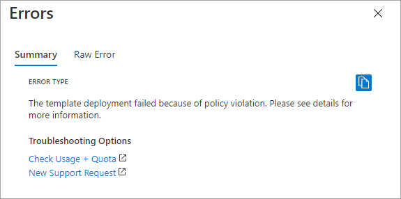

# Managed identities for Azure resources frequently asked questions - Azure AD

[!INCLUDE [preview-notice](../../../includes/active-directory-msi-preview-notice.md)]

> [!NOTE]
> Managed identities for Azure resources is the new name for the service formerly known as Managed Service Identity (MSI).

## Administration

### How can you find resources that have a managed identity?

You can find the list of resources that have a system-assigned managed identity by using the following Azure CLI Command: 

```azurecli-interactive
az resource list --query "[?identity.type=='SystemAssigned'].{Name:name,  principalId:identity.principalId}" --output table
```


### What Azure RBAC permissions are required to managed identity on a resource? 

- System-assigned managed identity: You need write permissions over the resource. For example, for virtual machines you need Microsoft.Compute/virtualMachines/write. This action is included in resource specific built-in roles like [Virtual Machine Contributor](../../role-based-access-control/built-in-roles.md#virtual-machine-contributor).
- User-assigned managed identity: You need write permissions over the resource. For example, for virtual machines you need Microsoft.Compute/virtualMachines/write. In addition to [Managed Identity Operator](../../role-based-access-control/built-in-roles.md#managed-identity-operator) role assignment over the managed identity.

### How do I prevent the creation of user-assigned managed identities?

You can keep your users from creating user-assigned managed identities using [Azure Policy](../../governance/policy/overview.md)

1. Navigate to the [Azure portal](https://portal.azure.com) and go to **Policy**.
2. Choose **Definitions**
3. Select **+ Policy definition** and enter the necessary information.
4. In the policy rule section paste
    
    ```json
    {
      "mode": "All",
      "policyRule": {
        "if": {
          "field": "type",
          "equals": "Microsoft.ManagedIdentity/userAssignedIdentities"
        },
        "then": {
          "effect": "deny"
        }
      },
      "parameters": {}
    }
    
    ```

After creating the policy, assign it to the resource group that you would like to use.

1. Navigate to resource groups.
2. Find the resource group that you are using for testing.
3. Choose **Policies** from the left menu.
4. Select **Assign policy**
5. In the **Basics** section, provide:
    1. **Scope** The resource group that we are using for testing
    1. **Policy definition**: The policy that we created earlier.
6. Leave all other settings at their defaults and choose **Review + Create**

At this point, any attempt to create a user-assigned managed identity in the resource group will fail.

  

## Concepts

### Do managed identities have a backing app object?

No. Managed identities and Azure AD App Registrations are not the same thing in the directory.

App registrations have two components: An Application Object + A Service Principal Object.
Managed Identities for Azure resources have only one of those components: A Service Principal Object.

Managed identities don't have an application object in the directory, which is what is commonly used to grant app permissions for MS graph. Instead, MS graph permissions for managed identities need to be granted directly to the Service Principal.

### What is the credential associated with a managed identity? How long is it valid and how often is it rotated?

> [!NOTE]
> How managed identities authenticate is an internal implementation detail that is subject to change without notice.

Managed identities use certificate-based authentication. Each managed identity’s credential has an expiration of 90 days and it is rolled after 45 days.

### What identity will IMDS default to if don't specify the identity in the request?

- If system assigned managed identity is enabled and no identity is specified in the request, IMDS defaults to the system assigned managed identity.
- If system assigned managed identity is not enabled, and only one user assigned managed identity exists, IMDS defaults to that single user assigned managed identity.
- If system assigned managed identity is not enabled, and multiple user assigned managed identities exist, then you are required to specify a managed identity in the request.

## Limitations

### Can the same managed identity be used across multiple regions?

In short, yes you can use user assigned managed identities in more than one Azure region. The longer answer is that while user assigned managed identities are created as regional resources the associated [service principal](../develop/app-objects-and-service-principals.md#service-principal-object) (SP) created in Azure AD is available globally. The service principal can be used from any Azure region and its availability is dependent on the availability of Azure AD. For example, if you created a user assigned managed identity in the South-Central region and that region becomes unavailable this issue only impacts [control plane](../../azure-resource-manager/management/control-plane-and-data-plane.md) activities on the managed identity itself.  The activities performed by any resources already configured to use the managed identities would not be impacted.

### Does managed identities for Azure resources work with Azure Cloud Services?

No, there are no plans to support managed identities for Azure resources in Azure Cloud Services.


### What is the security boundary of managed identities for Azure resources?

The security boundary of the identity is the resource to which it is attached to. For example, the security boundary for a Virtual Machine with managed identities for Azure resources enabled, is the Virtual Machine. Any code running on that VM, is able to call the managed identities for Azure resources endpoint and request tokens. It is the similar experience with other resources that support managed identities for Azure resources.

### Will managed identities be recreated automatically if I move a subscription to another directory?

No. If you move a subscription to another directory, you will have to manually re-create them and grant Azure role assignments again.
- For system assigned managed identities: disable and re-enable. 
- For user assigned managed identities: delete, re-create, and attach them again to the necessary resources (for example, virtual machines)

### Can I use a managed identity to access a resource in a different directory/tenant?

No. Managed identities do not currently support cross-directory scenarios. 

### Are there any rate limits that apply to managed identities?

Managed identities limits have dependencies on Azure service limits, Azure Instance Metadata Service (IMDS) limits, and Azure Active Directory service limits.

- **Azure service limits** define the number of create operations that can be performed at the tenant and subscription levels. User assigned managed identities also have [limitations](../../azure-resource-manager/management/azure-subscription-service-limits.md#managed-identity-limits) around how they may be named.
- **IMDS** In general, requests to IMDS are limited to five requests per second. Requests exceeding this threshold will be rejected with 429 responses. Requests to the Managed Identity category are limited to 20 requests per second and 5 concurrent requests. You can read more at the [Azure Instance Metadata Service (Windows)](../../virtual-machines/windows/instance-metadata-service.md?tabs=windows#managed-identity) article.
- **Azure Active Directory service** Each managed identity counts towards the object quota limit in an Azure AD tenant as described in Azure [AD service limits and restrictions](../enterprise-users/directory-service-limits-restrictions.md).


### Is it possible to move a user-assigned managed identity to a different resource group/subscription?

Moving a user-assigned managed identity to a different resource group is not supported.

## Next steps

- Learn [how managed identities work with virtual machines](how-managed-identities-work-vm.md)
