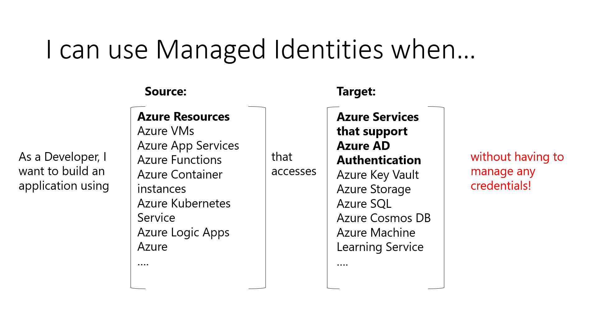

# What are managed identities for Azure resources?

A common challenge for developers is the management of secrets and credentials to secure communication between different services. On Azure, managed identities eliminate the need for developers having to manage credentials by providing an identity for the Azure resource in Azure AD and using it to obtain Azure Active Directory (Azure AD) tokens. This also helps accessing [Azure Key Vault](../../key-vault/general/overview.md) where developers can store credentials in a secure manner. Managed identities for Azure resources solves this problem by providing Azure services with an automatically managed identity in Azure AD.

What can a managed identity be used for?

   > [!VIDEO https://www.youtube.com/embed/5lqayO_oeEo]

Here are some of the benefits of using Managed identities:

- You don't need to manage credentials. Credentials are not even accessible to you.
- You can use managed identities to authenticate to any Azure service that supports Azure AD authentication including Azure Key Vault.
- Managed identities can be used without any additional cost.

> [!NOTE]
> Managed identities for Azure resources is the new name for the service formerly known as Managed Service Identity (MSI).

## Managed identity types

There are two types of managed identities:

- **System-assigned** Some Azure services allow you to enable a managed identity directly on a service instance. When you enable a system-assigned managed identity an identity is created in Azure AD that is tied to the lifecycle of that service instance. So when the resource is deleted, Azure automatically deletes the identity for you. By design, only that Azure resource can use this identity to request tokens from Azure AD.
- **User-assigned** You may also create a managed identity as a standalone Azure resource. You can [create a user-assigned managed identity](how-to-manage-ua-identity-portal.md) and assign it to one or more instances of an Azure service. In the case of user-assigned managed identities, the identity is managed separately from the resources that use it.   

  > [!VIDEO https://www.youtube.com/embed/OzqpxeD3fG0]

The table below shows the differences between the two types of managed identities.

|  Property    | System-assigned managed identity | User-assigned managed identity |
|------|----------------------------------|--------------------------------|
| Creation |  Created as part of an Azure resource (for example, an Azure virtual machine or Azure App Service) | Created as a stand-alone Azure resource |
| Life cycle | Shared life cycle with the Azure resource that the managed identity is created with.   When the parent resource is deleted, the managed identity is deleted as well. | Independent life cycle.   Must be explicitly deleted. |
| Sharing across Azure resources | Cannot be shared.   It can only be associated with a single Azure resource. | Can be shared   The same user-assigned managed identity can be associated with more than one Azure resource. |
| Common use cases | Workloads that are contained within a single Azure resource   Workloads for which you need independent identities.   For example, an application that runs on a single virtual machine | Workloads that run on multiple resources and which can share a single identity.   Workloads that need pre-authorization to a secure resource as part of a provisioning flow.   Workloads where resources are recycled frequently, but permissions should stay consistent.   For example, a workload where multiple virtual machines need to access the same resource |

>[!IMPORTANT]
>Regardless of the type of identity chosen a managed identity is a service principal of a special type that may only be used with Azure resources. When the managed identity is deleted, the corresponding service principal is automatically removed.

## How can I use managed identities for Azure resources?

## What Azure services support the feature?

Managed identities for Azure resources can be used to authenticate to services that support Azure AD authentication. For a list of Azure services that support the managed identities for Azure resources feature, see [Services that support managed identities for Azure resources](./services-support-managed-identities.md).

## Next steps

* [Use a Windows VM system-assigned managed identity to access Resource Manager](tutorial-windows-vm-access-arm.md)
* [Use a Linux VM system-assigned managed identity to access Resource Manager](tutorial-linux-vm-access-arm.md)
* [How to use managed identities for App Service and Azure Functions](../../app-service/overview-managed-identity.md)
* [How to use managed identities with Azure Container Instances](../../container-instances/container-instances-managed-identity.md)
* [Implementing Managed Identities for Microsoft Azure Resources](https://www.pluralsight.com/courses/microsoft-azure-resources-managed-identities-implementing).