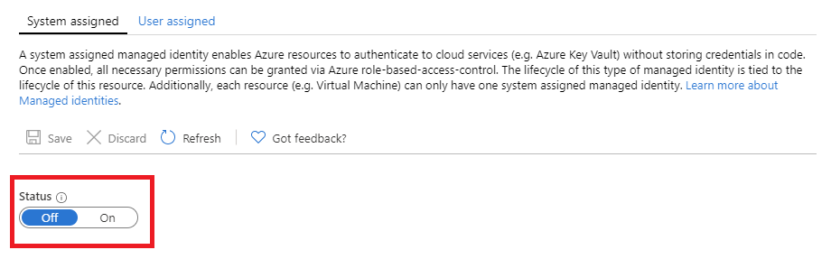

# What are managed identities for Azure resources?

[!INCLUDE [preview-notice](../../../includes/active-directory-msi-preview-notice.md)]

As a cloud developer, you are probably looking for the simplest and most secure method to access Azure resources in your code. 

The managed identities for Azure resources can help you with this requirement because managed identities:

- **Eliminate** the need for credentials in your code.
- **Rotate** credentials automatically.
- **Reduce** your involvement in managing identities to a minimum.

## How it works 

All Azure resources that support managed identities can obtain tokens to exchange data without having credentials in the code. The process consists of the following steps:

 
1.	**Enable** – Create the Managed Identity for the resource.
2.	**Grant access** –  Allow access to resources with Azure RBAC.
3.	**Access** - Perform the allowed actions.
4.	**Disable** – Delete the Managed Identity. 

## Managed identity types

There are two types of managed identities:

- System-assigned managed identity

- User-assigned managed identity

For stand-alone Azure resources, you can enable **system-assigned** managed identities. System-assigned managed identities provide the most convenient support from the identity management perspective. With just one click, you can enable the automated life cycle management of an identity for your resource.   

   

While system-assigned managed identities provide the most convenient solution for stand-alone resources, things look different if you need to manage a group of Azure resources for the same task. In this scenario, you are better of creating an identity manually and assigning this master identity to all Azure resources you need to group. This assignment is known as **user-assigned** managed identity. What is a good example?
  

## Supported services

You can use managed identities for Azure resources to authenticate to services that support Azure AD authentication. For a list of Azure services that support the managed identities for Azure resources feature, see [Services that support managed identities for Azure resources](services-support-msi.md).

## Next steps

Get started with the managed identities for Azure resources feature with the following quickstarts:

* [Use a Windows VM system-assigned managed identity to access Resource Manager](tutorial-windows-vm-access-arm.md)
* [Use a Linux VM system-assigned managed identity to access Resource Manager](tutorial-linux-vm-access-arm.md)
