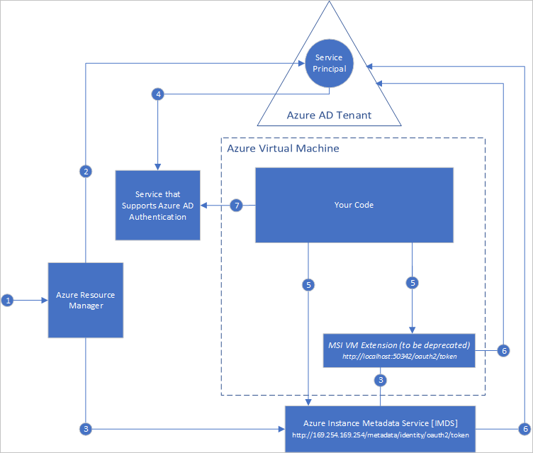

# What is managed identities for Azure resources?

[!INCLUDE [preview-notice](../../../includes/active-directory-msi-preview-notice.md)]

A common challenge when building cloud applications is how to manage the credentials in your code for authenticating to cloud services. Keeping the credentials secure is an important task. Ideally, the credentials never appear on developer workstations and aren't checked into source control. Azure Key Vault provides a way to securely store credentials, secrets, and other keys, but your code has to authenticate to Key Vault to retrieve them. 

The managed identities for Azure resources feature in Azure Active Directory (Azure AD) solves this problem. The feature provides Azure services with an automatically managed identity in Azure AD. You can use the identity to authenticate to any service that supports Azure AD authentication, including Key Vault, without any credentials in your code.

The managed identities for Azure resources feature is free with Azure AD for Azure subscriptions. There's no additional cost.

> [!NOTE]
> Managed identities for Azure resources is the new name for the service formerly known as Managed Service Identity (MSI).

## How does the feature work?

There are two types of managed identities:

- A **system-assigned managed identity** is enabled directly on an Azure service instance. When the identity is enabled, Azure creates an identity for the instance in the Azure AD tenant that's trusted by the subscription of the instance. After the identity is created, the credentials are provisioned onto the instance. The lifecycle of a system-assigned identity is directly tied to the Azure service instance that it's enabled on. If the instance is deleted, Azure automatically cleans up the credentials and the identity in Azure AD.
- A **user-assigned managed identity** is created as a standalone Azure resource. Through a create process, Azure creates an identity in the Azure AD tenant that's trusted by the subscription in use. After the identity is created, the identity can be assigned to one or more Azure service instances. The lifecycle of a user-assigned identity is managed separately from the lifecycle of the Azure service instances to which it's assigned.

Your code can use a managed identity to request access tokens for services that support Azure AD authentication. Azure takes care of rolling the credentials that are used by the service instance.

The following diagram shows how managed service identities work with Azure virtual machines (VMs):

### How a system-assigned managed identity works with an Azure VM

1. Azure Resource Manager receives a request to enable the system-assigned managed identity on a VM.
2. Azure Resource Manager creates a service principal in Azure AD for the identity of the VM. The service principal is created in the Azure AD tenant that's trusted by the subscription.
3. Azure Resource Manager configures the identity on the VM:
    1. Updates the Azure Instance Metadata Service identity endpoint with the service principal client ID and certificate.
    1. Provisions the VM extension (planned for deprecation in January 2019), and adds the service principal client ID and certificate. (This step is planned for deprecation.)
4. After the VM has an identity, use the service principal information to grant the VM access to Azure resources. To call Azure Resource Manager, use role-based access control (RBAC) in Azure AD to assign the appropriate role to the VM service principal. To call Key Vault, grant your code access to the specific secret or key in Key Vault.
5. Your code that's running on the VM can request a token from two endpoints that are accessible only from within the VM:

    - Azure Instance Metadata Service identity endpoint (recommended): `http://169.254.169.254/metadata/identity/oauth2/token`
        - The resource parameter specifies the service to which the token is sent. To authenticate to Azure Resource Manager, use `resource=https://management.azure.com/`.
        - API version parameter specifies the IMDS version, use api-version=2018-02-01 or greater.
    - VM extension endpoint (planned for deprecation in January 2019): `http://localhost:50342/oauth2/token` 
        - The resource parameter specifies the service to which the token is sent. To authenticate to Azure Resource Manager, use `resource=https://management.azure.com/`.

6. A call is made to Azure AD to request an access token (as specified in step 5) by using the client ID and certificate configured in step 3. Azure AD returns a JSON Web Token (JWT) access token.
7. Your code sends the access token on a call to a service that supports Azure AD authentication.

### How a user-assigned managed identity works with an Azure VM

1. Azure Resource Manager receives a request to create a user-assigned managed identity.
2. Azure Resource Manager creates a service principal in Azure AD for the user-assigned managed identity. The service principal is created in the Azure AD tenant that's trusted by the subscription.
3. Azure Resource Manager receives a request to configure the user-assigned managed identity on a VM:
    1. Updates the Azure Instance Metadata Service identity endpoint with the user-assigned managed identity service principal client ID and certificate.
    1. Provisions the VM extension, and adds the user-assigned managed identity service principal client ID and certificate. (This step is planned for deprecation.)
4. After the user-assigned managed identity is created, use the service principal information to grant the identity access to Azure resources. To call Azure Resource Manager, use RBAC in Azure AD to assign the appropriate role to the service principal of the user-assigned identity. To call Key Vault, grant your code access to the specific secret or key in Key Vault.

   > [!Note]
   > You can also do this step before step 3.

5. Your code that's running on the VM can request a token from two endpoints that are accessible only from within the VM:

    - Azure Instance Metadata Service identity endpoint (recommended): `http://169.254.169.254/metadata/identity/oauth2/token`
        - The resource parameter specifies the service to which the token is sent. To authenticate to Azure Resource Manager, use `resource=https://management.azure.com/`.
        - The client ID parameter specifies the identity for which the token is requested. This value is required for disambiguation when more than one user-assigned identity is on a single VM.
        - The API version parameter specifies the Azure Instance Metadata Service version. Use `api-version=2018-02-01` or higher.

    - VM extension endpoint (planned for deprecation in January 2019): `http://localhost:50342/oauth2/token`
        - The resource parameter specifies the service to which the token is sent. To authenticate to Azure Resource Manager, use `resource=https://management.azure.com/`.
        - The client ID parameter specifies the identity for which the token is requested. This value is required for disambiguation when more than one user-assigned identity is on a single VM.
6. A call is made to Azure AD to request an access token (as specified in step 5) by using the client ID and certificate configured in step 3. Azure AD returns a JSON Web Token (JWT) access token.
7. Your code sends the access token on a call to a service that supports Azure AD authentication.

## How can I use managed identities for Azure resources?

To learn how to use managed identities to access different Azure resources, try these tutorials.

Learn how to use a managed identity with a Windows VM:

* [Access Azure Data Lake Store](tutorial-windows-vm-access-datalake.md)
* [Access Azure Resource Manager](tutorial-windows-vm-access-arm.md)
* [Access Azure SQL](tutorial-windows-vm-access-sql.md)
* [Access Azure Storage by using an access key](tutorial-windows-vm-access-storage.md)
* [Access Azure Storage by using shared access signatures](tutorial-windows-vm-access-storage-sas.md)
* [Access a non-Azure AD resource with Azure Key Vault](tutorial-windows-vm-access-nonaad.md)

Learn how to use a managed identity with a Linux VM:

* [Access Azure Data Lake Store](tutorial-linux-vm-access-datalake.md)
* [Access Azure Resource Manager](tutorial-linux-vm-access-arm.md)
* [Access Azure Storage by using an access key](tutorial-linux-vm-access-storage.md)
* [Access Azure Storage by using shared access signatures](tutorial-linux-vm-access-storage-sas.md)
* [Access a non-Azure AD resource with Azure Key Vault](tutorial-linux-vm-access-nonaad.md)

Learn how to use a managed identity with other Azure services:

* [Azure App Service](/azure/app-service/app-service-managed-service-identity)
* [Azure Functions](/azure/app-service/app-service-managed-service-identity)
* [Azure Service Bus](../../service-bus-messaging/service-bus-managed-service-identity.md)
* [Azure Event Hubs](../../event-hubs/event-hubs-managed-service-identity.md)
* [Azure API Management](../../api-management/api-management-howto-use-managed-service-identity.md)

## What Azure services support the feature?

Managed identities for Azure resources can be used to authenticate to services that support Azure AD authentication. For a list of Azure services that support the managed identities for Azure resources feature, see [Services that support managed identities for Azure resources](services-support-msi.md).

## Next steps

Get started with the managed identities for Azure resources feature with the following quickstarts:

* [Use a Windows VM system-assigned managed identity to access Resource Manager](tutorial-windows-vm-access-arm.md)
* [Use a Linux VM system-assigned managed identity to access Resource Manager](tutorial-linux-vm-access-arm.md)
