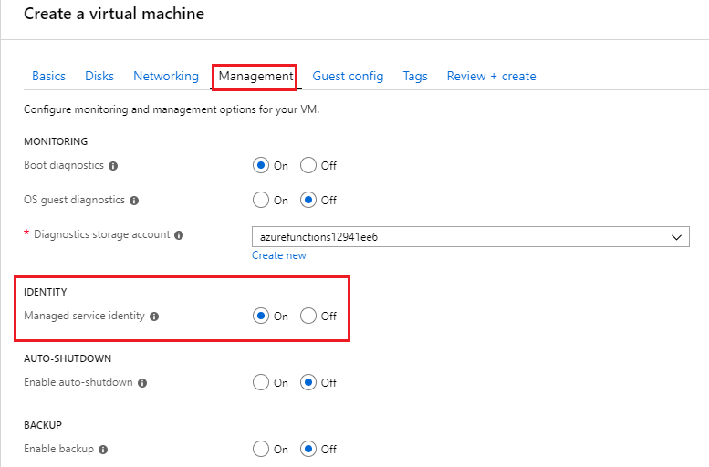
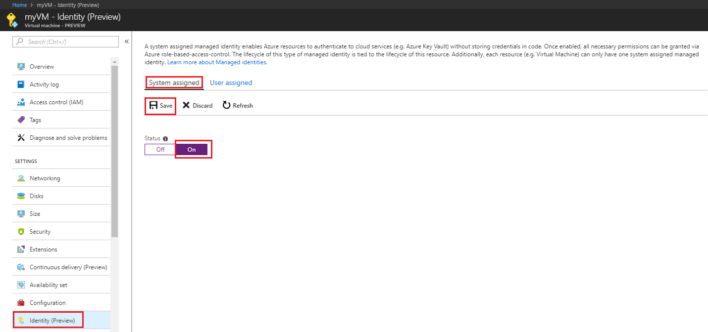
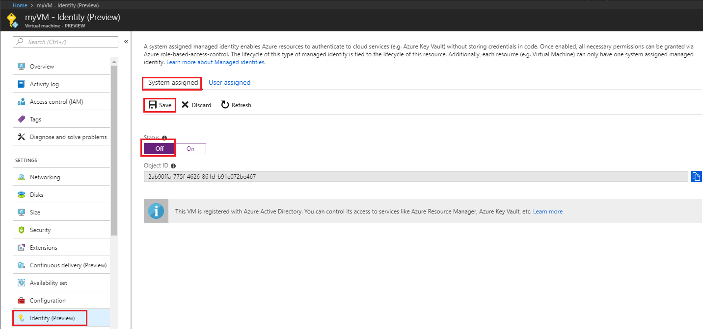
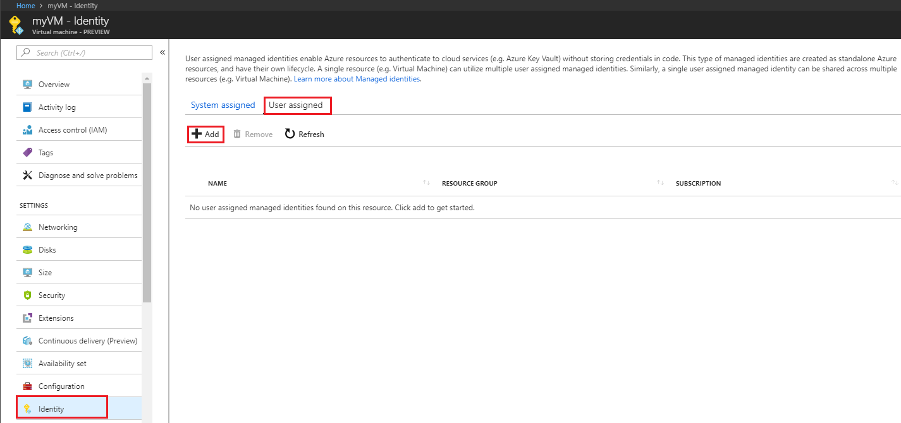
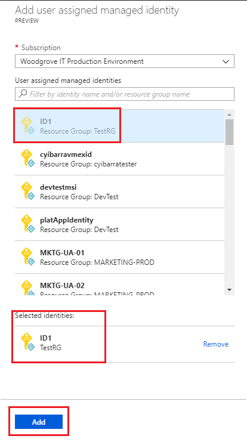
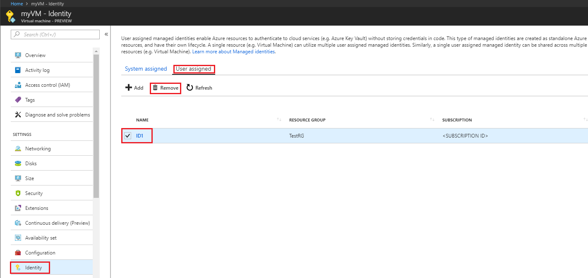

---
title: How to configure managed Identities for Azure resources on an Azure VM using the Azure portal
description: Step by step instructions for configuring managed identities for Azure resources on an Azure VM using the Azure portal.
services: active-directory
documentationcenter: ''
author: daveba
manager: mtillman
editor: ''

ms.service: active-directory
ms.component: msi
ms.devlang: na
ms.topic: conceptual
ms.tgt_pltfrm: na
ms.workload: identity
ms.date: 09/19/2017
ms.author: daveba
---

# Configure managed identities for Azure resources on a VM using the Azure portal

[!INCLUDE [preview-notice](../../../includes/active-directory-msi-preview-notice.md)]

Managed identities for Azure resources provides Azure services with an automatically managed identity in Azure Active Directory. You can use this identity to authenticate to any service that supports Azure AD authentication, without having credentials in your code. 

In this article, you learn how to enable and disable system and user-assigned managed identities for an Azure Virtual Machine (VM), using the Azure portal. 

## Prerequisites

- If you're unfamiliar with managed identities for Azure resources, check out the [overview section](overview.md).
- If you don't already have an Azure account, [sign up for a free account](https://azure.microsoft.com/free/) before continuing.
- To perform the management operations in this article, your account needs the following Azure role based access control assignments:

    > [!NOTE]
    > No additional Azure AD directory role assignments required.

    - [Virtual Machine Contributor](/azure/role-based-access-control/built-in-roles#virtual-machine-contributor) to enable and remove system-assigned managed identity from an Azure VM.

## System-assigned managed identity

In this section, you learn how to enable and disable the system-assigned managed identity for VM using the Azure portal.

### Enable system-assigned managed identity during creation of a VM

To enable system-assigned managed identity during the creation of a VM, under the **Management** tab in the **Identity** section, switch **Managed service identity** to **On**.  

Refer to the following Quickstarts to create a VM: 

- [Create a Windows virtual machine with the Azure portal](../../virtual-machines/windows/quick-create-portal.md#create-virtual-machine) 
- [Create a Linux virtual machine with the Azure portal](../../virtual-machines/linux/quick-create-portal.md#create-virtual-machine)

### Enable system-assigned managed identity on an existing VM

To enable the system-assigned managed identity on a VM that was originally provisioned without it:

1. Sign in to the [Azure portal](https://portal.azure.com) using an account associated with the Azure subscription that contains the VM.

2. Navigate to the desired Virtual Machine and select **Identity**.

3. Under **System assigned**, **Status**, select **On** and then click **Save**:

     

### Remove system-assigned managed identity from a VM

If you have a Virtual Machine that no longer needs system-assigned managed identity:

1. Sign in to the [Azure portal](https://portal.azure.com) using an account associated with the Azure subscription that contains the VM. 

2. Navigate to the desired Virtual Machine and select **Identity**.

3. Under **System assigned**, **Status**, select **Off** and then click **Save**:

   

## User-assigned managed identity

 In this section, you learn how to add and remove a user-assigned managed identity from a VM using the Azure portal.

### Assign a user-assigned identity during the creation of a VM

Currently, the Azure portal does not support assigning a user-assigned managed identity during the creation of a VM. Instead, refer to one of the following VM creation Quickstart articles to first create a VM, and then proceed to the next section for details on assigning a user-assigned managed identity to the VM:

- [Create a Windows virtual machine with the Azure portal](../../virtual-machines/windows/quick-create-portal.md#create-virtual-machine)
- [Create a Linux virtual machine with the Azure portal](../../virtual-machines/linux/quick-create-portal.md#create-virtual-machine)

### Assign a user-assigned managed identity to an existing VM

1. Sign in to the [Azure portal](https://portal.azure.com) using an account associated with the Azure subscription that contains the VM.
2. Navigate to the desired VM and click **Identity**, **User assigned** and then **\+Add**.

   

3. Click the user-assigned identity you want to add to the VM and then click **Add**.

    

### Remove a user-assigned managed identity from a VM

1. Sign in to the [Azure portal](https://portal.azure.com) using an account associated with the Azure subscription that contains the VM.
2. Navigate to the desired VM and click **Identity**, **User assigned**, the name of the user-assigned managed identity you want to delete and then click **Remove** (click **Yes** in the confirmation pane).

   

## Next steps

- Using the Azure portal, give an Azure VM's managed identity [access to another Azure resource](howto-assign-access-portal.md).

