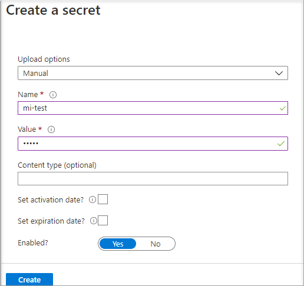

# Tutorial: Use a Linux VM system-assigned managed identity to access Azure Key Vault 

[!INCLUDE [preview-notice](../../../includes/active-directory-msi-preview-notice.md)]

This tutorial shows you how a Linux virtual machine (VM) can use a system-assigned managed identity to access [Azure Key Vault](/azure/key-vault/general/overview). Serving as a bootstrap, Key Vault makes it possible for your client application to then use a secret to access resources not secured by Microsoft Entra ID. Managed Service Identities are automatically managed by Azure and enable you to authenticate to services that support Microsoft Entra authentication, without including authentication information in your code.

You learn how to:

> [!div class="checklist"]
> * Grant your VM access to a secret stored in a Key Vault 
> * Get an access token using the VM's identity and use it to retrieve the secret from the Key Vault 
 
## Prerequisites

- A basic understanding of Managed identities. If you're not familiar with the managed identities for Azure resources feature, see this [overview](overview.md). 
- An Azure account, [sign up for a free account](https://azure.microsoft.com/free/).
- "Owner" permissions at the appropriate scope (your subscription or resource group) to perform required resource creation and role management steps. If you need assistance with role assignment, see [Assign Azure roles to manage access to your Azure subscription resources](/azure/role-based-access-control/role-assignments-portal).
- You also need a Linux Virtual machine that has system assigned managed identities enabled.
  - If you need to create  a virtual machine for this tutorial, you can follow the article titled [Create a Linux virtual machine with the Azure portal](/azure/virtual-machines/linux/quick-create-portal#create-virtual-machine)


## Create a Key Vault  

[!INCLUDE [portal updates](~/articles/active-directory/includes/portal-update.md)]

This section shows how to grant your VM access to a secret stored in a Key Vault. Using managed identities for Azure resources, your code can get access tokens to authenticate to resources that support Microsoft Entra authentication.  However, not all Azure services support Microsoft Entra authentication. To use managed identities for Azure resources with those services, store the service credentials in Azure Key Vault, and use the VM's managed identity to access Key Vault to retrieve the credentials.

First, we need to create a Key Vault and grant our VM's system-assigned managed identity access to the Key Vault.

1. Sign in to the [Azure portal]portal](https://portal.azure.com/)
1. At the top of the left navigation bar, select **Create a resource**  
1. In the **Search the Marketplace** box type in **Key Vault** and hit **Enter**.  
1. Select **Key Vault** from the results.
1. Select **Create**
1. Provide a **Name** for the new Key Vault.

    

1. Fill out all required information making sure that you choose the subscription and resource group where you created the virtual machine that you are using for this tutorial.
1. Select **Review+ create**
1. Select **Create**

### Create a secret

Next, add a secret to the Key Vault, so you can retrieve it later using code running in your VM. In this tutorial, we are using PowerShell but the same concepts apply to any code executing in this virtual machine.

1. Navigate to your newly created Key Vault.
1. Select **Secrets**, and click **Add**.
1. Select **Generate/Import**
1. In the **Create a secret** screen from **Upload options** leave **Manual** selected.
1. Enter a name and value for the secret.  The value can be anything you want. 
1. Leave the activation date and expiration date clear, and leave **Enabled** as **Yes**. 
1. Click **Create** to create the secret.

   

## Grant access

The managed identity used by the virtual machine needs to be granted access to read the secret that we will store in the Key Vault.

1. Navigate to your newly created Key Vault
1. Select **Access Policy** from the menu on the left side.
1. Select **Add Access Policy**

   

1. In the **Add access policy** section under **Configure from template (optional)** choose **Secret Management** from the pull-down menu.
1. Choose **Select Principal**, and in the search field enter the name of the VM you created earlier.  Select the VM in the result list and choose **Select**.
1. Select **Add**
1. Select **Save**.

## Access data

To complete these steps, you need an SSH client.  If you are using Windows, you can use the SSH client in the [Windows Subsystem for Linux](/windows/wsl/about). If you need assistance configuring your SSH client's keys, see [How to Use SSH keys with Windows on Azure](/azure/virtual-machines/linux/ssh-from-windows), or [How to create and use an SSH public and private key pair for Linux VMs in Azure](/azure/virtual-machines/linux/mac-create-ssh-keys).

>[!IMPORTANT]
> All Azure SDKs support the Azure.Identity library that makes it easy to acquire Microsoft Entra tokens to access target services. Learn more about [Azure SDKs](https://azure.microsoft.com/downloads/) and leverage the Azure.Identity library.
> - [.NET](/dotnet/api/overview/azure/identity-readme)
> - [Java](/java/api/overview/azure/identity-readme)
> - [JavaScript](/javascript/api/overview/azure/identity-readme)
> - [Python](/python/api/overview/azure/identity-readme)


1. In the portal, navigate to your Linux VM and in the **Overview**, click **Connect**. 
2. **Connect** to the VM with the SSH client of your choice. 
3. In the terminal window, use CURL to make a request to the local managed identities for Azure resources endpoint to get an access token for Azure Key Vault.  
 
 
    The CURL request for the access token is below.  
    
    ```bash
    curl 'http://169.254.169.254/metadata/identity/oauth2/token?api-version=2018-02-01&resource=https%3A%2F%2Fvault.azure.net' -H Metadata:true  
    ```
    The response includes the access token you need to access Resource Manager. 
    
    Response:  
    
    ```bash
    {"access_token":"eyJ0eXAi...",
    "refresh_token":"",
    "expires_in":"3599",
    "expires_on":"1504130527",
    "not_before":"1504126627",
    "resource":"https://vault.azure.net",
    "token_type":"Bearer"} 
    ```
    
    You can use this access token to authenticate to Azure Key Vault.  The next CURL request shows how to read a secret from Key Vault using CURL and the Key Vault REST API.  You'll need the URL of your Key Vault, which is in the **Essentials** section of the **Overview** page of the Key Vault.  You will also need the access token you obtained on the previous call. 
        
    ```bash
    curl 'https://<YOUR-KEY-VAULT-URL>/secrets/<secret-name>?api-version=2016-10-01' -H "Authorization: Bearer <ACCESS TOKEN>" 
    ```
    
    The response will look like this: 
    
    ```bash
    {"value":"p@ssw0rd!","id":"https://mytestkeyvault.vault.azure.net/secrets/MyTestSecret/7c2204c6093c4d859bc5b9eff8f29050","attributes":{"enabled":true,"created":1505088747,"updated":1505088747,"recoveryLevel":"Purgeable"}} 
    ```
    
Once you've retrieved the secret from the Key Vault, you can use it to authenticate to a service that requires a name and password.

## Clean up resources

When you want to clean up the resources, sign in to the [Azure portal](https://portal.azure.com), select **Resource groups**, locate, and select the resource group that was created in the process of this tutorial (such as `mi-test`), and then use the **Delete resource group** command.

Alternatively you may also do this via [PowerShell or the CLI](/azure/azure-resource-manager/management/delete-resource-group)

## Next steps

In this tutorial, you learned how to use a Linux VM system-assigned managed identity to access Azure Key Vault.  To learn more about Azure Key Vault see:

> [!div class="nextstepaction"]
>[Azure Key Vault](/azure/key-vault/general/overview)
